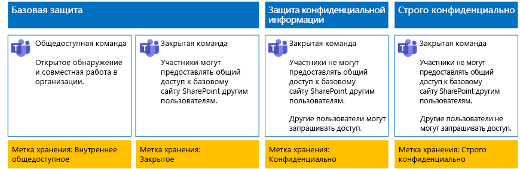
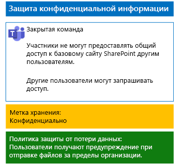
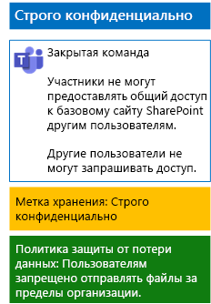

# Защита файлов в командах с помощью меток хранения и политики защиты от потери данных

 
В этой статье приводятся инструкции по разработке и развертыванию меток хранения и политик защиты от потери данных для команд с базовым, конфиденциальным и строго конфиденциальным уровнями защиты, а также их базовых сайтов SharePoint. Дополнительные сведения об этих трех уровнях защиты см. в статье [Защита файлов в Microsoft Teams](secure-files-in-teams.md).
  
## Как это работает

1. Создайте нужные метки хранения и опубликуйте их. Для их публикации может потребоваться до 12 часов.
2. Для нужных базовых сайтов SharePoint измените параметры библиотеки документов, чтобы присвоить желаемые метки хранения элементам в библиотеке.
3. Создайте политики защиты от потери данных, чтобы выполнять действия на основе меток хранения.

Когда пользователи добавляют документ в библиотеку базового сайта SharePoint команды, этот документ получает назначенную метку хранения по умолчанию. При необходимости пользователи могут изменить метку. Если пользователь делится документом за пределами организации, служба защиты от потери данных проверяет, назначена ли метка, и выполняет действия, если политика защиты от потери данных соответствует метке. Служба защиты от потери данных также проверяет соответствие другим политикам, таким как защита файлов с номерами кредитных карт, если этот тип политики настроен. 

## Метки хранения для базовых сайтов SharePoint

Существует три этапа создания и назначения меток хранения для базовых сайтов SharePoint.
  
### Этап 1. Определение имен меток хранения

На этом этапе нужно определить имена меток хранения для четырех уровней защиты информации, применяемых к базовым сайтам SharePoint. В следующей таблице перечислены рекомендуемые имена для каждого уровня.
  
|**Уровень защиты базовых сайтов SharePoint**|**Имя метки**|
|:-----|:-----|
|Базовый общедоступный    |Внутренний общедоступный    |
|Базовый частный    |Частный    |
|Конфиденциальный    |Конфиденциальный    |
|Строго конфиденциальный    |Строго конфиденциально    |
   
### Этап 2. Создание меток хранения

На этом этапе нужно создать и опубликовать определенные метки для разных уровней защиты информации.
  
1. Войдите на [портал соответствия требованиям Microsoft 365](https://compliance.microsoft.com), используя учетную запись с ролью администратора компании или администратора безопасности.
    
2. На вкладке **Главная — соответствие требованиям Microsoft 365** в браузере выберите пункты **Классификации > Метки**.
    
3. Щелкните **Метки хранения > Создать метку**.
    
4. В области **Назовите метку** введите название метки и описание для администраторов и пользователей, а затем нажмите кнопку **Далее**.

5. В области **Дескрипторы плана хранения** введите необходимые параметры и нажмите кнопку **Далее**.
    
6. В области **Параметры метки** при необходимости установите параметр **Хранение** в положение **Вкл.** и настройте параметры хранения. Нажмите кнопку **Далее**.
    
7. В области **Проверьте параметры** нажмите кнопку **Создать эту метку**.
    
8. Для создания дополнительных меток нажмите кнопку **Создать метку** и повторите нужные действия с 3 по 7, описанные в этом разделе.
    

### Публикация новых меток

Для публикации новых меток хранения выполните действия, указанные ниже.
  
1. В области **Метки** щелкните вкладку **Метки хранения** и нажмите кнопку **Опубликовать метки**.
    
2. В области **Выберите метки для публикации** щелкните **Выберите метки для публикации**.
    
3. В области **Выбор меток** нажмите кнопку **Добавить**, выберите все четыре метки и щелкните **Добавить**.
    
4. Нажмите кнопку **Готово**.
    
5. В области **Выберите метки для публикации** нажмите кнопку **Далее**.
    
6. В области **Выбор расположений** нажмите кнопку **Далее**.
    
7. В области **Назовите политику** введите название для своего набора меток в поле **Название**, а затем нажмите кнопку **Далее**.
    
8. В области **Проверьте параметры** последовательно нажмите кнопки **Опубликовать метки** и **Закрыть**.

    
### Этап 3. Применение меток хранения к базовым сайтам SharePoint

Ниже приведены инструкции по применению меток хранения к папкам документов, размещенным на базовых сайтах SharePoint.
  
1.  В интерфейсе команды нажмите **Файлы**, а затем **Открыть в SharePoint**.

2. На новой вкладке SharePoint в браузере щелкните **Документы**.
    
3. Щелкните значок параметров, а затем **Параметры библиотеки**.
    
4. В разделе **Разрешения и управление** нажмите **Применить метку к элементам в этой библиотеке**.
    
5. В разделе **Параметры — применение метки** выберите соответствующую метку хранения и нажмите кнопку **Сохранить**.
    
6. Закройте вкладку сайта SharePoint.
    
7. Повторите шаги со 1 по 6, чтобы назначить метки хранения для дополнительных базовых сайтов SharePoint.
    
Ниже показана итоговая конфигурация.
  

  
## Политики защиты от потери данных для базовых сайтов SharePoint

Выполните указанные ниже действия, чтобы настроить политику защиты от потери данных, которая уведомляет пользователей, когда они предоставляют доступ к документу с базового сайта SharePoint пользователям за пределами организации.

1. Войдите на [портал соответствия требованиям Microsoft 365](https://compliance.microsoft.com/), используя учетную запись с ролью администратора компании или администратора безопасности.
    
2. На новой вкладке **Соответствие требованиям Microsoft 365** в браузере выберите пункты **Политики > Защита от потери данных**.
    
3. В области **Главная > Защита от потери данных** нажмите кнопку **Создание политики**.
    
4. В области **Начать с шаблона или создать настраиваемую политику** выберите **Настраиваемая**, а затем нажмите кнопку **Далее**.
    
5. В области **Назовите политику** введите название для политики защиты от потери конфиденциальных данных в поле **Название**, а затем нажмите кнопку **Далее**.
    
6. В области **Выберите расположения** щелкните **Позволить мне выбрать расположения** и нажмите кнопку **Далее**.
    
7. В списке расположений отключите параметры **Электронная почта Exchange**, **Учетные записи OneDrive** и **Сообщения из чатов и каналов Teams**, а затем нажмите кнопку **Далее**.
    
8. В области **Выберите тип содержимого, которое вы хотите защитить** щелкните ссылку **Изменить**.
    
9. В области **Выбрать типы содержимого для защиты** выберите **Добавить** в раскрывающемся списке, а затем выберите **Метки хранения**.
    
10. В области **Метки хранения** нажмите кнопку **Добавить**, укажите метку **Конфиденциальный** и последовательно нажмите кнопки **Добавить** > **Готово**.
    
11. В области **Выбрать типы содержимого для защиты** нажмите кнопку **Сохранить**.
    
12. В области **Выберите тип содержимого, которое вы хотите защитить** нажмите кнопку **Далее**.

13. В области **Что необходимо делать, если мы обнаружим конфиденциальные сведения?** щелкните **Настройка подсказки и уведомления**.
    
14. В области **Настройка подсказок политики и уведомлений по электронной почте** щелкните **Измените текст подсказки политики**.
    
15. В текстовом поле введите или вставьте один из советов, приведенных ниже.
    
  - Чтобы предоставить доступ пользователю за пределами организации, скачайте файл и откройте его. Выберите пункты "Файл > Защитить документ > Зашифровать паролем", а затем укажите надежный пароль. Отправьте пароль в отдельном сообщении или с помощью других средств связи.
  - Строго конфиденциальные файлы защищены с помощью шифрования. Их могут просматривать только те внешние пользователи, которым ваш ИТ-отдел предоставил разрешения для этих файлов.
    
    Вы также можете ввести или вставить собственную подсказку политики, которая укажет пользователям, как делиться файлом с людьми за пределами организации.
    
16. Нажмите кнопку **ОК**.
    
17. В области **Что необходимо делать, если мы обнаружим конфиденциальные сведения?** нажмите кнопку **Далее**.
    
18. В области **Вы хотите включить политику или сначала проверить, как все работает?** выберите пункт **Да, включить сразу**, а затем нажмите кнопку **Далее**.
    
19. В области **Проверка параметров** нажмите **Создать**, а затем нажмите кнопку **Закрыть**.
    
Здесь показана итоговая конфигурация для конфиденциальных команд.
  

  
После этого выполните указанные ниже действия, чтобы настроить политику защиты от потери данных, которая блокирует пользователей, когда они предоставляют доступ к документу с базового сайта SharePoint пользователям за пределами организации.
  
1. На новой вкладке **Соответствие требованиям Microsoft 365** в браузере выберите пункты **Политики > Защита от потери данных**.
    
2. В области **Защита от потери данных** нажмите кнопку **Создание политики**.
    
3. В области **Начать с шаблона или создать настраиваемую политику** выберите **Настраиваемая**, а затем нажмите кнопку **Далее**.
    
4. В области **Назовите политику** введите название для политики защиты от потери строго конфиденциальных данных в поле **Название**, а затем нажмите кнопку **Далее**.
    
5. В области **Выберите расположения** щелкните **Позволить мне выбрать расположения** и нажмите кнопку **Далее**.
    
6. В списке расположений отключите параметры **Электронная почта Exchange**, **Учетные записи OneDrive** и **Сообщения из чатов и каналов Teams**, а затем нажмите кнопку **Далее**.
    
7. В области **Выберите тип содержимого, которое вы хотите защитить** щелкните ссылку **Изменить**.
    
8. В области **Выбрать типы содержимого для защиты** выберите **Добавить** в раскрывающемся списке, а затем выберите **Метки хранения**.
    
9. В области **Метки хранения** нажмите кнопку **Добавить**, укажите метку **Строго конфиденциальный** и последовательно нажмите кнопки **Добавить** > **Готово**.
    
10. В области **Выбрать типы содержимого для защиты** нажмите кнопку **Сохранить**.
    
12. В области **Выберите тип содержимого, которое вы хотите защитить** нажмите кнопку **Далее**.
    
13. В области **Что необходимо делать, если мы обнаружим конфиденциальные сведения?** щелкните **Настройка подсказки и уведомления**.
    
14. В области **Настройка подсказок политики и уведомлений по электронной почте** щелкните **Измените текст подсказки политики**.
    
15. В текстовом поле введите или вставьте следующее:
    
  - Чтобы предоставить доступ пользователю за пределами организации, скачайте файл и откройте его. Выберите пункты "Файл > Защитить документ > Зашифровать паролем", а затем укажите надежный пароль. Отправьте пароль в отдельном сообщении или с помощью других средств связи.
    
    Вы также можете ввести или вставить, скопировав, собственную подсказку политики, которая укажет пользователям, как делиться файлом с людьми за пределами организации.
    
16. Нажмите кнопку **ОК**.
    
17. В разделе **Обнаружение случаев разовой отправки определенного объема конфиденциальных данных** области **Что необходимо делать, если мы обнаружим конфиденциальные сведения?** щелкните **Ограничение доступа или шифрование содержимого** и нажмите кнопку **Далее**.
    
18. В области **Включить политику или сначала протестировать ее?** выберите пункт **Да, включить ее сразу**, а затем нажмите кнопку **Далее**.
    
19. В области **Проверка параметров** нажмите **Создать**, а затем нажмите кнопку **Закрыть**.
    
Ниже показана итоговая конфигурация для команд со строго конфиденциальным уровнем защиты.
  

  
## Дальнейшие действия

[Защита файлов в командах с помощью меток конфиденциальности](deploy-teams-sensitivity-labels.md)
    
## См. также

[Защита файлов в Microsoft Teams](secure-files-in-teams.md)
  
[Освоение облака и гибридные решения](https://docs.microsoft.com/office365/enterprise/cloud-adoption-and-hybrid-solutions)

