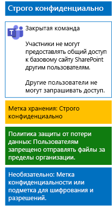

# Защита файлов в командах с помощью меток конфиденциальностиProtect files in teams with sensitivity labels

В отличие от метки конфиденциальности для строго регулируемых данных, которую любой пользователь может применить к любому файлу, команде со строго конфиденциальным уровнем защиты требуется собственная метка или вложенная метка, чтобы файлы, которым она назначена:Unlike a sensitivity label for highly regulated data that anyone can apply to any file, a highly confidential team needs its own label or sublabel so that assigned files:

- шифровались по отдельности;Are individually encrypted.
- содержали настраиваемые разрешения, благодаря которым их смогут открыть только участники команды.Contain custom permissions so that only members of the team can open it.

Чтобы установить этот дополнительный уровень безопасности для файлов, хранящихся на базовом сайте SharePoint команды, необходимо настроить метку конфиденциальности, являющуюся самостоятельной меткой или вложенной меткой для общей метки строго регулируемых данных.To accomplish this additional level of security for files stored in the underlying SharePoint site of a team, you must configure a customized sensitivity label that is either its own label or a sublabel of the general label for highly regulated data. Только участники команды смогут увидеть настроенную метку или вложенную метку в своем списке меток.Only team members will see the customized label or sublabel in their list of labels.

Используйте метку конфиденциальности, если требуется небольшое число меток для общих и отдельных закрытых команд.Use a sensitivity label when you need a small number of labels for both global use and individual private teams. 

Используйте вложенную метку конфиденциальности, если у вас большое число меток или нужно упорядочить метки для команд со строго конфиденциальным уровнем защиты под меткой строго регулируемых данных.Use a sensitivity sublabel when you have a large number of labels or want to organize labels for highly confidential teams under the highly regulated label.

Используйте [эти инструкции](https://docs.microsoft.com/microsoft-365/compliance/encryption-sensitivity-labels), чтобы настроить отдельную метку или вложенную метку со следующими параметрами:Use [these instructions](https://docs.microsoft.com/microsoft-365/compliance/encryption-sensitivity-labels) to configure a separate label or a sublabel with the following settings:

- Имя метки или вложенной метки содержит название командыThe name of the label or sublabel contains the name of the team
- включено шифрование;Encryption is enabled
- У группы Microsoft 365 для команды есть разрешения на совместное редактирование.The Microsoft 365 group for the team has Co-Author permissions

После создания опубликуйте новую метку или вложенную метку для своих пользователей, которые смогут применять ее к файлам локально, прежде чем загружать их в команду, или позже, когда файл будет сохранен в команде.After creating, publish the new label or sublabel for your users, who can then apply them to files either locally before uploading them to the team or later once the file is stored in the team.

Ниже приведена конфигурация команды с особо конфиденциальным уровнем защиты, в которой используются метки конфиденциальности для шифрования файлов и предоставления разрешений.Here is the configuration of the highly confidential team that uses sensitivity labels for file encryption and permissions.

## См. такжеSee Also

[Защита файлов в Microsoft TeamsSecure files in Microsoft Teams](secure-files-in-teams.md)
  
[Освоение облака и гибридные решенияCloud adoption and hybrid solutions](https://docs.microsoft.com/office365/enterprise/cloud-adoption-and-hybrid-solutions)
