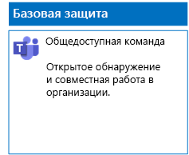
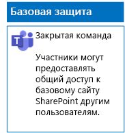
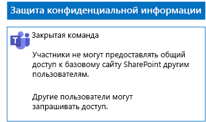
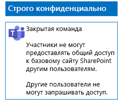

# Развертывание команд с тремя уровнями защиты файлов

В этой статье показано создание и развертывание базовых, конфиденциальных и строго конфиденциальных команд. Дополнительные сведения об этих трех уровнях защиты см. в статье [Защита файлов в Microsoft Teams](secure-files-in-teams.md).

## Команды базового уровня

Базовая защита распространяется на общедоступные и закрытые команды. Обнаруживать общедоступные команды и получать к ним доступ может любой пользователь в организации. Частный сайт могут найти и открыть только члены группы Microsoft 365, связанной с этой командой. Оба типа команд позволяют участникам делиться содержимым сайта.

### Общедоступное

Следуйте инструкциям, приведенным в [этой статье](https://support.office.com/article/174adf5f-846b-4780-b765-de1a0a737e2b), чтобы создать команду базового уровня с открытым доступом и соответствующими разрешениями.

Ниже показана итоговая конфигурация.

### Личные сведения

Следуйте инструкциям, приведенным в [этой статье](https://support.office.com/article/174adf5f-846b-4780-b765-de1a0a737e2b), чтобы создать команду базового уровня с закрытым доступом и соответствующими разрешениями.

Ниже показана итоговая конфигурация.

## Конфиденциальные команды

Для работы с конфиденциальными командами необходимо сначала [создать закрытую команду](https://support.office.com/article/174adf5f-846b-4780-b765-de1a0a737e2b).

После этого настройте базовый сайт SharePoint таким образом, чтобы предотвратить общий доступ к нему для участников команды.

1. На панели инструментов команды щелкните **Файлы**.

2. Щелкните многоточие, а затем — **Открыть в SharePoint**.

3. На панели инструментов базового сайта SharePoint щелкните значок параметров и выберите вариант **Разрешения для сайта**.

4. В области **Разрешения для сайта** в разделе **Параметры общего доступа** щелкните **Изменить параметры общего доступа**.

5. В разделе **Разрешения на предоставление общего доступа** выберите **Только владельцы сайта могут делиться файлами, папками и сайтом** и щелкните **Сохранить**.

Ниже показана итоговая конфигурация.

## Строго конфиденциальные команды

Для работы со строго конфиденциальными командами необходимо сначала [создать закрытую команду](https://support.office.com/article/174adf5f-846b-4780-b765-de1a0a737e2b).

После этого настройте базовый сайт SharePoint таким образом, чтобы предотвратить общий доступ к нему для участников команды и запретить запросы на доступ от лиц, не являющихся участниками команды.

1. На панели инструментов команды щелкните **Файлы**.

2. Щелкните многоточие, а затем — **Открыть в SharePoint**.

3. На панели инструментов базового сайта SharePoint щелкните значок параметров и выберите вариант **Разрешения для сайта**.

4. В области **Разрешения для сайта** в разделе **Параметры общего доступа** щелкните **Изменить параметры общего доступа**.

5. В разделе **Разрешения на предоставление общего доступа** установите флажок **Только владельцы сайта могут делиться файлами, папками и сайтом**.

6. Отключите параметр **Разрешить запросы на доступ** и нажмите кнопку **Сохранить**.

Ниже показана итоговая конфигурация.

## Дальнейшие действия

[Защита файлов в командах с помощью меток хранения и политики защиты от потери данных](deploy-teams-retention-DLP.md)

## См. также

[Защита файлов в Microsoft Teams](secure-files-in-teams.md)

[Освоение облака и гибридные решения](https://docs.microsoft.com/office365/enterprise/cloud-adoption-and-hybrid-solutions)
