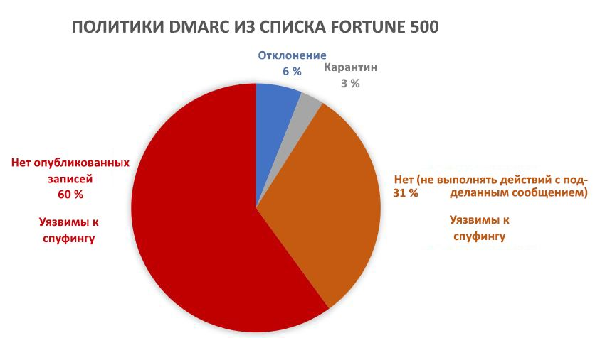

# <a name="email-authentication-in-eop"></a><span data-ttu-id="b89b8-103">Проверка подлинности электронной почты в EOP</span><span class="sxs-lookup"><span data-stu-id="b89b8-103">Email authentication in EOP</span></span>

<span data-ttu-id="b89b8-104">Проверка подлинности электронной почты (также известная как проверка адреса электронной почты) — это набор стандартов для борьбы со спуфингом (сообщения электронной почты от поддельных отправителей).</span><span class="sxs-lookup"><span data-stu-id="b89b8-104">Email authentication (also known as email validation) is a group of standards that tries to stop spoofing (email messages from forged senders).</span></span> <span data-ttu-id="b89b8-105">Во всех организациях Microsoft 365 EOP использует следующие стандарты для проверки входящих писем:</span><span class="sxs-lookup"><span data-stu-id="b89b8-105">In all Microsoft 365 organizations, EOP uses these standards to verify inbound email:</span></span>

- [<span data-ttu-id="b89b8-106">SPF</span><span class="sxs-lookup"><span data-stu-id="b89b8-106">SPF</span></span>](how-office-365-uses-spf-to-prevent-spoofing.md)

- [<span data-ttu-id="b89b8-107">DKIM</span><span class="sxs-lookup"><span data-stu-id="b89b8-107">DKIM</span></span>](support-for-validation-of-dkim-signed-messages.md)

- [<span data-ttu-id="b89b8-108">DMARC</span><span class="sxs-lookup"><span data-stu-id="b89b8-108">DMARC</span></span>](use-dmarc-to-validate-email.md)

<span data-ttu-id="b89b8-109">Проверка подлинности электронной почты удостоверяет, что письма отправителя (например, regina@contoso.com) являются подлинными и получены доменом электронной почты из ожидаемых источников (например, contoso.com)</span><span class="sxs-lookup"><span data-stu-id="b89b8-109">Email authentication verifies that email messages from a sender (for example, laura@contoso.com) are legitimate and come from expected sources for that email domain (for example, contoso.com.)</span></span>

<span data-ttu-id="b89b8-110">Далее в этой статье описываются принципы работы этих технологий, а также их использование службой EOP для проверки входящих писем.</span><span class="sxs-lookup"><span data-stu-id="b89b8-110">The rest of this article explains how these technologies work, and how EOP uses them to check inbound email.</span></span>

## <a name="use-email-authentication-to-help-prevent-spoofing"></a><span data-ttu-id="b89b8-111">Использование проверки подлинности электронной почты для предотвращения спуфинга</span><span class="sxs-lookup"><span data-stu-id="b89b8-111">Use email authentication to help prevent spoofing</span></span>

<span data-ttu-id="b89b8-112">DMARC предотвращает спуфинг, анализируя адрес **отправителя** в сообщениях.</span><span class="sxs-lookup"><span data-stu-id="b89b8-112">DMARC prevents spoofing by examining the **From** address in messages.</span></span> <span data-ttu-id="b89b8-113">Адрес **отправителя** — это адрес электронной почты отправителя, который пользователи видят в почтовом клиенте.</span><span class="sxs-lookup"><span data-stu-id="b89b8-113">The **From** address is the sender's email address that users see in their email client.</span></span> <span data-ttu-id="b89b8-114">Организации электронной почты, являющиеся получателями, также могут убедиться, что домен электронной почты прошел проверку SPF или DKIM.</span><span class="sxs-lookup"><span data-stu-id="b89b8-114">Destination email organizations can also verify that the email domain has passed SPF or DKIM.</span></span> <span data-ttu-id="b89b8-115">Иначе говоря, если домен прошел проверку подлинности, адрес электронной почты отправителя не является поддельным.</span><span class="sxs-lookup"><span data-stu-id="b89b8-115">In other words, the domain has been authenticated and therefore the sender's email address is not spoofed.</span></span>

<span data-ttu-id="b89b8-116">Однако записи DNS для SPF, DKIM и DMARC (совместно именуемых "политики проверки подлинности электронной почты") являются необязательными.</span><span class="sxs-lookup"><span data-stu-id="b89b8-116">However, DNS records for SPF, DKIM, and DMARC (collectively known as email authentication policies) are optional.</span></span> <span data-ttu-id="b89b8-117">Домены с надежными политиками проверки подлинности электронной почты, такими как microsoft.com и skype.com, защищены от спуфинга.</span><span class="sxs-lookup"><span data-stu-id="b89b8-117">Domains with strong email authentication policies like microsoft.com and skype.com are protected from spoofing.</span></span> <span data-ttu-id="b89b8-118">Но домены, имеющие менее надежные политики проверки подлинности электронной почты или не имеющие вообще никакой политики, являются основной целью спуфинга.</span><span class="sxs-lookup"><span data-stu-id="b89b8-118">But domains with weaker email authentication policies, or no policy at all, are prime targets for being spoofed.</span></span>

<span data-ttu-id="b89b8-119">По состоянию на март 2018 г. только 9 % доменов компаний из списка Fortune 500 публиковали надежные политики проверки подлинности электронной почты.</span><span class="sxs-lookup"><span data-stu-id="b89b8-119">As of March 2018, only 9% of domains of companies in the Fortune 500 publish strong email authentication policies.</span></span> <span data-ttu-id="b89b8-120">В остальных компаниях (91%) адреса могут быть подделаны злоумышленниками.</span><span class="sxs-lookup"><span data-stu-id="b89b8-120">The remaining 91% of companies might be spoofed by an attacker.</span></span> <span data-ttu-id="b89b8-121">Если не используется какой-либо другой механизм фильтрации электронной почты, сообщения от поддельных отправителей в этих доменах могут быть доставлены пользователям.</span><span class="sxs-lookup"><span data-stu-id="b89b8-121">Unless some other email filtering mechanism is in-place, email from spoofed senders in these domains might be delivered to users.</span></span>



<span data-ttu-id="b89b8-123">Процент небольших или средних компаний, которые публикуют надежные политики проверки подлинности электронной почты, ниже.</span><span class="sxs-lookup"><span data-stu-id="b89b8-123">The proportion of small-to-medium sized companies that publish strong email authentication policies is smaller.</span></span> <span data-ttu-id="b89b8-124">А для доменов электронной почты за пределами Северной Америки и Западной Европы это число еще ниже.</span><span class="sxs-lookup"><span data-stu-id="b89b8-124">And the number is even smaller for email domains outside North America and western Europe.</span></span>

<span data-ttu-id="b89b8-125">Отсутствие надежных политик проверки подлинности электронной почты является большой проблемой.</span><span class="sxs-lookup"><span data-stu-id="b89b8-125">Lack of strong email authentication policies is a large problem.</span></span> <span data-ttu-id="b89b8-126">Организации могут не понимать принцип работы проверки подлинности электронной почты, зато его хорошо понимают злоумышленники и пользуются этим.</span><span class="sxs-lookup"><span data-stu-id="b89b8-126">W while organizations might not understand how email authentication works, attackers fully understand, and they take advantage.</span></span> <span data-ttu-id="b89b8-127">Из-за проблем, связанных с фишингом, а также из-за ограниченного внедрения надежных политик проверки подлинности электронной почты корпорация Майкрософт использует *неявную проверку подлинности* для проверки входящих писем.</span><span class="sxs-lookup"><span data-stu-id="b89b8-127">Because of phishing concerns and the limited adoption of strong email authentication policies, Microsoft uses *implicit email authentication* to check inbound email.</span></span>

<span data-ttu-id="b89b8-128">Неявная проверка подлинности является расширением обычных политик проверки подлинности электронной почты.</span><span class="sxs-lookup"><span data-stu-id="b89b8-128">Implicit email authentication is an extension of regular email authentication policies.</span></span> <span data-ttu-id="b89b8-129">Эти расширения включают репутацию отправителя, журнал отправителя, журнал получателя, анализ поведения и другие дополнительные методы.</span><span class="sxs-lookup"><span data-stu-id="b89b8-129">These extensions include: sender reputation, sender history, recipient history, behavioral analysis, and other advanced techniques.</span></span> <span data-ttu-id="b89b8-130">Если от этих расширений не поступает других сигналов, сообщения, отправленные из доменов, которые не используют политики проверки подлинности электронной почты, будут помечены как поддельные.</span><span class="sxs-lookup"><span data-stu-id="b89b8-130">In the absence of other signals from these extensions, messages sent from domains that don't use email authentication policies will be marked as spoof.</span></span>

<span data-ttu-id="b89b8-131">Общее извещение корпорации Майкрософт см. в статье [Море фишинга, часть 2 — Улучшенные средства борьбы со спуфингом в Microsoft 365](https://techcommunity.microsoft.com/t5/Security-Privacy-and-Compliance/Schooling-A-Sea-of-Phish-Part-2-Enhanced-Anti-spoofing/ba-p/176209).</span><span class="sxs-lookup"><span data-stu-id="b89b8-131">To see Microsoft's general announcement, see [A Sea of Phish Part 2 - Enhanced Anti-spoofing in Microsoft 365](https://techcommunity.microsoft.com/t5/Security-Privacy-and-Compliance/Schooling-A-Sea-of-Phish-Part-2-Enhanced-Anti-spoofing/ba-p/176209).</span></span>

## <a name="composite-authentication"></a><span data-ttu-id="b89b8-132">Многофакторная аутентификация</span><span class="sxs-lookup"><span data-stu-id="b89b8-132">Composite authentication</span></span>

<span data-ttu-id="b89b8-133">Если в домене отсутствуют традиционные записи SPF, DKIM и DMARC, проверка записей не передает достаточно сведений о состоянии проверки подлинности.</span><span class="sxs-lookup"><span data-stu-id="b89b8-133">If a domain doesn't have traditional SPF, DKIM, and DMARC records, those record checks don't communicate enough authentication status information.</span></span> <span data-ttu-id="b89b8-134">Поэтому корпорация Майкрософт разработала алгоритм неявной проверки подлинности электронной почты.</span><span class="sxs-lookup"><span data-stu-id="b89b8-134">Therefore, Microsoft has developed an algorithm for implicit email authentication.</span></span> <span data-ttu-id="b89b8-135">Этот алгоритм объединяет несколько сигналов в одно значение, которое называется _многофакторной аутентификацией_, или сокращенно `compauth`.</span><span class="sxs-lookup"><span data-stu-id="b89b8-135">This algorithm combines multiple signals into a single value called _composite authentication_, or `compauth` for short.</span></span> <span data-ttu-id="b89b8-136">Значение `compauth` добавляется в заголовок **Authentication-Results** в заголовках сообщений.</span><span class="sxs-lookup"><span data-stu-id="b89b8-136">The `compauth` value is stamped into the **Authentication-Results** header in the message headers.</span></span>

```text
Authentication-Results:
   compauth=<fail | pass | softpass | none> reason=<yyy>
```

<span data-ttu-id="b89b8-137">Эти значения описываются в разделе [Заголовок сообщения Authentication-results](anti-spam-message-headers.md#authentication-results-message-header).</span><span class="sxs-lookup"><span data-stu-id="b89b8-137">These values are explained at [Authentication-results message header](anti-spam-message-headers.md#authentication-results-message-header).</span></span>

<span data-ttu-id="b89b8-138">Изучив заголовки сообщений, администраторы и даже пользователи могут увидеть, каким образом Microsoft 365 определил, что отправитель поддельный.</span><span class="sxs-lookup"><span data-stu-id="b89b8-138">By examining the message headers, admins or even end users can determine how Microsoft 365 determined that the sender is spoofed.</span></span>

## <a name="why-email-authentication-is-not-always-enough-to-stop-spoofing"></a><span data-ttu-id="b89b8-139">Почему проверки подлинности электронной почты может быть недостаточно для борьбы со спуфингом</span><span class="sxs-lookup"><span data-stu-id="b89b8-139">Why email authentication is not always enough to stop spoofing</span></span>

<span data-ttu-id="b89b8-140">Использование только записей проверки подлинности электронной почты для определения, является ли входящее письмо поддельным, имеет следующие ограничения:</span><span class="sxs-lookup"><span data-stu-id="b89b8-140">Relying only on email authentication records to determine if an incoming message is spoofed has the following limitations:</span></span>

- <span data-ttu-id="b89b8-141">В отправляющем домене могут отсутствовать необходимые записи DNS, или же они могут быть неправильно настроены.</span><span class="sxs-lookup"><span data-stu-id="b89b8-141">The sending domain might lack the required DNS records, or the records are incorrectly configured.</span></span>

- <span data-ttu-id="b89b8-142">Записи DNS исходного домена настроены правильно, но он не совпадает с доменом в адресе отправителя.</span><span class="sxs-lookup"><span data-stu-id="b89b8-142">The source domain has correctly configured DNS records, but that domain doesn't match the domain in the From address.</span></span> <span data-ttu-id="b89b8-143">SPF и DKIM не требуют использовать домен в адресе отправителя.</span><span class="sxs-lookup"><span data-stu-id="b89b8-143">SPF and DKIM don't require the domain to be used in the From address.</span></span> <span data-ttu-id="b89b8-144">Злоумышленники или надежные службы могут зарегистрировать домен, настроить для него записи SPF и DKIM и использовать совершенно другой домен в адресе отправителя.</span><span class="sxs-lookup"><span data-stu-id="b89b8-144">Attackers or legitimate services can register a domain, configure SPF and DKIM for the domain, and use a completely different domain in the From address.</span></span> <span data-ttu-id="b89b8-145">Сообщения от отправителей в этом домене пройдут проверку SPF и DKIM.</span><span class="sxs-lookup"><span data-stu-id="b89b8-145">Messages from senders in this domain will pass SPF and DKIM.</span></span>

<span data-ttu-id="b89b8-146">Многофакторная аутентификация позволяет устранить эти ограничения, пропуская сообщения, которые иначе не прошли бы проверку подлинности.</span><span class="sxs-lookup"><span data-stu-id="b89b8-146">Composite authentication can address these limitations by passing messages that would otherwise fail email authentication checks.</span></span>

<span data-ttu-id="b89b8-147">Для наглядности в приведенных ниже примерах рассматриваются результаты проверки подлинности электронной почты.</span><span class="sxs-lookup"><span data-stu-id="b89b8-147">For simplicity, the following examples concentrate on email authentication results.</span></span> <span data-ttu-id="b89b8-148">Другие интеллектуальные факторы серверной части могли определить сообщения, которые прошли проверку подлинности, как поддельные, а сообщения, которые не прошли проверку, как подлинные.</span><span class="sxs-lookup"><span data-stu-id="b89b8-148">Other back-end intelligence factors could identify messages that pass email authentication as spoofed, or messages that fail email email authentication as legitimate.</span></span>

<span data-ttu-id="b89b8-149">Например, для домена fabrikam.com записи SPF, DKIM или DMARC отсутствуют.</span><span class="sxs-lookup"><span data-stu-id="b89b8-149">For example, the fabrikam.com domain has no SPF, DKIM, or DMARC records.</span></span> <span data-ttu-id="b89b8-150">Сообщения от отправителей в домене fabrikam.com могут не пройти многофакторную аутентификацию (обратите внимание на значение `compauth` и причину):</span><span class="sxs-lookup"><span data-stu-id="b89b8-150">Messages from senders in the fabrikam.com domain can fail composite authentication (note the `compauth` value and reason):</span></span>

```text
Authentication-Results: spf=none (sender IP is 10.2.3.4)
  smtp.mailfrom=fabrikam.com; contoso.com; dkim=none
  (message not signed) header.d=none; contoso.com; dmarc=none
  action=none header.from=fabrikam.com; compauth=fail reason=001
From: chris@fabrikam.com
To: michelle@contoso.com
```

<span data-ttu-id="b89b8-151">Если для fabrikam.com настроить запись SPF без записи DKIM, сообщение может пройти многофакторную аутентификацию.</span><span class="sxs-lookup"><span data-stu-id="b89b8-151">If fabrikam.com configures an SPF without a DKIM record, the message can pass composite authentication.</span></span> <span data-ttu-id="b89b8-152">Домен, прошедший проверку SPF, соответствует домену в адресе отправителя.</span><span class="sxs-lookup"><span data-stu-id="b89b8-152">The domain that passed SPF checks is aligned with the domain in the From address:</span></span>

```text
Authentication-Results: spf=pass (sender IP is 10.2.3.4)
  smtp.mailfrom=fabrikam.com; contoso.com; dkim=none
  (message not signed) header.d=none; contoso.com; dmarc=bestguesspass
  action=none header.from=fabrikam.com; compauth=pass reason=109
From: chris@fabrikam.com
To: michelle@contoso.com
```

<span data-ttu-id="b89b8-153">Если для fabrikam.com настроить запись DKIM без записи SPF, сообщение может пройти многофакторную аутентификацию.</span><span class="sxs-lookup"><span data-stu-id="b89b8-153">If fabrikam.com configures a DKIM record without an SPF record, the message can pass composite authentication.</span></span> <span data-ttu-id="b89b8-154">Домен в подписи DKIM соответствует домену в адресе отправителя.</span><span class="sxs-lookup"><span data-stu-id="b89b8-154">The domain in the DKIM signature is aligned with the domain in the From address:</span></span>

```text
Authentication-Results: spf=none (sender IP is 10.2.3.4)
  smtp.mailfrom=fabrikam.com; contoso.com; dkim=pass
  (signature was verified) header.d=outbound.fabrikam.com;
  contoso.com; dmarc=bestguesspass action=none
  header.from=fabrikam.com; compauth=pass reason=109
From: chris@fabrikam.com
To: michelle@contoso.com
```

<span data-ttu-id="b89b8-155">Если домен в записи SPF или подписи DKIM не соответствует домену в адресе отправителя, сообщение может не пройти многофакторную аутентификацию.</span><span class="sxs-lookup"><span data-stu-id="b89b8-155">If the domain in SPF or the DKIM signature doesn't align with the domain in the From address, the message can fail composite authentication:</span></span>

```text
Authentication-Results: spf=none (sender IP is 192.168.1.8)
  smtp.mailfrom=maliciousdomain.com; contoso.com; dkim=pass
  (signature was verified) header.d=maliciousdomain.com;
  contoso.com; dmarc=none action=none header.from=contoso.com;
  compauth=fail reason=001
From: chris@contoso.com
To: michelle@fabrikam.com
```

## <a name="solutions-for-legitimate-senders-who-are-sending-unauthenticated-email"></a><span data-ttu-id="b89b8-156">Решения для добросовестных отправителей, которые отправляют письма без проверки подлинности</span><span class="sxs-lookup"><span data-stu-id="b89b8-156">Solutions for legitimate senders who are sending unauthenticated email</span></span>

<span data-ttu-id="b89b8-157">Microsoft 365 сохраняет сведения о том, кто отправляет непроверенную электронную почту вашей организации.</span><span class="sxs-lookup"><span data-stu-id="b89b8-157">Microsoft 365 keeps track of who is sending unauthenticated email to your organization.</span></span> <span data-ttu-id="b89b8-158">Если служба считает, что отправитель является ненадежным, она будет помечать сообщения отправителя как не прошедшие многофакторную аутентификацию.</span><span class="sxs-lookup"><span data-stu-id="b89b8-158">If the service thinks the sender is not legitimate, it will mark messages from this sender as a composite authentication failure.</span></span> <span data-ttu-id="b89b8-159">Чтобы избежать этого, воспользуйтесь рекомендациями из этого раздела.</span><span class="sxs-lookup"><span data-stu-id="b89b8-159">To avoid this verdict, you can use the recommendations in this section.</span></span>

### <a name="configure-email-authentication-for-domains-you-own"></a><span data-ttu-id="b89b8-160">Настройка проверки подлинности электронной почты для доменов, которыми вы владеете</span><span class="sxs-lookup"><span data-stu-id="b89b8-160">Configure email authentication for domains you own</span></span>

<span data-ttu-id="b89b8-161">Этот метод можно использовать для устранения спуфинга внутри организации, а также междоменного спуфинга, если вы владеете несколькими клиентами или взаимодействуете с ними.</span><span class="sxs-lookup"><span data-stu-id="b89b8-161">You can use this method to resolve intra-org spoofing and cross-domain spoofing in cases where you own or interact with multiple tenants.</span></span> <span data-ttu-id="b89b8-162">Он также позволяет устранить междоменный спуфинг, когда сообщения отправляются пользователям в среде Microsoft 365 или третьим сторонам, размещенным другими поставщиками.</span><span class="sxs-lookup"><span data-stu-id="b89b8-162">It also helps resolve cross-domain spoofing where you send to other customers within Microsoft 365 or third parties that are hosted by other providers.</span></span>

- <span data-ttu-id="b89b8-163">[Настройте записи SPF](set-up-spf-in-office-365-to-help-prevent-spoofing.md) для ваших доменов.</span><span class="sxs-lookup"><span data-stu-id="b89b8-163">[Configure SPF records](set-up-spf-in-office-365-to-help-prevent-spoofing.md) for your domains.</span></span>

- <span data-ttu-id="b89b8-164">[Настройте записи DKIM](use-dkim-to-validate-outbound-email.md) для ваших основных доменов.</span><span class="sxs-lookup"><span data-stu-id="b89b8-164">[Configure DKIM records](use-dkim-to-validate-outbound-email.md) for your primary domains.</span></span>

- <span data-ttu-id="b89b8-165">[Рекомендуем настроить записи DMARC ](use-dmarc-to-validate-email.md) для вашего домена, чтобы определить добросовестных отправителей.</span><span class="sxs-lookup"><span data-stu-id="b89b8-165">[Consider setting up DMARC records](use-dmarc-to-validate-email.md) for your domain to determine your legitimate senders.</span></span>

<span data-ttu-id="b89b8-166">Майкрософт не предоставляет подробные рекомендации по реализации для записей SPF, DKIM и DMARC.</span><span class="sxs-lookup"><span data-stu-id="b89b8-166">Microsoft doesn't provide detailed implementation guidelines for SPF, DKIM, and DMARC records.</span></span> <span data-ttu-id="b89b8-167">Однако большой объем информации доступен в Интернете.</span><span class="sxs-lookup"><span data-stu-id="b89b8-167">However, there's many information available online.</span></span> <span data-ttu-id="b89b8-168">Существуют также сторонние компании, которые могут помочь вашей организации настроить записи для проверки подлинности электронной почты.</span><span class="sxs-lookup"><span data-stu-id="b89b8-168">There are also third party companies dedicated to helping your organization setup email authentication records.</span></span>

#### <a name="you-dont-know-all-sources-for-your-email"></a><span data-ttu-id="b89b8-169">Вы не знаете все источники ваших писем</span><span class="sxs-lookup"><span data-stu-id="b89b8-169">You don't know all sources for your email</span></span>

<span data-ttu-id="b89b8-170">Многие домены не публикуют записи SPF, так как они не знают все источники сообщений электронной почты.</span><span class="sxs-lookup"><span data-stu-id="b89b8-170">Many domains don't publish SPF records because they don't know all of the email sources for messages in their domain.</span></span> <span data-ttu-id="b89b8-171">Начните с публикации записи SPF, содержащей все источники электронной почты, о которых вы знаете (особенно при наличии корпоративного трафика), и опубликуйте нейтральную политику SPF `?all`.</span><span class="sxs-lookup"><span data-stu-id="b89b8-171">Start by publishing an SPF record that contains all of the email sources you know about (especially where your corporate traffic is located), and publish the neutral SPF policy `?all`.</span></span> <span data-ttu-id="b89b8-172">Например:</span><span class="sxs-lookup"><span data-stu-id="b89b8-172">For example:</span></span>

```text
fabrikam.com IN TXT "v=spf1 include:spf.fabrikam.com ?all"
```

<span data-ttu-id="b89b8-173">Этот пример означает, что электронная почта из вашей корпоративной инфраструктуры пройдет проверку подлинности, а электронная почта из неизвестных источников будет возвращаться к нейтральному состоянию.</span><span class="sxs-lookup"><span data-stu-id="b89b8-173">This example means that email from your corporate infrastructure will pass email authentication, but email from unknown sources will fall back to neutral.</span></span>

<span data-ttu-id="b89b8-174">Microsoft 365 будет рассматривать входящие письма из корпоративной инфраструктуры как прошедшие проверку подлинности.</span><span class="sxs-lookup"><span data-stu-id="b89b8-174">Microsoft 365 will treat inbound email from your corporate infrastructure as authenticated.</span></span> <span data-ttu-id="b89b8-175">Письма из неизвестных источников все же могут быть помечены как поддельные, если не пройдут неявную проверку подлинности.</span><span class="sxs-lookup"><span data-stu-id="b89b8-175">Email from unidentified sources might still be marked as spoof if it fails implicit authentication.</span></span> <span data-ttu-id="b89b8-176">Но это все равно является шагом вперед по сравнению с ситуацией, когда все электронные письма помечались как поддельные в Microsoft 365.</span><span class="sxs-lookup"><span data-stu-id="b89b8-176">However, this is still an improvement from all email being marked as spoof by Microsoft 365.</span></span>

<span data-ttu-id="b89b8-177">Приступив к работе с политикой возврата SPF `?all`, вы можете постепенно найти и добавить больше источников для ваших сообщений, а затем обновить запись SPF с помощью более строгой политики.</span><span class="sxs-lookup"><span data-stu-id="b89b8-177">Once you've gotten started with an SPF fallback policy of `?all`, you can gradually discover and include more email sources for your messages, and then update your SPF record with a stricter policy.</span></span>

### <a name="use-spoof-intelligence-to-configure-permitted-senders-of-unauthenticated-email"></a><span data-ttu-id="b89b8-178">Использование аналитики спуфинга для настройки разрешенных отправителей непроверенной электронной почты</span><span class="sxs-lookup"><span data-stu-id="b89b8-178">Use spoof intelligence to configure permitted senders of unauthenticated email</span></span>

<span data-ttu-id="b89b8-179">Вы также можете использовать [аналитику спуфинга](learn-about-spoof-intelligence.md), чтобы предоставить отправителям разрешение на передачу непроверенных сообщений в вашей организации.</span><span class="sxs-lookup"><span data-stu-id="b89b8-179">You can also use [spoof intelligence](learn-about-spoof-intelligence.md) to permit senders to transmit unauthenticated messages to your organization.</span></span>

<span data-ttu-id="b89b8-180">Для внешних доменов поддельный пользователь — это домен в адресе отправителя, а инфраструктура отправки — это либо исходный IP-адрес (разделенный на /24 диапазоны CIDR), либо домен организации в записи обратного поиска в DNS (запись типа PTR).</span><span class="sxs-lookup"><span data-stu-id="b89b8-180">For external domains, the spoofed user is the domain in the From address, while the sending infrastructure is either the source IP address (divided up into /24 CIDR ranges), or the organizational domain of the reverse DNS (PTR) record.</span></span>

<span data-ttu-id="b89b8-181">На снимке экрана, приведенном ниже, исходный IP-адрес — 131.107.18.4, с записью типа PTR outbound.mail.protection.outlook.com.</span><span class="sxs-lookup"><span data-stu-id="b89b8-181">In the screenshot below, the source IP might be 131.107.18.4 with the PTR record outbound.mail.protection.outlook.com.</span></span> <span data-ttu-id="b89b8-182">Она будет отображаться как outlook.com для инфраструктуры отправки.</span><span class="sxs-lookup"><span data-stu-id="b89b8-182">This would show up as outlook.com for the sending infrastructure.</span></span>

<span data-ttu-id="b89b8-183">Чтобы предоставить этому отправителю разрешение на отправку неавторизованной электронной почты, измените значение с **Нет** на **Да**.</span><span class="sxs-lookup"><span data-stu-id="b89b8-183">To permit this sender to send unauthenticated email, change the **No** to a **Yes**.</span></span>


### <a name="create-an-allow-entry-for-the-senderrecipient-pair"></a><span data-ttu-id="b89b8-185">Создание разрешающей записи для пары отправитель-получатель</span><span class="sxs-lookup"><span data-stu-id="b89b8-185">Create an allow entry for the sender/recipient pair</span></span>

<span data-ttu-id="b89b8-186">Чтобы обойти фильтрацию спама и некоторые компоненты фильтрации фишинга, но оставить фильтрацию вредоносных программ для определенных отправителей, см. статью [Создание списков надежных отправителей в Microsoft 365](create-safe-sender-lists-in-office-365.md).</span><span class="sxs-lookup"><span data-stu-id="b89b8-186">To bypass spam filtering, some parts of phish filtering, but not malware filtering for specific senders, see [Create safe sender lists in Microsoft 365](create-safe-sender-lists-in-office-365.md).</span></span>

### <a name="ask-the-sender-to-configure-email-authentication-for-domains-you-dont-own"></a><span data-ttu-id="b89b8-187">Попросите отправителя настроить проверку подлинности электронной почты для доменов, которые вам не принадлежат</span><span class="sxs-lookup"><span data-stu-id="b89b8-187">Ask the sender to configure email authentication for domains you don't own</span></span>

<span data-ttu-id="b89b8-188">Из-за проблем со спамом и фишинговыми сообщениями корпорация Майкрософт рекомендует проверку подлинности электронной почты для всех организаций электронной почты.</span><span class="sxs-lookup"><span data-stu-id="b89b8-188">Because of the problem of spam and phishing, Microsoft recommends email authentication for all email organizations.</span></span> <span data-ttu-id="b89b8-189">Вместо настройки переопределения вручную в вашей организации вы можете попросить администратора в отправляющем домене настроить записи проверки подлинности электронной почты.</span><span class="sxs-lookup"><span data-stu-id="b89b8-189">Instead of configuring manual overrides in your organization, you can ask an admin in the sending domain to configure their email authentication records.</span></span>

- <span data-ttu-id="b89b8-190">Даже если им не нужно было публиковать записи проверки подлинности в прошлом, они придется сделать это сейчас, если они отправляют электронную почту в корпорацию Майкрософт.</span><span class="sxs-lookup"><span data-stu-id="b89b8-190">Even if they didn't need to publish email authentication records in the past, they should do so if they send email to Microsoft.</span></span>

- <span data-ttu-id="b89b8-191">Настройте SPF для публикации IP-адреса отправителя для вашего домена, а также настройте DKIM (при наличии) для добавления цифровой подписи к сообщениям.</span><span class="sxs-lookup"><span data-stu-id="b89b8-191">Set up SPF to publish the domain's sending IP addresses, and set up DKIM (if available) to digitally sign messages.</span></span> <span data-ttu-id="b89b8-192">Кроме того, следует рассмотреть возможность настройки записей DMARC.</span><span class="sxs-lookup"><span data-stu-id="b89b8-192">They should also consider setting up DMARC records.</span></span>

- <span data-ttu-id="b89b8-193">Если они используют массовые рассылки для отправки электронной почты от их имени, убедитесь, что домен в адресе отправителя (если он принадлежит им) соответствует домену, который прошел проверку SPF или DMARC.</span><span class="sxs-lookup"><span data-stu-id="b89b8-193">If they use bulk senders to send email on their behalf, verify that the domain in the From address (if it belongs to them) aligns with the domain that passes SPF or DMARC.</span></span>

- <span data-ttu-id="b89b8-194">Убедитесь, что указанные ниже расположения (если они используют их) включены в запись SPF:</span><span class="sxs-lookup"><span data-stu-id="b89b8-194">Verify the following locations (if they use them) are included in the SPF record:</span></span>
  
  - <span data-ttu-id="b89b8-195">Локальные почтовые серверы.</span><span class="sxs-lookup"><span data-stu-id="b89b8-195">On-premises email servers.</span></span>
  - <span data-ttu-id="b89b8-196">Электронная почта, отправленная SaaS-поставщиком (программное обеспечение как услуга).</span><span class="sxs-lookup"><span data-stu-id="b89b8-196">Email sent from a software-as-a-service (SaaS) provider.</span></span>
  - <span data-ttu-id="b89b8-197">Электронная почта, отправленная службой размещения в облаке (Microsoft Azure, GoDaddy, Rackspace, Amazon Web Services и т. д.).</span><span class="sxs-lookup"><span data-stu-id="b89b8-197">Email sent from a cloud-hosting service (Microsoft Azure, GoDaddy, Rackspace, Amazon Web Services, etc.).</span></span>

- <span data-ttu-id="b89b8-198">Для небольших доменов, размещенных поставщиком услуг Интернета, настройте запись SPF согласно инструкциям поставщика.</span><span class="sxs-lookup"><span data-stu-id="b89b8-198">For small domains that are hosted by an ISP, configure the SPF record according to the instructions from the ISP.</span></span>

<span data-ttu-id="b89b8-199">Хотя сначала может показаться сложным заставить домены отправителя настроить проверку подлинности, но со временем, когда все новые и новые фильтры почты начнут отправлять в нежелательную почту или даже отклонять их почту, это заставит из настроить корректные записи для гарантии нормальной доставки почты.</span><span class="sxs-lookup"><span data-stu-id="b89b8-199">While it may be difficult at first to get sending domains to authenticate, over time, as more and more email filters start junking or even rejecting their email, it will cause them to set up the proper records to ensure better delivery.</span></span> <span data-ttu-id="b89b8-200">Кроме того, они могут помочь в борьбе с фишингом и снизить его вероятность в своей организации либо в организациях, которым они отправляют почту.</span><span class="sxs-lookup"><span data-stu-id="b89b8-200">Also, their participation can help in the fight against phishing, and can reduce the possibility of phishing in their organization or organizations that they send email to.</span></span>

#### <a name="information-for-infrastructure-providers-isps-esps-or-cloud-hosting-services"></a><span data-ttu-id="b89b8-201">Сведения для поставщиков инфраструктуры (поставщики услуг Интернета, ESP и службы размещения в облаке)</span><span class="sxs-lookup"><span data-stu-id="b89b8-201">Information for infrastructure providers (ISPs, ESPs, or cloud hosting services)</span></span>

<span data-ttu-id="b89b8-202">Если вы размещаете электронную почту для домена или предоставляете инфраструктуру для размещения, которая позволяет отправлять почту, выполните указанные ниже действия.</span><span class="sxs-lookup"><span data-stu-id="b89b8-202">If you host a domain's email or provide hosting infrastructure that can send email, you should do the following steps:</span></span>

- <span data-ttu-id="b89b8-203">Убедитесь, что у ваших клиентов есть документация, в которой объясняется, как пользователи могут настраивать записи SPF.</span><span class="sxs-lookup"><span data-stu-id="b89b8-203">Ensure your customers have documentation that explains how your customers should configure their SPF records</span></span>

- <span data-ttu-id="b89b8-204">Рассмотрите возможность использования подписей DKIM для исходящих писем, даже если клиент не настроил эту опцию явным образом (подпись с доменом по умолчанию).</span><span class="sxs-lookup"><span data-stu-id="b89b8-204">Consider signing DKIM-signatures on outbound email, even if the customer doesn't explicitly set it up (sign with a default domain).</span></span> <span data-ttu-id="b89b8-205">Вы можете даже дважды подписать электронную почту с помощью подписей DKIM (один раз с доменом клиента, если они настроили эту опцию, и еще раз с помощью подписи DKIM вашей организации)</span><span class="sxs-lookup"><span data-stu-id="b89b8-205">You can even double-sign the email with DKIM signatures (once with the customer's domain if they have set it up, and a second time with your company's DKIM signature)</span></span>

<span data-ttu-id="b89b8-206">Доставка в корпорацию Майкрософт не гарантируется, даже если пройдена проверка подлинности электронной почты, поступающей с вашей платформы, но, по крайней мере, вы можете быть уверены, что корпорация Майкрософт не будет направлять ваши письма в папку с нежелательными сообщения, которые не прошли проверку подлинности.</span><span class="sxs-lookup"><span data-stu-id="b89b8-206">Deliverability to Microsoft is not guaranteed even if you authenticate email originating from your platform, but at least it ensures that Microsoft does not junk your email because it isn't authenticated.</span></span>

<span data-ttu-id="b89b8-207">Дополнительные сведения о рекомендациях поставщиков услуг см. в статье [M3AAWG: Рекомендации по обмену мобильными сообщениями для поставщиков услуг](https://www.m3aawg.org/sites/default/files/M3AAWG-Mobile-Messaging-Best-Practices-Service-Providers-2015-08.pdf).</span><span class="sxs-lookup"><span data-stu-id="b89b8-207">For more information about service providers best practices, see [M3AAWG Mobile Messaging Best Practices for Service Providers](https://www.m3aawg.org/sites/default/files/M3AAWG-Mobile-Messaging-Best-Practices-Service-Providers-2015-08.pdf).</span></span>
