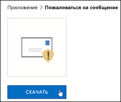
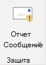
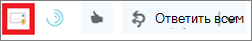
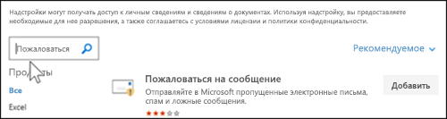
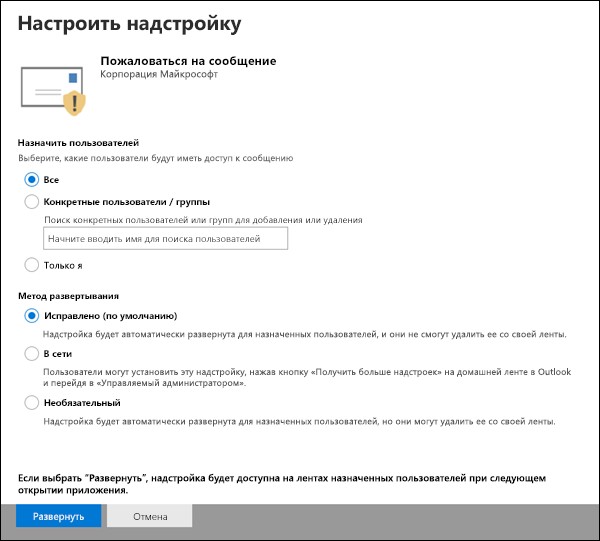
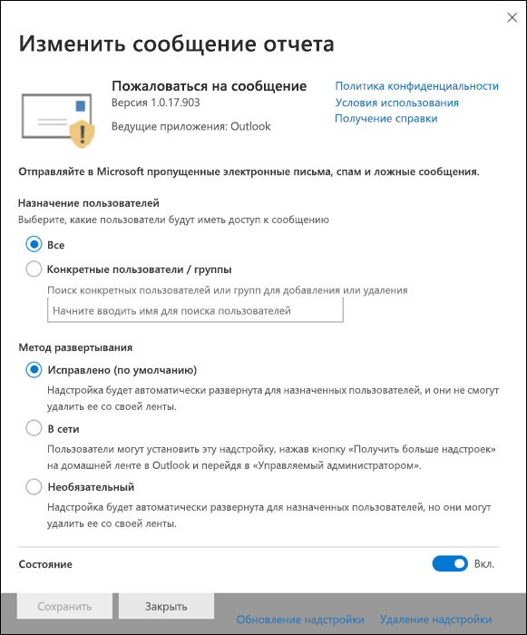

# Включение надстройки "Пожаловаться на сообщение"

[!INCLUDE [Microsoft 365 Defender rebranding](../includes/microsoft-defender-for-office.md)]

> [!NOTE]
> Если вы являетесь администратором в организации Microsoft 365 с почтовыми ящиками Exchange Online, рекомендуем использовать портал отправки в центре безопасности & соответствия требованиям. Дополнительные сведения см. в [статье Использование отправки администратором для отправки подозреваемой спама, фишинга, URL-адресов и файлов в корпорацию Майкрософт](admin-submission.md).

Надстройка сообщения отчета для Outlook и Outlook в Интернете (прежнее название — Outlook Web App) позволяет людям легко сообщать о ложных срабатываниях (хорошее письмо отмечено как плохое) или ложные отрицательные (недопустимые сообщения электронной почты) корпорации Майкрософт и ее аффилированным лицам для анализа. Корпорация Майкрософт использует эти отправки для повышения эффективности технологий защиты электронной почты.

Например, предположим, что люди сообщают о большом числе фишинговых сообщений. Эта информация послужит в качестве поверхности в [панели мониторинга безопасности](security-dashboard.md) и других отчетов. Группа безопасности вашей организации может использовать эти сведения для указания того, что политики защиты от фишинга может потребоваться обновить. Или, если пользователи сообщают о большом количестве сообщений, помеченных как нежелательные, с помощью надстройки Report Message, группе безопасности Организации может потребоваться настроить [политики защиты от нежелательной почты](configure-your-spam-filter-policies.md).

Кроме того, если в организации используется [Office 365 Advanced Threat Protection Plan 1](office-365-atp.md) или [Plan 2](office-365-ti.md), надстройка сообщения отчета предоставляет группе безопасности Организации полезную информацию, которую можно использовать для просмотра и обновления политик безопасности.

Администраторы могут включить надстройку сообщений отчета для Организации, а отдельные пользователи могут установить их самостоятельно.

Если вы являетесь отдельным пользователем, вы можете [включить для себя надстройку сообщения отчета](#get-the-report-message-add-in-for-yourself).

Если вы являетесь глобальным администратором или администратором Exchange Online, а Exchange настроен на использование проверки подлинности OAuth, вы можете [включить надстройку сообщения отчета для Организации](#get-and-enable-the-report-message-add-in-for-your-organization). Теперь надстройка сообщений отчета доступна с помощью [централизованного развертывания](https://docs.microsoft.com/microsoft-365/admin/manage/centralized-deployment-of-add-ins).

## Что нужно знать перед началом работы

- Надстройка сообщения отчета работает с большинством подписок Microsoft 365 и следующих продуктов:

  - Outlook в Интернете
  - Outlook 2013 SP1 или более поздней версии
  - Outlook 2016 для Mac;
  - Outlook, входящий в состав приложений Microsoft 365 для предприятий

- Надстройка сообщений отчета недоступна для почтовых ящиков в локальных организациях Exchange.

- Можно настроить копирование или перенаправление сообщений, отправленных в указанный почтовый ящик. Дополнительные сведения см. [в статье определение почтового ящика для отправленных пользователем сообщений о нежелательной почте и фишинговых сообщениях в Exchange Online](user-submission.md).

- Существующий веб-браузер должен работать с надстройкой сообщения отчета. Но если вы заметили, что надстройка недоступна или не работает должным образом, попробуйте другой браузер.

- Для организационных установок Организация должна быть настроена на использование проверки подлинности OAuth. Дополнительную информацию можно узнать [в статье определение того, работает ли централизованное развертывание надстроек для вашей организации](../../admin/manage/centralized-deployment-of-add-ins.md).

- Администраторы должны быть членами группы ролей глобальные администраторы. Дополнительные сведения см. в статье [Разрешения в Центре безопасности и соответствия требованиям](permissions-in-the-security-and-compliance-center.md).

## Получение надстройки "сообщение отчета" для себя

1. Перейдите на страницу Microsoft AppSource <https://appsource.microsoft.com/marketplace/apps> и найдите надстройку сообщения отчета. Чтобы перейти непосредственно к надстройке сообщения отчета, перейдите на страницу <https://appsource.microsoft.com/product/office/wa104381180> .

2. Нажмите кнопку **получить**.

   

3. В появившемся диалоговом окне просмотрите условия использования и политика конфиденциальности, а затем нажмите кнопку **продолжить**.

4. Войдите с помощью рабочей или учебной учетной записи (для бизнес-использования) или учетной записи Майкрософт (для личного использования).

После установки и включения надстройки вы увидите следующие значки:

- В Outlook значок выглядит следующим образом:

  

- В Outlook в Интернете значок выглядит следующим образом:

  

Сведения о том, как использовать надстройку, можно найти [в разделе Использование надстройки Report Message](https://support.microsoft.com/office/b5caa9f1-cdf3-4443-af8c-ff724ea719d2).

## Получение и включение надстройки сообщений отчета для Организации

> [!NOTE]
> Для отображения надстройки в Организации может потребоваться до 12 часов.

1. В центре администрирования Microsoft 365 перейдите на страницу " **службы & надстроек** " по адресу <https://admin.microsoft.com/AdminPortal/Home#/Settings/ServicesAndAddIns> , а затем нажмите кнопку **развернуть надстройку**.

   

2. В появившемся всплывающем окне **развертывание новой надстройки** просмотрите сведения, а затем нажмите кнопку **Далее**.

3. На следующей странице щелкните **выбрать в магазине**.

   

4. На появившейся странице **Выбор надстройки** щелкните в поле **поиска** , введите **сообщение отчета**и нажмите кнопку **Поиск** поиска  . В списке результатов найдите **сообщение отчета** и нажмите кнопку **Добавить**.

   

5. В появившемся диалоговом окне ознакомьтесь со сведениями о лицензировании и конфиденциальности, а затем нажмите кнопку **продолжить**.

6. На открывшейся странице **Настройка надстройки** настройте следующие параметры:

   - **Назначенные пользователи**: выберите одно из следующих значений:

     - **Все** (по умолчанию)
     - **Конкретные пользователи и группы**
     - **Только я**

   - **Метод развертывания**: выберите одно из следующих значений:

     - **Fixed (по умолчанию)**: надстройка автоматически развертывается для указанных пользователей и не может удалить ее.
     - **Доступно**: пользователи могут устанавливать надстройки на **домашней странице** \> **получить** надстройки \> , **управляемые администратором**.
     - **Необязательно**: надстройка автоматически развертывается для указанных пользователей, но ее можно удалить.

   

   Когда все будет готово, нажмите кнопку **развернуть**.

7. На появившейся странице **развертывание сообщения отчета** отображается отчет о ходе выполнения, а затем подтверждение, в котором была развернута надстройка. Прочтите сведения и нажмите кнопку **Далее**.

   

8. На появившейся странице **объявить надстройку** просмотрите сведения, а затем нажмите кнопку **Закрыть**.

   

## Узнайте, как использовать надстройку "сообщение отчета"

Пользователи, которым назначена надстройка, увидят следующие значки:

- В Outlook значок выглядит следующим образом:

  

- В Outlook в Интернете значок выглядит следующим образом:

  

При уведомлении пользователей о надстройке сообщения отчета добавьте ссылку для [использования надстройки Report Message](https://support.microsoft.com/office/b5caa9f1-cdf3-4443-af8c-ff724ea719d2).

## Просмотр или изменение параметров для надстройки "сообщение отчета"

1. В центре администрирования Microsoft 365 перейдите на страницу " **службы &** надстроек" по адресу <https://admin.microsoft.com/AdminPortal/Home#/Settings/ServicesAndAddIns> .

   

2. Найдите и выберите надстройку **сообщения отчета** .

3. В появившемся всплывающем окне **изменение сообщения отчета** просмотрите и измените параметры в соответствии с требованиями Организации. Выполнив необходимые действия, нажмите кнопку **Сохранить**.

   

## Просмотр и просмотр сообщений, о которых получено сообщение

Чтобы просмотреть сообщения, отправляемые пользователями в корпорацию Майкрософт, выполните следующие действия.

- Используйте портал отправки администратором. Дополнительную информацию можно узнать [в статье Просмотр отправок пользователей в корпорацию Майкрософт](admin-submission.md#view-user-submissions-to-microsoft).

- Создайте правило для почтового процесса (также называемое правилом транспорта), чтобы отправлять копии сообщений, отправленных в отчет. Инструкции можно найти в статье [Использование правил для обработки почтового ящика для просмотра отчетов о пользователях в Майкрософт](use-mail-flow-rules-to-see-what-your-users-are-reporting-to-microsoft.md).
