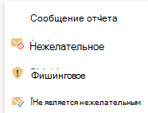

# Включить сообщение отчета или надстройки для фишинга отчетовEnable the Report Message or the Report Phishing add-ins

[!INCLUDE [Microsoft 365 Defender rebranding](../includes/microsoft-defender-for-office.md)]

**Область применения****Applies to**
- [Exchange Online ProtectionExchange Online Protection](exchange-online-protection-overview.md)
- [Microsoft Defender для Office 365 (план 1 и план 2)Microsoft Defender for Office 365 plan 1 and plan 2](defender-for-office-365.md)
- [Microsoft 365 DefenderMicrosoft 365 Defender](../defender/microsoft-365-defender.md)

> [!NOTE]
> Если вы администратор в организации Microsoft 365 с почтовыми ящиками Exchange Online, рекомендуем использовать портал Отправки на портале Microsoft 365 Defender.If you're an admin in a Microsoft 365 organization with Exchange Online mailboxes, we recommend that you use the Submissions portal in the Microsoft 365 Defender portal. Дополнительные сведения см. в материале Использование отправки администратора для отправки в Корпорацию Майкрософт подозрительных [спама, фишинга, URL-адресов и файлов.](admin-submission.md)For more information, see [Use Admin Submission to submit suspected spam, phish, URLs, and files to Microsoft](admin-submission.md).

Надстройки Для Outlook и Outlook в Интернете (ранее известные как Outlook Web App) позволяют пользователям легко сообщать о ложных срабатываниях (хорошая электронная почта, помеченная как плохие) или ложных отрицательных (разрешенная плохая электронная почта) в Корпорацию Майкрософт и ее филиалы для анализа.The Report Message and Report Phishing add-ins for Outlook and Outlook on the web (formerly known as Outlook Web App) enable people to easily report false positives (good email marked as bad) or false negatives (bad email allowed) to Microsoft and its affiliates for analysis.

Корпорация Майкрософт использует эти материалы для повышения эффективности технологий защиты электронной почты.Microsoft uses these submissions to improve the effectiveness of email protection technologies. Например, предположим, что люди сообщают много сообщений с помощью надстройки Report Phishing.For example, suppose that people are reporting many messages using the Report Phishing add-in. Эти сведения будут использоваться в панели мониторинга безопасности и других отчетах.This information surfaces in the Security Dashboard and other reports. Группа безопасности организации может использовать эти сведения в качестве указания на необходимость обновления политик защиты от фишинга.Your organization's security team can use this information as an indication that anti-phishing policies might need to be updated.

Можно установить надстройку Report Message или Report Phishing.You can install either the Report Message or Report Phishing add-in. Если вы хотите, чтобы пользователи сообщали о спаме и фишинговых сообщениях, разместите надстройку Report Message в организации.If you want your users to report both spam and phishing messages, deploy the Report Message add-in in your organization. Дополнительные сведения см. в добавлении Enable the Report Message.For more information, see Enable the Report Message add-in.

Надстройка Report Message предоставляет возможность сообщать о спаме и фишинговых сообщениях.The Report Message add-in provides the option to report both spam and phishing messages. Администраторы могут включить надстройка Report Message для организации, а отдельные пользователи могут установить ее для себя.Admins can enable the Report Message add-in for the organization, and individual users can install it for themselves.

Надстройка Report Phishing предоставляет возможность сообщать только о фишинговых сообщениях.The Report Phishing add-in provides the option to report only phishing messages. Администраторы могут включить надстройку Report Phishing для организации, а отдельные пользователи могут установить ее для себя.Admins can enable the Report Phishing add-in for the organization, and individual users can install it for themselves.

Если вы индивидуальный пользователь, вы можете включить оба надстройки для себя.If you're an individual user, you can enable both the add-ins for yourself.

Если вы глобальный администратор или администратор Exchange Online, а Exchange настроена на использование проверки подлинности OAuth, вы можете включить надстройку Report Message и надстройку Report Phishing для вашей организации.If you're a global administrator or an Exchange Online administrator, and Exchange is configured to use OAuth authentication, you can enable the Report Message add-in and the Report Phishing add-in for your organization. Обе надстройки теперь доступны через [централизованное развертывание.](../../admin/manage/centralized-deployment-of-add-ins.md)Both add-ins are now available through [Centralized Deployment](../../admin/manage/centralized-deployment-of-add-ins.md).

## Что нужно знать перед началом работыWhat do you need to know before you begin?

- Надстройка Сообщения отчетов и надстройка Report Phishing работают с большинством подписок Microsoft 365 и следующими продуктами:Both the Report Message add-in and the Report Phishing add-in works with most Microsoft 365 subscriptions and the following products:
  - Outlook в ИнтернетеOutlook on the web
  - Outlook 2013 SP1 или более позднийOutlook 2013 SP1 or later
  - Outlook 2016 для Mac;Outlook 2016 for Mac
  - Outlook, включенный в приложения Microsoft 365 для предприятияOutlook included with Microsoft 365 apps for Enterprise
  - Приложение Outlook для iOS и AndroidOutlook app for iOS and Android

- Обе надстройки недоступны для общих почтовых ящиков или почтовых ящиков в локальной организации Exchange.Both add-ins are not available for shared mailboxes or mailboxes in on-premises Exchange organizations.

- Существующий веб-браузер должен работать как с надстройки Report Message, так и с надстройки Report Phishing. Но если вы заметили, что надстройка недоступна или работает не так, как ожидалось, попробуйте другой браузер.Your existing web browser should work with both the Report Message and Report Phishing add-ins. But, if you notice the add-in is not available or not working as expected, try a different browser.

- Для организационных установок необходимо настроить организацию для использования проверки подлинности OAuth.For organizational installs, the organization needs to be configured to use OAuth authentication. Дополнительные сведения см. в [рубриках Определение,](../../admin/manage/centralized-deployment-of-add-ins.md)работает ли централизованное развертывание надстройок для вашей организации.For more information, see [Determine if Centralized Deployment of add-ins works for your organization](../../admin/manage/centralized-deployment-of-add-ins.md).

- Администраторы должны быть членами группы ролей глобальных администраторов.Admins need to be a member of the Global admins role group. Дополнительные сведения см. [в веб-сайте Permissions in the Microsoft 365 Defender portal](permissions-microsoft-365-security-center.md).For more information, see [Permissions in the Microsoft 365 Defender portal](permissions-microsoft-365-security-center.md).

- Дополнительные сведения о том, как сообщать о сообщении с помощью функции Сообщение отчетов, см. в обзоре [Report false positives and false negatives in Outlook.](report-false-positives-and-false-negatives.md)For more information on how to report a message using the Report Message feature, see [Report false positives and false negatives in Outlook](report-false-positives-and-false-negatives.md).

> [!IMPORTANT]
> Мы не рекомендуем встроенный интерфейс отчетности в Outlook, так как он не может использовать политику отправки [пользователей.](./user-submission.md)We don't recommend the built-in reporting experience in Outlook because it can't use the [user submission policy](./user-submission.md). Рекомендуется использовать надстройку "Сообщение отчетов" или надстройку Report Phishing.We recommend using the Report Message add-in or the Report Phishing add-in instead.

## Получить надстройки сообщения отчетаGet the Report Message add-in

### Получите надстройка "Сообщение отчетов" для себяGet the Report Message add-in for yourself

1. Перейдите в Microsoft AppSource и <https://appsource.microsoft.com/marketplace/apps> найдите надстройки "Сообщение отчетов".Go to the Microsoft AppSource at <https://appsource.microsoft.com/marketplace/apps> and search for the Report Message add-in. Чтобы перейти непосредственно к надстройки Сообщение отчета, перейдите к <https://appsource.microsoft.com/product/office/wa104381180> .To go directly to the Report Message add-in, go to <https://appsource.microsoft.com/product/office/wa104381180>.

2. Нажмите **КНОПКУ GET IT NOW**.Click **GET IT NOW**.

   

3. В диалоговом окантове, который появляется, просмотрите условия использования и политику конфиденциальности, а затем нажмите **кнопку Продолжить**.In the dialog that appears, review the terms of use and privacy policy, and then click **Continue**.

4. Впишитесь с помощью учетной записи работы или учебного заведения (для бизнеса) или учетной записи Майкрософт (для личного использования).Sign in using your work or school account (for business use) or your Microsoft account (for personal use).

После установки и включения надстройки вы увидите следующие значки:After the add-in is installed and enabled, you'll see the following icons:

- В Outlook значок выглядит так:In Outlook, the icon looks like this:

  > [!div class="mx-imgBorder"]
  > 

- В Outlook в Интернете значок выглядит так:In Outlook on the web, the icon looks like this:

  > [!div class="mx-imgBorder"]
  > 

### Получите надстройка "Сообщение отчета" для организацииGet the Report Message add-in for your organization

> [!NOTE]
> Для появления надстройки в организации может занять до 12 часов.It could take up to 12 hours for the add-in to appear in your organization.

1. В центре администрирования Microsoft 365  перейдите на страницу \> **Надстройки** параметров по <https://admin.microsoft.com/AdminPortal/Home#/Settings/AddIns> крайней мере .In the Microsoft 365 admin center, go to the **Settings** \> **Add-ins** page at <https://admin.microsoft.com/AdminPortal/Home#/Settings/AddIns>. Если вы не видите  страницу надстройки, перейдите к ссылке Надстройки "Параметры интегрированных приложений" в верхней части страницы  \>  \>  **Интегрированные** приложения.If you don't see the **Add-in** Page, go to the **Settings** \> **Integrated apps** \> **Add-ins** link on the top of the **Integrated apps** page.

2. Выберите **развертывание надстройки** в верхней части страницы, а затем выберите **Далее**.Select **Deploy Add-in** at the top of the page, and then select **Next**.

   

3. В **развертывании новой** надстройки, которая появится, просмотрите сведения, а затем нажмите **кнопку Далее**.In the **Deploy a new add-in** flyout that appears, review the information, and then click **Next**.

4. На следующей странице нажмите **кнопку Выберите из магазина**.On the next page, click **Choose from the Store**.

   

5. На странице **Выберите надстройку,** которая  появится, щелкните в поле Поиск, **введите** сообщение отчета, а затем нажмите **значок Поиск** поиска  .In the **Select add-in** page that appears, click in the **Search** box, enter **Report Message**, and then click **Search** . В списке результатов найдите **сообщение отчета** и нажмите кнопку **Добавить**.In the list of results, find **Report Message** and then click **Add**.

   

6. В диалоговом окте, который появится, просмотрите сведения о лицензировании и конфиденциальности, а затем нажмите **кнопку Продолжить**.In the dialog that appears, review the licensing and privacy information, and then click **Continue**.

7. На **странице Настройка надстройки,** которая появится, настройте следующие параметры:In the **Configure add-in** page that appears, configure the following settings:

   - **Назначены пользователи:** Выберите одно из следующих значений:**Assigned users**: Select one of the following values:
     - **Все** (по умолчанию)**Everyone** (default)
     - **Конкретные пользователи / группы****Specific users / groups**
     - **Только я****Just me**

   - **Метод развертывания:** Выберите одно из следующих значений:**Deployment method**: Select one of the following values:
     - **Исправлено (по умолчанию).** Надстройка автоматически развертывается для указанных пользователей, и они не могут удалить ее.**Fixed (Default)**: The add-in is automatically deployed to the specified users and they can't remove it.
     - **Доступно.** Пользователи могут установить надстройки в **Home** \> **Get надстройки,** \> **управляемые администратором.****Available**: Users can install the add-in at **Home** \> **Get add-ins** \> **Admin-managed**.
     - **Необязательный** вариант: надстройка автоматически развертывается для указанных пользователей, но они могут удалить ее.**Optional**: The add-in is automatically deployed to the specified users, but they can choose to remove it.

   

   По завершению щелкните **Развертывание**.When you're finished, click **Deploy**.

8. На странице **Развертывание сообщения отчетов,** которая отображается, вы увидите отчет о ходе выполнения, за которым следует подтверждение развертывания надстройки.In the **Deploy Report Message** page that appears, you'll see a progress report followed by a confirmation that the add-in was deployed. После прочтя сведений нажмите кнопку **Далее**.After you read the information, click **Next**.

   

9. На странице **Надстройка** "Объявить", которая появится, просмотрите сведения и нажмите **кнопку Закрыть**.On the **Announce add-in** page that appears, review the information, and then click **Close**.

   

## Просмотр или изменение параметров надстройки "Сообщение отчетов"Review or edit settings for the Report Message add-in

1. В центре администрирования Microsoft 365 перейдите на страницу **Параметры** надстройки \>  по <https://admin.microsoft.com/AdminPortal/Home#/Settings/AddIns> крайней .In the Microsoft 365 admin center, go to the go to the **Settings** \> **Add-ins** page at <https://admin.microsoft.com/AdminPortal/Home#/Settings/AddIns>. Если вы не видите  страницу надстройки, перейдите к ссылке Надстройки "Параметры интегрированных приложений" в верхней части страницы  \>  \>  **Интегрированные** приложения.If you don't see the **Add-in** Page, go to the **Settings** \> **Integrated apps** \> **Add-ins** link on the top of the **Integrated apps** page.

   

2. Найдите и выберите **надстройка "Сообщение** отчетов".Find and select the **Report Message** add-in.

3. В **вылете Сообщение** об редактировании отчетов, которое отображается, просмотрите и отредактируете параметры, соответствующие вашей организации.In the **Edit Report Message** flyout that appears, review and edit settings as appropriate for your organization. Выполнив необходимые действия, нажмите кнопку **Сохранить**.When you're finished, click **Save**.

   

## Получить надстройку Для фишинга отчетовGet the Report Phishing add-in

### Получите надстройку Report Phishing для себяGet the Report Phishing add-in for yourself

1. Перейдите в Microsoft AppSource и <https://appsource.microsoft.com/marketplace/apps> найдите надстройку Report Phishing.Go to the Microsoft AppSource at <https://appsource.microsoft.com/marketplace/apps> and search for the Report Phishing add-in.

2. Нажмите **КНОПКУ GET IT NOW**.Click **GET IT NOW**.

3. В диалоговом окантове, который появляется, просмотрите условия использования и политику конфиденциальности, а затем нажмите **кнопку Продолжить**.In the dialog that appears, review the terms of use and privacy policy, and then click **Continue**.

4. Впишитесь с помощью учетной записи работы или учебного заведения (для бизнеса) или учетной записи Майкрософт (для личного использования).Sign in using your work or school account (for business use) or your Microsoft account (for personal use).

После установки и включения надстройки вы увидите следующие значки:After the add-in is installed and enabled, you'll see the following icons:

- В Outlook значок выглядит так:In Outlook, the icon looks like this:

  

- В Outlook в Интернете значок выглядит так:In Outlook on the web, the icon looks like this:

  > [!div class="mx-imgBorder"]
  > 

### Получите надстройку "Фишинг отчетов" для организацииGet the Report Phishing add-in for your organization

> [!NOTE]
> Для появления надстройки в организации может занять до 12 часов.It could take up to 12 hours for the add-in to appear in your organization.

1. В центре администрирования Microsoft 365 перейдите на страницу **Параметры** надстройки \>  по <https://admin.microsoft.com/AdminPortal/Home#/Settings/AddIns> крайней .In the Microsoft 365 admin center, go to the go to the **Settings** \> **Add-ins** page at <https://admin.microsoft.com/AdminPortal/Home#/Settings/AddIns>. Если вы не видите  страницу надстройки, перейдите к ссылке Надстройки "Параметры интегрированных приложений" в верхней части страницы  \>  \>  **Интегрированные** приложения.If you don't see the **Add-in** Page, go to the **Settings** \> **Integrated apps** \> **Add-ins** link on the top of the **Integrated apps** page.

2. Выберите **развертывание надстройки** в верхней части страницы, а затем выберите **Далее**.Select **Deploy Add-in** at the top of the page, and then select **Next**.

   

3. В **развертывании новой** надстройки, которая появится, просмотрите сведения, а затем нажмите **кнопку Далее**.In the **Deploy a new add-in** flyout that appears, review the information, and then click **Next**.

4. На следующей странице нажмите **кнопку Выберите из магазина**.On the next page, click **Choose from the Store**.

   

5. На странице **Выбор надстройки,** которая появится, нажмите кнопку в поле **Поиск,** введите **сообщение** фишинг, а затем нажмите **значок Поиска**  .In the **Select add-in** page that appears, click in the **Search** box, enter **Report Phishing**, and then click **Search** . В списке результатов найдите **сообщение Фишинг** и нажмите кнопку **Добавить**.In the list of results, find **Report Phishing** and then click **Add**.

6. В диалоговом окте, который появится, просмотрите сведения о лицензировании и конфиденциальности, а затем нажмите **кнопку Продолжить**.In the dialog that appears, review the licensing and privacy information, and then click **Continue**.

7. На **странице Настройка надстройки,** которая появится, настройте следующие параметры:In the **Configure add-in** page that appears, configure the following settings:

   - **Назначены пользователи:** Выберите одно из следующих значений:**Assigned users**: Select one of the following values:
     - **Все** (по умолчанию)**Everyone** (default)
     - **Конкретные пользователи / группы****Specific users / groups**
     - **Только я****Just me**

   - **Метод развертывания:** Выберите одно из следующих значений:**Deployment method**: Select one of the following values:
     - **Исправлено (по умолчанию).** Надстройка автоматически развертывается для указанных пользователей, и они не могут удалить ее.**Fixed (Default)**: The add-in is automatically deployed to the specified users and they can't remove it.
     - **Доступно.** Пользователи могут установить надстройки в **Home** \> **Get надстройки,** \> **управляемые администратором.****Available**: Users can install the add-in at **Home** \> **Get add-ins** \> **Admin-managed**.
     - **Необязательный** вариант: надстройка автоматически развертывается для указанных пользователей, но они могут удалить ее.**Optional**: The add-in is automatically deployed to the specified users, but they can choose to remove it.

   По завершению щелкните **Развертывание**.When you're finished, click **Deploy**.

8. На странице **Развертывание фишинга** отчетов, которая отображается, вы увидите отчет о ходе выполнения, после чего будет подтверждено, что надстройка была развернута.In the **Deploy Report Phishing** page that appears, you'll see a progress report followed by a confirmation that the add-in was deployed. После прочтя сведений нажмите кнопку **Далее**.After you read the information, click **Next**.

9. На странице **Надстройка** "Объявить", которая появится, просмотрите сведения и нажмите **кнопку Закрыть**.On the **Announce add-in** page that appears, review the information, and then click **Close**.

## Просмотр или изменение параметров надстройки Report PhishingReview or edit settings for the Report Phishing add-in

1. В центре администрирования Microsoft 365 перейдите на страницу **Параметры** надстройки \>  по <https://admin.microsoft.com/AdminPortal/Home#/Settings/AddIns> крайней .In the Microsoft 365 admin center, go to the go to the **Settings** \> **Add-ins** page at <https://admin.microsoft.com/AdminPortal/Home#/Settings/AddIns>. Если вы не видите  страницу надстройки, перейдите к ссылке Надстройки "Параметры интегрированных приложений" в верхней части страницы  \>  \>  **Интегрированные** приложения.If you don't see the **Add-in** Page, go to the **Settings** \> **Integrated apps** \> **Add-ins** link on the top of the **Integrated apps** page.

2. Найдите и выберите **надстройку Report Phishing.**Find and select the **Report Phishing** add-in.

3. В **вылете Редактирование фишинговых** отчетов, которое отображается, просмотрите и отредактировать параметры, соответствующие вашей организации.In the **Edit Report Phishing** flyout that appears, review, and edit settings as appropriate for your organization. По завершении нажмите кнопку **Сохранить**.When you're finished, click **Save**.
