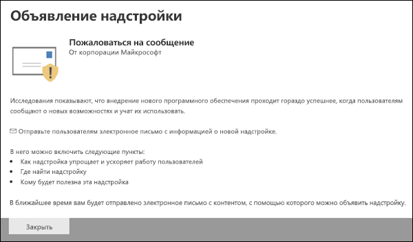

# Включение надстройки "Пожаловаться на сообщение"Enable the Report Message add-in

[!INCLUDE [Microsoft 365 Defender rebranding](../includes/microsoft-defender-for-office.md)]

> [!NOTE]
> Если вы являетесь администратором в организации Microsoft 365 с почтовыми ящиками Exchange Online, рекомендуем использовать портал отправки в центре безопасности & соответствия требованиям.If you're an admin in a Microsoft 365 organization with Exchange Online mailboxes, we recommend that you use the Submissions portal in the Security & Compliance Center. Дополнительные сведения см. в [статье Использование отправки администратором для отправки подозреваемой спама, фишинга, URL-адресов и файлов в корпорацию Майкрософт](admin-submission.md).For more information, see [Use Admin Submission to submit suspected spam, phish, URLs, and files to Microsoft](admin-submission.md).

Надстройка сообщения отчета для Outlook и Outlook в Интернете (прежнее название — Outlook Web App) позволяет людям легко сообщать о ложных срабатываниях (хорошее письмо отмечено как плохое) или ложные отрицательные (недопустимые сообщения электронной почты) корпорации Майкрософт и ее аффилированным лицам для анализа.The Report Message add-in for Outlook and Outlook on the web (formerly known as Outlook Web App) enables people to easily report false positives (good email marked as bad) or false negatives (bad email allowed) to Microsoft and its affiliates for analysis. Корпорация Майкрософт использует эти отправки для повышения эффективности технологий защиты электронной почты.Microsoft uses these submissions to improve the effectiveness of email protection technologies.

Например, предположим, что люди сообщают о большом числе фишинговых сообщений.For example, suppose that people are reporting a lot of messages as phishing. Эта информация послужит в качестве поверхности в [панели мониторинга безопасности](security-dashboard.md) и других отчетов.This information surfaces in the [Security Dashboard](security-dashboard.md) and other reports. Группа безопасности вашей организации может использовать эти сведения для указания того, что политики защиты от фишинга может потребоваться обновить.Your organization's security team can use this information as an indication that anti-phishing policies might need to be updated. Или, если пользователи сообщают о большом количестве сообщений, помеченных как нежелательные, с помощью надстройки Report Message, группе безопасности Организации может потребоваться настроить [политики защиты от нежелательной почты](configure-your-spam-filter-policies.md).Or, if people are reporting a lot of messages that were flagged as junk mail as Not Junk by using the Report Message add-in, your organization's security team might need to adjust [anti-spam policies](configure-your-spam-filter-policies.md).

Кроме того, если в организации используется [Office 365 Advanced Threat Protection Plan 1](office-365-atp.md) или [Plan 2](office-365-ti.md), надстройка сообщения отчета предоставляет группе безопасности Организации полезную информацию, которую можно использовать для просмотра и обновления политик безопасности.In addition, if your organization is using [Office 365 Advanced Threat Protection Plan 1](office-365-atp.md) or [Plan 2](office-365-ti.md), the Report Message add-in provides your organization's security team with useful information they can use to review and update security policies.

Администраторы могут включить надстройку сообщений отчета для Организации, а отдельные пользователи могут установить их самостоятельно.Admins can enable the Report Message add-in for the organization, and individual users can install it for themselves.

Если вы являетесь отдельным пользователем, вы можете [включить для себя надстройку сообщения отчета](#get-the-report-message-add-in-for-yourself).If you're an individual user, you can [enable the Report Message add-in for yourself](#get-the-report-message-add-in-for-yourself).

Если вы являетесь глобальным администратором или администратором Exchange Online, а Exchange настроен на использование проверки подлинности OAuth, вы можете [включить надстройку сообщения отчета для Организации](#get-and-enable-the-report-message-add-in-for-your-organization).If you're a global administrator or an Exchange Online administrator, and Exchange is configured to use OAuth authentication, you can [enable the Report Message add-in for your organization](#get-and-enable-the-report-message-add-in-for-your-organization). Теперь Add-In сообщения отчетов можно использовать для [централизованного развертывания](https://docs.microsoft.com/microsoft-365/admin/manage/centralized-deployment-of-add-ins).The Report Message Add-In is now available through [Centralized Deployment](https://docs.microsoft.com/microsoft-365/admin/manage/centralized-deployment-of-add-ins).

## Что нужно знать перед началом работыWhat do you need to know before you begin?

- Надстройка сообщения отчета работает с большинством подписок Microsoft 365 и следующих продуктов:The Report Message add-in works with most Microsoft 365 subscriptions and the following products:

  - Outlook в ИнтернетеOutlook on the web
  - Outlook 2013 SP1 или более поздней версииOutlook 2013 SP1 or later
  - Outlook 2016 для Mac;Outlook 2016 for Mac
  - Outlook, входящий в состав приложений Microsoft 365 для предприятийOutlook included with Microsoft 365 apps for Enterprise

- Надстройка сообщений отчета недоступна для почтовых ящиков в локальных организациях Exchange.The Report Message add-in is not available for mailboxes in on-premises Exchange organizations.

- Можно настроить копирование или перенаправление сообщений, отправленных в указанный почтовый ящик.You can configure reported messages to be copied or redirected to a mailbox that you specify. Для получения дополнительных сведений обратитесь к разделу [политики отправки пользователей](user-submission.md).For more information, see [User submissions policies](user-submission.md).

- Существующий веб-браузер должен работать с надстройкой сообщения отчета.Your existing web browser should work with the Report Message add-in. Но если вы заметили, что надстройка недоступна или не работает должным образом, попробуйте другой браузер.But, if you notice the add-in is not available or not working as expected, try a different browser.

- Для организационных установок Организация должна быть настроена на использование проверки подлинности OAuth.For organizational installs, the organization needs to be configured to use OAuth authentication. Дополнительную информацию можно узнать [в статье определение того, работает ли централизованное развертывание надстроек для вашей организации](../../admin/manage/centralized-deployment-of-add-ins.md).For more information, see [Determine if Centralized Deployment of add-ins works for your organization](../../admin/manage/centralized-deployment-of-add-ins.md).

- Администраторы должны быть членами группы ролей глобальные администраторы.Admins need to be a member of the Global admins role group. Дополнительные сведения см. в статье [Разрешения в Центре безопасности и соответствия требованиям](permissions-in-the-security-and-compliance-center.md).For more information, see [Permissions in the Security & Compliance Center](permissions-in-the-security-and-compliance-center.md).

## Получение надстройки "сообщение отчета" для себяGet the Report Message add-in for yourself

1. Перейдите на страницу Microsoft AppSource <https://appsource.microsoft.com/marketplace/apps> и найдите надстройку сообщения отчета.Go to the Microsoft AppSource at <https://appsource.microsoft.com/marketplace/apps> and search for the Report Message add-in. Чтобы перейти непосредственно к надстройке сообщения отчета, перейдите на страницу <https://appsource.microsoft.com/product/office/wa104381180> .To go directly to the Report Message add-in, go to <https://appsource.microsoft.com/product/office/wa104381180>.

2. Нажмите кнопку **получить**.Click **GET IT NOW**.

   

3. В появившемся диалоговом окне просмотрите условия использования и политика конфиденциальности, а затем нажмите кнопку **продолжить**.In the dialog that appears, review the terms of use and privacy policy, and then click **Continue**.

4. Войдите с помощью рабочей или учебной учетной записи (для бизнес-использования) или учетной записи Майкрософт (для личного использования).Sign in using your work or school account (for business use) or your Microsoft account (for personal use).

После установки и включения надстройки вы увидите следующие значки:After the add-in is installed and enabled, you'll see the following icons:

- В Outlook значок выглядит следующим образом:In Outlook, the icon looks like this:

  

- В Outlook в Интернете значок выглядит следующим образом:In Outlook on the web, the icon looks like this:

  

Сведения о том, как использовать надстройку, можно найти [в разделе Использование надстройки Report Message](https://support.microsoft.com/office/b5caa9f1-cdf3-4443-af8c-ff724ea719d2).To learn how to use the add-in, see [Use the Report Message add-in](https://support.microsoft.com/office/b5caa9f1-cdf3-4443-af8c-ff724ea719d2).

## Получение и включение надстройки сообщений отчета для ОрганизацииGet and enable the Report Message add-in for your organization

> [!NOTE]
> Для отображения надстройки в Организации может потребоваться до 12 часов.It could take up to 12 hours for the add-in to appear in your organization.

1. В центре администрирования Microsoft 365 перейдите на страницу **Параметры, интегрированные приложения & надстройки** по адресу <https://admin.microsoft.com/AdminPortal/Home#/Settings/AddIns> и нажмите кнопку **развернуть надстройку**.In the Microsoft 365 admin center, go to the **Settings, integrated Apps & Add-ins** page at <https://admin.microsoft.com/AdminPortal/Home#/Settings/AddIns>, and then click **Deploy Add-In**.

   

2. В появившемся всплывающем окне **развертывание новой надстройки** просмотрите сведения, а затем нажмите кнопку **Далее**.In the **Deploy a new add-in** flyout that appears, review the information, and then click **Next**.

3. На следующей странице щелкните **выбрать в магазине**.On the next page, click **Choose from the Store**.

   

4. На появившейся странице **Выбор надстройки** щелкните в поле **поиска** , введите **сообщение отчета**и нажмите кнопку **Поиск** поиска  .In the **Select add-in** page that appears, click in the **Search** box, enter **Report Message**, and then click **Search** . В списке результатов найдите **сообщение отчета** и нажмите кнопку **Добавить**.In the list of results, find **Report Message** and then click **Add**.

   

5. В появившемся диалоговом окне ознакомьтесь со сведениями о лицензировании и конфиденциальности, а затем нажмите кнопку **продолжить**.In the dialog that appears, review the licensing and privacy information, and then click **Continue**.

6. На открывшейся странице **Настройка надстройки** настройте следующие параметры:In the **Configure add-in** page that appears, configure the following settings:

   - **Назначенные пользователи**: выберите одно из следующих значений:**Assigned users**: Select one of the following values:

     - **Все** (по умолчанию)**Everyone** (default)
     - **Конкретные пользователи и группы****Specific users / groups**
     - **Только я****Just me**

   - **Метод развертывания**: выберите одно из следующих значений:**Deployment method**: Select one of the following values:

     - **Fixed (по умолчанию)**: надстройка автоматически развертывается для указанных пользователей и не может удалить ее.**Fixed (Default)**: The add-in is automatically deployed to the specified users and they can't remove it.
     - **Доступно**: пользователи могут устанавливать надстройки на **домашней странице** \> **получить** надстройки \> , **управляемые администратором**.**Available**: Users can install the add-in at **Home** \> **Get add-ins** \> **Admin-managed**.
     - **Необязательно**: надстройка автоматически развертывается для указанных пользователей, но ее можно удалить.**Optional**: The add-in is automatically deployed to the specified users, but they can choose to remove it.

   

   Когда все будет готово, нажмите кнопку **развернуть**.When you're finished, click **Deploy**.

7. На появившейся странице **развертывание сообщения отчета** отображается отчет о ходе выполнения, а затем подтверждение, в котором была развернута надстройка.In the **Deploy Report Message** page that appears, you'll see a progress report followed by a confirmation that the add-in was deployed. Прочтите сведения и нажмите кнопку **Далее**.After you read the information, click **Next**.

   

8. На появившейся странице **объявить надстройку** просмотрите сведения, а затем нажмите кнопку **Закрыть**.On the **Announce add-in** page that appears, review the information, and then click **Close**.

   

## Узнайте, как использовать надстройку "сообщение отчета"Learn how to use the Report Message add-in

Пользователи, которым назначена надстройка, увидят следующие значки:People who have the add-in assigned to them will see the following icons:

- В Outlook значок выглядит следующим образом:In Outlook, the icon looks like this:

  

- В Outlook в Интернете значок выглядит следующим образом:In Outlook on the web, the icon looks like this:

  

При уведомлении пользователей о надстройке сообщения отчета добавьте ссылку для [использования надстройки Report Message](https://support.microsoft.com/office/b5caa9f1-cdf3-4443-af8c-ff724ea719d2).When you notify users about the Report Message add-in, include a link to [Use the Report Message add-in](https://support.microsoft.com/office/b5caa9f1-cdf3-4443-af8c-ff724ea719d2).

## Просмотр или изменение параметров для надстройки "сообщение отчета"Review or edit settings for the Report Message add-in

1. В центре администрирования Microsoft 365 перейдите на страницу " **службы &** надстроек" по адресу <https://admin.microsoft.com/AdminPortal/Home#/Settings/ServicesAndAddIns> .In the Microsoft 365 admin center, go to the **Services & add-ins** page at <https://admin.microsoft.com/AdminPortal/Home#/Settings/ServicesAndAddIns>.

   

2. Найдите и выберите надстройку **сообщения отчета** .Find and select the **Report Message** add-in.

3. В появившемся всплывающем окне **изменение сообщения отчета** просмотрите и измените параметры в соответствии с требованиями Организации.In the **Edit Report Message** flyout that appears, review and edit settings as appropriate for your organization. Выполнив необходимые действия, нажмите кнопку **Сохранить**.When you're finished, click **Save**.

   

## Просмотр и просмотр сообщений, о которых получено сообщениеView and review reported messages

Чтобы просмотреть сообщения, отправляемые пользователями в корпорацию Майкрософт, выполните следующие действия.To review messages that users report to Microsoft, you have these options:

- Используйте портал отправки администратором.Use the Admin Submissions portal. Дополнительную информацию можно узнать [в статье Просмотр отправок пользователей в корпорацию Майкрософт](admin-submission.md#view-user-submissions-to-microsoft).For more information, see [View user submissions to Microsoft](admin-submission.md#view-user-submissions-to-microsoft).

- Создайте правило для почтового процесса (также называемое правилом транспорта), чтобы отправлять копии сообщений, отправленных в отчет.Create a mail flow rule (also known as a transport rule) to send copies of reported messages. Инструкции можно найти в статье [Использование правил для обработки почтового ящика для просмотра отчетов о пользователях в Майкрософт](use-mail-flow-rules-to-see-what-your-users-are-reporting-to-microsoft.md).For instructions, see [Use mail flow rules to see what your users are reporting to Microsoft](use-mail-flow-rules-to-see-what-your-users-are-reporting-to-microsoft.md).
