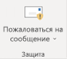

# Включение надстройки "Пожаловаться на сообщение"

> [!NOTE]
> Администраторы организации Microsoft 365, имеющей почтовые ящики Exchange Online, рекомендуем использовать портал отправки в Центре безопасности & соответствия требованиям. Дополнительные сведения см. в статье ["Использование функции отправки администратора" для отправки подозрительного спама, фишинга, URL-адресов и файлов в корпорацию Майкрософт.](admin-submission.md)

Надстройка Report Message для Outlook и Outlook в Интернете (предыдущее название Outlook Web App) позволяет пользователям легко сообщать о ложных срабатываниях (таких сообщениях оно отмечено как недопустимые) или отрицательные отрицательные результаты (разрешены недопустимые электронные письма) в корпорацию Майкрософт и ее аффилированных лиц для анализа. Корпорация Майкрософт использует эти средства отправки для повышения эффективности технологий защиты электронной почты.

Например, предположим, что пользователи сообщают о многое количество сообщений как о фишинговых сообщениях. Эта информация доступна в панели [мониторинга безопасности и](security-dashboard.md) других отчетах. Группы безопасности в вашей организации могут использовать эту информацию в качестве данных о том, что могут возникнуть требования политик защиты от фишинга. Или, если пользователи сообщают о нежелательных сообщениях как нежелательных с помощью надстройки Report Message, группе безопасности вашей организации, возможно, потребуется настроить политики [защиты от нежелательной почты.](configure-your-spam-filter-policies.md)

Кроме того, если ваша организация использует [Office 365 Advanced Threat Protection (план 1)](office-365-atp.md) или [план 2,](office-365-ti.md)надстройка Report Message предоставляет команде безопасности вашей организации полезные сведения, которые можно использовать для просмотра и обновления политик безопасности.

Администраторы могут включить надстройку Report Message для организации, а отдельные пользователи могут ее установить самим в вашей организации.

Если вы являетесь отдельным пользователем, вы можете самостоятельно включить [надстройку Report Message.](#get-the-report-message-add-in-for-yourself)

Если вы являетесь глобальным администратором или администратором Exchange Online, а в Exchange настроено использование проверки подлинности OAuth, вы можете включить [надстройку Report Message в своей организации.](#get-and-enable-the-report-message-add-in-for-your-organization) Теперь надстройка Report Message теперь доступна в [централизованном развертывании.](https://docs.microsoft.com/microsoft-365/admin/manage/centralized-deployment-of-add-ins)

## Что нужно знать перед началом работы

- Надстройка Report Message работает с большинством подписок Microsoft 365 и следующими продуктами:

  - Outlook в Интернете
  - Outlook 2013 с пакетом обновления 1 (SP1) или более поздних версий
  - Outlook 2016 для Mac;
  - Outlook включен в приложения Microsoft 365 для предприятий

- Надстройка Report Message недоступна для почтовых ящиков в локальных организациях Exchange.

- Вы можете настроить отправленные сообщения для копирования или перенаправления в заданный почтовый ящик. Дополнительные сведения см. в статье , посвященном почтовому ящику, для отправки нежелательных [и фишинговых сообщений в Exchange Online.](user-submission.md)

- Существующий веб-браузер должен работать с надстройкой Report Message. Но если вы заметите, что надстройка недоступна или не работает должным образом, попробуйте использовать другой браузер.

- Организационная установка требуется для использования проверки подлинности OAuth. Дополнительные сведения см. в разделе ["Определение способа ли для вашей организации" централизованного развертывания надстроек.](../../admin/manage/centralized-deployment-of-add-ins.md)

- Администраторы должны быть членом группы ролей глобальных администраторов. Дополнительные сведения см. в статье [Разрешения в Центре безопасности и соответствия требованиям](permissions-in-the-security-and-compliance-center.md).

## Получение надстройки Report Message для себя

1. Перейдите в Microsoft AppSource и <https://appsource.microsoft.com/marketplace/apps> найдите надстройку Report Message. Чтобы перейти непосредственно к надстройке Report Message, перейдите к <https://appsource.microsoft.com/product/office/wa104381180> разделу.

2. Нажмите **КНОПКУ GET IT NOW.**

   

3. В появившемся диалоговом окне просмотрите условия **Continue**использования и политику конфиденциальности, а затем нажмите кнопку "Продолжить".

4. Войдите с помощью рабочей или учебной учетной записи (для деловых пользователей) или учетной записи Майкрософт (для личного использования).

После установки и включения надстройки вы увидите следующие значки:

- В Outlook значок выглядит следующим образом:

  

- В Outlook в Интернете значок выглядит следующим образом:

  

Чтобы узнать, как использовать надстройку, см. [статью Использование надстройки Report Message.](https://support.microsoft.com/office/b5caa9f1-cdf3-4443-af8c-ff724ea719d2)

## Получение и включение надстройки Report Message в организации

> [!NOTE]
> Настройка надстройки в организации может занять до 12 часов.

1. В Центре администрирования Microsoft 365 перейдите на страницу **"Службы& надстройки"** <https://admin.microsoft.com/AdminPortal/Home#/Settings/ServicesAndAddIns> и нажмите **кнопку "Развернуть надстройку".**

   

2. В **появившемся всплывающем** окне "Развертывание новой надстройки" просмотрите сведения и нажмите кнопку **"Далее".**

3. На следующей странице выберите элемент **"Выбрать из Магазина".**

   

4. На **появившейся** странице "Выбор надстройки" в поле **поиска** введите **"Сообщение Report Message"** и щелкните **значок "Поиск".**  В списке результатов найдите отчет **Report Message** и нажмите кнопку **"Добавить".**

   

5. В появившемся диалоговом окне просмотрите **Continue**сведения о лицензировании и конфиденциальности, а затем нажмите кнопку "Продолжить".

6. На **появившейся** странице "Настройка надстройки" настройте следующие параметры:

   - **Назначенные**пользователи: выберите одно из следующих значений:

     - **Все (по умолчанию)**
     - **Определенные пользователи и группы**
     - **Только я**

   - **Метод развертывания:** выберите одно из следующих значений:

     - **Исправлена (по умолчанию).** Надстройка автоматически развертывается для указанных пользователей и не может удалить ее.
     - **Доступно:** пользователи могут устанавливать надстройку **при** просмотре \> **дома надстроек,** \> **управляемых администратором.**
     - **Необязательно:** надстройка автоматически развертывается для указанных пользователей, но может удалить ее.

   

   По завершении нажмите кнопку **"Развернуть".**

7. На **появившейся** странице "Отчет о развертывании сообщения" вы увидите отчет о ходе выполнения, а затем подтверждение развертывания надстройки. После прочтения сведений нажмите кнопку **"Далее".**

   

8. На **появившейся странице надстройки** "Новый" просмотрите сведения и нажмите кнопку **"Закрыть".**

   

## Узнайте, как использовать надстройку Report Message

Значки могут видеть следующие значки для пользователей, которым назначена надстройка:

- В Outlook значок выглядит следующим образом:

  

- В Outlook в Интернете значок выглядит следующим образом:

  

Когда вы уведомите пользователей о надстройке Report Message, добавьте ссылку на [надстройку Report Message.](https://support.microsoft.com/office/b5caa9f1-cdf3-4443-af8c-ff724ea719d2)

## Просмотр и изменение параметров надстройки Report Message

1. В Центре администрирования Microsoft 365 перейдите на страницу **& надстройки в этой** папке. <https://admin.microsoft.com/AdminPortal/Home#/Settings/ServicesAndAddIns>

   

2. Найдите и **выберите надстройку Report Message.**

3. В **появившемся** окне "Изменение сообщения отчета" измените и измените параметры в подходящем для вашей организации. Выполнив необходимые действия, нажмите кнопку **Сохранить**.

   

## Просмотр и просмотр сообщений, отправленных в этот отчет

Чтобы просмотреть сообщения, подключаемые пользователями в Майкрософт, вы можете:

- На портале отправки администраторов. Дополнительные сведения см. в статье ["Просмотр пользовательских отправок в Майкрософт.](admin-submission.md#view-user-submissions-to-microsoft)

- Создание правила потока обработки почты (также называемого правилом транспорта) для отправки копий отчетных сообщений. Инструкции см. в статье ["Использование правил для потока обработки почты", чтобы узнать, что пользователи подчиникают в Майкрософт.](use-mail-flow-rules-to-see-what-your-users-are-reporting-to-microsoft.md)
