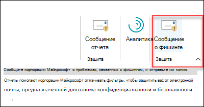
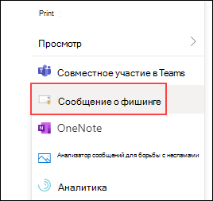
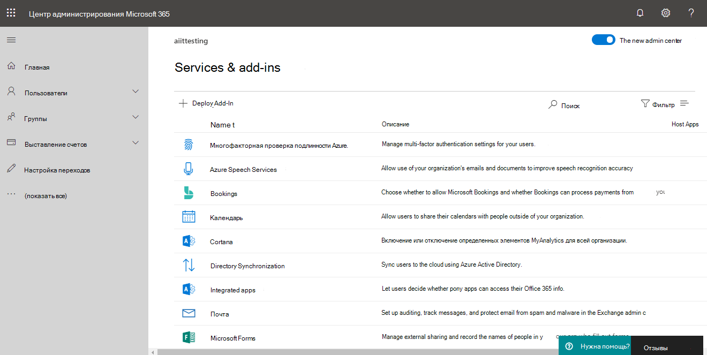
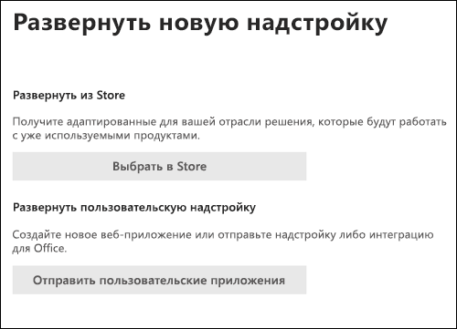

# Включение надстройки "Пожаловаться на фишинг"Enable the Report Phishing add-in

[!INCLUDE [Microsoft 365 Defender rebranding](../includes/microsoft-defender-for-office.md)]

> [!NOTE]
> Если вы администратор в Microsoft 365 с Exchange Online почтовыми ящиками, рекомендуем использовать портал Отправки в Центре & соответствия требованиям.If you're an admin in a Microsoft 365 organization with Exchange Online mailboxes, we recommend that you use the Submissions portal in the Security & Compliance Center. Дополнительные сведения см. в материале Использование отправки администратора для отправки в Корпорацию Майкрософт подозрительных [спама, фишинга, URL-адресов и файлов.](admin-submission.md)For more information, see [Use Admin Submission to submit suspected spam, phish, URLs, and files to Microsoft](admin-submission.md).

Надстройки для сообщений и сообщений о фишинге для Outlook и Outlook в Интернете (ранее известные как Outlook Web App) позволяют пользователям легко сообщать о ложных срабатываниях (хорошая электронная почта, помеченная как плохие) или ложных отрицательных (разрешена плохая электронная почта) в Корпорацию Майкрософт и ее филиалы для анализа.The Report Message and Report Phishing add-ins for Outlook and Outlook on the web (formerly known as Outlook Web App) enable people to easily report false positives (good email marked as bad) or false negatives (bad email allowed) to Microsoft and its affiliates for analysis.

Корпорация Майкрософт использует эти материалы для повышения эффективности технологий защиты электронной почты.Microsoft uses these submissions to improve the effectiveness of email protection technologies. Например, предположим, что люди сообщают много сообщений с помощью надстройки Report Phishing.For example, suppose that people are reporting many messages using the Report Phishing add-in. Эти сведения будут использоваться в панели мониторинга [безопасности](security-dashboard.md) и других отчетах.This information surfaces in the [Security Dashboard](security-dashboard.md) and other reports. Группа безопасности организации может использовать эти сведения в качестве указания на необходимость обновления политик защиты от фишинга.Your organization's security team can use this information as an indication that anti-phishing policies might need to be updated.

Можно установить надстройку Report Message или Report Phishing.You can install either the Report Message or Report Phishing add-in. Если вы хотите, чтобы пользователи сообщали о спаме и фишинговых сообщениях, разместите надстройку Report Message в организации.If you want your users to report both spam and phishing messages, deploy the Report Message add-in in your organization. Дополнительные сведения см. в [добавлении "Включить сообщение отчета".](enable-the-report-message-add-in.md)For more information, see [Enable the Report Message add-in](enable-the-report-message-add-in.md).

Надстройка Report Phishing предоставляет возможность сообщать только о фишинговых сообщениях.The Report Phishing add-in provides the option to report only phishing messages. Администраторы могут включить надстройку Report Phishing для организации, а отдельные пользователи могут установить ее для себя.Admins can enable the Report Phishing add-in for the organization, and individual users can install it for themselves.

Если вы индивидуальный пользователь, вы можете включить надстройку [Report Phishing для себя.](#get-the-report-phishing-add-in-for-yourself)If you're an individual user, you can [enable the Report Phishing add-in for yourself](#get-the-report-phishing-add-in-for-yourself).

Если вы глобальный администратор или администратор Exchange Online и Exchange настроены на использование проверки подлинности OAuth, вы можете включить надстройку Report Phishing для [вашей организации.](#get-and-enable-the-report-phishing-add-in-for-your-organization)If you're a global administrator or an Exchange Online administrator, and Exchange is configured to use OAuth authentication, you can [enable the Report Phishing add-in for your organization](#get-and-enable-the-report-phishing-add-in-for-your-organization). Фишинговый отчет Add-In теперь доступен с помощью [централизированного развертывания.](../../admin/manage/centralized-deployment-of-add-ins.md)The Report Phishing Add-In is now available through [Centralized Deployment](../../admin/manage/centralized-deployment-of-add-ins.md).

## Что нужно знать перед началом работыWhat do you need to know before you begin?

- Надстройка Report Phishing работает с большинством Microsoft 365 и следующими продуктами:The Report Phishing add-in works with most Microsoft 365 subscriptions and the following products:

  - Outlook в ИнтернетеOutlook on the web
  - Outlook 2013 sp1 или более позднейOutlook 2013 SP1 or later
  - Outlook 2016 для Mac или более позднейOutlook 2016 for Mac or later
  - Outlook в Microsoft 365 приложения для EnterpriseOutlook included with Microsoft 365 apps for Enterprise
  - Outlook для iOS и AndroidOutlook app for iOS and Android

- Надстройка Report Phishing недоступна для общих почтовых ящиков или почтовых ящиков в Exchange организациях.The Report Phishing add-in is not available for shared mailboxes or mailboxes in on-premises Exchange organizations.

- Вы можете настроить сообщения, которые будут скопированы или перенаправлены в почтовый ящик, который указан.You can configure reported messages to be copied or redirected to a mailbox that you specify. Дополнительные сведения см. [в материале Политики отправки пользователей.](user-submission.md)For more information, see [User submissions policies](user-submission.md).

- Существующий веб-браузер должен работать с надстройки Report Phishing.Your existing web browser should work with the Report Phishing add-in. Но если вы заметили, что надстройка недоступна или работает не так, как ожидалось, попробуйте другой браузер.But, if you notice the add-in is not available or not working as expected, try a different browser.

- Для организационных установок необходимо настроить организацию для использования проверки подлинности OAuth.For organizational installs, the organization needs to be configured to use OAuth authentication. Дополнительные сведения см. в [рубриках Определение,](../../admin/manage/centralized-deployment-of-add-ins.md)работает ли централизованное развертывание надстройок для вашей организации.For more information, see [Determine if Centralized Deployment of add-ins works for your organization](../../admin/manage/centralized-deployment-of-add-ins.md).

- Администраторы должны быть членами группы ролей глобальных администраторов.Admins need to be a member of the Global admins role group. Дополнительные сведения см. в статье [Разрешения в Центре безопасности и соответствия требованиям](permissions-in-the-security-and-compliance-center.md).For more information, see [Permissions in the Security & Compliance Center](permissions-in-the-security-and-compliance-center.md).

## Получите надстройку Report Phishing для себяGet the Report Phishing add-in for yourself

1. Перейдите в Microsoft AppSource и <https://appsource.microsoft.com/marketplace/apps> найдите надстройку Report Phishing.Go to the Microsoft AppSource at <https://appsource.microsoft.com/marketplace/apps> and search for the Report Phishing add-in.

2. Нажмите **КНОПКУ GET IT NOW**.Click **GET IT NOW**.

3. В диалоговом окантове, который появляется, просмотрите условия использования и политику конфиденциальности, а затем нажмите **кнопку Продолжить**.In the dialog that appears, review the terms of use and privacy policy, and then click **Continue**.

4. Впишитесь с помощью учетной записи работы или учебного заведения (для бизнеса) или учетной записи Майкрософт (для личного использования).Sign in using your work or school account (for business use) or your Microsoft account (for personal use).

После установки и включения надстройки вы увидите следующие значки:After the add-in is installed and enabled, you'll see the following icons:

- В Outlook значок выглядит так:In Outlook, the icon looks like this:

  

- В Outlook веб-страницы значок выглядит так:In Outlook on the web, the icon looks like this:

  

## Получить и включить надстройку Report Phishing для организацииGet and enable the Report Phishing add-in for your organization

> [!NOTE]
> Для появления надстройки в организации может занять до 12 часов.It could take up to 12 hours for the add-in to appear in your organization.

1. В центре администрирования Microsoft 365 перейдите на страницу надстройки **Параметры** на странице , если вы не видите страницу надстройки, перейдите на ссылку Параметры Интегрированные надстройки приложений на верхней части страницы Интегрированные \>  <https://admin.microsoft.com/AdminPortal/Home#/Settings/AddIns>   \>  \>  приложения. In the Microsoft 365 admin center, go to the go to the **Settings** \> **Add-ins** page at <https://admin.microsoft.com/AdminPortal/Home#/Settings/AddIns>, If you don't see the **Add-in** Page, go to the **Settings** \> **Integrated apps** \> **Add-ins** link on the top of the **Integrated apps** page.

2. Выберите **развертывание надстройки** в верхней части страницы, а затем выберите **Далее**.Select **Deploy Add-in** at the top of the page, and then select **Next**.

   

3. В **развертывании новой** надстройки, которая появится, просмотрите сведения, а затем нажмите **кнопку Далее**.In the **Deploy a new add-in** flyout that appears, review the information, and then click **Next**.

4. На следующей странице нажмите **кнопку Выберите из магазина**.On the next page, click **Choose from the Store**.

   

5. На странице **Выбор надстройки,** которая появится, нажмите кнопку в поле **Поиск,** введите **сообщение** фишинг, а затем нажмите **значок Поиска**  .In the **Select add-in** page that appears, click in the **Search** box, enter **Report Phishing**, and then click **Search** . В списке результатов найдите **сообщение Фишинг** и нажмите кнопку **Добавить**.In the list of results, find **Report Phishing** and then click **Add**.

6. В диалоговом окте, который появится, просмотрите сведения о лицензировании и конфиденциальности, а затем нажмите **кнопку Продолжить**.In the dialog that appears, review the licensing and privacy information, and then click **Continue**.

7. На **странице Настройка надстройки,** которая появится, настройте следующие параметры:In the **Configure add-in** page that appears, configure the following settings:

   - **Назначены пользователи:** Выберите одно из следующих значений:**Assigned users**: Select one of the following values:

     - **Все** (по умолчанию)**Everyone** (default)
     - **Конкретные пользователи / группы****Specific users / groups**
     - **Только я****Just me**

   - **Метод развертывания:** Выберите одно из следующих значений:**Deployment method**: Select one of the following values:

     - **Исправлено (по умолчанию).** Надстройка автоматически развертывается для указанных пользователей, и они не могут удалить ее.**Fixed (Default)**: The add-in is automatically deployed to the specified users and they can't remove it.
     - **Доступно.** Пользователи могут установить надстройки в **Home** \> **Get надстройки,** \> **управляемые администратором.****Available**: Users can install the add-in at **Home** \> **Get add-ins** \> **Admin-managed**.
     - **Необязательный** вариант: надстройка автоматически развертывается для указанных пользователей, но они могут удалить ее.**Optional**: The add-in is automatically deployed to the specified users, but they can choose to remove it.

   По завершению щелкните **Развертывание**.When you're finished, click **Deploy**.

8. На странице **Развертывание фишинга** отчетов, которая отображается, вы увидите отчет о ходе выполнения, после чего будет подтверждено, что надстройка была развернута.In the **Deploy Report Phishing** page that appears, you'll see a progress report followed by a confirmation that the add-in was deployed. После прочтя сведений нажмите кнопку **Далее**.After you read the information, click **Next**.

9. На странице **Надстройка** "Объявить", которая появится, просмотрите сведения и нажмите **кнопку Закрыть**.On the **Announce add-in** page that appears, review the information, and then click **Close**.

## Узнайте, как использовать надстройку Report PhishingLearn how to use the Report Phishing add-in

Люди, которым назначена надстройка, увидят следующие значки:People who have the add-in assigned to them will see the following icons:

- В Outlook значок выглядит так:In Outlook, the icon looks like this:

  

- В Outlook веб-страницы значок выглядит так:In Outlook on the web, the icon looks like this:

  

## Просмотр или изменение параметров надстройки Report PhishingReview or edit settings for the Report Phishing add-in

1. В центре администрирования Microsoft 365 перейдите на страницу надстройки **Параметры** на странице , если вы не видите страницу надстройки, перейдите на ссылку Параметры Интегрированные надстройки приложений на верхней части страницы Интегрированные \>  <https://admin.microsoft.com/AdminPortal/Home#/Settings/AddIns>   \>  \>  приложения. In the Microsoft 365 admin center, go to the go to the **Settings** \> **Add-ins** page at <https://admin.microsoft.com/AdminPortal/Home#/Settings/AddIns>, If you don't see the **Add-in** Page, go to the **Settings** \> **Integrated apps** \> **Add-ins** link on the top of the **Integrated apps** page.

2. Найдите и выберите **надстройку Report Phishing.**Find and select the **Report Phishing** add-in.

3. В **вылете Редактирование фишинговых** отчетов, которое отображается, просмотрите и отредактировать параметры, соответствующие вашей организации.In the **Edit Report Phishing** flyout that appears, review, and edit settings as appropriate for your organization. Выполнив необходимые действия, нажмите кнопку **Сохранить**.When you're finished, click **Save**.

## Просмотр и просмотр сообщений, о чем сообщалосьView and review reported messages

Чтобы просмотреть сообщения, которые пользователи сообщают в Корпорацию Майкрософт, у вас есть такие параметры:To review messages that users report to Microsoft, you have these options:

- Используйте портал Отправки администратора.Use the Admin Submissions portal. Дополнительные сведения см. в [материале Просмотр пользовательских представлений в Microsoft.](admin-submission.md#view-user-submissions-to-microsoft)For more information, see [View user submissions to Microsoft](admin-submission.md#view-user-submissions-to-microsoft).

- Создайте правило потока почты (также известное как правило транспорта) для отправки копий сообщений.Create a mail flow rule (also known as a transport rule) to send copies of reported messages. Инструкции см. в инструкции Использование правил потока [почты, чтобы узнать, какие пользователи сообщают в Корпорацию Майкрософт.](/exchange/security-and-compliance/mail-flow-rules/use-rules-to-see-what-users-are-reporting-to-microsoft)For instructions, see [Use mail flow rules to see what users are reporting to Microsoft](/exchange/security-and-compliance/mail-flow-rules/use-rules-to-see-what-users-are-reporting-to-microsoft).
