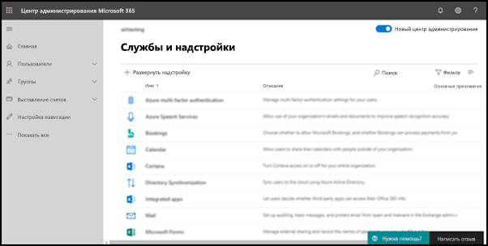

# Включение надстройки "Пожаловаться на фишинг"

[!INCLUDE [Microsoft 365 Defender rebranding](../includes/microsoft-defender-for-office.md)]

> [!NOTE]
> Если вы администратор в организации Microsoft 365 с почтовыми ящиками Exchange Online, рекомендуем использовать портал "Отправки" в Центре безопасности & соответствия требованиям. Дополнительные сведения см. в документе "Отправка администратора" для отправки подозрительной нежелательной [почты, фишинга, URL-адресов и файлов в корпорацию Майкрософт.](admin-submission.md)

Надстройки Report Message и Report Phishing для Outlook и Outlook в Интернете (прежнее название — Outlook Web App) позволяют пользователям легко сообщать о ложных срабатываниях (хорошая электронная почта, помеченная как пустая) или ложных отрицательных результатах (разрешена неверная почта) корпорации Майкрософт и ее аффилированным лицам для анализа.

Корпорация Майкрософт использует эти отправки для повышения эффективности технологий защиты электронной почты. Например, предположим, что люди сообщают о многих сообщениях с помощью надстройки Report Phishing. Эти сведения можно получить на панели мониторинга [безопасности](security-dashboard.md) и в других отчетах. Группа безопасности вашей организации может использовать эти сведения в качестве указания на необходимость обновления политик защиты от фишинга.

Вы можете установить надстройку Report Message или Report Phishing. Если вы хотите, чтобы пользователи сообщали о спаме и фишинговых сообщениях, разверните надстройку Report Message в организации. Дополнительные сведения см. в [надстройки "Включить сообщение отчета".](enable-the-report-message-add-in.md)

Надстройка Report Phishing предоставляет возможность сообщать только о фишинговых сообщениях. Администраторы могут включить для организации надстройку Report Phishing, а отдельные пользователи могут установить ее самостоятельно.

Если вы отдельный пользователь, вы можете включить для себя надстройку [Report Phishing.](#get-the-report-phishing-add-in-for-yourself)

Если вы глобальный администратор или администратор Exchange Online, а в Exchange настроена проверка подлинности OAuth, вы можете включить для своей организации надстройку [Report Phishing.](#get-and-enable-the-report-phishing-add-in-for-your-organization) Фишинговый отчет Add-In теперь доступен через [централизованное развертывание.](https://docs.microsoft.com/microsoft-365/admin/manage/centralized-deployment-of-add-ins)

## Что нужно знать перед началом работы

- Надстройка Report Phishing работает с большинством подписок Microsoft 365 и следующими продуктами:

  - Outlook в Интернете
  - Outlook 2013 с sp1 или более поздней
  - Outlook 2016 для Mac
  - Outlook, включенный в приложения Microsoft 365 для предприятий

- Надстройка Report Phishing недоступна для почтовых ящиков в локальной организации Exchange.

- Вы можете настроить копирование или перенаправление сообщений в задаемый почтовый ящик. Дополнительные сведения [см. в политиках отправки пользователей.](user-submission.md)

- Существующий веб-браузер должен работать с надстройой Report Phishing. Но если вы заметите, что надстройка недоступна или не работает ожидаемым образом, попробуйте другой браузер.

- Для организационных установок необходимо настроить организацию на использование проверки подлинности OAuth. Дополнительные сведения см. в подстройки "Определение работы централизованного развертывания надстройки" [в организации.](../../admin/manage/centralized-deployment-of-add-ins.md)

- Администраторы должны быть членами группы ролей "Глобальные администраторы". Дополнительные сведения см. в статье [Разрешения в Центре безопасности и соответствия требованиям](permissions-in-the-security-and-compliance-center.md).

## Получите для себя надстройку Report Phishing

1. Перейдите в Microsoft AppSource и найдите надстройку <https://appsource.microsoft.com/marketplace/apps> Report Phishing.

2. Нажмите **КНОПКУ GET IT NOW**.

3. В от появляются диалоговое окно, просмотрите условия использования и политику конфиденциальности, а затем нажмите кнопку **"Продолжить.**

4. Во sign in using your work or school account (for business use) or your Microsoft account (for personal use).

После установки и включения надстройки вы увидите следующие значки:

- В Outlook значок выглядит так:

  

- В Outlook в Интернете значок выглядит так:

  

## Получить и включить надстройку Report Phishing для вашей организации

> [!NOTE]
> Для появления надстройки в организации может занять до 12 часов.

1. В Центре администрирования Microsoft 365 перейдите  на страницу "Надстройки параметров" по ссылке "Если страница надстройки не видите", перейдите по ссылке "Надстройки, интегрированные в параметры" в верхней части страницы "Интегрированные \>  <https://admin.microsoft.com/AdminPortal/Home#/Settings/AddIns>   \>  \>  приложения". 

2. Выберите **"Развернуть надстройки"** в верхней части страницы, а затем — **"Далее".**

   

3. В **окле "Развертывание новой** надстройки" просмотрите сведения и нажмите кнопку **"Далее".**

4. На следующей странице нажмите **кнопку "Выбрать из Магазина".**

   

5. На **отображаемой** странице "Выбор  надстройки" щелкните поле  "Поиск", введите "Сообщить о фишинге" **и** щелкните значок  поиска. В списке результатов найдите **фишинговый** отчет и нажмите кнопку **"Добавить".**

6. В от появляются диалоговое окно, просмотрите сведения о лицензировании и конфиденциальности, а затем нажмите кнопку **"Продолжить"**.

7. На **странице "Настройка надстройки"** настройте следующие параметры:

   - **Пользователи с назначенной** подписью: выберите одно из следующих значений:

     - **Все** (по умолчанию)
     - **Конкретные пользователи и группы**
     - **Только я**

   - **Метод развертывания:** выберите одно из следующих значений:

     - **Исправлено (по умолчанию):** надстройка автоматически развертывается для указанных пользователей, и они не могут удалить ее.
     - **Доступно:** пользователи могут установить надстройки на домашней сайте **Get** \> надстройки, **управляемые** \> **администратором.**
     - **Необязательно:** надстройка автоматически развертывается для указанных пользователей, но они могут удалить ее.

   По завершению нажмите кнопку **"Развернуть".**

8. На странице **"Развертывание** фишинга отчета" появится отчет о ходе выполнения, а затем подтверждение развертывания надстройки. После прочтия сведений нажмите кнопку **"Далее".**

9. На **откроемой странице** "Объявить надстройки" просмотрите сведения и нажмите кнопку **"Закрыть".**

## Узнайте, как использовать надстройку Report Phishing

Люди, которым назначена надстройка, увидят следующие значки:

- В Outlook значок выглядит так:

  

- В Outlook в Интернете значок выглядит так:

  

## Просмотр или изменение параметров для надстройки Report Phishing

1. В Центре администрирования Microsoft 365 перейдите  на страницу "Надстройки параметров" по ссылке "Если страница надстройки не видите", перейдите по ссылке "Надстройки, интегрированные в параметры" в верхней части страницы "Интегрированные \>  <https://admin.microsoft.com/AdminPortal/Home#/Settings/AddIns>   \>  \>  приложения". 

2. Найдите и выберите **надстройку Report Phishing.**

3. В **отредактируемом окте** "Отчет о фишинге", который отображается, просмотрите и отредактируете параметры, соответствующие вашей организации. Когда закончите, нажмите кнопку **Сохранить**.

## Просмотр и просмотр сообщений, о чем сообщается

Чтобы просмотреть сообщения, которые пользователи сообщают в корпорацию Майкрософт, у вас есть указанные здесь варианты.

- Используйте портал отправки администраторов. Дополнительные сведения [см. в документе "Просмотр от отправленных пользователями данных в Корпорацию Майкрософт".](admin-submission.md#view-user-submissions-to-microsoft)

- Создайте правило потока почты (также известное как правило транспорта) для отправки копий сообщений. Инструкции см. в инструкциях по использованию правил потока почты, чтобы узнать, что ваши [пользователи сообщают корпорации Майкрософт.](use-mail-flow-rules-to-see-what-your-users-are-reporting-to-microsoft.md)