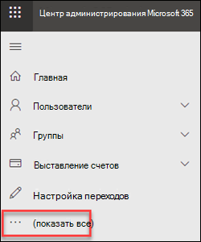
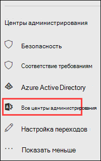
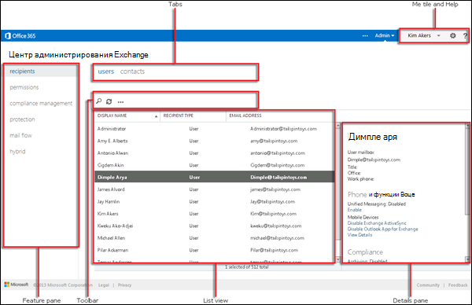

# Центр администрирования Exchange в автономном EOP

[!INCLUDE [Microsoft 365 Defender rebranding](../includes/microsoft-defender-for-office.md)]

Центр администрирования Exchange — это веб-консоль управления для отдельной Exchange Online Protection (EOP).

Ищете версию этой статьи для Exchange Online? Обратитесь к [центру администрирования Exchange в Exchange Online](https://docs.microsoft.com/exchange/exchange-admin-center).

## Открытие центра администрирования Exchange в EOP

Автономные клиенты EOP могут получать доступ к центру администрирования Exchange с помощью следующих методов:

- **В центре администрирования Microsoft 365**:

  1. Перейдите к разделу <https://admin.microsoft.com> и выберите команду **Показать все**.

     

  2. В открывшемся разделе **центры администрирования** выберите **все центры администрирования**.

     

  3. На открывшейся странице **все центры администрирования** выберите **Exchange Online Protection**.

- Перейдите непосредственно к `https://admin.protection.outlook.com/ecp/` .

## Общие элементы пользовательского интерфейса в центре администрирования Exchange в EOP

В этом разделе рассматриваются элементы интерфейса пользователя в Центре администрирования Exchange.

### Панель "Функции"

Это первый уровень навигации для большинства заданий, выполняемых в Центре администрирования Exchange. Панель функций состоит из областей функций.

- **Получатели**: в этой области отображаются группы и внешние контакты.

- **Разрешения**: здесь вы будете управлять ролями администраторов.

- **Управление соответствием**: здесь вы найдете отчет группы ролей администраторов и отчет по журналу аудита действий администратора.

- **Protection**: в этой области можно управлять политиками защиты от вредоносных программ, политикой фильтрации подключений по умолчанию и DKIM.

  > [!NOTE]
  > Следует управлять политиками защиты от вредоносных программ и политикой фильтрации подключений по умолчанию в центре безопасности & соответствия требованиям. Дополнительную информацию можно узнать [в статье Настройка политик защиты от вредоносных программ в EOP](configure-anti-malware-policies.md) и [Настройка ФИЛЬТРАЦИИ подключений в EOP](configure-the-connection-filter-policy.md).

- **Поток обработки почты**: здесь вы будете управлять правилами потока обработки почты (также называемыми правилами транспорта), обслуживаемыми доменами и соединителями, а также с местом, где можно запустить трассировку сообщений.

- **Гибридная**среда: в этой области можно запустить [Мастер гибридной конфигурации](https://docs.microsoft.com/Exchange/hybrid-configuration-wizard), а также установить [модуль PowerShell для Exchange Online](https://docs.microsoft.com/powershell/exchange/mfa-connect-to-exchange-online-powershell).

### Вкладки

Вкладки — это второй уровень навигации. Каждый из компонентов содержит различные вкладки, на каждой из которых будет представлена функция.

### Панель инструментов

При выборе большинства вкладок отображается панель инструментов. Панель инструментов содержит значки, которые выполняют определенное действие. Значки и их действия описаны в следующей таблице.

****

|Значок|Имя|Action|
|---|---|---|
||"Добавить", "Создать"|Используйте этот значок для создания нового объекта. Некоторые из этих значков имеют стрелку вниз, щелкнув которую, можно отобразить дополнительные объекты, которые можно создать.|
||Изменить|Используйте этот значок для редактирования объекта.|
||Удаление|Используйте этот значок для удаления объекта. У некоторых значков удаления есть стрелка вниз, которая позволяет отобразить дополнительные параметры.|
||Поиск|Этот значок позволяет открыть поле поиска, в котором можно ввести фразу поиска для объекта, который требуется найти.|
||Обновить|Используйте этот значок, чтобы обновить представление списка.|
||Дополнительные параметры|Используйте этот значок для просмотра дополнительных действий, которые можно выполнить для объектов этой вкладки. Например, при нажатии этого значка в области **Получатели \> Пользователи** отображается параметр для выполнения **расширенного поиска**.  |
||Стрелка вверх и стрелка вниз|Используйте эти значки для изменения приоритета объекта.|
||Удалить|Используйте этот значок, чтобы удалять объекты из списка.|
|

### Представление списка

При выборе вкладки в большинстве случаев отображается представление списка. Лимит просмотра в Центре администрирования Exchange составляет около 10 000 объектов. Кроме того, включено постраничное разделение, так что вы можете листать страницы результатов.

### Область сведений

При выборе объекта в представлении списка информация об этом объекте отображается в области сведений. В некоторых случаях область сведений включает задачи управления.

### Иконка "Я" и справка

Плитка **Я** позволяет выйти из Центра администрирования Exchange и войти в него как другой пользователь. При помощи раскрывающегося меню справки **Справка** можно выполнять следующие действия:

- **Справка**: щелкните  чтобы просмотреть содержимое справки в Интернете.

- **Обратная связь**: Оставьте отзыв.

- **Сообщество**: опубликуйте вопрос для поиска ответов на форумах сообщества.

- **Отключить всплывающее**окно справки: при создании или редактировании объекта всплывающая справка отображается в контекстной справке для полей. Вы можете отключить подменю справки или включить его, если оно отключено.

- **Показать ведение журнала команды**: откроется новое окно с эквивалентными командами PowerShell в зависимости от того, что было настроено в центре администрирования Exchange.

## Поддерживаемые веб-браузеры

Для оптимальной работы с центром администрирования Exchange рекомендуется всегда использовать новейшие браузеры, клиенты Office и приложения. We also recommend that you install software updates when they become available. Дополнительные сведения о поддерживаемых браузерах и требованиях к системе для службы приведены в разделе [требования к системе для Office](https://products.office.com/office-system-requirements).

## Поддерживаемые языки

Следующие языки поддерживаются и доступны для центра администрирования Exchange в автономной EOP.

- Амхарский
- Арабский
- Баскский (Basque)
- Бенгальский (Индия)
- Болгарский
- Каталонский
- китайский (упрощенное письмо);
- китайский (традиционный);
- хорватский;
- чешский;
- датский;
- голландский;
- английский;
- эстонский;
- Филиппинский (Филиппины)
- финский;
- французский;
- Галисийский
- немецкий;
- греческий;
- Гуджарати
- иврит;
- хинди;
- венгерский;
- Исландский
- индонезийский;
- итальянский;
- японский;
- Каннада
- Казахский
- Суахили
- корейский;
- латышский;
- литовский;
- Малайский (Бруней-Даруссалам)
- Малайский (Малайзия)
- Малаялам
- Маратхи
- Норвежский (букмол)
- Норвежский (нюнорск)
- Ория
- Персидский
- польский;
- португальский (Бразилия);
- португальский (Португалия);
- румынский;
- русский;
- Сербскохорватский (кириллица, Сербия)
- сербский (латиница);
- словацкий;
- словенский;
- испанский;
- шведский;
- Тамильский
- Телугу
- тайский;
- турецкий;
- украинский;
- Урду
- Вьетнамский
- Валлийский
