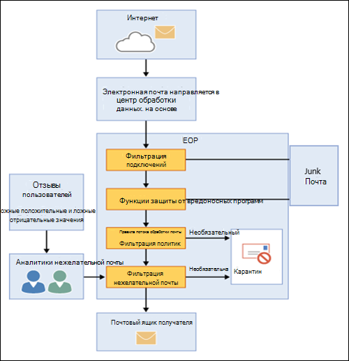

# Обзор Exchange Online Protection

Exchange Online Protection (EOP) — это облачная служба фильтрации, которая помогает защитить организацию от нежелательной почты и вредоносных программ. EOP включается во все организации Microsoft 365 с почтовыми ящиками Exchange Online.

Однако EOP также можно использовать в следующих локальных сценариях:

- **В автономном сценарии**: EOP предоставляет облачную защиту электронной почты для локальной организации Exchange или для любого другого локального решения электронной почты SMTP.

- **В гибридном развертывании**: EOP можно настроить для защиты среды электронной почты и управления маршрутизацией почты при наличии смешанных локальных и облачных почтовых ящиков.

В этих сценариях EOP может упростить управление вашей средой электронной почты и сократить многие из накладных расходов, которые поставляются с обслуживанием локального оборудования и программного обеспечения.

В оставшейся части этого раздела объясняется, как EOP работает в автономных и гибридных средах.

## Как работает EOP

Чтобы понять, как работает EOP, будет полезным взглянуть, как эта служба обрабатывает входящую электронную почту.

- Входящее сообщение изначально проходит через фильтрацию подключений, которое проверяет репутацию отправителя и проверяет сообщение на наличие вредоносных программ. Большая часть нежелательных сообщений на этом шаге останавливается и удалена в EOP. Дополнительные сведения см. в статье [Настройка фильтрации подключений](configure-the-connection-filter-policy.md).

- Сообщения продолжаются с помощью фильтрации политик, где сообщения оцениваются по настраиваемым правилам для обработки почты (также называемым правилами транспорта), которые создаются или применяются из шаблона. Например, вы можете создать правило, которое отправляет уведомление руководителю при поступлении почты от определенного отправителя. На этом шаге также выполняются проверки защиты от потери данных (клиентская лицензия Exchange Enterprise со службами).

- Затем сообщения проходят фильтрацию нежелательной почты (также называемую фильтрацией содержимого). Сообщение, которое определено как нежелательная почта, можно отправить в папку нежелательной почты пользователя или на карантин, а также другие варианты. Дополнительные сведения см. в статье [Настройка политик защиты от нежелательной почты](configure-your-spam-filter-policies.md).

- После успешной передачи всех этих уровней защиты получателю он доставляется получателю.

Для получения дополнительных сведений см [порядок и очередность защиты электронной почты](how-policies-and-protections-are-combined.md).

### Центры обработки данных службы EOP

Служба EOP работает во всемирной сети центров данных, которые предназначены для обеспечения лучшей доступности. Например, если центр данных недоступен, сообщения электронной почты автоматически направляются в другой центр данных без остановки работы службы. Серверы в каждом центре данных принимают сообщения от вашего имени, обеспечивая уровень разделения между Организацией и Интернетом, тем самым уменьшая нагрузку на серверы. Благодаря этой высокой доступности сети корпорация Майкрософт может гарантировать, что электронная почта достигнет вашей организации в установленные сроки.

Служба EOP выполняет балансировку нагрузки между центрами обработки данных, но только в пределах одного региона. Если ваша система настроена в одном регионе, все ваши сообщения будут обрабатываться с использованием маршрутизации для этого региона. В следующем списке показано, как региональная маршрутизация почты работает для центров обработки данных EOP:

- В Европе, на Ближнем Востоке и в Африке (регион EMEA) все почтовые ящики Exchange Online находятся в центрах обработки данных региона EMEA, а все сообщения направляются через центры обработки данных EMEA для фильтрации с помощью EOP.

- В Азиатско-Тихоокеанском (APAC) все почтовые ящики Exchange Online расположены в центрах обработки данных APAC, а сообщения в настоящее время направляются через центры обработки данных APAC для фильтрации EOP.

- В Америки все почтовые ящики Exchange Online находятся в центрах обработки данных США, за исключением Южной Америки, в котором используются центры обработки данных в Бразилии и Чили, и в Канаде используются центры обработки данных в Канаде. Все сообщения электронной почты, в том числе сообщения для клиентов в Южной Америке и Канаде, направляются через локальные центры обработки данных для фильтрации EOP; сообщение электронной почты, помещенное в карантин, хранится в центре обработки данных, в котором расположен клиент.

- Для облака сообщества государственных учреждений США (GCC) все почтовые ящики Exchange Online находятся в центрах обработки данных в США, а все сообщения направляются через центры обработки данных в США для фильтрации с помощью EOP.

## Планы и функции EOP для локальных организаций электронной почты

Доступные планы подписки на EOP:

- **EOP standalone**: вы регистрируетесь в EOP, чтобы защитить локальную почтовую организацию.

- **Функции EOP в Exchange Online**: любая подписка, включающая Exchange Online (автономная или в составе Microsoft 365), использует EOP для защиты почтовых ящиков Exchange Online.

- **Клиентская лицензия Exchange Enterprise CAL со службами**: если у вас есть локальная организация Exchange, в которой вы приобрели дополнительные лицензии на Exchange Enterprise CAL со СЛУЖБАМИ, EOP является частью включенных служб.

Сведения о требованиях, важных пределах и доступности функций во всех планах подписки на EOP можно найти в [описании службы Exchange Online Protection](https://docs.microsoft.com/office365/servicedescriptions/exchange-online-protection-service-description/exchange-online-protection-service-description).

## Настройка EOP для локальных организаций электронной почты

Настройка EOP может быть простой процедурой, особенно в случае небольшой организации с немногочисленными правилами соответствия. Однако, в случае большой организации с несколькими доменами, настраиваемыми правилами соответствия или гибридным потоком обработки почты настройка может потребовать большего планирования и времени.

При уже приобретенной EOP см. [Настройка службы EOP](set-up-your-eop-service.md), чтобы убедиться в выполнении всех действий, необходимых для настройки EOP с целью защиты вашей среды обмена сообщениями.

## Справка по EOP для администраторов

Содержимое справки EOP для администраторов состоит из следующих категорий верхнего уровня.

- [Обзор Exchange Online Protection](exchange-online-protection-overview.md): в этой статье представлены сведения о том, как работает EOP и приведены ссылки на дополнительные сведения.

- [Функции EOP](eop-features.md): предоставляет список функций, доступных в EOP.

- [Настройте службу EOP](set-up-your-eop-service.md): в этой статье приведены инструкции по настройке службы EOP и ссылки на дополнительные сведения.

- [Переключитесь на EOP из Google Postini, с помощью Barracuda спама и антивирусного брандмауэра или Cisco IronPort](switch-to-eop-from-google-postini-the-barracuda-spam-and-virus-firewall-or-cisco.md): описывает процесс переключения на EOP из другой программы защиты электронной почты.

- [Управление получателями в автономной EOP](manage-recipients-in-eop.md): в этой статье описано, как управлять почтовыми пользователями и группами в EOP.

- [Почтовый ящик в EOP: в](mail-flow-in-eop.md)этой статье описано, как настроить пользовательские сценарии обработки почты с помощью соединителей, как управлять доменами, связанными со службой, и как включить функцию пограничной блокировки на основе каталогов (DBEB).

- Рекомендации [по настройке EOP](best-practices-for-configuring-eop.md): в этой статье описываются рекомендуемые параметры конфигурации и рекомендации по настройке и подготовке службы.

- [Отчеты аудита в автономных EOP](auditing-reports-in-eop.md): в этой статье описано, как использовать отчеты аудита для отслеживания изменений конфигурации службы.

- [Защита от нежелательной почты и вредоносных программ в EOP](anti-spam-and-anti-malware-protection.md): Описывает фильтрацию нежелательной почты и фильтрацию вредоносных программ, а также показывает, как настроить их для лучшего соответствия потребностям вашей организации. Кроме того, в этом разделе описываются задачи, которые администраторы и конечные пользователи могут выполнить для сообщений, помещенных в карантин.

- [Отчеты и трассировка сообщений в Exchange Online Protection](reporting-and-message-trace-in-exchange-online-protection.md): в этой статье описываются доступные средства отчетов и устранения неполадок.

- [Центр администрирования Exchange в автономной EOP](exchange-admin-center-in-exchange-online-protection-eop.md): в этой статье описывается, как получить доступ к интерфейсу управления центра администрирования Exchange и перемещаться по нему для управления службой EOP.

- [Exchange Online Protection PowerShell](https://docs.microsoft.com/powershell/exchange/exchange-eop/exchange-online-protection-powershell): содержит сведения об удаленной оболочке PowerShell, которая позволяет управлять службой EOP из командной строки.

- [Справка и поддержка для EOP](help-and-support-for-eop.md) В этом разделе представлены сведения о том, как получить помощь и техническую поддержку.
