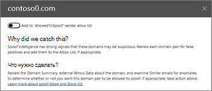

# Пошаговое руководство. Из панели мониторинга к аналитикеWalkthrough - From a dashboard to an insight

Если вы не знакомы с [отчетами и аналитическими сведениями в центре безопасности &amp; и соответствия требованиям Office 365](reports-and-insights-in-security-and-compliance.md), то можете понять, как легко переходить с панели мониторинга на подробные и рекомендуемые действия.If you're new to [reports and insights in the Office 365 Security &amp; Compliance Center](reports-and-insights-in-security-and-compliance.md), it might help to see how you can easily navigate from a dashboard to an insight and recommended actions. 
  
Это одно из нескольких пошаговых руководств для центра &amp; безопасности и соответствия требованиям.This is one of several walkthroughs for the Security &amp; Compliance Center. Дополнительные пошаговые руководства можно найти в разделе [связанные темы](#related-topics) .To see additional walkthroughs, see the [Related topics](#related-topics) section. 
  
## Пошаговое руководство: из панели мониторинга в представлениеWalkthrough: From a dashboard to an insight

Давайте рассмотрим процесс передачи данных из панели мониторинга в отчет для анализа и действия.Let's walk through the flow from a dashboard to a report to an insight and action. (Это краткий пример службы [подделки](learn-about-spoof-intelligence.md) .)(This is a brief [spoof intelligence](learn-about-spoof-intelligence.md) example.) 
  
1. Мы начнем с панели мониторинга безопасности в [центре безопасности &amp; и соответствия требованиям](https://protection.office.com).We begin with the Security dashboard in the [Security &amp; Compliance Center](https://protection.office.com). (Перейдите на \> **панель мониторинга** **управления угрозами** .)(Go to **Threat management** \> **Dashboard**.)  
  
2. В строке **Insights** мы рассмотрели информацию о том, что нам нужно проверить некоторые домены, которые могут быть подозрительными.In the **Insights** row, we notice an insight indicating we need to review some domains that might be suspicious. В строке **Insights** (сведения о домене) выберите пункт **пары доменов**.(In the **Insights** row, click **Domain pairs**.)  
  
3. Мы получаем список действий, связанных с логикой подделки.We get a list of activities related to spoof intelligence. Это экземпляры, в которых сообщения электронной почты отправляются так, как они поступили из нашей Организации, но на самом деле были отправлены из другой организации.These are instances where email messages were sent that look like they came from our organization but were, in fact, sent from another organization. Цель состоит в том, чтобы определить, авторизованы ли подложные сообщения.The goal is to determine whether the spoofed messages are authorized or not.  В этом списке можно отсортировать информацию по количеству сообщений, дате и времени последнего обнаружения поддельных сообщений.In this list, we can sort the information by message count, date the spoofing was last detected, and more. (Щелкните заголовки столбцов, например, **количество сообщений** или **Последнее** отображение, чтобы увидеть, как работает сортировка.)(Click column headings, such as **Message count** or **Last seen** to see how sorting works.) 
    
4. При выборе элемента в списке открывается область сведений, в которой можно увидеть дополнительные сведения, в том числе Похожие сообщения электронной почты, которые были обнаружены.Selecting an item in the list opens a details pane where we can see additional information, including similar email messages that were detected. (Щелкните элемент в списке и ознакомьтесь со сведениями и рекомендациями.)(Click an item in the list, and review the information and recommendations.)  
  
5. Обратите внимание, что в верхней части области можно добавить отправителя в список разрешенных отправителей организации.Notice that at the top of the pane, we have the option to add the sender to our organization's allowed senders list. (Не выбирайте **Добавить в список "алловедтоспуф" отправителя** , пока вы не подтвердите это.(Do not select **Add to 'AllowedtoSpoof' sender allow list** until you are sure you want to do this. [Узнайте больше о логике подделки](learn-about-spoof-intelligence.md).)[Learn more about spoof intelligence](learn-about-spoof-intelligence.md).) 
  
Таким образом, мы можем перейти с панели мониторинга к ценным и рекомендуемым действиям.In this way, we can move from a dashboard to insights and recommended actions.
  
## Статьи по темеRelated topics

[Пошаговое руководство: из подробного отчетаWalkthrough: From an insight to a detailed report](from-an-insight-to-a-detailed-report.md)
  
[Пошаговое руководство: из подробного отчета в представлениеWalkthrough: From a detailed report to an insight](from-a-detailed-report-to-an-insight.md)
  

