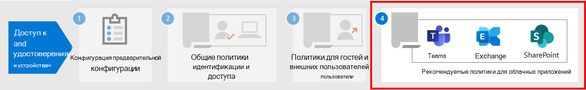

# Политики, разрешающие гостевой доступ и доступ внешних пользователей B2BPolicies for allowing guest access and B2B external user access

В этой статье обсуждается настройка рекомендуемых политик доступа к устройствам и удостоверениям, чтобы разрешить доступ гостям и внешним пользователям с учетной записью Azure Active Directory (Azure AD) business-to-Business (B2B).This article discusses adjusting the recommended device and identity access policies to allow access for guests and external users that have an Azure Active Directory (Azure AD) Business-to-Business (B2B) account. Это руководство построено на [общих политиках доступа к удостоверениям и устройствам.](identity-access-policies.md)This guidance builds on the [common identity and device access policies](identity-access-policies.md).

Эти рекомендации предназначены для применения к **базовому** уровню защиты.These recommendations are designed to apply to the **baseline** tier of protection. Однако вы также можете скорректировать рекомендации в зависимости от конкретных потребностей в конфиденциальной **и** **строго регулируемой** защите.But you can also adjust the recommendations based on your specific needs for **sensitive** and **highly regulated** protection.

Если предоставить учетным записям B2B путь для проверки подлинности в клиенте Azure AD, эти учетные записи не будут иметь доступ ко всей среде.Providing a path for B2B accounts to authenticate with your Azure AD tenant doesn't give these accounts access to your entire environment. Пользователи B2B и их учетные записи имеют доступ к службам и ресурсам, например файлам, доступ к ним делиться политикой условного доступа.B2B users and their accounts have access to services and resources, like files, shared with them by Conditional Access policy.

## Обновление общих политик для поддержки и защиты гостей и доступа внешних пользователейUpdating the common policies to allow and protect guests and external user access

На этой схеме показано, какие политики необходимо добавить или обновить среди общих политик доступа к удостоверениям и устройствам для гостевого и внешнего доступа пользователей B2B.This diagram shows which policies to add or update among the common identity and device access policies, for B2B guest and external user access.

[См. более крупную версию этого изображенияSee a larger version of this image](https://github.com/MicrosoftDocs/microsoft-365-docs/raw/public/microsoft-365/media/microsoft-365-policies-configurations/identity-access-ruleset-guest.png)

В следующей таблице перечислены политики, которые необходимо создать и обновить.The following table lists the policies you either need to create and update. Общие политики ссылались на связанные инструкции по настройке в статье "Общие политики доступа к удостоверениям [и устройствам".](identity-access-policies.md)The common policies link to the associated configuration instructions in the [Common identity and device access policies](identity-access-policies.md) article.

|Уровень защитыProtection level|ПолитикиPolicies|Дополнительная информацияMore information|
|---|---|---|
|**Базовый уровень****Baseline**|[Всегда требовать многофаксную многофаксную раз для гостей и внешних пользователейRequire MFA always for guests and external users](identity-access-policies.md#require-mfa-based-on-sign-in-risk)|Создайте эту новую политику и настройте:Create this new policy and configure: <ul><li>For **Assignments > Users and groups > Include, choose** **Select users and groups**, and then select All guest and **external users**.For **Assignments > Users and groups > Include**, choose **Select users and groups**, and then select **All guest and external users**.</li><li>Для **заданий > условий > входе** оставьте все параметры невызванными, чтобы всегда применять многофакторную проверку подлинности (MFA).For **Assignments > Conditions > Sign-in**, leave all options unchecked to always enforce multi-factor authentication (MFA).</li></ul>|
||[Требовать многофаксную оценку, если риск при входе средний *или* *высокий*Require MFA when sign-in risk is *medium* or *high*](identity-access-policies.md#require-mfa-based-on-sign-in-risk)|Измените эту политику, чтобы исключить гостей и внешних пользователей.Modify this policy to exclude guests and external users.|
||[Требовать использования соответствующих политике компьютеровRequire compliant PCs](identity-access-policies.md#require-compliant-pcs-but-not-compliant-phones-and-tablets)|Измените эту политику, чтобы исключить гостей и внешних пользователей.Modify this policy to exclude guests and external users.|

Чтобы включить или исключить гостей и внешних пользователей в политиках условного доступа, для > пользователей и групп **> Включить** или исключить **всех** гостевых и **внешних пользователей.**To include or exclude guests and external users in Conditional Access policies, for **Assignments > Users and groups > Include** or **Exclude**, check **All guest and external users**.

## Дополнительная информацияMore information

### Гостевой доступ и доступ внешних пользователей с помощью Microsoft TeamsGuests and external user access with Microsoft Teams

Microsoft Teams определяет следующих пользователей:Microsoft Teams defines the following users:

- **Гостевой** доступ использует учетную запись Azure AD B2B, которую можно добавить в качестве участника команды и получить доступ к коммуникациям и ресурсам команды.**Guest access** uses an Azure AD B2B account that can be added as a member of a team and have access to the communications and resources of the team.

- **Внешний доступ** для внешнего пользователя без учетной записи B2B.**External access** is for an external user that doesn't have a B2B account. Доступ внешних пользователей включает приглашения, звонки, чаты и собрания, но не включает членство в команде и доступ к ресурсам команды.External user access includes invitations, calls, chats, and meetings, but doesn't include team membership and access to the resources of the team.

Дополнительные сведения см. в [сравнении гостевых и внешних пользователей с доступом к командам.](https://docs.microsoft.com/microsoftteams/communicate-with-users-from-other-organizations#compare-external-and-guest-access)For more information, see the [comparison between guests and external user access for teams](https://docs.microsoft.com/microsoftteams/communicate-with-users-from-other-organizations#compare-external-and-guest-access).

Дополнительные сведения о защите политик доступа к удостоверениям и устройствам для Teams см. в рекомендациях политики для защиты чатов, групп [и файлов Teams.](teams-access-policies.md)For more information on securing identity and device access policies for Teams, see [Policy recommendations for securing Teams chats, groups, and files](teams-access-policies.md).

### Требовать многофаксную многофайловую многофайловую раз для гостевых и внешних пользователейRequire MFA always for guest and external users

Эта политика побуждает гостей зарегистрироваться для MFA в клиенте независимо от того, зарегистрированы ли они для MFA в домашнем клиенте.This policy prompts guests to register for MFA in your tenant, regardless of whether they're registered for MFA in their home tenant. При доступе к ресурсам в клиенте гости и внешние пользователи должны использовать MFA для каждого запроса.When accessing resources in your tenant, guests and external users are required to use MFA for every request.

### Исключение гостей и внешних пользователей из MFA с учетом рисковExcluding guests and external users from risk-based MFA

Хотя организации могут применять политики на основе рисков для пользователей B2B с помощью защиты идентификации Azure AD, существуют ограничения в реализации защиты идентификации Azure AD для пользователей совместной работы B2B в каталоге ресурсов из-за их удостоверений, существующих в их домашнем каталоге.While organizations can enforce risk-based policies for B2B users using Azure AD Identity Protection, there are limitations in the implementation of Azure AD Identity Protection for B2B collaboration users in a resource directory due to their identity existing in their home directory. Из-за этих ограничений Корпорация Майкрософт рекомендует исключить гостей из политик MFA на основе рисков и требовать от этих пользователей всегда использовать многофаксную.Due to these limitations, Microsoft recommends you exclude guests from risk-based MFA policies and require these users to always use MFA.

Дополнительные сведения см. в сведениях об ограничениях [защиты идентификации для пользователей совместной работы B2B.](https://docs.microsoft.com/azure/active-directory/identity-protection/concept-identity-protection-b2b#limitations-of-identity-protection-for-b2b-collaboration-users)For more information, see [Limitations of Identity Protection for B2B collaboration users](https://docs.microsoft.com/azure/active-directory/identity-protection/concept-identity-protection-b2b#limitations-of-identity-protection-for-b2b-collaboration-users).

### Исключение гостей и внешних пользователей из системы управления устройствамиExcluding guests and external users from device management

Управлять устройством может только одна организация.Only one organization can manage a device. Если вы не исключите гостей и внешних пользователей из политик, которые требуют соответствия устройств требованиям, эти политики заблокируют этих пользователей.If you don't exclude guests and external users from policies that require device compliance, these policies will block these users.

## Следующий шагNext step

Настройте политики условного доступа для:Configure Conditional Access policies for:

- [Microsoft TeamsMicrosoft Teams](teams-access-policies.md)
- [Exchange OnlineExchange Online](secure-email-recommended-policies.md)
- [SharePointSharePoint](sharepoint-file-access-policies.md)
