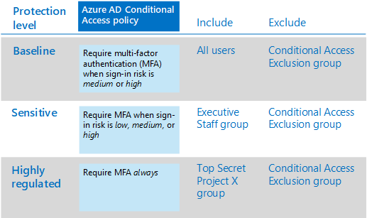

# Основные политики доступа для удостоверений и устройствCommon identity and device access policies

В этой статье описываются распространенные рекомендуемые политики для защиты доступа к облачным службам Microsoft 365, включая локальные приложения, опубликованные с помощью прокси-сервера приложения Azure Active Directory (Azure AD).This article describes the common recommended policies for securing access to Microsoft 365 cloud services, including on-premises applications published with Azure Active Directory (Azure AD) Application Proxy. 

В этом руководстве рассказывается, как развертывать рекомендуемые политики в новой подготовленной среде.This guidance discusses how to deploy the recommended policies in a newly-provisioned environment. Настройка этих политик в отдельной лабораторной среде позволяет ознакомиться с рекомендуемыми политиками и оценить их до того, как они будут выдаваться в предварительных и рабочих средах.Setting up these policies in a separate lab environment allows you to understand and evaluate the recommended policies before staging the rollout to your preproduction and production environments. Созданная вами среда может быть только облачной или гибридной в соответствии с потребностями вашей оценки.Your newly provisioned environment can be cloud-only or hybrid to reflect your evaluation needs.  

## Набор политикPolicy set 

На следующей схеме показан рекомендуемый набор политик.The following diagram illustrates the recommended set of policies. Здесь показано, к какому уровню защиты применяется каждая политика, а также применяются ли политики к компьютерам, телефонам и планшетам или обеим категориям устройств.It shows which tier of protections each policy applies to and whether the policies apply to PCs or phones and tablets, or both categories of devices. Здесь также указывается, где настраиваются эти политики.It also indicates where you configure these policies.

 
 [просмотреть более крупную версию этого изображения](https://github.com/MicrosoftDocs/microsoft-365-docs/raw/public/microsoft-365/media/microsoft-365-policies-configurations/Identity_device_access_policies_byplan.png)
[See a larger version of this image](https://github.com/MicrosoftDocs/microsoft-365-docs/raw/public/microsoft-365/media/microsoft-365-policies-configurations/Identity_device_access_policies_byplan.png)

Ниже приведена одностраничная сводка PDF-файлов со ссылками на индивидуальные политики:Here's a one-page PDF summary with links to the individual policies:

    [Просмотр в виде PDF-файла](../../downloads/MSFT-cloud-architecture-identity-device-protection-handout.pdf) \| [Загрузка в виде PDF-файла](https://github.com/MicrosoftDocs/microsoft-365-docs/raw/public/microsoft-365/downloads/MSFT-cloud-architecture-identity-device-protection-handout.pdf)[View as a PDF](../../downloads/MSFT-cloud-architecture-identity-device-protection-handout.pdf) \| [Download as a PDF](https://github.com/MicrosoftDocs/microsoft-365-docs/raw/public/microsoft-365/downloads/MSFT-cloud-architecture-identity-device-protection-handout.pdf)  

В оставшейся части этой статьи рассказывается, как настроить эти политики.The rest of this article describes how to configure these policies. 

>[!Note]
>Перед регистрацией устройств в Intune рекомендуется использовать многофакторную проверку подлинности (MFA), чтобы убедиться, что устройство находится в среде выполнения предполагаемого пользователя.Requiring the use of multi-factor authentication (MFA) is recommended before enrolling devices in Intune to assure that the device is in the possession of the intended user. Прежде чем приступать к применению политик соответствия требованиям устройств, необходимо зарегистрировать устройства в Intune.You must enroll devices in Intune before you can enforce device compliance policies.
>

Чтобы обеспечить время для выполнения этих задач, рекомендуем реализовать базовые политики в порядке, указанном в этой таблице.To give you time to accomplish these tasks, we recommend implementing the baseline policies in the order listed in this table. Однако политики MFA для конфиденциальных и строго регулируемых уровней защиты можно реализовать в любое время.However, the MFA policies for sensitive and highly regulated levels of protection can be implemented at any time.

|Уровень защитыProtection level|ПолитикиPolicies|Дополнительная информацияMore information|
|:---------------|:-------|:----------------|
|**Базовый уровень****Baseline**|[Требовать, чтобы риск входа в систему был *средним* или *высоким*Require MFA when sign-in risk is *medium* or *high*](#require-mfa-based-on-sign-in-risk)| |
|        |[Блокирование клиентов, не поддерживающих современную проверку подлинностиBlock clients that don't support modern authentication](#block-clients-that-dont-support-modern-authentication)|Клиенты, для которых не используется современная проверка подлинности, могут обходить политики условного доступа, поэтому важно заблокировать их.Clients that do not use modern authentication can bypass Conditional Access policies, so it's important to block these.|
|        |[Необходимость смены пароля для пользователей с высоким рискомHigh risk users must change password](#high-risk-users-must-change-password)|Принудительно изменяет пароль при входе в учетную запись, если для учетной записи обнаружены действия с высокой степенью риска.Forces users to change their password when signing in if high-risk activity is detected for their account.|
|        |[Применение политик защиты данных приложенийApply app data protection policies](#apply-app-data-protection-policies)|Одна политика защиты приложений Intune на платформу (Windows, iOS/Ипадос, Android).One Intune App Protection policy per platform (Windows, iOS/iPadOS, Android).|
|        |[Требовать утвержденные приложения и защиту приложенийRequire approved apps and app protection](#require-approved-apps-and-app-protection)|Обеспечивает защиту мобильных приложений для телефонов и планшетов с помощью iOS, Ипадос или Android.Enforces mobile app protection for phones and tablets using iOS, iPadOS, or Android.|
|        |[Определение политик соответствия требованиям устройствDefine device compliance policies](#define-device-compliance-policies)|Одна политика для каждой платформы.One policy for each platform.|
|        |[Требовать использования соответствующих политике компьютеровRequire compliant PCs](#require-compliant-pcs-but-not-compliant-phones-and-tablets)|Обеспечивает управление компьютерами в Intune с помощью Windows или MacOS.Enforces Intune management of PCs using Windows or MacOS.|
|**Конфиденциально****Sensitive**|[Требовать, когда риск входа в систему имеет *низкую*, *среднюю*или *высокую*Require MFA when sign-in risk is *low*, *medium*, or *high*](#require-mfa-based-on-sign-in-risk)| |
|         |[Требовать соответствующие компьютеры *и* мобильные устройстваRequire compliant PCs *and* mobile devices](#require-compliant-pcs-and-mobile-devices)|Обеспечивает управление Intune для обоих компьютеров (Windows или MacOS), а также телефонов или планшетов (iOS, Ипадос или Android).Enforces Intune management for both PCs (Windows or MacOS) and phones or tablets (iOS, iPadOS, or Android).|
|**Строго контролируемый****Highly regulated**|[*Всегда* требовать MFA*Always* require MFA](#require-mfa-based-on-sign-in-risk)|
| | | |

## Назначение политик группам и пользователямAssigning policies to groups and users

Перед настройкой политик Определите группы Azure AD, которые вы используете для каждого уровня защиты.Before configuring policies, identify the Azure AD groups you are using for each tier of protection. Как правило, базовая защита применяется ко всем сотрудникам Организации.Typically, baseline protection applies to everybody in the organization. Для пользователя, включенного для базовой и конфиденциальной защиты, будут применены все базовые политики плюс политики конфиденциальной защиты.A user who is included for both baseline and sensitive protection will have all the baseline policies applied plus the sensitive policies. Защита является накопительной и применяется наиболее строгая политика.Protection is cumulative and the most restrictive policy is enforced. 

Рекомендуем создать группу Azure AD для исключения условного доступа.A recommended practice is to create an Azure AD group for Conditional Access exclusion. Добавьте эту группу ко всем политикам условного доступа в значении **Exclude** параметра **Пользователи и группы** в разделе **назначения** .Add this group to all of your Conditional Access policies in the **Exclude** value of the **Users and groups** setting in the **Assignments** section. Это позволяет получить доступ к пользователю при устранении неполадок, связанных с доступом.This gives you a method to provide access to a user while you troubleshoot access issues. Рекомендуется использовать только временное решение.This is recommended as a temporary solution only. Отслеживайте изменения в этой группе и следите за тем, чтобы группа исключений использовалась только как задумано.Monitor this group for changes and be sure the exclusion group is being used only as intended. 

Ниже приведен пример назначения групп и исключений для требования MFA.Here's an example of group assignment and exclusions for requiring MFA.

Ниже приведены результаты.Here are the results:

- Все пользователи должны использовать MFA, если риск для входа имеет средний или высокий уровень.All users are required to use MFA when the sign-in risk is medium or high.

- Участники группы "руководители руководителей" должны использовать MFA, если риск для входа невысок, средний или высокий.Members of the Executive Staff group are required to use MFA when the sign-in risk is low, medium, or high.

  В этом случае участники группы руководителей совпадают с базовыми и конфиденциальными политиками условного доступа.In this case, members of the Executive Staff group match both the baseline and sensitive Conditional Access policies. Элементы управления доступом для обоих политик объединяются, что в данном случае эквивалентно политике условного доступа.The access controls for both policies are combined, which in this case is equivalent to the sensitive Conditional Access policy.

- Членам группы верхнего уровня секретного проекта X всегда требуется использовать MFAMembers of the Top Secret Project X group are always required to use MFA

  В этом случае участники группы Top Secret X совпадают как базовые политики и политики условного доступа с высоким уровнем поднадзора.In this case, members of the Top Secret Project X group match both the baseline and highly-regulated Conditional Access policies. Элементы управления доступом для обоих политик объединяются.The access controls for both policies are combined. Так как управление доступом для политики условного доступа с высоким уровнем доступа является более строго жестким, используется.Because the access control for the highly-regulated Conditional Access policy is more restrictive, it is used.

Будьте внимательны при применении более высоких уровней защиты для групп и пользователей.Be careful when applying higher levels of protection to groups and users. Например, участники группы Top Secret Project должны использовать MFA при каждом входе в систему, даже если они не работают с жестко регулируемым контентом для Project X.For example, members of the Top Secret Project X group will be required to use MFA every time they sign in, even if they are not working on the highly-regulated content for Project X.  

Все группы Azure AD, созданные как часть этих рекомендаций, должны быть созданы как группы Microsoft 365.All Azure AD groups created as part of these recommendations must be created as Microsoft 365 groups. Это важно для развертывания меток конфиденциальности при защите документов в Microsoft Teams и SharePoint.This is important for the deployment of sensitivity labels when securing documents in Microsoft Teams and SharePoint.

## Запрос MFA на основе риска входаRequire MFA based on sign-in risk

Пользователям необходимо зарегистрировать MFA, прежде чем требовать его использование.You should have your users register for MFA prior to requiring its use. Если у вас есть Microsoft 365, Microsoft 365 E3 с удостоверением & для защиты от угроз, Office 365 с EMS или с помощью отдельных лицензий Azure AD Premium P2, вы можете использовать политику регистрации MFA с защитой удостоверений в Azure AD, чтобы требовать регистрацию пользователей в MFA.If you have Microsoft 365 E5, Microsoft 365 E3 with the Identity & Threat Protection add-on, Office 365 with EMS E5, or individual Azure AD Premium P2 licenses, you can use the MFA registration policy with Azure AD Identity Protection to require that users register for MFA. Необходимые [условия](identity-access-prerequisites.md) включают регистрацию всех пользователей с помощью mfa.The [prerequisite work](identity-access-prerequisites.md) includes registering all users with MFA.

Когда ваши пользователи будут зарегистрированы, вы можете включить MFA для входа с помощью новой политики условного доступа.After your users are registered, you can require MFA for sign-in with a new Conditional Access policy.

1. Войдите на [портал Azure](https://portal.azure.com) со своими учетными данными.Go to the [Azure portal](https://portal.azure.com), and sign in with your credentials.
2. В списке служб Azure выберите **Azure Active Directory**.In the list of Azure services, choose **Azure Active Directory**.
3. В списке **Управление** выберите **Безопасность**, а затем выберите **Условный доступ**.In the **Manage** list, choose **Security**, and then choose **Conditional Access**.
4. Выберите **создать политику** и введите имя новой политики.Choose **New policy** and type the new policy's name.

В следующих таблицах описываются параметры политики условного доступа, которые требуют использования MFA на основе риска при входе.The following tables describes the Conditional Access policy settings to require MFA based on sign-in risk.

В разделе " **назначения** " выполните следующие действия:In the **Assignments** section:

|ПараметрSetting|Элемент PropertyProperties|ЗначенияValues|"Заметки"Notes|
|:---|:---------|:-----|:----|
|Пользователи или группыUsers and groups|ВключитьInclude| **Выберите Пользователи и группы > пользователи и группы**: выберите определенные группы, содержащие целевые учетные записи пользователей.**Select users and groups > Users and groups**:  Select specific groups containing targeted user accounts. |Начните с группы, включающей в себя учетные записи пилотного пользователя.Start with the group that includes pilot user accounts.|
||ИсключитьExclude| **Пользователи и группы**: выберите группу исключений условного доступа; учетные записи служб (удостоверения приложений).**Users and groups**: Select your Conditional Access exception group; service accounts (app identities).|Членство следует изменять по мере необходимости на временной основе.Membership should be modified on an as-needed, temporary basis.|
|Облачные приложения или действияCloud apps or actions| **> облачных приложений****Cloud apps > Include** | **Выберите приложения**: выберите приложения, к которым вы хотите применить эту политику.**Select apps**: Select the apps you want this policy to apply to. Например, выберите Exchange Online.For example, select Exchange Online.||
|УсловияConditions| | |Настройка условий, относящихся к среде и потребностям.Configure conditions that are specific to your environment and needs.|
||Риск при входеSign-in risk||Ознакомьтесь с рекомендациями, приведенными в следующей таблице.See the guidance in the following table.|
|||||

**Параметры условий риска при входе****Sign-in risk condition settings**

Примените параметры уровня риска на основе целевого уровня защиты.Apply the risk level settings based on the protection level you are targeting.

|Уровень защитыLevel of protection|Необходимые значения уровня рискаRisk level values needed|ДействиеAction|
|:---------|:-----|:----|
|Базовый уровеньBaseline|Высокий, среднийHigh, medium|Установите оба флажка.Check both.|
|КонфиденциальныйSensitive|Высокий, средний, минимальныйHigh, medium, low|Проверьте все три.Check all three.|
|Строго контролируемыйHighly regulated| |Оставьте флажок все параметры снятым, чтобы всегда применять MFA.Leave all options unchecked to always enforce MFA.|
||||

В разделе **элементы управления доступом** :In the **Access controls** section:

|ПараметрSetting|Элемент PropertyProperties|ЗначенияValues|ДействиеAction|
|:---|:---------|:-----|:----|
|ПредоставитьGrant|**Предоставление доступа****Grant access**| | ВыборSelect |
|||**Требовать многофакторную проверку подлинности****Require Multi-factor authentication**| ПроверкаCheck |
||**Требовать все выбранные средства управления****Require all the selected controls** ||ВыборSelect|
|||||

Нажмите **кнопку Выбрать** , чтобы сохранить параметры **предоставления** .Choose **Select** to save the **Grant** settings.

Наконец, выберите Включить, чтобы **включить политику**, а затем **нажмите кнопку** **создать**.Finally, select **On** for **Enable policy**, and then choose **Create**.

Кроме того, рекомендуется проверить политику с помощью средства " [что если](https://docs.microsoft.com/azure/active-directory/active-directory-conditional-access-whatif) ".Also consider using the [What if](https://docs.microsoft.com/azure/active-directory/active-directory-conditional-access-whatif) tool to test the policy.

## Блокировать клиенты, не поддерживающие современную проверку подлинностиBlock clients that don't support modern authentication

Используйте параметры в этих таблицах для политики условного доступа, чтобы заблокировать клиентов, не поддерживающих современные проверки подлинности.Use the settings in these tables for a Conditional Access policy to block clients that don't support modern authentication.

В [этой статье](../../enterprise/microsoft-365-client-support-modern-authentication.md) представлен список клиентов в Microsoft 365, которые выполняют современная проверка подлинности супппорт.See [this article](../../enterprise/microsoft-365-client-support-modern-authentication.md) for a list of clients in Microsoft 365 that do suppport modern authentication.

В разделе " **назначения** " выполните следующие действия:In the **Assignments** section:

|ПараметрSetting|Элемент PropertyProperties|ЗначенияValues|"Заметки"Notes|
|:---|:---------|:-----|:----|
|Пользователи или группыUsers and groups|ВключитьInclude| **Выберите Пользователи и группы > пользователи и группы**: выберите определенные группы, содержащие целевые учетные записи пользователей.**Select users and groups > Users and groups**:  Select specific groups containing targeted user accounts. |Начните с группы, включающей в себя учетные записи пилотного пользователя.Start with the group that includes pilot user accounts.|
||ИсключитьExclude| **Пользователи и группы**: выберите группу исключений условного доступа; учетные записи служб (удостоверения приложений).**Users and groups**: Select your Conditional Access exception group; service accounts (app identities).|Членство следует изменять по мере необходимости на временной основе.Membership should be modified on an as-needed, temporary basis.|
|Облачные приложения или действияCloud apps or actions|**> облачных приложений****Cloud apps > Include**| **Выберите приложения**: выберите приложения, соответствующие клиентам, которые не поддерживают современные проверки подлинности.**Select apps**: Select the apps corresponding to the clients that do not support modern authentication.||
|УсловияConditions| **Клиентские приложения****Client apps** | Нажмите кнопку **Да** для **настройки**Choose **Yes** for **Configure**   Снимите флажки для **браузеров** и **мобильных приложений и клиентов для настольных ПК** .Clear the check marks for **Browser** and **Mobile apps and desktop clients** | |
||||

В разделе **элементы управления доступом** :In the **Access controls** section:

|ПараметрSetting|Элемент PropertyProperties|ЗначенияValues|ДействиеAction|
|:---|:---------|:-----|:----|
|ПредоставитьGrant|**Заблокировать доступ****Block access**| | ВыборSelect |
||**Требовать все выбранные средства управления****Require all the selected controls** ||ВыборSelect|
|||||

Нажмите **кнопку Выбрать** , чтобы сохранить параметры **предоставления** .Choose **Select** to save the **Grant** settings.

Наконец, выберите Включить, чтобы **включить политику**, а затем **нажмите кнопку** **создать**.Finally, select **On** for **Enable policy**, and then choose **Create**.

Рассмотрите возможность использования средства " [что если](https://docs.microsoft.com/azure/active-directory/active-directory-conditional-access-whatif) " для проверки политики.Consider using the [What if](https://docs.microsoft.com/azure/active-directory/active-directory-conditional-access-whatif) tool to test the policy.

Для Exchange Online можно использовать политики проверки подлинности для [отключения обычной проверки подлинности](https://docs.microsoft.com/exchange/clients-and-mobile-in-exchange-online/disable-basic-authentication-in-exchange-online), что заставляет все запросы клиентского доступа использовать современные проверки подлинности.For Exchange Online, you can use authentication policies to [disable Basic authentication](https://docs.microsoft.com/exchange/clients-and-mobile-in-exchange-online/disable-basic-authentication-in-exchange-online), which forces all client access requests to use modern authentication.

## Необходимость смены пароля для пользователей с высоким рискомHigh risk users must change password

Чтобы принудительно сменить пароль для всех скомпрометированных учетных записей пользователей с высоким уровнем риска при входе в систему, необходимо применить следующую политику.To ensure that all high-risk users' compromised accounts are forced to perform a password change when signing-in, you must apply the following policy.

Войдите на [портал Microsoft Azure (https://portal.azure.com)](https://portal.azure.com/) с помощью учетных данных администратора и последовательно выберите **Защита идентификации Azure AD > Политика риска пользователя**.Log in to the [Microsoft Azure portal (https://portal.azure.com)](https://portal.azure.com/) with your administrator credentials, and then navigate to **Azure AD Identity Protection > User Risk Policy**.

В разделе " **назначения** " выполните следующие действия:In the **Assignments** section:

|TypeType|Элемент PropertyProperties|ЗначенияValues|ДействиеAction|
|:---|:---------|:-----|:----|
|UsersUsers|ВключитьInclude|**Все пользователи**.**All users**|ВыборSelect|
|Риск пользователяUser risk| **Высокий****High**||ВыборSelect|
|||||

Во втором разделе " **назначения** ":In the second **Assignments** section:

| TypeType | Элемент PropertyProperties | ЗначенияValues                  | ДействиеAction |
|:-----|:-----------|:------------------------|:------|
| ДоступAccess | **Разрешить доступ****Allow access** |  | ВыборSelect  |
|      |     | **Требовать смену пароля****Require password change** | ПроверкаCheck  |
|||||

Нажмите кнопку **Готово** , чтобы сохранить параметры **доступа** .Choose **Done** to save the **Access** settings.

Наконец, выберите **включено** , чтобы **включить политику**, а затем нажмите кнопку **сохранить**.Finally, select **On** for **Enforce policy**, and then choose **Save**.

Рассмотрите возможность использования средства " [что если](https://docs.microsoft.com/azure/active-directory/active-directory-conditional-access-whatif) " для проверки политики.Consider using the [What if](https://docs.microsoft.com/azure/active-directory/active-directory-conditional-access-whatif) tool to test the policy.

Используйте эту политику совместно с политикой " [Настройка защиты паролем Azure AD](https://docs.microsoft.com/azure/active-directory/authentication/concept-password-ban-bad)", которая определяет и блокирует известные слабые пароли и их варианты и дополнительные слабые термины, характерные для вашей организации.Use this policy in conjunction with [Configure Azure AD password protection](https://docs.microsoft.com/azure/active-directory/authentication/concept-password-ban-bad), which detects and blocks known weak passwords and their variants and additional weak terms that are specific to your organization. Использование защиты паролем Azure AD гарантирует, что измененные пароли являются надежными.Using Azure AD password protection ensures that changed passwords are strong ones.

## Применение политик защиты данных приложенийApply APP data protection policies

Политики защиты приложений (APP) определяют, какие приложения разрешены и какие действия они могут выполнять с данными вашей организации.App Protection Policies (APP) define which apps are allowed and the actions they can take with your organization's data. Параметры, доступные в приложении APP, позволяют организациям адаптировать защиту к определенным потребностям.The choices available in APP enable organizations to tailor the protection to their specific needs. В некоторых случаях может быть неясно, какие параметры политики требуются для реализации полного сценария.For some, it may not be obvious which policy settings are required to implement a complete scenario. Чтобы упростить усиление защиты конечных точек мобильных клиентов, корпорация Майкрософт предоставила таксономию для платформы защиты данных приложений для управления мобильными приложениями iOS и Android.To help organizations prioritize mobile client endpoint hardening, Microsoft has introduced taxonomy for its APP data protection framework for iOS and Android mobile app management. 

Структура защиты данных приложений организована на трех отдельных уровнях конфигурации, при этом каждый уровень строится на предыдущем уровне:The APP data protection framework is organized into three distinct configuration levels, with each level building off the previous level: 

- **Enterprise Basic Data Protection** (уровень 1) обеспечивает защиту приложений с помощью ПИН-кода и шифрование и выполнение операций выборочного стирания.**Enterprise basic data protection** (Level 1) ensures that apps are protected with a PIN and encrypted and performs selective wipe operations. Для устройств Android этот уровень проверяет аттестацию устройств Android.For Android devices, this level validates Android device attestation. Это конфигурация начального уровня, обеспечивающая аналогичные элементы управления защитой данных в политиках почтовых ящиков Exchange Online, а также сведения о заполнении пользователями приложения.This is an entry level configuration that provides similar data protection control in Exchange Online mailbox policies and introduces IT and the user population to APP. 
- **Усовершенствованная защита данных в корпоративной среде** (уровень 2) содержит механизмы защиты от утечки данных приложений и минимальные требования к ОС.**Enterprise enhanced data protection** (Level 2) introduces APP data leakage prevention mechanisms and minimum OS requirements. Это конфигурация, которая применяется для большинства мобильных пользователей, обращающихся к рабочим или учебным данным.This is the configuration that is applicable to most mobile users accessing work or school data. 
- **Высокая защита данных в корпоративной среде** (уровень 3) содержит расширенные механизмы защиты данных, усиленную конфигурацию ПИН-кода и защиту от угроз для мобильных устройств.**Enterprise high data protection** (Level 3) introduces advanced data protection mechanisms, enhanced PIN configuration, and APP Mobile Threat Defense. Эта конфигурация желательно для пользователей, которые обращаются к данным с высоким уровнем риска.This configuration is desirable for users that are accessing high risk data. 

Чтобы просмотреть конкретные рекомендации по каждому уровню конфигурации и минимальным приложениям, которые необходимо защищать, ознакомьтесь со статьей [Data Protection Framework с помощью политик защиты приложений](https://docs.microsoft.com/mem/intune/apps/app-protection-framework).To see the specific recommendations for each configuration level and the minimum apps that must be protected, review [Data protection framework using app protection policies](https://docs.microsoft.com/mem/intune/apps/app-protection-framework). 

Используя принципы, описанные в разделе [конфигурации доступа для удостоверений и устройств](microsoft-365-policies-configurations.md), базовые и конфиденциальные уровни защиты сопоставлены с расширенными корпоративными параметрами защиты данных уровня 2.Using the principles outlined in [Identity and device access configurations](microsoft-365-policies-configurations.md), the Baseline and Sensitive protection tiers map closely with the Level 2 enterprise enhanced data protection settings. Уровень защиты с высоким уровнем защиты тесно сопоставлен с высокими настройками защиты данных предприятия уровня 3.The Highly regulated protection tier maps closely to the Level 3 enterprise high data protection settings.

|Уровень защитыProtection level |Политика защиты приложенийApp Protection Policy  |Дополнительная информацияMore information  |
|---------|---------|---------|
|Базовый уровеньBaseline     | [Расширенная защита данных второго уровняLevel 2 enhanced data protection](https://docs.microsoft.com/mem/intune/apps/app-protection-framework#level-2-enterprise-enhanced-data-protection)        | Параметры политики, примененные на уровне 2, включают все параметры политики, Рекомендуемые для уровня 1, и добавляют или обновляют указанные ниже параметры политики для реализации большего числа элементов управления и более сложной конфигурации, чем уровень 1.The policy settings enforced in level 2 include all the policy settings recommended for level 1 and only adds to or updates the below policy settings to implement more controls and a more sophisticated configuration than level 1.         |
|КонфиденциальныйSensitive     | [Расширенная защита данных второго уровняLevel 2 enhanced data protection](https://docs.microsoft.com/mem/intune/apps/app-protection-framework#level-2-enterprise-enhanced-data-protection)        | Параметры политики, примененные на уровне 2, включают все параметры политики, Рекомендуемые для уровня 1, и добавляют или обновляют указанные ниже параметры политики для реализации большего числа элементов управления и более сложной конфигурации, чем уровень 1.The policy settings enforced in level 2 include all the policy settings recommended for level 1 and only adds to or updates the below policy settings to implement more controls and a more sophisticated configuration than level 1.        |
|Строго регулируемаяHighly Regulated     | [Высокий уровень защиты данных предприятия уровня 3Level 3 enterprise high data protection](https://docs.microsoft.com/mem/intune/apps/app-protection-framework#level-3-enterprise-high-data-protection)        | Параметры политики, примененные на уровне 3, включают все параметры политики, Рекомендуемые для уровней 1 и 2, и добавляют или обновляют указанные ниже параметры политики для реализации большего числа элементов управления и более сложной конфигурации, чем уровень 2.The policy settings enforced in level 3 include all the policy settings recommended for level 1 and 2 and only adds to or updates the below policy settings to implement more controls and a more sophisticated configuration than level 2.        |

Чтобы создать новую политику защиты приложений для каждой платформы (iOS и Android) в Microsoft Endpoint Manager с помощью параметров платформы защиты данных, можно выполнить указанные ниже действия.To create a new app protection policy for each platform (iOS and Android) within Microsoft Endpoint Manager using the data protection framework settings, you can:

1. Создайте политики вручную, выполнив действия, описанные в статье [Создание и развертывание политик защиты приложений с помощью Microsoft Intune](https://docs.microsoft.com/mem/intune/apps/app-protection-policies).Manually create the policies by following the steps in [How to create and deploy app protection policies with Microsoft Intune](https://docs.microsoft.com/mem/intune/apps/app-protection-policies). 
2. Импортируйте [шаблоны JSON платформы настройки политики защиты приложений Intune](https://github.com/microsoft/Intune-Config-Frameworks/tree/master/AppProtectionPolicies) с помощью [скриптов PowerShell в Intune](https://github.com/microsoftgraph/powershell-intune-samples).Import the sample [Intune App Protection Policy Configuration Framework JSON templates](https://github.com/microsoft/Intune-Config-Frameworks/tree/master/AppProtectionPolicies) with [Intune's PowerShell scripts](https://github.com/microsoftgraph/powershell-intune-samples).

## Требовать утвержденные приложения и защиту приложенийRequire approved apps and APP protection

Для принудительного применения политик защиты приложений, применяемых в Intune, необходимо создать политику условного доступа, чтобы запрашивать утвержденные клиентские приложения и условия, заданные в политиках защиты приложений.To enforce the APP protection policies you applied in Intune, you must create a Conditional Access policy to require approved client apps and the conditions set in the APP protection policies. 

Для применения политик защиты приложений требуется набор политик, описанный в статье [требования к политике защиты приложений для облачного доступа к приложениям с условным доступом](https://docs.microsoft.com/azure/active-directory/conditional-access/app-protection-based-conditional-access).Enforcing APP protection policies requires a set of policies described in in [Require app protection policy for cloud app access with Conditional Access](https://docs.microsoft.com/azure/active-directory/conditional-access/app-protection-based-conditional-access). Эти политики включены в этот рекомендуемый набор политик настройки удостоверений и доступа.These policies are each included in this recommended set of identity and access configuration policies.

Чтобы создать политику условного доступа, требующую утвержденные приложения и защиту приложений, выполните действие "шаг 1: Настройка политики условного доступа Azure AD для Microsoft 365" в [сценарии 1: microsoft 365 приложения требуют утвержденных приложений с политиками защиты приложений](https://docs.microsoft.com/azure/active-directory/conditional-access/app-protection-based-conditional-access#scenario-1-office-365-apps-require-approved-apps-with-app-protection-policies), что позволяет использовать Outlook для iOS и Android, но блокирует подключение клиентов Exchange ActiveSync к Exchange Online.To create the Conditional Access policy that requires approved apps and APP protection, follow "Step 1: Configure an Azure AD Conditional Access policy for Microsoft 365" in [Scenario 1: Microsoft 365 apps require approved apps with app protection policies](https://docs.microsoft.com/azure/active-directory/conditional-access/app-protection-based-conditional-access#scenario-1-office-365-apps-require-approved-apps-with-app-protection-policies), which allows Outlook for iOS and Android, but blocks OAuth capable Exchange ActiveSync clients from connecting to Exchange Online.

   > [!NOTE]
   > Эта политика гарантирует, что мобильные пользователи смогут получить доступ ко всем конечным точкам Office, используя соответствующие приложения.This policy ensures mobile users can access all Office endpoints using the applicable apps.

Если вы включите мобильный доступ к Exchange Online, реализуйте [блокировку клиентов ActiveSync](secure-email-recommended-policies.md#block-activesync-clients), которая не позволяет клиентам Exchange ActiveSync использовать обычную проверку подлинности для подключения к Exchange Online.If you are enabling mobile access to Exchange Online, implement [Block ActiveSync clients](secure-email-recommended-policies.md#block-activesync-clients), which prevents Exchange ActiveSync clients leveraging basic authentication from connecting to Exchange Online. Эта политика не изображена на рисунке в начале этой статьи.This policy is not pictured in the illustration at the top of this article. Он описывается и рассказано в разделе [рекомендации по политике защиты электронной почты](secure-email-recommended-policies.md).It is described and pictured in [Policy recommendations for securing email](secure-email-recommended-policies.md).

 Эти политики используют элементы управления предоставлением разрешений для [утвержденного клиентского приложения](https://docs.microsoft.com/azure/active-directory/conditional-access/concept-conditional-access-grant#require-approved-client-app) и [требуют политики защиты приложений](https://docs.microsoft.com/azure/active-directory/conditional-access/concept-conditional-access-grant#require-app-protection-policy).These policies leverage the grant controls [Require approved client app](https://docs.microsoft.com/azure/active-directory/conditional-access/concept-conditional-access-grant#require-approved-client-app) and [Require app protection policy](https://docs.microsoft.com/azure/active-directory/conditional-access/concept-conditional-access-grant#require-app-protection-policy).

Наконец, блокировка устаревшей проверки подлинности для других клиентских приложений на устройствах с iOS и Android гарантирует, что эти клиенты не смогут обходить политики условного доступа.Finally, blocking legacy authentication for other client apps on iOS and Android devices ensures that these clients cannot bypass Conditional Access policies. Если вы подписаны на рекомендации, описанные в этой статье, вы уже настроили [Блокирование клиентов, не поддерживающих современные проверки подлинности](#block-clients-that-dont-support-modern-authentication).If you're following the guidance in this article, you've already configured [Block clients that don't support modern authentication](#block-clients-that-dont-support-modern-authentication).

<!---
With Conditional Access, organizations can restrict access to approved (modern authentication capable) iOS and Android client apps with Intune app protection policies applied to them. Several Conditional Access policies are required, with each policy targeting all potential users. Details on creating these policies can be found in [Require app protection policy for cloud app access with Conditional Access](https://docs.microsoft.com/azure/active-directory/conditional-access/app-protection-based-conditional-access).

1. Follow "Step 1: Configure an Azure AD Conditional Access policy for Microsoft 365" in [Scenario 1: Microsoft 365 apps require approved apps with app protection policies](https://docs.microsoft.com/azure/active-directory/conditional-access/app-protection-based-conditional-access#scenario-1-office-365-apps-require-approved-apps-with-app-protection-policies), which allows Outlook for iOS and Android, but blocks OAuth capable Exchange ActiveSync clients from connecting to Exchange Online.

   > [!NOTE]
   > This policy ensures mobile users can access all Office endpoints using the applicable apps.

2. If enabling mobile access to Exchange Online, implement [Block ActiveSync clients](secure-email-recommended-policies.md#block-activesync-clients), which prevents Exchange ActiveSync clients leveraging basic authentication from connecting to Exchange Online.

   The above policies leverage the grant controls [Require approved client app](https://docs.microsoft.com/azure/active-directory/conditional-access/concept-conditional-access-grant#require-approved-client-app) and [Require app protection policy](https://docs.microsoft.com/azure/active-directory/conditional-access/concept-conditional-access-grant#require-app-protection-policy).

3. Disable legacy authentication for other client apps on iOS and Android devices. For more information, see [Block clients that don't support modern authentication](#block-clients-that-dont-support-modern-authentication).
-->

## Определение политик соответствия требованиям устройствDefine device-compliance policies

Политики соответствия требованиям устройств определяют требования, которым должны соответствовать устройства, которые должны быть признаны совместимыми.Device-compliance policies define the requirements that devices must meet to be determined as compliant. Политики соответствия требованиям для устройств Intune создаются в центре администрирования Microsoft Endpoint Manager.You create Intune device compliance policies from within the Microsoft Endpoint Manager admin center.

Необходимо создать политику для каждого компьютера, телефона или планшетной платформы:You must create a policy for each PC, phone, or tablet platform:

- Администратор устройств AndroidAndroid device administrator
- Android EnterpriseAndroid Enterprise
- iOS/ИпадосiOS/iPadOS
- macOSmacOS
- Windows 8,1 и более поздние версииWindows 8.1 and later
- Windows 10 и более поздние версииWindows 10 and later

Чтобы создать политики соответствия требованиям устройств, войдите в [центр администрирования Microsoft Endpoint Manager](https://endpoint.microsoft.com) с учетными данными администратора, а затем перейдите к **Devices**разделу  >  **политики соответствия требованиям**устройств  >  **Policies**.To create device compliance policies, log in to the [Microsoft Endpoint Manager Admin Center](https://endpoint.microsoft.com) with your administrator credentials, and then navigate to **Devices** > **Compliance policies** > **Policies**. Выберите **создать политику**.Select **Create Policy**.

Для развертывания политик соответствия требованиям к устройствам они должны быть назначены группам пользователей.For device compliance policies to be deployed, they must be assigned to user groups. Вы назначаете политику после ее создания и сохранения.You assign a policy after you create and save it. В центре администрирования выберите политику и нажмите кнопку **назначения**.In the admin center, select the policy and then select **Assignments**. Выбрав группы, которые будут получать политику, нажмите кнопку **сохранить** , чтобы сохранить назначение группы и развернуть политику.After selecting the groups that you want to receive the policy, select **Save** to save that group assignment and deploy the policy.

Пошаговые инструкции по созданию политик соответствия требованиям в Intune приведены в статье [Создание политики соответствия в Microsoft Intune](https://docs.microsoft.com/mem/intune/protect/create-compliance-policy) в документации по Intune.For step-by-step guidance on creating compliance policies in Intune, see [Create a compliance policy in Microsoft Intune](https://docs.microsoft.com/mem/intune/protect/create-compliance-policy) in the Intune documentation.

### Рекомендуемые параметры для Windows 10 и более поздних версийRecommended settings for Windows 10 and later

Следующие параметры рекомендуются для компьютеров под управлением Windows 10 и более поздних версий, настроенных в **шаге 2: параметры совместимости**процесса создания политики.The following settings are recommended for PCs running Windows 10 and later, as configured in **Step 2: Compliance settings**, of the policy creation process.

Сведения о **работоспособности устройств > правилах оценки работоспособности Windows**приведены в этой таблице.For **Device health > Windows Health Attestation Service evaluation rules**, see this table.

|СвойстваProperties|ЗначениеValue|ДействиеAction|
|:---------|:-----|:----|
|Требовать BitLockerRequire BitLocker|ОбязательностьRequire| ВыборSelect |
|Требовать включения безопасной загрузки на устройствеRequire Secure Boot to be enabled on the device|ОбязательностьRequire| ВыборSelect |
|Требовать целостность кодаRequire code integrity|ОбязательностьRequire| ВыборSelect |
||||

В **свойствах устройств**укажите соответствующие значения для версий операционной системы в соответствии с политиками и политиками безопасности.For **Device properties**, specify appropriate values for operating system versions based on your IT and security policies.

Для **обеспечения соответствия требованиям Configuration Manager**выберите **требуется**.For **Configuration Manager Compliance**, select **Require**.

В этой таблице представлены сведения о **безопасности системы**.For **System security**, see this table.

|TypeType|Элемент PropertyProperties|ЗначениеValue|ДействиеAction|
|:---|:---------|:-----|:----|
|PasswordPassword|Запрос пароля для разблокировки мобильных устройствRequire a password to unlock mobile devices|ОбязательностьRequire| ВыборSelect |
||Простые паролиSimple passwords|БлокировкаBlock|ВыборSelect|
||Тип пароляPassword type|Устройство по умолчаниюDevice default|ВыборSelect|
||Минимальная длина пароляMinimum password length|6 6|ТипType|
||Максимальное количество минут бездействия до обязательного ввода пароляMaximum minutes of inactivity before password is required|15 15|ТипType  Этот параметр поддерживается для Android версий 4,0 и более поздних версий, а также для KNOX 4,0 и более поздних версий.This setting is supported for Android versions 4.0 and above or KNOX 4.0 and above. Для устройств с iOS он поддерживается для iOS 8,0 и более поздних версий.For iOS devices, it's supported for iOS 8.0 and above.|
||Срок действия пароля (дней)Password expiration (days)|4141|ТипType|
||Количество предыдущих паролей для предотвращения повторного использованияNumber of previous passwords to prevent reuse|5 5|ТипType|
||Требовать пароль при возврате устройства в состояние простоя (мобильный и holographic)Require password when device returns from idle state (Mobile and Holographic)|ОбязательностьRequire|Доступно для Windows 10 и более поздних версийAvailable for Windows 10 and later|
|ШифрованиеEncryption|Шифрование хранилища данных на устройствеEncryption of data storage on device|ОбязательностьRequire|ВыборSelect|
|Безопасность устройствDevice Security|БрандмауэраFirewall|ОбязательностьRequire|ВыборSelect|
||Защита от вирусовAntivirus|ОбязательностьRequire|ВыборSelect|
||Антишпионская программаAntispyware|ОбязательностьRequire|ВыборSelect   Для этого параметра требуется решение для защиты от шпионских программ, зарегистрированное в центре безопасности Windows.This setting requires an Anti-Spyware solution registered with Windows Security Center.|
|ОбеспечиваемDefender|Антивредоносная программа защитника МайкрософтMicrosoft Defender Antimalware|ОбязательностьRequire|ВыборSelect|
||Минимальная версия антивредоносной программы защитника МайкрософтMicrosoft Defender Antimalware minimum version||ТипType   Поддерживается только для настольных компьютеров с Windows 10.Only supported for Windows 10 desktop. Корпорация Майкрософт рекомендует не более пяти версий за последнюю версию.Microsoft recommends versions no more than five behind from the most recent version.|
||Срок действия подписи антивредоносной программы защитника МайкрософтMicrosoft Defender Antimalware signature up to date|ОбязательностьRequire|ВыборSelect|
||Защита в режиме реального времениReal-time protection|ОбязательностьRequire|ВыборSelect  Поддерживается только для Windows 10 DesktopOnly supported for Windows 10 desktop|
|||||

**ATP в Microsoft Defender****Microsoft Defender ATP**

|TypeType|Элемент PropertyProperties|ЗначениеValue|ДействиеAction|
|:---|:---------|:-----|:----|
|Правила Advanced Threat Protection в защитнике МайкрософтMicrosoft Defender Advanced Threat Protection rules|Потребовать, чтобы устройство было в показателе риска или на уровне машиныRequire the device to be at or under the machine-risk score|СредняяMedium|ВыборSelect|
|||||

## Требуются совместимые компьютеры (но не совместимые телефоны и Планшетные ПК)Require compliant PCs (but not compliant phones and tablets)

Прежде чем добавлять политику, чтобы потребовать соответствия требованиям компьютеров, обязательно Зарегистрируйте устройства для управления в Intune.Before adding a policy to require compliant PCs, be sure to enroll devices for management into Intune. Рекомендуется использовать многофакторную проверку подлинности перед регистрацией устройств в Intune для гарантии того, что устройство находится в среде выполнения предполагаемого пользователя.Using multi-factor authentication is recommended before enrolling devices into Intune for assurance that the device is in the possession of the intended user. 

Чтобы потребовать соответствия требованиям компьютеров:To require compliant PCs:

1. Войдите на [портал Azure](https://portal.azure.com) со своими учетными данными.Go to the [Azure portal](https://portal.azure.com), and sign in with your credentials.
2. В списке служб Azure выберите **Azure Active Directory**.In the list of Azure services, choose **Azure Active Directory**.
3. В списке **Управление** выберите **Безопасность**, а затем выберите **Условный доступ**.In the **Manage** list, choose **Security**, and then choose **Conditional Access**.
4. Выберите **создать политику** и введите имя новой политики.Choose **New policy** and type the new policy's name.

5. В разделе **назначения**выберите **Пользователи и группы** и укажите, к кому нужно применить эту политику.Under **Assignments**, choose **Users and groups** and include who you want the policy to apply to. Кроме того, исключите группу исключений условного доступа.Also exclude your Conditional Access exclusion group.

6. В разделе **назначения**выберите пункт **облачные приложения или действия**.Under **Assignments**, choose **Cloud apps or actions**.

7. Для параметра **включить**выберите **пункт выбрать приложения > выбрать**, а затем выберите нужные приложения в списке **облачные приложения** .For **Include**, choose **Select apps > Select**, and then select the desired apps from the **Cloud apps** list. Например, выберите Exchange Online.For example, select Exchange Online. Нажмите кнопку **выбрать** , когда все готово.Choose **Select** when done.

8. Чтобы потребовать соответствия требованиям компьютеров (но не совместимых телефонов и планшетов), в разделе **назначения**выберите **условия > платформы устройств**.To require compliant PCs (but not compliant phones and tablets), under **Assignments**, choose **Conditions > Device platforms**. Выберите **Да** для **настройки**.Select **Yes** for **Configure**. Нажмите кнопку "  **выбрать платформы устройств**", выберите пункт **Windows** и **macOS**, а затем нажмите кнопку **Готово**.Choose  **Select device platforms**, select **Windows** and **macOS**, and then choose **Done**.

9. В разделе **Управление доступом**выберите **Grant (разрешить** ).Under **Access controls**, choose **Grant** .

10. Выберите **предоставить доступ** , а затем установите флажок **требовать, чтобы устройство было помечено как соответствующее требованиям**.Choose **Grant access** and then check **Require device to be marked as compliant**. Для нескольких элементов управления установите флажок **требовать все выбранные элементы управления**.For multiple controls, select **Require all the selected controls**. По завершении нажмите кнопку **выбрать**.When complete, choose **Select**. 

10. Выберите **On** включить, чтобы **включить политику**, а затем нажмите кнопку **создать**.Select **On** for **Enable policy**, and then choose **Create**.

>[!Note]
>Перед включением этой политики убедитесь, что устройство соответствует требованиям.Make sure that your device is compliant before enabling this policy. В противном случае вы можете заблокировать эту политику и изменить ее до тех пор, пока ваша учетная запись пользователя не будет добавлена в группу исключений условного доступа.Otherwise, you could get locked out and will be unable to change this policy until your user account has been added to the Conditional Access exclusion group.
>

## Требовать соответствующие компьютеры *и* мобильные устройстваRequire compliant PCs *and* mobile devices

Чтобы требовать соблюдение требований для всех устройств:To require compliance for all devices:

1. Войдите на [портал Azure](https://portal.azure.com) со своими учетными данными.Go to the [Azure portal](https://portal.azure.com), and sign in with your credentials.
2. В списке служб Azure выберите **Azure Active Directory**.In the list of Azure services, choose **Azure Active Directory**.
3. В списке **Управление** выберите **Безопасность**, а затем выберите **Условный доступ**.In the **Manage** list, choose **Security**, and then choose **Conditional Access**.
4. Выберите **создать политику** и введите имя новой политики.Choose **New policy** and type the new policy's name.

5. В разделе **назначения**выберите **Пользователи и группы** и укажите, к кому нужно применить эту политику.Under **Assignments**, choose **Users and groups** and include who you want the policy to apply to. Кроме того, исключите группу исключений условного доступа.Also exclude your Conditional Access exclusion group.

6. В разделе **назначения**выберите пункт **облачные приложения или действия**.Under **Assignments**, choose **Cloud apps or actions**.

7. Для параметра **включить**выберите **пункт выбрать приложения > выбрать**, а затем выберите нужные приложения в списке **облачные приложения** .For **Include**, choose **Select apps > Select**, and then select the desired apps from the **Cloud apps** list. Например, выберите Exchange Online.For example, select Exchange Online. Нажмите кнопку **выбрать** , когда все готово.Choose **Select** when done.

8. В разделе **Управление доступом**выберите **Grant (разрешить** ).Under **Access controls**, choose **Grant** .

9. Выберите **предоставить доступ** , а затем установите флажок **требовать, чтобы устройство было помечено как соответствующее требованиям**.Choose **Grant access** and then check **Require device to be marked as compliant**. Для нескольких элементов управления установите флажок **требовать все выбранные элементы управления**.For multiple controls, select **Require all the selected controls**. По завершении нажмите кнопку **выбрать**.When complete, choose **Select**. 

10. Выберите **On** включить, чтобы **включить политику**, а затем нажмите кнопку **создать**.Select **On** for **Enable policy**, and then choose **Create**.

>[!Note]
>Перед включением этой политики убедитесь, что устройство соответствует требованиям.Make sure that your device is compliant before enabling this policy. В противном случае вы можете заблокировать эту политику и изменить ее до тех пор, пока ваша учетная запись пользователя не будет добавлена в группу исключений условного доступа.Otherwise, you could get locked out and will be unable to change this policy until your user account has been added to the Conditional Access exclusion group.
>

## Следующий этапNext step

[Сведения о рекомендациях по политике для гостевых и внешних пользователейLearn about policy recommendations for guest and external users](identity-access-policies-guest-access.md)
