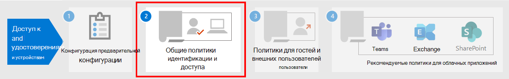

# Необходимые условия для реализации политик доступа к удостоверениям и устройствамPrerequisite work for implementing identity and device access policies

В этой статье описываются необходимые условия, которые должны выполнять администраторы, чтобы использовать рекомендуемые политики доступа к удостоверениям и устройствам, а также использовать условный доступ.This article describes the prerequisites admins must meet to use recommended identity and device access policies, and to use Conditional Access. В ней также обсуждаются рекомендуемые значения по умолчанию для настройки клиентских платформ для наилучшего единого входного времени.It also discusses the recommended defaults for configuring client platforms for the best single sign-on (SSO) experience.

## Предварительные условияPrerequisites

Перед использованием рекомендуемых политик доступа к удостоверениям и устройствам ваша организация должна выполнить необходимые условия.Before using the identity and device access policies that are recommended, your organization needs to meet prerequisites. Требования для различных моделей идентификации и проверки подлинности в списке отличаются:The requirements are different for the various identity and authentication models listed:

- Только облакоCloud-only
- Гибридная проверка подлинности с проверкой подлинности с помощью синхронизации паролей (PHS)Hybrid with password hash sync (PHS) authentication
- Гибридная с сквозной проверкой подлинности (PTA)Hybrid with pass-through authentication (PTA)
- ФедератнаяFederated

В следующей таблице подробно представлены необходимые функции и их конфигурация, которые применяются для всех моделей удостоверений, за исключением отмеченных.The following table details the prerequisite features and their configuration that apply to all identity models, except where noted.

|КонфигурацияConfiguration|ExceptionsExceptions|
|---|:---:|
|[Настройка PHS](https://docs.microsoft.com/azure/active-directory/hybrid/how-to-connect-password-hash-synchronization).[Configure PHS](https://docs.microsoft.com/azure/active-directory/hybrid/how-to-connect-password-hash-synchronization).  Эта возможность должна быть включена для обнаружения утечек учетных данных и для их действий в случае условного доступа с учетом рисков.This must be enabled to detect leaked credentials and to act on them for risk-based Conditional Access. **Примечание.** Это необходимо независимо от того, использует ли ваша организация федераированную проверку подлинности.**Note:** This is required regardless of whether your organization uses federated authentication.|Только облакоCloud-only|
|[Включите единый](https://docs.microsoft.com/azure/active-directory/connect/active-directory-aadconnect-sso) вход для автоматического входе пользователей, когда они находятся на устройствах организации, подключенных к сети организации.[Enable seamless single sign-on](https://docs.microsoft.com/azure/active-directory/connect/active-directory-aadconnect-sso) to automatically sign users in when they are on their organization devices connected to your organization network.|Только облако и федерарноеCloud-only and federated|
|[Настройка именуемых сетей.](https://docs.microsoft.com/azure/active-directory/active-directory-known-networks-azure-portal)[Configure named networks](https://docs.microsoft.com/azure/active-directory/active-directory-known-networks-azure-portal). Служба защиты идентификации Azure AD собирает и анализирует все доступные данные сеанса, чтобы получить оценку риска.Azure AD Identity Protection collects and analyzes all available session data to generate a risk score. Мы рекомендуем указать общедоступные диапазоны IP-адресов вашей организации для вашей сети в конфигурации именуемых сетей Azure AD.We recommend you specify your organization's public IP ranges for your network in the Azure AD named networks configuration. Трафик из этих диапазонов имеет пониженную оценку риска, а трафик из-за пределов среды организации — более высокий.Traffic coming from these ranges is given a reduced risk score, and traffic from outside the organization environment is given a higher risk score.||
|Регистрация всех пользователей для самостоятельного сброса пароля (SSPR) и многофакторной [проверки подлинности (MFA).](https://docs.microsoft.com/azure/active-directory/authentication/concept-registration-mfa-sspr-converged)[Register all users for self-service password reset (SSPR) and multi-factor authentication (MFA)](https://docs.microsoft.com/azure/active-directory/authentication/concept-registration-mfa-sspr-converged). Рекомендуем заранее зарегистрировать пользователей для многофакторной проверки подлинности Azure AD.We recommend you register users for Azure AD Multi-Factor Authentication ahead of time. Служба защиты идентификации Azure AD использует многофакторную проверку подлинности Azure AD для дополнительной проверки безопасности.Azure AD Identity Protection makes use of Azure AD Multi-Factor Authentication to perform additional security verification. Кроме того, для лучшего вход в систему мы рекомендуем пользователям установить приложение [Microsoft Authenticator](https://docs.microsoft.com/azure/active-directory/user-help/microsoft-authenticator-app-how-to) и приложение "Портал компании Майкрософт" на своих устройствах.Additionally, for the best sign-in experience, we recommend users install the [Microsoft Authenticator app](https://docs.microsoft.com/azure/active-directory/user-help/microsoft-authenticator-app-how-to) and the Microsoft Company Portal app on their devices. Их можно установить из магазина приложений для каждой платформы.These can be installed from the app store for each platform.||
|[Включите автоматическую регистрацию устройств, присоединив к домену компьютеры с Windows.](https://docs.microsoft.com/azure/active-directory/active-directory-conditional-access-automatic-device-registration-setup)[Enable automatic device registration of domain-joined Windows computers](https://docs.microsoft.com/azure/active-directory/active-directory-conditional-access-automatic-device-registration-setup). Условный доступ позволит убедиться, что устройства, подключающиеся к приложениям, присоединены к домену или совместимы.Conditional Access will make sure devices connecting to apps are domain-joined or compliant. Для поддержки этого на компьютерах с Windows устройство должно быть зарегистрировано в Azure AD.To support this on Windows computers, the device must be registered with Azure AD.  В этой статье обсуждается настройка автоматической регистрации устройств.This article discusses how to configure automatic device registration.|Только облакоCloud-only|
|**Подготовьте свою службу поддержки.****Prepare your support team**. Разпланируйте пользователей, которые не могут выполнить многофаксную многофаксную многофайловую развявь.Have a plan in place for users that cannot complete MFA. Это может быть добавление их в группу исключений политики или регистрация новых сведений MFA для них.This could be adding them to a policy exclusion group, or registering new MFA information for them. Прежде чем вносить какие-либо из этих изменений, чувствительных к безопасности, необходимо убедиться, что запрос делает фактический пользователь.Before making either of these security-sensitive changes, you need to ensure that the actual user is making the request. Требование, чтобы руководители пользователей помогли с утверждением, является эффективным шагом.Requiring users' managers to help with the approval is an effective step.||
|[Настройте возможность записи паролей в локальном AD.](https://docs.microsoft.com/azure/active-directory/active-directory-passwords-getting-started)[Configure password writeback to on-premises AD](https://docs.microsoft.com/azure/active-directory/active-directory-passwords-getting-started). С помощью записи пароля Azure AD может потребовать, чтобы пользователи меняли свои пароли в локальной сети при обнаружении компрометации учетной записи с высоким уровнем риска.Password writeback allows Azure AD to require that users change their on-premises passwords when a high-risk account compromise is detected. Эту функцию можно включить с помощью Azure AD  Connect одним из двух способов: включить функцию записи пароля на экране необязательных функций мастера настройки Azure AD Connect или включить ее через Windows PowerShell.You can enable this feature using Azure AD Connect in one of two ways: either enable **Password Writeback** in the optional features screen of the Azure AD Connect setup wizard, or enable it via Windows PowerShell.|Только облакоCloud-only|
|[Настройка защиты паролем Azure AD.](https://docs.microsoft.com/azure/active-directory/authentication/concept-password-ban-bad)[Configure Azure AD password protection](https://docs.microsoft.com/azure/active-directory/authentication/concept-password-ban-bad). Защита паролем Azure AD позволяет обнаруживать и блокировать известные слабые пароли и их варианты, а также может блокировать дополнительные ненадёжные термины, характерные для вашей организации.Azure AD Password Protection detects and blocks known weak passwords and their variants, and can also block additional weak terms that are specific to your organization. Общие списки заблокированных паролей по умолчанию автоматически применяются ко всем пользователям в клиенте Azure AD.Default global banned password lists are automatically applied to all users in an Azure AD tenant. Дополнительные элементы можно определить в настраиваемом списке заблокированных паролей.You can define additional entries in a custom banned password list. При изменении или сбросе паролей пользователями эти списки заблокированных паролей проверяются с целью обеспечения использования надежных паролей.When users change or reset their passwords, these banned password lists are checked to enforce the use of strong passwords.||
|[Включить защиту идентификации Azure Active Directory.](https://docs.microsoft.com/azure/active-directory/identity-protection/overview-identity-protection)[Enable Azure Active Directory Identity Protection](https://docs.microsoft.com/azure/active-directory/identity-protection/overview-identity-protection). Защита идентификации Azure AD позволяет обнаруживать потенциальные уязвимости, влияющие на удостоверения вашей организации, и настраивать политику автоматического устранения низкого, среднего и высокого риска для входов и риска для пользователей.Azure AD Identity Protection enables you to detect potential vulnerabilities affecting your organization's identities and configure an automated remediation policy to low, medium, and high sign-in risk and user risk.||
|**Включить современную проверку подлинности** [для Exchange Online](https://docs.microsoft.com/Exchange/clients-and-mobile-in-exchange-online/enable-or-disable-modern-authentication-in-exchange-online) и Skype для бизнеса [Online.](https://social.technet.microsoft.com/wiki/contents/articles/34339.skype-for-business-online-enable-your-tenant-for-modern-authentication.aspx)**Enable modern authentication** for [Exchange Online](https://docs.microsoft.com/Exchange/clients-and-mobile-in-exchange-online/enable-or-disable-modern-authentication-in-exchange-online) and for [Skype for Business Online](https://social.technet.microsoft.com/wiki/contents/articles/34339.skype-for-business-online-enable-your-tenant-for-modern-authentication.aspx). Современная проверка подлинности является необходимым условием для использования MFA.Modern authentication is a prerequisite for using MFA. Современная проверка подлинности включена по умолчанию для клиентов Office 2016 и 2019, SharePoint и OneDrive для бизнеса.Modern authentication is enabled by default for Office 2016 and 2019 clients, SharePoint, and OneDrive for Business.||
|

## Рекомендуемые конфигурации клиентаRecommended client configurations

В этом разделе описаны конфигурации клиентов платформы по умолчанию, которые рекомендуется использовать для обеспечения наилучшего доступа пользователей к SSO, а также технические предварительные условия для условного доступа.This section describes the default platform client configurations we recommend to provide the best SSO experience to your users, as well as the technical prerequisites for Conditional Access.

### Устройства WindowsWindows devices

Мы рекомендуем Использовать Windows 10 (версии 2004 или более поздней), так как Azure обеспечивает самый плавный вариант использования службы SSO как для локальной системы, так и для Azure AD.We recommend the Windows 10 (version 2004 or later), as Azure is designed to provide the smoothest SSO experience possible for both on-premises and Azure AD. Устройства, выдаемые на работе или в учебном заданном учебном замещаемом сайте, должны быть настроены для прямой регистрации в Azure AD или если организация использует локальное доменное имя AD, эти устройства должны быть настроены для автоматической регистрации в [Azure AD.](https://docs.microsoft.com/azure/active-directory/active-directory-conditional-access-automatic-device-registration-setup)Work or school-issued devices should be configured to join Azure AD directly or if the organization uses on-premises AD domain join, those devices should be [configured to automatically and silently register with Azure AD](https://docs.microsoft.com/azure/active-directory/active-directory-conditional-access-automatic-device-registration-setup).

Для устройств с Windows BYOD пользователи могут использовать добавление учетной записи для **работы или учебного заведения.**For BYOD Windows devices, users can use **Add work or school account**. Обратите внимание, что пользователям браузера Google Chrome  на устройствах с Windows 10 необходимо установить расширение, чтобы получить такой же плавный вход, что и пользователи Microsoft Edge.Note that users of the Google Chrome browser on Windows 10 devices need to [install an extension](https://chrome.google.com/webstore/detail/windows-10-accounts/ppnbnpeolgkicgegkbkbjmhlideopiji?utm_source=chrome-app-launcher-info-dialog) to get the same smooth sign-in experience as Microsoft Edge users. Кроме того, если в организации есть устройства Windows 8 8.1 или 8.1, можно установить Microsoft Workplace Join для компьютеров без Windows 10.Also, if your organization has domain-joined Windows 8 or 8.1 devices, you can install Microsoft Workplace Join for non-Windows 10 computers. [Скачайте пакет для регистрации](https://www.microsoft.com/download/details.aspx?id=53554) устройств в Azure AD.[Download the package to register](https://www.microsoft.com/download/details.aspx?id=53554) the devices with Azure AD.

### Устройства iOSiOS devices

Мы рекомендуем установить приложение [Microsoft Authenticator на](https://docs.microsoft.com/azure/multi-factor-authentication/end-user/microsoft-authenticator-app-how-to) устройствах пользователей перед развертыванием политик условного доступа или MFA.We recommend installing the [Microsoft Authenticator app](https://docs.microsoft.com/azure/multi-factor-authentication/end-user/microsoft-authenticator-app-how-to) on user devices before deploying Conditional Access or MFA policies. Как минимум, приложение должно быть установлено, когда пользователям будет предложено зарегистрировать свое устройство в Azure AD путем добавления учетной записи для работы или учебного заведения или при установке приложения портала компании Intune для регистрации устройства в управлении.At a minimum, the app should be installed when users are asked to register their device with Azure AD by adding a work or school account, or when they install the Intune company portal app to enroll their device into management. Это зависит от настроенной политики условного доступа.This depends on the configured Conditional Access policy.

### устройства Android,Android devices

Мы рекомендуем пользователям устанавливать приложение "Портал компании [Intune"](https://play.google.com/store/apps/details?id=com.microsoft.windowsintune.companyportal&hl=en) и [приложение Microsoft Authenticator](https://docs.microsoft.com/azure/multi-factor-authentication/end-user/microsoft-authenticator-app-how-to) до развертывания политик условного доступа или при необходимости при определенных попытках проверки подлинности.We recommend users install the [Intune Company Portal app](https://play.google.com/store/apps/details?id=com.microsoft.windowsintune.companyportal&hl=en) and [Microsoft Authenticator app](https://docs.microsoft.com/azure/multi-factor-authentication/end-user/microsoft-authenticator-app-how-to) before Conditional Access policies are deployed or when required during certain authentication attempts. После установки приложения пользователям может быть предложено зарегистрироваться в Azure AD и зарегистрировать устройства в Intune.After app installation, users may be asked to register with Azure AD or enroll their device with Intune. Это зависит от настроенной политики условного доступа.This depends on the configured Conditional Access policy.

Мы также рекомендуем стандартизировать собственные устройства на OEM и версиях, которые поддерживают Android for Work или Android Knox, чтобы разрешить управление и защиту почтовых учетных записей с помощью политики MDM Intune.We also recommend that organization-owned devices are standardized on OEMs and versions that support Android for Work or Samsung Knox to allow mail accounts, be managed and protected by Intune MDM policy.

### Рекомендуемые почтовые клиентыRecommended email clients

Следующие почтовые клиенты поддерживают современную проверку подлинности и условный доступ.The following email clients support modern authentication and Conditional Access.

|ПлатформаPlatform|КлиентClient|Версия/примечанияVersion/Notes|
|---|---|---|
|**Windows****Windows**|OutlookOutlook|2019, 2016, 20132019, 2016, 2013 
 [Включить современную проверку подлинностиEnable modern authentication](https://docs.microsoft.com/microsoft-365/admin/security-and-compliance/enable-modern-authentication) 
 [Необходимые обновленияRequired updates](https://support.office.com/article/Outlook-Updates-472c2322-23a4-4014-8f02-bbc09ad62213)|
|**iOS****iOS**|Outlook для iOSOutlook for iOS|[Последняя версияLatest](https://itunes.apple.com/us/app/microsoft-outlook-email-and-calendar/id951937596?mt=8)|
|**Android****Android**|Outlook для AndroidOutlook for Android|[Последняя версияLatest](https://play.google.com/store/apps/details?id=com.microsoft.office.outlook&hl=en)|
|**macOS****macOS**|OutlookOutlook|2019 и 20162019 and 2016|
|**Linux****Linux**|Не поддерживаетсяNot supported||
|

### Рекомендуемые клиентские платформы при защите документовRecommended client platforms when securing documents

При применении политики безопасных документов рекомендуется использовать следующие клиенты.The following clients are recommended when a secure documents policy has been applied.

|ПлатформаPlatform|Word, Excel и PowerPointWord/Excel/PowerPoint|OneNoteOneNote|Приложение OneDriveOneDrive App|Приложение SharePointSharePoint App|[Клиент синхронизации OneDriveOneDrive sync client](https://docs.microsoft.com/onedrive/enable-conditional-access)|
|---|---|---|---|---|---|
|Windows 8.1Windows 8.1|ПоддерживаетсяSupported|ПоддерживаетсяSupported|Н/ДN/A|Н/ДN/A|ПоддерживаетсяSupported|
|Windows 10;Windows 10|ПоддерживаетсяSupported|ПоддерживаетсяSupported|Н/ДN/A|Н/ДN/A|ПоддерживаетсяSupported|
|AndroidAndroid|ПоддерживаетсяSupported|ПоддерживаетсяSupported|ПоддерживаетсяSupported|ПоддерживаетсяSupported|НедоступноN/A|
|iOSiOS|ПоддерживаетсяSupported|ПоддерживаетсяSupported|ПоддерживаетсяSupported|ПоддерживаетсяSupported|НедоступноN/A|
|macOSmacOS|ПоддерживаетсяSupported|ПоддерживаетсяSupported|Н/ДN/A|Н/ДN/A|Не поддерживаетсяNot supported|
|LinuxLinux|Не поддерживаетсяNot supported|Не поддерживаетсяNot supported|Не поддерживаетсяNot supported|Не поддерживаетсяNot supported|Не поддерживаетсяNot supported|
|

### Служба поддержки клиентов Microsoft 365Microsoft 365 client support

Дополнительные сведения о поддержке клиентов в Microsoft 365 см. в следующих статьях:For more information about client support in Microsoft 365, see the following articles:

- [Поддержка клиентских приложений Microsoft 365 — условный доступMicrosoft 365 Client App Support - Conditional Access](../../enterprise/microsoft-365-client-support-conditional-access.md)
- [Поддержка клиентских приложений Microsoft 365 : многофакторная проверка подлинностиMicrosoft 365 Client App Support - Multi-factor authentication](../../enterprise/microsoft-365-client-support-multi-factor-authentication.md)

## Защита учетных записей администраторовProtecting administrator accounts

Для Microsoft 365 E3 или E5 или с отдельными лицензиями Azure AD Premium P1 или P2 можно требовать многофаксную проверку MFA для учетных записей администраторов с помощью созданной вручную политики условного доступа.For Microsoft 365 E3 or E5 or with separate Azure AD Premium P1 or P2 licenses, you can require MFA for administrator accounts with a manually-created Conditional Access policy. См. [условный доступ: требовать MFA для администраторов](https://docs.microsoft.com/azure/active-directory/conditional-access/howto-conditional-access-policy-admin-mfa) для получения подробных сведений.See [Conditional Access: Require MFA for administrators](https://docs.microsoft.com/azure/active-directory/conditional-access/howto-conditional-access-policy-admin-mfa) for the details.

Для выпусков Microsoft 365 или Office 365, которые не  поддерживают условный доступ, можно включить настройки безопасности по умолчанию, чтобы требовать MFA для всех учетных записей.For editions of Microsoft 365 or Office 365 that do not support Conditional Access, you can enable [security defaults](https://docs.microsoft.com/azure/active-directory/fundamentals/concept-fundamentals-security-defaults) to require MFA for all accounts.

Вот несколько дополнительных рекомендаций:Here are some additional recommendations:

- Используйте [Azure AD Privileged Identity Management,](https://docs.microsoft.com/azure/active-directory/privileged-identity-management/pim-getting-started) чтобы уменьшить количество постоянных административных учетных записей.Use [Azure AD Privileged Identity Management](https://docs.microsoft.com/azure/active-directory/privileged-identity-management/pim-getting-started) to reduce the number of persistent administrative accounts.
- [Используйте управление привилегированным](../../compliance/privileged-access-management-overview.md) доступом для защиты организации от нарушений, которые могут использовать существующие привилегированные учетные записи администраторов с постоянный доступ к конфиденциальным данным или доступ к критически важным настройкам конфигурации.[Use privileged access management](../../compliance/privileged-access-management-overview.md) to protect your organization from breaches that may use existing privileged admin accounts with standing access to sensitive data or access to critical configuration settings.
- Создайте и используйте отдельные учетные записи, которые назначены роли администратора [Microsoft 365](https://docs.microsoft.com/microsoft-365/admin/add-users/about-admin-roles) *только для администрирования.*Create and use separate accounts that are assigned [Microsoft 365 administrator roles](https://docs.microsoft.com/microsoft-365/admin/add-users/about-admin-roles) *only for administration*. Администраторы должны иметь собственную учетную запись пользователя для регулярного использования, не связанного с администрированием, и использовать учетную запись администратора, только если это необходимо для выполнения задачи, связанной с их ролью или должностью.Admins should have their own user account for regular non-administrative use and only use an administrative account when necessary to complete a task associated with their role or job function.
- Следуйте [лучшим методикам](https://docs.microsoft.com/azure/active-directory/admin-roles-best-practices) по защите привилегированных учетных записей в Azure AD.Follow [best practices](https://docs.microsoft.com/azure/active-directory/admin-roles-best-practices) for securing privileged accounts in Azure AD.

## Следующий этапNext step

[Настройка общих политик доступа к удостоверениям и устройствамConfigure the common identity and device access policies](identity-access-policies.md)
