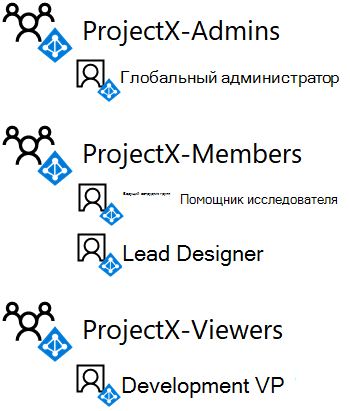

# <a name="isolated-sharepoint-online-team-site-devtest-environment"></a><span data-ttu-id="8c8f2-103">Среда разработки и тестирования изолированного сайта группы SharePoint Online</span><span class="sxs-lookup"><span data-stu-id="8c8f2-103">Isolated SharePoint Online team site dev/test environment</span></span>

[!INCLUDE [Microsoft 365 Defender rebranding](../includes/microsoft-defender-for-office.md)]


 <span data-ttu-id="8c8f2-104">**Сводка:** Настройка сайта группы SharePoint Online, изолированного от остальной части Организации в среде разработки и тестирования Microsoft 365.</span><span class="sxs-lookup"><span data-stu-id="8c8f2-104">**Summary:** Configure a SharePoint Online team site that is isolated from the rest of the organization in your Microsoft 365 dev/test environment.</span></span>

<span data-ttu-id="8c8f2-105">Сайты групп SharePoint Online в Microsoft 365 — это расположения для совместной работы с помощью общей библиотеки документов, записной книжки OneNote и других служб.</span><span class="sxs-lookup"><span data-stu-id="8c8f2-105">SharePoint Online team sites in Microsoft 365 are locations for collaboration using a common document library, a OneNote notebook, and other services.</span></span> <span data-ttu-id="8c8f2-106">Во многих случаях требуется широкий доступ и совместная работа отделов или организаций.</span><span class="sxs-lookup"><span data-stu-id="8c8f2-106">In many cases, you want wide access and collaboration across departments or organizations.</span></span> <span data-ttu-id="8c8f2-107">Однако в некоторых случаях необходимо управлять доступом и разрешениями для совместной работы небольшой группы пользователей.</span><span class="sxs-lookup"><span data-stu-id="8c8f2-107">However, in some cases, you want to tightly control the access and permissions for collaboration among a small group of people.</span></span>

<span data-ttu-id="8c8f2-108">Доступ к сайтам группы SharePoint Online и к каким пользователям можно управлять с помощью групп SharePoint и уровней разрешений.</span><span class="sxs-lookup"><span data-stu-id="8c8f2-108">Access to SharePoint Online team sites and what users can do is controlled by SharePoint groups and permission levels.</span></span> <span data-ttu-id="8c8f2-109">По умолчанию на сайтах SharePoint Online предусмотрено три уровня доступа:</span><span class="sxs-lookup"><span data-stu-id="8c8f2-109">By default, SharePoint Online sites have three levels of access:</span></span>

- <span data-ttu-id="8c8f2-110">**Участники** могут просматривать, создавать и изменять ресурсы на сайте.</span><span class="sxs-lookup"><span data-stu-id="8c8f2-110">**Members**, who can view, create, and modify resources on the site.</span></span>

- <span data-ttu-id="8c8f2-111">**Владельцы** могут полностью контролировать сайт, в том числе изменять разрешения.</span><span class="sxs-lookup"><span data-stu-id="8c8f2-111">**Owners**, who have complete control of the site, including the ability to change permissions.</span></span>

- <span data-ttu-id="8c8f2-112">**Посетители** могут просматривать ресурсы на сайте.</span><span class="sxs-lookup"><span data-stu-id="8c8f2-112">**Visitors**, who only can view resources on the site.</span></span>

<span data-ttu-id="8c8f2-113">В этой статье приведены инструкции по настройке изолированного сайта группы SharePoint Online для секретного исследовательского проекта ProjectX.</span><span class="sxs-lookup"><span data-stu-id="8c8f2-113">This article steps you through the configuration of an isolated SharePoint Online team site for a secret research project named ProjectX.</span></span> <span data-ttu-id="8c8f2-114">Требования доступа:</span><span class="sxs-lookup"><span data-stu-id="8c8f2-114">The access requirements are:</span></span>

- <span data-ttu-id="8c8f2-115">Только участники проекта могут получить доступ к сайту и его содержимому (документам, записной книжке OneNote, страницам), уровни разрешений SharePoint на просмотр и редактирование определяются членством в группе.</span><span class="sxs-lookup"><span data-stu-id="8c8f2-115">Only members of the project can access the site and its contents (documents, OneNote Notebook, Pages), with edit and view SharePoint permission levels controlled through group membership.</span></span>

- <span data-ttu-id="8c8f2-116">Только создатель сайта и члены группы администраторов сайта могут выполнять администрирование сайта, в том числе изменять разрешения на уровне сайта.</span><span class="sxs-lookup"><span data-stu-id="8c8f2-116">Only the site creator and members of an Admins group for the site can perform site administration, which includes modifying site-level permissions.</span></span>

<span data-ttu-id="8c8f2-117">Настройка изолированного сайта группы SharePoint Online в среде разработки и тестирования Microsoft 365 состоит из трех этапов:</span><span class="sxs-lookup"><span data-stu-id="8c8f2-117">There are three phases to setting up an isolated SharePoint Online team site in your Microsoft 365 dev/test environment:</span></span>

1. <span data-ttu-id="8c8f2-118">Создайте среду разработки и тестирования Microsoft 365.</span><span class="sxs-lookup"><span data-stu-id="8c8f2-118">Create the Microsoft 365 dev/test environment.</span></span>

2. <span data-ttu-id="8c8f2-119">Создание пользователей и групп для ProjectX.</span><span class="sxs-lookup"><span data-stu-id="8c8f2-119">Create the users and groups for ProjectX.</span></span>

3. <span data-ttu-id="8c8f2-120">Создание сайта группы SharePoint Online для ProjectX и его изоляция.</span><span class="sxs-lookup"><span data-stu-id="8c8f2-120">Create a new ProjectX SharePoint Online team site and isolate it.</span></span>

> [!TIP]
> <span data-ttu-id="8c8f2-121">Щелкните [здесь](https://aka.ms/catlgstack), чтобы просмотреть схему всех статей, относящихся к руководствам по лаборатории тестирования в One Microsoft Cloud.</span><span class="sxs-lookup"><span data-stu-id="8c8f2-121">Click [here](https://aka.ms/catlgstack) for a visual map to all the articles in the One Microsoft Cloud Test Lab Guide stack.</span></span>

## <a name="phase-1-build-out-your-lightweight-or-simulated-enterprise-microsoft-365-devtest-environment"></a><span data-ttu-id="8c8f2-122">Этап 1: создание простой или имитируемой среды для разработки и тестирования Microsoft 365 для предприятий</span><span class="sxs-lookup"><span data-stu-id="8c8f2-122">Phase 1: Build out your lightweight or simulated enterprise Microsoft 365 dev/test environment</span></span>

<span data-ttu-id="8c8f2-123">Если вы хотите просто создать изолированный сайт группы SharePoint Online с минимальными требованиями, выполните инструкции, приведенные в разделе этапы 2 и 3 [упрощенной базовой конфигурации](https://docs.microsoft.com/microsoft-365/enterprise/lightweight-base-configuration-microsoft-365-enterprise).</span><span class="sxs-lookup"><span data-stu-id="8c8f2-123">If you just want to create an isolated SharePoint Online team site in a lightweight way with the minimum requirements, follow the instructions in phases 2 and 3 of [The lightweight base configuration](https://docs.microsoft.com/microsoft-365/enterprise/lightweight-base-configuration-microsoft-365-enterprise).</span></span>

<span data-ttu-id="8c8f2-124">Если вы хотите создать изолированный сайт группы SharePoint Online в смоделированной конфигурации предприятия, следуйте инструкциям в статье [Синхронизация хэша паролей для тестовой среды Microsoft 365](https://docs.microsoft.com/microsoft-365/enterprise/password-hash-sync-m365-ent-test-environment).</span><span class="sxs-lookup"><span data-stu-id="8c8f2-124">If you want to create an isolated SharePoint Online team site in a simulated enterprise configuration, follow the instructions in [Password hash synchronization for your Microsoft 365 test environment](https://docs.microsoft.com/microsoft-365/enterprise/password-hash-sync-m365-ent-test-environment).</span></span>

> [!NOTE]
> <span data-ttu-id="8c8f2-125">Для создания изолированного сайта SharePoint Online не требуется имитация среды Enterprise dev/test, которая включает имитируемую интрасеть, подключенную к Интернету и синхронизацию каталогов, для леса доменных служб Active Directory (AD DS).</span><span class="sxs-lookup"><span data-stu-id="8c8f2-125">Creating an isolated SharePoint Online site does not require the simulated enterprise dev/test environment, which includes a simulated intranet connected to the Internet and directory synchronization for a Active Directory Domain Services (AD DS) forest.</span></span> <span data-ttu-id="8c8f2-126">Она указана здесь, чтобы вы могли протестировать изолированный сайт SharePoint Online и поэкспериментировать с ним в среде, которая представляет типичную среду для организаций.</span><span class="sxs-lookup"><span data-stu-id="8c8f2-126">It is provided here as an option so that you can test an isolated SharePoint Online site and experiment with it in an environment that represents a typical organization.</span></span>

## <a name="phase-2-create-user-accounts-and-access-groups"></a><span data-ttu-id="8c8f2-127">Этап 2: создание учетных записей пользователей и групп доступа</span><span class="sxs-lookup"><span data-stu-id="8c8f2-127">Phase 2: Create user accounts and access groups</span></span>

<span data-ttu-id="8c8f2-128">Воспользуйтесь инструкциями из статьи [Подключение к Office 365 PowerShell](https://docs.microsoft.com/microsoft-365/enterprise/connect-to-microsoft-365-powershell) , чтобы подключиться к пробной подписке с помощью учетной записи глобального администратора:</span><span class="sxs-lookup"><span data-stu-id="8c8f2-128">Use the instructions in [Connect to Office 365 PowerShell](https://docs.microsoft.com/microsoft-365/enterprise/connect-to-microsoft-365-powershell) to connect to your trial subscription with your global administrator account from:</span></span>

- <span data-ttu-id="8c8f2-129">Компьютер (для упрощенной среды разработки и тестирования Microsoft 365).</span><span class="sxs-lookup"><span data-stu-id="8c8f2-129">Your computer (for the lightweight Microsoft 365 dev/test environment).</span></span>

- <span data-ttu-id="8c8f2-130">Виртуальная машина CLIENT1 (для среды разработки и тестирования Microsoft 365 для предприятий).</span><span class="sxs-lookup"><span data-stu-id="8c8f2-130">The CLIENT1 virtual machine (for the simulated enterprise Microsoft 365 dev/test environment).</span></span>

<span data-ttu-id="8c8f2-131">Чтобы создать новые группы доступа для сайта группы SharePoint Online ProjectX, выполните следующие команды в командной консоли Windows Azure Active Directory для Windows PowerShell:</span><span class="sxs-lookup"><span data-stu-id="8c8f2-131">To create the new access groups for the ProjectX SharePoint Online team site, run these commands from the Windows Azure Active Directory Module for Windows PowerShell prompt:</span></span>

```powershell
$groupName="ProjectX-Members"
$groupDesc="People allowed to collaborate for ProjectX."
New-MsolGroup -DisplayName $groupName -Description $groupDesc
$groupName="ProjectX-Admins"
$groupDesc="People allowed to administer SharePoint for ProjectX."
New-MsolGroup -DisplayName $groupName -Description $groupDesc
$groupName="ProjectX-Viewers"
$groupDesc="People allowed to view the SharePoint resources for ProjectX."
New-MsolGroup -DisplayName $groupName -Description $groupDesc
```

<span data-ttu-id="8c8f2-132">Введите название организации (например, contosotoycompany) и двузначный код страны, а затем выполните следующие команды в командной строке модуля Windows Azure Active Directory для Windows PowerShell:</span><span class="sxs-lookup"><span data-stu-id="8c8f2-132">Fill in your organization name (example: contosotoycompany), the two-character country code for your location, and then run the following commands from the Windows Azure Active Directory Module for Windows PowerShell prompt:</span></span>

```powershell
$orgName="<organization name>"
$loc="<two-character country code, such as US>"
$licAssignment= $orgName + ":ENTERPRISEPREMIUM"
$userName= "designer@" + $orgName + ".onmicrosoft.com"
New-MsolUser -DisplayName "Lead Designer" -FirstName Lead -LastName Designer -UserPrincipalName $userName -UsageLocation $loc -LicenseAssignment $licAssignment -ForceChangePassword $false
```

<span data-ttu-id="8c8f2-133">Запишите в надежном месте пароль, созданный командой **New-MsolUser** для учетной записи ведущего дизайнера.</span><span class="sxs-lookup"><span data-stu-id="8c8f2-133">From the display of the **New-MsolUser** command, note the generated password for the Lead Designer account and record it in a safe location.</span></span>

<span data-ttu-id="8c8f2-134">Выполните следующие команды в командной строке модуля Windows Azure Active Directory для Windows PowerShell:</span><span class="sxs-lookup"><span data-stu-id="8c8f2-134">Run the following commands from the Windows Azure Active Directory Module for Windows PowerShell prompt:</span></span>

```powershell
$userName= "researcher@" + $orgName + ".onmicrosoft.com"
New-MsolUser -DisplayName "Lead Researcher" -FirstName Lead -LastName Researcher -UserPrincipalName $userName -UsageLocation $loc -LicenseAssignment $licAssignment -ForceChangePassword $false
```

<span data-ttu-id="8c8f2-135">Запишите в надежном месте пароль, созданный командой **New-MsolUser** для учетной записи ведущего научного сотрудника.</span><span class="sxs-lookup"><span data-stu-id="8c8f2-135">From the display of the **New-MsolUser** command, note the generated password for the Lead Researcher account and record it in a safe location.</span></span>

<span data-ttu-id="8c8f2-136">Выполните следующие команды в командной строке модуля Windows Azure Active Directory для Windows PowerShell:</span><span class="sxs-lookup"><span data-stu-id="8c8f2-136">Run the following commands from the Windows Azure Active Directory Module for Windows PowerShell prompt:</span></span>

```powershell
$userName= "devvp@" + $orgName + ".onmicrosoft.com"
New-MsolUser -DisplayName "Development VP" -FirstName Development -LastName VP -UserPrincipalName $userName -UsageLocation $loc -LicenseAssignment $licAssignment -ForceChangePassword $false
```

<span data-ttu-id="8c8f2-137">Запишите в надежном месте пароль, созданный командой **New-MsolUser** для учетной записи вице-президента по развитию.</span><span class="sxs-lookup"><span data-stu-id="8c8f2-137">From the display of the **New-MsolUser** command, note the generated password for the Development VP account and record it in a safe location.</span></span>

<span data-ttu-id="8c8f2-138">Затем, чтобы добавить новые учетные записи в новые группы доступа, выполните следующие команды PowerShell в командной строке модуля Windows Azure Active Directory для Windows PowerShell:</span><span class="sxs-lookup"><span data-stu-id="8c8f2-138">Next, to add the new accounts to the new access groups, run these PowerShell commands from the Windows Azure Active Directory Module for Windows PowerShell prompt:</span></span>

```powershell
$grpName="ProjectX-Members"
$userUPN="designer@" + $orgName + ".onmicrosoft.com"
Add-MsolGroupMember -GroupObjectId (Get-MsolGroup | Where { $_.DisplayName -eq $grpName }).ObjectID -GroupMemberObjectId (Get-MsolUser | Where { $_.UserPrincipalName -eq $userUPN }).ObjectID -GroupMemberType "User"
$userUPN="researcher@" + $orgName + ".onmicrosoft.com"
Add-MsolGroupMember -GroupObjectId (Get-MsolGroup | Where { $_.DisplayName -eq $grpName }).ObjectID -GroupMemberObjectId (Get-MsolUser | Where { $_.UserPrincipalName -eq $userUPN }).ObjectID -GroupMemberType "User"
$grpName="ProjectX-Admins"
Add-MsolGroupMember -GroupObjectId (Get-MsolGroup | Where { $_.DisplayName -eq $grpName }).ObjectID -GroupMemberObjectId (Get-MsolUser | Where { $_.UserPrincipalName -eq $userCredential.UserName }).ObjectID -GroupMemberType "User"
$grpName="ProjectX-Viewers"
$userUPN="devvp@" + $orgName + ".onmicrosoft.com"
Add-MsolGroupMember -GroupObjectId (Get-MsolGroup | Where { $_.DisplayName -eq $grpName }).ObjectID -GroupMemberObjectId (Get-MsolUser | Where { $_.UserPrincipalName -eq $userUPN }).ObjectID -GroupMemberType "User"
```

<span data-ttu-id="8c8f2-139">Результатом</span><span class="sxs-lookup"><span data-stu-id="8c8f2-139">Results:</span></span>

- <span data-ttu-id="8c8f2-140">Группа доступа ProjectX – Members содержит сведения об дизайнере и учетных записях ведущего сотрудника.</span><span class="sxs-lookup"><span data-stu-id="8c8f2-140">The ProjectX-Members access group contains the Lead Designer and Lead Researcher user accounts</span></span>

- <span data-ttu-id="8c8f2-141">Группа доступа ProjectX — администраторы содержит учетную запись глобального администратора для пробной подписки.</span><span class="sxs-lookup"><span data-stu-id="8c8f2-141">The ProjectX-Admins access group contains the global administrator account for your trial subscription</span></span>

- <span data-ttu-id="8c8f2-142">Группа доступа ProjectX – просматривающий содержит учетную запись пользователя ВИЦЕs Development</span><span class="sxs-lookup"><span data-stu-id="8c8f2-142">The ProjectX-Viewers access group contains the Development VP user account</span></span>

<span data-ttu-id="8c8f2-143">На рисунке 1 показаны группы доступа и их членство.</span><span class="sxs-lookup"><span data-stu-id="8c8f2-143">Figure 1 shows the access groups and their membership.</span></span>

<span data-ttu-id="8c8f2-144">**Рисунок 1**</span><span class="sxs-lookup"><span data-stu-id="8c8f2-144">**Figure 1**</span></span>



## <a name="phase-3-create-a-new-projectx-sharepoint-online-team-site-and-isolate-it"></a><span data-ttu-id="8c8f2-146">Этап 3. Создание сайта группы SharePoint Online для ProjectX и его изоляция</span><span class="sxs-lookup"><span data-stu-id="8c8f2-146">Phase 3: Create a new ProjectX SharePoint Online team site and isolate it</span></span>

<span data-ttu-id="8c8f2-147">Чтобы создать сайт группы SharePoint Online для ProjectX, выполните перечисленные ниже действия.</span><span class="sxs-lookup"><span data-stu-id="8c8f2-147">To create a SharePoint Online team site for ProjectX, do the following:</span></span>

1. <span data-ttu-id="8c8f2-148">С помощью браузера на локальном компьютере (облегченная настройка) или на компьютере CLIENT1 (смоделированная конфигурация предприятия) Войдите в центр администрирования Microsoft 365 ( [https://admin.microsoft.com](https://admin.microsoft.com) ), используя свою учетную запись глобального администратора.</span><span class="sxs-lookup"><span data-stu-id="8c8f2-148">Using a browser on either your local computer (lightweight configuration) or on CLIENT1 (simulated enterprise configuration), sign in to the Microsoft 365 admin center ([https://admin.microsoft.com](https://admin.microsoft.com)) using your global administrator account.</span></span>

2. <span data-ttu-id="8c8f2-149">В списке плиток выберите **SharePoint**.</span><span class="sxs-lookup"><span data-stu-id="8c8f2-149">In the list of tiles, click **SharePoint**.</span></span>

3. <span data-ttu-id="8c8f2-150">На новой вкладке SharePoint в браузере нажмите **+ Создать сайт**.</span><span class="sxs-lookup"><span data-stu-id="8c8f2-150">On the new SharePoint tab in your browser, click **+ Create site**.</span></span>

4. <span data-ttu-id="8c8f2-151">В поле **Имя сайта группы** введите **ProjectX**.</span><span class="sxs-lookup"><span data-stu-id="8c8f2-151">In **Team site name**, type **ProjectX**.</span></span> <span data-ttu-id="8c8f2-152">В окне **Параметры конфиденциальности**выберите пункт **частные пользователи могут получать доступ к этому сайту**.</span><span class="sxs-lookup"><span data-stu-id="8c8f2-152">In **Privacy settings**, select **Private - only members can access this site**.</span></span>

5. <span data-ttu-id="8c8f2-153">В поле **Описание сайта группы** введите **Сайт SharePoint для ProjectX** и нажмите кнопку **Далее**.</span><span class="sxs-lookup"><span data-stu-id="8c8f2-153">In **Team site description**, type **SharePoint site for ProjectX**, and then click **Next**.</span></span>

6. <span data-ttu-id="8c8f2-154">На панели **Кого вы хотите добавить**? нажмите **Завершить**.</span><span class="sxs-lookup"><span data-stu-id="8c8f2-154">On the **Who do you want to add**? pane, click **Finish**.</span></span>

7. <span data-ttu-id="8c8f2-155">В новой вкладке **Главная, ProjectX** в браузере, на панели инструментов, щелкните значок параметров и выберите **Разрешения для сайта**.</span><span class="sxs-lookup"><span data-stu-id="8c8f2-155">On the new **ProjectX-Home** tab in your browser, in the tool bar, click the settings icon, and then click **Site permissions**.</span></span>

8. <span data-ttu-id="8c8f2-156">В области **Разрешения для сайта** нажмите **Параметры дополнительных разрешений**.</span><span class="sxs-lookup"><span data-stu-id="8c8f2-156">In the **Site permissions** pane, click **Advanced permissions settings**.</span></span>

9. <span data-ttu-id="8c8f2-157">В новой вкладке **Разрешения: Project X** в браузере нажмите **Параметры запросов на доступ**.</span><span class="sxs-lookup"><span data-stu-id="8c8f2-157">In the new **Permissions: Project X** tab in your browser, click **Access Request Settings**.</span></span>

10. <span data-ttu-id="8c8f2-158">В диалоговом окне **Параметры запросов на доступ** снимите флажки **Разрешить участникам совместный доступ к этому сайту, а также отдельным файлам и папкам** и **Разрешить запросы на доступ** (все три флажка должны быть сняты) и нажмите кнопку **ОК**.</span><span class="sxs-lookup"><span data-stu-id="8c8f2-158">In the **Access Requests Settings** dialog box, clear **Allow members to share the site and individual files and folders** and **Allow access requests** (so that all three check boxes are cleared), and then click **OK**.</span></span>

11. <span data-ttu-id="8c8f2-159">Выберите **ProjectX — участники** в списке.</span><span class="sxs-lookup"><span data-stu-id="8c8f2-159">Click **ProjectX Members** in the list.</span></span>

12. <span data-ttu-id="8c8f2-160">На странице **Пользователи и группы** нажмите кнопку **Создание**.</span><span class="sxs-lookup"><span data-stu-id="8c8f2-160">On the **People and Groups** page, click **New**.</span></span>

13. <span data-ttu-id="8c8f2-161">В диалоговом окне **Общий доступ** введите **ProjectX-Members**, выберите группу и нажмите **Поделиться**.</span><span class="sxs-lookup"><span data-stu-id="8c8f2-161">In the **Share** dialog box, type **ProjectX-Members**, select it, and then click **Share**.</span></span>

14. <span data-ttu-id="8c8f2-162">Нажмите кнопку "Назад" в браузере.</span><span class="sxs-lookup"><span data-stu-id="8c8f2-162">Click the back button on your browser.</span></span>

15. <span data-ttu-id="8c8f2-163">Выберите **ProjectX — владельцы** в списке.</span><span class="sxs-lookup"><span data-stu-id="8c8f2-163">Click **ProjectX Owners** in the list.</span></span>

16. <span data-ttu-id="8c8f2-164">На странице **Пользователи и группы** нажмите кнопку **Создание**.</span><span class="sxs-lookup"><span data-stu-id="8c8f2-164">On the **People and Groups** page, click **New**.</span></span>

17. <span data-ttu-id="8c8f2-165">В диалоговом окне **Общий доступ** введите **ProjectX-Admins**, выберите группу и нажмите **Поделиться**.</span><span class="sxs-lookup"><span data-stu-id="8c8f2-165">In the **Share** dialog box, type **ProjectX-Admins**, select it, and then click **Share**.</span></span>

18. <span data-ttu-id="8c8f2-166">Нажмите кнопку "Назад" в браузере.</span><span class="sxs-lookup"><span data-stu-id="8c8f2-166">Click the back button on your browser.</span></span>

19. <span data-ttu-id="8c8f2-167">Выберите **ProjectX — посетители** в списке.</span><span class="sxs-lookup"><span data-stu-id="8c8f2-167">Click **ProjectX Visitors** in the list.</span></span>

20. <span data-ttu-id="8c8f2-168">На странице **Пользователи и группы** нажмите кнопку **Создание**.</span><span class="sxs-lookup"><span data-stu-id="8c8f2-168">On the **People and Groups** page, click **New**.</span></span>

21. <span data-ttu-id="8c8f2-169">В диалоговом окне **Общий доступ** введите **ProjectX-Viewers**, выберите группу и нажмите **Поделиться**.</span><span class="sxs-lookup"><span data-stu-id="8c8f2-169">In the **Share** dialog box, type **ProjectX-Viewers**, select it, and then click **Share**.</span></span>

22. <span data-ttu-id="8c8f2-170">Закройте вкладку **Пользователи и группы** в браузере, перейдите на вкладку **Главная, ProjectX** в браузере и закройте область **Разрешения для сайта**.</span><span class="sxs-lookup"><span data-stu-id="8c8f2-170">Close the **People and Groups** tab in your browser, click the **ProjectX-Home** tab in your browser, and then close the **Site permissions** pane.</span></span>

<span data-ttu-id="8c8f2-171">Ниже приведены результаты настройки разрешений.</span><span class="sxs-lookup"><span data-stu-id="8c8f2-171">Here are the results of configuring permissions:</span></span>

- <span data-ttu-id="8c8f2-172">Группа ProjectX Members содержит только группу доступа ProjectX-Members (которая содержит только учетные записи ведущего дизайнера и ведущего пользователя) и группу ProjectX (которая содержит только учетную запись глобального администратора).</span><span class="sxs-lookup"><span data-stu-id="8c8f2-172">The ProjectX Members SharePoint group contains only the ProjectX-Members access group (which contains only the Lead Designer and Lead Researcher user accounts) and the ProjectX group (which contains only the global administrator user account).</span></span>

- <span data-ttu-id="8c8f2-173">Группа SharePoint Owners ProjectX содержит только группу доступа ProjectX-Admins (которая содержит только учетную запись глобального администратора).</span><span class="sxs-lookup"><span data-stu-id="8c8f2-173">The ProjectX Owners SharePoint group contains only the ProjectX-Admins access group (which contains only the global administrator user account).</span></span>

- <span data-ttu-id="8c8f2-174">Группа SharePoint "Посетители ProjectX" содержит только группу доступа ProjectX-просматривающих (которая содержит только учетную запись "вице-президент разработки").</span><span class="sxs-lookup"><span data-stu-id="8c8f2-174">The ProjectX Visitors SharePoint group contains only the ProjectX-Viewers access group (which contains only the Development VP user account).</span></span>

- <span data-ttu-id="8c8f2-175">Участники не могут изменять разрешения на уровне сайта (это могут делать только члены группы ProjectX-Admins).</span><span class="sxs-lookup"><span data-stu-id="8c8f2-175">Members cannot modify site-level permissions (this can only be done by members of the ProjectX-Admins group).</span></span>

- <span data-ttu-id="8c8f2-176">Другие учетные записи пользователей не могут получить доступ к сайту и его ресурсам и запросить доступ к нему.</span><span class="sxs-lookup"><span data-stu-id="8c8f2-176">Other user accounts cannot access the site or its resources or request access to the site.</span></span>

<span data-ttu-id="8c8f2-177">На рисунке 2 показаны группы SharePoint и их участники.</span><span class="sxs-lookup"><span data-stu-id="8c8f2-177">Figure 2 shows the SharePoint groups and their membership.</span></span>

<span data-ttu-id="8c8f2-178">**Рис. 2**</span><span class="sxs-lookup"><span data-stu-id="8c8f2-178">**Figure 2**</span></span>


<span data-ttu-id="8c8f2-180">Теперь рассмотрим доступ, используя учетную запись пользователя конструктора ведущего:</span><span class="sxs-lookup"><span data-stu-id="8c8f2-180">Now let's demonstrate access using the Lead Designer user account:</span></span>

1. <span data-ttu-id="8c8f2-181">Закройте вкладку **Главная, ProjectX** в браузере и перейдите на вкладку **Домашняя страница Microsoft Office**.</span><span class="sxs-lookup"><span data-stu-id="8c8f2-181">Close the **ProjectX-Home** tab in your browser, and then click the **Microsoft Office Home** tab in your browser.</span></span>

2. <span data-ttu-id="8c8f2-182">Щелкните имя глобального администратора и нажмите **Выйти**.</span><span class="sxs-lookup"><span data-stu-id="8c8f2-182">Click the name of your global administrator, and then click **Sign out**.</span></span>

3. <span data-ttu-id="8c8f2-183">Войдите в центр администрирования Microsoft 365 ( [https://admin.microsoft.com](https://admin.microsoft.com) ), используя имя и пароль учетной записи ведущего дизайнера.</span><span class="sxs-lookup"><span data-stu-id="8c8f2-183">Sign in to the Microsoft 365 admin center ([https://admin.microsoft.com](https://admin.microsoft.com)) using the Lead Designer account name and its password.</span></span>

4. <span data-ttu-id="8c8f2-184">В списке плиток выберите **SharePoint**.</span><span class="sxs-lookup"><span data-stu-id="8c8f2-184">In the list of tiles, click **SharePoint**.</span></span>

5. <span data-ttu-id="8c8f2-p106">На новой вкладке **SharePoint** введите **ProjectX** в поле поиска, активируйте поиск и выберите сайт группы **ProjectX**. Сайт группы ProjectX откроется на новой вкладке в браузере.</span><span class="sxs-lookup"><span data-stu-id="8c8f2-p106">On the new **SharePoint** tab in your browser, type **ProjectX** in the search box, activate the search, and then click the **ProjectX** team site. You should see a new tab in your browser for the ProjectX team site.</span></span>

6. <span data-ttu-id="8c8f2-p107">Щелкните значок параметров. Обратите внимание, что параметр **Разрешения для сайта** отсутствует, так как только члены группы ProjectX-Admins могут изменять разрешения для сайта.</span><span class="sxs-lookup"><span data-stu-id="8c8f2-p107">Click the settings icon. Notice that there is no option for **Site Permissions**. This is correct because only the members of the ProjectX-Admins group can modify permissions on the site</span></span>

7. <span data-ttu-id="8c8f2-190">Откройте приложение "Блокнот" или другой текстовый редактор.</span><span class="sxs-lookup"><span data-stu-id="8c8f2-190">Open Notepad or a text editor of your choice.</span></span>

8. <span data-ttu-id="8c8f2-191">Скопируйте URL-адрес сайта группы ProjectX и вставьте его в новой строке в приложении "Блокнот" или другом текстовом редакторе.</span><span class="sxs-lookup"><span data-stu-id="8c8f2-191">Copy the URL of the ProjectX team site and paste it on a new line in Notepad or your text editor.</span></span>

9. <span data-ttu-id="8c8f2-192">На новой вкладке **Главная, ProjectX** в браузере нажмите **Документы**.</span><span class="sxs-lookup"><span data-stu-id="8c8f2-192">On the new **ProjectX-Home** tab in your browser, click **Documents**.</span></span>

10. <span data-ttu-id="8c8f2-193">Скопируйте URL-адрес папки документов ProjectX и вставьте его в новой строке в Блокноте или другом текстовом редакторе.</span><span class="sxs-lookup"><span data-stu-id="8c8f2-193">Copy the URL of the ProjectX documents folder and paste it on a new line in Notepad or your text editor.</span></span>

11. <span data-ttu-id="8c8f2-194">В новой вкладке **ProjectX — Документы** в браузере нажмите **Создать > Документ Word**.</span><span class="sxs-lookup"><span data-stu-id="8c8f2-194">On the new **ProjectX-Documents** tab in your browser, click **New > Word document**.</span></span>

12. <span data-ttu-id="8c8f2-195">Введите какой-либо текст на странице, дождитесь, пока состояние будет **сохранено**, нажмите кнопку "назад" в браузере, а затем обновите страницу.</span><span class="sxs-lookup"><span data-stu-id="8c8f2-195">Type some text on the page, wait for the status to indicate **Saved**, click the back button on your browser, and then refresh the page.</span></span> <span data-ttu-id="8c8f2-196">В папке **Документы** появится новый файл **Документ.docx**.</span><span class="sxs-lookup"><span data-stu-id="8c8f2-196">You should see a new **Document.docx** in the **Documents** folder.</span></span>

13. <span data-ttu-id="8c8f2-197">Нажмите кнопку с многоточием для **Document.docx** документа, а затем щелкните **получить ссылку**.</span><span class="sxs-lookup"><span data-stu-id="8c8f2-197">Click the ellipsis for the **Document.docx** document, and then click **Get a link**.</span></span>

14. <span data-ttu-id="8c8f2-198">Скопируйте URL-адрес в диалоговом окне **общий доступ к Document.docxу** и вставьте его в новую строку в блокноте или в текстовом редакторе, а затем закройте диалоговое окно **общий доступ к Document.docx** .</span><span class="sxs-lookup"><span data-stu-id="8c8f2-198">Copy the URL in the **Share 'Document.docx'** dialog box and paste it on a new line in Notepad or your text editor, and then close the **Share 'Document.docx'** dialog box.</span></span>

15. <span data-ttu-id="8c8f2-199">Закройте вкладки **ProjectX — Документы** и **SharePoint** в браузере и перейдите на вкладку **Домашняя страница Microsoft Office**.</span><span class="sxs-lookup"><span data-stu-id="8c8f2-199">Close the **ProjectX-Documents** and **SharePoint** tabs in your browser, and then click the **Microsoft Office Home** tab.</span></span>

16. <span data-ttu-id="8c8f2-200">Щелкните имя **ведущего дизайнера** и нажмите **Выйти**.</span><span class="sxs-lookup"><span data-stu-id="8c8f2-200">Click the **Lead Designer** name, and then click **Sign out**.</span></span>

<span data-ttu-id="8c8f2-201">Теперь рассмотрим доступ, используя учетную запись "вице — президент по разработке":</span><span class="sxs-lookup"><span data-stu-id="8c8f2-201">Now let's demonstrate access using the Development VP user account:</span></span>

1. <span data-ttu-id="8c8f2-202">Войдите в центр администрирования Microsoft 365 (), [https://admin.microsoft.com](https://admin.microsoft.com) используя имя и пароль учетной записи вице-президента по разработке.</span><span class="sxs-lookup"><span data-stu-id="8c8f2-202">Sign in to the Microsoft 365 admin center ([https://admin.microsoft.com](https://admin.microsoft.com)) using the Development VP account name and its password.</span></span>

2. <span data-ttu-id="8c8f2-203">В списке плиток выберите **SharePoint**.</span><span class="sxs-lookup"><span data-stu-id="8c8f2-203">In the list of tiles, click **SharePoint**.</span></span>

3. <span data-ttu-id="8c8f2-p109">На новой вкладке **SharePoint** введите **ProjectX** в поле поиска, активируйте поиск и выберите сайт группы **ProjectX**. Сайт группы ProjectX откроется на новой вкладке в браузере.</span><span class="sxs-lookup"><span data-stu-id="8c8f2-p109">On the new **SharePoint** tab in your browser, type **ProjectX** in the search box, activate the search, and then click the **ProjectX** team site. You should see a new tab in your browser for the ProjectX team site.</span></span>

4. <span data-ttu-id="8c8f2-206">Нажмите **Документы** и выберите файл **Документ.docx**.</span><span class="sxs-lookup"><span data-stu-id="8c8f2-206">Click **Documents**, and then click the **Document.docx** file.</span></span>

5. <span data-ttu-id="8c8f2-p110">Во вкладке **Документ.docx** в браузере попробуйте изменить текст. Вы увидите сообщение о том, что **этот документ доступен только для чтения**, так как у учетной записи вице-президента по развитию есть только разрешения на просмотр сайта.</span><span class="sxs-lookup"><span data-stu-id="8c8f2-p110">In the **Document.docx** tab in your browser, try to modify the text. You should see a message stating **This document is read-only.** This is expected because the Development VP user account only has view permissions for the site.</span></span>

6. <span data-ttu-id="8c8f2-210">Закройте вкладки **Документ.docx**, **ProjectX — Документы** и **SharePoint** в браузере.</span><span class="sxs-lookup"><span data-stu-id="8c8f2-210">Close the **Document.docx**, **ProjectX-Documents**, and **SharePoint** tabs in your browser.</span></span>

7. <span data-ttu-id="8c8f2-211">Перейдите на вкладку **Домашняя страница Microsoft Office**, щелкните имя **вице-президента по развитию** и нажмите **Выйти**.</span><span class="sxs-lookup"><span data-stu-id="8c8f2-211">Click the **Microsoft Office Home** tab, click the **Development VP** name, and then click **Sign out**.</span></span>

<span data-ttu-id="8c8f2-212">Теперь рассмотрим доступ с учетной записью пользователя, не имеющей разрешений.</span><span class="sxs-lookup"><span data-stu-id="8c8f2-212">Now let's demonstrate access with a user account that has no permissions:</span></span>

1. <span data-ttu-id="8c8f2-213">Войдите в центр администрирования Microsoft 365 (), [https://admin.microsoft.com](https://admin.microsoft.com) используя имя учетной записи пользователя 3 и пароль.</span><span class="sxs-lookup"><span data-stu-id="8c8f2-213">Sign in to the Microsoft 365 admin center ([https://admin.microsoft.com](https://admin.microsoft.com)) using the User 3 account name and its password.</span></span>

2. <span data-ttu-id="8c8f2-214">В списке плиток выберите **SharePoint**.</span><span class="sxs-lookup"><span data-stu-id="8c8f2-214">In the list of tiles, click **SharePoint**.</span></span>

3. <span data-ttu-id="8c8f2-p111">	В новой вкладке *\*SharePoint** введите *\*ProjectX** в поле поиска и активируйте поиск. Вы увидите сообщение *\*Нет результатов, соответствующих вашим условиям поиска*\*.</span><span class="sxs-lookup"><span data-stu-id="8c8f2-p111">On the new **SharePoint** tab in your browser, type **ProjectX** in the search box and then activate the search. You should see the message **Nothing here matches your search.**</span></span>

4. <span data-ttu-id="8c8f2-p112">Скопируйте URL-адрес сайта ProjectX из открытого Блокнота или другого текстового редактора в адресную строку браузера и нажмите клавишу **Ввод**. Вы увидите страницу **Доступ запрещен**.</span><span class="sxs-lookup"><span data-stu-id="8c8f2-p112">From the open instance of Notepad or your text editor, copy the URL for the ProjectX site into the address bar of your browser and press **Enter**. You should see an **Access Denied** page.</span></span>

5. <span data-ttu-id="8c8f2-p113">Скопируйте URL-адрес папки документов ProjectX из Блокнота или другого текстового редактора в адресную строку браузера и нажмите клавишу **Ввод**. Вы увидите страницу **Доступ запрещен**.</span><span class="sxs-lookup"><span data-stu-id="8c8f2-p113">From Notepad or your text editor, copy the URL for the ProjectX Documents folder into the address bar of your browser and press **Enter**. You should see an **Access Denied** page.</span></span>

6. <span data-ttu-id="8c8f2-p114">Скопируйте URL-адрес файла Документ.docx из Блокнота или другого текстового редактора в адресную строку браузера и нажмите клавишу **Ввод**. Вы увидите страницу **Доступ запрещен**.</span><span class="sxs-lookup"><span data-stu-id="8c8f2-p114">From Notepad or your text editor, copy the URL for the Documents.docx file into the address bar of your browser and press **Enter**. You should see an **Access Denied** page.</span></span>

7. <span data-ttu-id="8c8f2-223">Закройте вкладку **SharePoint** в браузере, перейдите на вкладку **Домашняя страница Microsoft Office**, щелкните имя **пользователя 3** и нажмите **Выйти**.</span><span class="sxs-lookup"><span data-stu-id="8c8f2-223">Close the **SharePoint** tab in your browser, click the **Microsoft Office Home** tab, click the **User 3** name, and then click **Sign out**.</span></span>

<span data-ttu-id="8c8f2-224">Теперь изолированный сайт SharePoint Online готов к выполнению дополнительного эксперимента.</span><span class="sxs-lookup"><span data-stu-id="8c8f2-224">Your isolated SharePoint Online site is now ready for your additional experimentation.</span></span>

## <a name="next-step"></a><span data-ttu-id="8c8f2-225">Следующий шаг</span><span class="sxs-lookup"><span data-stu-id="8c8f2-225">Next Step</span></span>

<span data-ttu-id="8c8f2-226">Когда вы будете готовы выполнить развертывание изолированного сайта группы SharePoint Online в рабочей среде, просмотрите подробные инструкции из статьи [Разработка изолированного сайта группы SharePoint Online](design-an-isolated-sharepoint-online-team-site.md).</span><span class="sxs-lookup"><span data-stu-id="8c8f2-226">When you are ready to deploy an isolated SharePoint Online team site in production, see the step-by-step design considerations in [Design an isolated SharePoint Online team site](design-an-isolated-sharepoint-online-team-site.md).</span></span>

## <a name="see-also"></a><span data-ttu-id="8c8f2-227">См. также</span><span class="sxs-lookup"><span data-stu-id="8c8f2-227">See Also</span></span>

[<span data-ttu-id="8c8f2-228">Изолированные сайты групп SharePoint Online</span><span class="sxs-lookup"><span data-stu-id="8c8f2-228">Isolated SharePoint Online team sites</span></span>](isolated-sharepoint-online-team-sites.md)

[<span data-ttu-id="8c8f2-229">Руководства по лабораториям тестирования (TLG) для принятия облачных решений</span><span class="sxs-lookup"><span data-stu-id="8c8f2-229">Cloud adoption Test Lab Guides (TLGs)</span></span>](https://docs.microsoft.com/microsoft-365/enterprise/cloud-adoption-test-lab-guides-tlgs)

[<span data-ttu-id="8c8f2-230">Базовая конфигурация "имитация предприятия"</span><span class="sxs-lookup"><span data-stu-id="8c8f2-230">The simulated enterprise base configuration</span></span>](https://docs.microsoft.com/microsoft-365/enterprise/simulated-ent-base-configuration-microsoft-365-enterprise)

[<span data-ttu-id="8c8f2-231">Простая базовая конфигурация</span><span class="sxs-lookup"><span data-stu-id="8c8f2-231">The lightweight base configuration</span></span>](https://docs.microsoft.com/microsoft-365/enterprise/lightweight-base-configuration-microsoft-365-enterprise)

[<span data-ttu-id="8c8f2-232">Освоение облака и гибридные решения</span><span class="sxs-lookup"><span data-stu-id="8c8f2-232">Cloud adoption and hybrid solutions</span></span>](https://docs.microsoft.com/office365/enterprise/cloud-adoption-and-hybrid-solutions)
