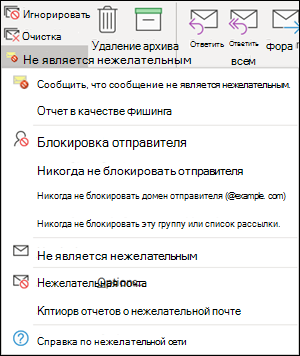

# <a name="install-and-use-the-junk-email-reporting-add-in-for-microsoft-outlook"></a><span data-ttu-id="f6c3f-103">Установка и использование надстройки "Отчеты о нежелательной почте" для Microsoft Outlook</span><span class="sxs-lookup"><span data-stu-id="f6c3f-103">Install and use the Junk Email Reporting add-in for Microsoft Outlook</span></span>

[!INCLUDE [Microsoft 365 Defender rebranding](../includes/microsoft-defender-for-office.md)]


> [!NOTE]
> <span data-ttu-id="f6c3f-104">Если вы в настоящее время не используете надстройку "Отчеты о нежелательной почте", рекомендуем использовать надстройку [Report Message](enable-the-report-message-add-in.md) или надстройку [Report Phishing.](enable-the-report-phish-add-in.md)</span><span class="sxs-lookup"><span data-stu-id="f6c3f-104">If you aren't currently using the Junk E-mail Reporting add-in, we recommend the [Report Message add-in](enable-the-report-message-add-in.md) or the [Report Phishing add-in](enable-the-report-phish-add-in.md) instead.</span></span> <span data-ttu-id="f6c3f-105">Для получения дополнительной информации см. [Отчет о сообщениях и файлах в Microsoft](report-junk-email-messages-to-microsoft.md).</span><span class="sxs-lookup"><span data-stu-id="f6c3f-105">For more information, see [Report messages and files to Microsoft](report-junk-email-messages-to-microsoft.md).</span></span>

<span data-ttu-id="f6c3f-106">Надстройка отчетов о нежелательной почте для Microsoft Outlook позволяет пользователям отправлять в корпорацию Майкрософт ложные срабатывания (хорошая почта помечена как нежелательная почта), ложные отрицательные результаты (разрешены нежелательные сообщения) и фишинговые сообщения.</span><span class="sxs-lookup"><span data-stu-id="f6c3f-106">The Junk Email Reporting Add-in for Microsoft Outlook allows users to submit false positives (good email marked as spam), false negatives (bad email allowed) and phishing messages to Microsoft.</span></span> <span data-ttu-id="f6c3f-107">Если ваша организация не использует Exchange Online Protection (например, локальное exchange или службы электронной почты, кроме Exchange Online), отправка отчета о нежелательной почте не повлияет на фильтрацию нежелательной почты.</span><span class="sxs-lookup"><span data-stu-id="f6c3f-107">If your organization doesn't use Exchange Online Protection (for example, on-premises Exchange or email services other than Exchange Online), your junk email report submission will not affect your spam filtering.</span></span>

<span data-ttu-id="f6c3f-108">В этом разделе объясняется, как установить и использовать надстройки отчетов о нежелательной почте.</span><span class="sxs-lookup"><span data-stu-id="f6c3f-108">This topic explains how to install and use the Junk Email Reporting add-in.</span></span>

## <a name="what-do-you-need-to-know-before-you-begin"></a><span data-ttu-id="f6c3f-109">Что нужно знать перед началом работы</span><span class="sxs-lookup"><span data-stu-id="f6c3f-109">What do you need to know before you begin?</span></span>

- <span data-ttu-id="f6c3f-110">Чтобы установить надстройки отчетов о нежелательной почте, см. раздел "Установка надстройки отчетов о нежелательной [почте"](#install-the-junk-email-reporting-add-in) далее в этой статье.</span><span class="sxs-lookup"><span data-stu-id="f6c3f-110">To install the Junk Email Reporting add-in, see the [Install the Junk Email Reporting add-in](#install-the-junk-email-reporting-add-in) section later in this article.</span></span>

- <span data-ttu-id="f6c3f-111">Надстройка отчетов о нежелательной почте работает со следующими версиями Outlook:</span><span class="sxs-lookup"><span data-stu-id="f6c3f-111">The Junk Email Reporting add-in works with the following versions of Outlook:</span></span>

  - <span data-ttu-id="f6c3f-112">Outlook 2013 или более поздней версии</span><span class="sxs-lookup"><span data-stu-id="f6c3f-112">Outlook 2013 or later</span></span>
  - <span data-ttu-id="f6c3f-113">Outlook, включенный в приложения Microsoft 365 для предприятий</span><span class="sxs-lookup"><span data-stu-id="f6c3f-113">Outlook included with Microsoft 365 Apps for enterprise</span></span>

- <span data-ttu-id="f6c3f-114">Дополнительные сведения об отчетах о сообщениях в корпорацию Майкрософт см. в отчете о [сообщениях и файлах корпорации Майкрософт.](report-junk-email-messages-to-microsoft.md)</span><span class="sxs-lookup"><span data-stu-id="f6c3f-114">For more information about reporting messages to Microsoft, see [Report messages and files to Microsoft](report-junk-email-messages-to-microsoft.md).</span></span>

## <a name="use-the-junk-email-reporting-add-in-to-report-spam-and-phishing-messages"></a><span data-ttu-id="f6c3f-115">Использование надстройки "Отчеты о нежелательной почте" для отправки отчетов о спаме и фишинговых сообщениях</span><span class="sxs-lookup"><span data-stu-id="f6c3f-115">Use the Junk Email Reporting add-in to report spam and phishing messages</span></span>

1. <span data-ttu-id="f6c3f-116">Для сообщений в папке "Входящие" или любой другой папке электронной почты, кроме нежелательной почты, используйте любой из следующих методов для отправки отчетов о спаме и фишинговых сообщениях:</span><span class="sxs-lookup"><span data-stu-id="f6c3f-116">For messages in the Inbox or any other email folder except Junk Email, use any of the following methods to report spam and phishing messages:</span></span>

   - <span data-ttu-id="f6c3f-117">Выберите сообщение или откройте его.</span><span class="sxs-lookup"><span data-stu-id="f6c3f-117">Select the message or open the message.</span></span> <span data-ttu-id="f6c3f-118">На **вкладке "Главная"** или **"Сообщение"** на ленте щелкните "Нежелаическая почта", а затем выберите "Отчет **как** нежелательный" или "Сообщить как **фишинг".**</span><span class="sxs-lookup"><span data-stu-id="f6c3f-118">In the **Home** or **Message** tab in the ribbon, click **Junk**, and then select **Report as Junk** or **Report as Phishing**.</span></span>

     

   - <span data-ttu-id="f6c3f-120">Щелкните сообщение правой кнопкой мыши, выберите "Нежеланая почта", а затем выберите "Отчет **как** нежелательное" или "Сообщить как **фишинг".**</span><span class="sxs-lookup"><span data-stu-id="f6c3f-120">Right-click on the message, select **Junk**, and then select **Report as Junk** or **Report as Phishing**.</span></span>

     

   - <span data-ttu-id="f6c3f-122">Выберите несколько сообщений, щелкните правой кнопкой мыши и выберите **"Отчет как** спам" или **"Отчет как фишинг".**</span><span class="sxs-lookup"><span data-stu-id="f6c3f-122">Select multiple messages, right-click, and then select **Report as Junk** or **Report as Phishing**.</span></span>

     

2. <span data-ttu-id="f6c3f-124">В от появляются диалоговое окно прочитать сведения и нажмите кнопку **Report**.</span><span class="sxs-lookup"><span data-stu-id="f6c3f-124">In the dialog that appears, read the information and click **Report**.</span></span> <span data-ttu-id="f6c3f-125">Если вы передумаете, нажмите кнопку **"Не сообщать".**</span><span class="sxs-lookup"><span data-stu-id="f6c3f-125">If you change your mind, click **Don't Report**.</span></span>

   

   

3. <span data-ttu-id="f6c3f-128">Выбранные сообщения будут отправлены в корпорацию Майкрософт для анализа и:</span><span class="sxs-lookup"><span data-stu-id="f6c3f-128">The selected messages will be sent to Microsoft for analysis and:</span></span>

   - <span data-ttu-id="f6c3f-129">Перемещается в папку нежелательной почты, если сообщение было отправлено как спам.</span><span class="sxs-lookup"><span data-stu-id="f6c3f-129">Moved to the Junk Email folder if it was reported as spam.</span></span>
   - <span data-ttu-id="f6c3f-130">Удалено, если оно было засчитано как фишинговое.</span><span class="sxs-lookup"><span data-stu-id="f6c3f-130">Deleted if it was reported as phishing.</span></span>

   <span data-ttu-id="f6c3f-131">Чтобы убедиться, что сообщения отправлены, откройте папку **Отправленные** и просмотрите отправленные сообщения.</span><span class="sxs-lookup"><span data-stu-id="f6c3f-131">To confirm that the messages have been submitted, open your **Sent Items** folder to view the submitted messages.</span></span>

## <a name="use-the-junk-email-reporting-add-in-to-report-non-spam-and-phishing-messages-from-the-junk-email-folder"></a><span data-ttu-id="f6c3f-132">Использование надстройки "Отчеты о нежелательной почте" для отправки отчетов о нежелательных и фишинговых сообщениях из папки нежелательной почты</span><span class="sxs-lookup"><span data-stu-id="f6c3f-132">Use the Junk Email Reporting add-in to report non-spam and phishing messages from the Junk Email folder</span></span>

1. <span data-ttu-id="f6c3f-133">В папке нежелательной почты используйте любой из следующих методов для сообщения о ложных срабатываниях или фишинговых сообщениях:</span><span class="sxs-lookup"><span data-stu-id="f6c3f-133">In the Junk Email folder, use any of the following methods to report spam false positives or phishing messages:</span></span>

   - <span data-ttu-id="f6c3f-134">Выберите сообщение или откройте его.</span><span class="sxs-lookup"><span data-stu-id="f6c3f-134">Select the message or open the message.</span></span> <span data-ttu-id="f6c3f-135">На **вкладке "Главная"** или  **"Сообщение"** на ленте щелкните "Не является нежелательным" и выберите "Отчет **как** не является нежелательным" или "Сообщить **как фишинг".**</span><span class="sxs-lookup"><span data-stu-id="f6c3f-135">In the **Home** or **Message** tab in the ribbon, click **Not Junk**, and then select **Report as Not Junk** or **Report as Phishing**.</span></span>

     

   - <span data-ttu-id="f6c3f-137">Щелкните сообщение правой кнопкой мыши и выберите "Отчет **как** не является нежелательным" или "Сообщить **как фишинг".** </span><span class="sxs-lookup"><span data-stu-id="f6c3f-137">Right-click on the message, click **Junk**, and then select **Report as Not Junk** or **Report as Phishing**.</span></span>

     

   - <span data-ttu-id="f6c3f-139">Выберите несколько сообщений, щелкните правой кнопкой мыши и выберите **"Отчет как** не является нежелательным" или "Сообщить **как фишинг".**</span><span class="sxs-lookup"><span data-stu-id="f6c3f-139">Select multiple messages, right-click, and then select **Report as Not Junk** or **Report as Phishing**.</span></span>

     

2. <span data-ttu-id="f6c3f-141">В от появляются диалоговое окно прочитать сведения и нажмите кнопку **Report**.</span><span class="sxs-lookup"><span data-stu-id="f6c3f-141">In the dialog that appears, read the information and click **Report**.</span></span> <span data-ttu-id="f6c3f-142">Если вы передумаете, нажмите кнопку **"Не сообщать".**</span><span class="sxs-lookup"><span data-stu-id="f6c3f-142">If you change your mind, click **Don't Report**.</span></span>

   

   

3. <span data-ttu-id="f6c3f-145">Выбранные сообщения будут отправлены в корпорацию Майкрософт для анализа и:</span><span class="sxs-lookup"><span data-stu-id="f6c3f-145">The selected messages will be sent to Microsoft for analysis and:</span></span>

   - <span data-ttu-id="f6c3f-146">Перемещается в папку нежелательной почты, если сообщение было отправлено как спам.</span><span class="sxs-lookup"><span data-stu-id="f6c3f-146">Moved to the Junk Email folder if it was reported as spam.</span></span>
   - <span data-ttu-id="f6c3f-147">Удалено, если оно было засчитано как фишинговое.</span><span class="sxs-lookup"><span data-stu-id="f6c3f-147">Deleted if it was reported as phishing.</span></span>

   <span data-ttu-id="f6c3f-148">Чтобы убедиться, что сообщения отправлены, откройте папку **Отправленные** и просмотрите отправленные сообщения.</span><span class="sxs-lookup"><span data-stu-id="f6c3f-148">To confirm that the messages have been submitted, open your **Sent Items** folder to view the submitted messages.</span></span>

## <a name="install-the-junk-email-reporting-add-in"></a><span data-ttu-id="f6c3f-149">Установка надстройки "Отчеты о нежелательной почте"</span><span class="sxs-lookup"><span data-stu-id="f6c3f-149">Install the Junk Email Reporting add-in</span></span>

- <span data-ttu-id="f6c3f-150">На компьютере, на котором устанавливается надстройка, необходимы права администратора.</span><span class="sxs-lookup"><span data-stu-id="f6c3f-150">You need to have administrator privileges on the computer where you're installing the add-in.</span></span>

- <span data-ttu-id="f6c3f-151">Перейдите в папку, которую легко найти, и скачайте соответствующий MSI-файл для вашей версии <https://www.microsoft.com/download/details.aspx?id=18275> Office:</span><span class="sxs-lookup"><span data-stu-id="f6c3f-151">Go to <https://www.microsoft.com/download/details.aspx?id=18275> and download the appropriate .msi file for your version of Office to a location that's easy to find:</span></span>

  - <span data-ttu-id="f6c3f-152">**32-битная:**`Junk Reporting Add-in for Office 2007, 2010, 2013, and 2016 (32-bit).msi`</span><span class="sxs-lookup"><span data-stu-id="f6c3f-152">**32-bit**: `Junk Reporting Add-in for Office 2007, 2010, 2013, and 2016 (32-bit).msi`</span></span>
  - <span data-ttu-id="f6c3f-153">**64-битная:**`Junk Reporting Add-in for Office 2007, 2010, 2013, and 2016 (64-bit).msi`</span><span class="sxs-lookup"><span data-stu-id="f6c3f-153">**64-bit**: `Junk Reporting Add-in for Office 2007, 2010, 2013, and 2016 (64-bit).msi`</span></span>

- <span data-ttu-id="f6c3f-154">Для Outlook 2013 или более поздней 2013 единственным необходимым условием является Microsoft .NET Framework 2.0.</span><span class="sxs-lookup"><span data-stu-id="f6c3f-154">For Outlook 2013 or later, the only prerequisite is the Microsoft .NET Framework 2.0.</span></span> <span data-ttu-id="f6c3f-155">В Windows 10 не устанавливается .NET Framework 2.0 из загружаемой версии.</span><span class="sxs-lookup"><span data-stu-id="f6c3f-155">In Windows 10, you don't install the .NET Framework 2.0 from a download.</span></span>

### <a name="install-the-junk-email-reporting-add-in-using-the-setup-wizard"></a><span data-ttu-id="f6c3f-156">Установка надстройки отчетов о нежелательной почте с помощью мастера установки</span><span class="sxs-lookup"><span data-stu-id="f6c3f-156">Install the Junk Email Reporting Add-in using the Setup wizard</span></span>

1. <span data-ttu-id="f6c3f-157">Закройте Outlook на компьютере.</span><span class="sxs-lookup"><span data-stu-id="f6c3f-157">On your computer, close Outlook.</span></span>

2. <span data-ttu-id="f6c3f-158">Убедитесь, что в Windows 10 включена .NET Framework 2.0.</span><span class="sxs-lookup"><span data-stu-id="f6c3f-158">In Windows 10, verify the .NET Framework 2.0 is enabled.</span></span> <span data-ttu-id="f6c3f-159">Инструкции см. в под [управлением .NET Framework 3.5 на панели управления.](https://docs.microsoft.com/dotnet/framework/install/dotnet-35-windows-10#enable-the-net-framework-35-in-control-panel)</span><span class="sxs-lookup"><span data-stu-id="f6c3f-159">For instructions, see [Enable the .NET Framework 3.5 in Control Panel](https://docs.microsoft.com/dotnet/framework/install/dotnet-35-windows-10#enable-the-net-framework-35-in-control-panel).</span></span>

3. <span data-ttu-id="f6c3f-160">Найдите загруженный MSI-файл и дважды щелкните его.</span><span class="sxs-lookup"><span data-stu-id="f6c3f-160">Locate the .msi file you downloaded and double-click on it.</span></span>

4. <span data-ttu-id="f6c3f-161">На странице **Добро пожаловать в мастер установки надстройки создания отчетов о нежелательной почте** нажмите кнопку **Далее**.</span><span class="sxs-lookup"><span data-stu-id="f6c3f-161">On the **Welcome to Microsoft Junk Email Reporting Add-in Setup** page, click **Next**.</span></span>

5. <span data-ttu-id="f6c3f-162">Просмотрите лицензионный договор, щелкните **"Я принимаю** условия лицензионного соглашения", если вы согласны с условиями лицензионного соглашения, и нажмите кнопку **"Далее".**</span><span class="sxs-lookup"><span data-stu-id="f6c3f-162">Review the license agreement, click **I accept the terms in the License Agreement** if you agree to the terms, and then click **Next**.</span></span>

6. <span data-ttu-id="f6c3f-163">После завершения мастера нажмите кнопку **Готово**.</span><span class="sxs-lookup"><span data-stu-id="f6c3f-163">When the wizard is complete, click **Finish**.</span></span>

<span data-ttu-id="f6c3f-164">Запустите приложение Outlook.</span><span class="sxs-lookup"><span data-stu-id="f6c3f-164">Start Outlook.</span></span>

<span data-ttu-id="f6c3f-p109">Найдите кнопку **Нежелательная почта** в ленте Outlook. С ее помощью можно сообщить корпорации Майкрософт о нежелательных сообщениях электронной почты. Выберите эти письма в папке "Входящие" и нажмите кнопку **Сообщить о нежелательной почте**.</span><span class="sxs-lookup"><span data-stu-id="f6c3f-p109">Look for the **Junk** button on your Outlook ribbon. You can now report junk email messages to Microsoft by selecting the junk email messages in your Inbox and clicking the **Report Junk** button.</span></span>

<span data-ttu-id="f6c3f-p110">Нажмите стрелку вниз рядом с кнопкой **Нежелательная почта**, чтобы открыть дополнительные параметры, например **Фишинговое сообщение**, если вы хотите сообщить корпорации Майкрософт о фишинговых сообщениях. В папке нежелательной почты можно также выбрать параметр **Не является нежелательным**, если сообщение ошибочно помечено как нежелательное.</span><span class="sxs-lookup"><span data-stu-id="f6c3f-p110">Choose the down arrow next to **Junk** for more options such as **Report as Phishing** if you want to report phishing scam emails to Microsoft. In your junk mail folder, you can also select, **Report not junk** if an email was incorrectly identified as junk mail.</span></span>

### <a name="install-the-junk-email-reporting-add-in-using-silent-mode"></a><span data-ttu-id="f6c3f-169">Установка надстройки создания отчетов о нежелательной почте в автоматическом режиме</span><span class="sxs-lookup"><span data-stu-id="f6c3f-169">Install the Junk Email Reporting Add-In using Silent Mode</span></span>

1. <span data-ttu-id="f6c3f-170">Закройте Outlook на компьютере.</span><span class="sxs-lookup"><span data-stu-id="f6c3f-170">On your computer, close Outlook.</span></span>

2. <span data-ttu-id="f6c3f-171">В Windows 10 установите .NET Framework 2.0 с помощью следующей команды:</span><span class="sxs-lookup"><span data-stu-id="f6c3f-171">In Windows 10, install the .NET Framework 2.0 by running the following command:</span></span>

   ```dos
   DISM /Online /Enable-Feature /FeatureName:NetFx3 /All
   ```

3. <span data-ttu-id="f6c3f-172">Чтобы установить надстройку без участия пользователя, откройте командную подсказку и используйте следующий синтаксис:</span><span class="sxs-lookup"><span data-stu-id="f6c3f-172">To install the add-in without any user interaction, open a Command Prompt and use the following syntax:</span></span>

   ```dos
   msiexec /qn /i "<PathToMSIFile>\<MSIFile>" [MaxMessageSelection=<1-50>] [BccEmailAddress="<EmailAddress1>; <EmailAddress2>"...]
   ```

   - <span data-ttu-id="f6c3f-173">`MaxMessageSelection` указывает максимальное количество сообщений, которые можно выбрать для одной отправки.</span><span class="sxs-lookup"><span data-stu-id="f6c3f-173">`MaxMessageSelection` specifies the maximum number of messages that you can select for a single submission.</span></span> <span data-ttu-id="f6c3f-174">Допустимые значения: от 1 до 50.</span><span class="sxs-lookup"><span data-stu-id="f6c3f-174">Valid values are from 1 to 50.</span></span> <span data-ttu-id="f6c3f-175">Значение по умолчанию — 15.</span><span class="sxs-lookup"><span data-stu-id="f6c3f-175">The default value is 15.</span></span>

   - <span data-ttu-id="f6c3f-176">`BccEmailAddress` указывает дополнительных получателей копии всех отправленных пользователями копий.</span><span class="sxs-lookup"><span data-stu-id="f6c3f-176">`BccEmailAddress` specifies additional Bcc recipients who will receive a copy of all user submissions.</span></span> <span data-ttu-id="f6c3f-177">Значение по умолчанию пустое (без дополнительных получателей в ск. ).</span><span class="sxs-lookup"><span data-stu-id="f6c3f-177">The default value is blank (no additional Bcc recipients).</span></span>

   <span data-ttu-id="f6c3f-178">В этом примере устанавливается 64-битная версия надстройки по указанному пути с настройками по умолчанию.</span><span class="sxs-lookup"><span data-stu-id="f6c3f-178">This example installs the 64-bit version of the add-in from the specified path with the default settings.</span></span>

   ```dos
   msiexec /qn /i "C:\Downloads\Junk Reporting Add-in for Office 2007, 2010, 2013, and 2016 (64-bit).msi"
   ```

   <span data-ttu-id="f6c3f-179">В этом примере по указанному пути устанавливается 32-битная версия надстройки со следующими дополнительными настройками:</span><span class="sxs-lookup"><span data-stu-id="f6c3f-179">This example installs the 32-bit version of the add-in from the specified path with the following additional settings:</span></span>

   - <span data-ttu-id="f6c3f-180">В одной отправке можно выбрать до 20 сообщений.</span><span class="sxs-lookup"><span data-stu-id="f6c3f-180">Up to 20 messages can be selected in a single submission.</span></span>
   - <span data-ttu-id="f6c3f-181">junkreports@contoso.com и hollyd@treyresearch.net копии всех от отправленных сообщений.</span><span class="sxs-lookup"><span data-stu-id="f6c3f-181">junkreports@contoso.com and hollyd@treyresearch.net receive Bcc copies of all submissions.</span></span>

   ```dos
   msiexec /qn /i "C:\Downloads\Junk Reporting Add-in for Office 2007, 2010, 2013, and 2016 (32-bit).msi" MaxMessageSelection=20 BccEmailAddress="junkreports@contoso.com; hollyd@treyresearch.net"
   ```

### <a name="how-do-you-know-this-worked"></a><span data-ttu-id="f6c3f-182">Как проверить, что все получилось?</span><span class="sxs-lookup"><span data-stu-id="f6c3f-182">How do you know this worked?</span></span>

<span data-ttu-id="f6c3f-183">Чтобы убедиться, что надстройка отчетов о нежелательной почте успешно установлена, сделайте в Outlook любое из следующих действий:</span><span class="sxs-lookup"><span data-stu-id="f6c3f-183">To verify that you've successfully installed the Junk Email Reporting Add-in, do the any of the following steps in Outlook:</span></span>

- <span data-ttu-id="f6c3f-184">Выберите сообщение или откройте его.</span><span class="sxs-lookup"><span data-stu-id="f6c3f-184">Select the message or open the message.</span></span> <span data-ttu-id="f6c3f-185">На **вкладке "Главная"** или  **"Сообщение"** на ленте щелкните "Нежелаическая почта" и убедитесь, что доступны следующие параметры:</span><span class="sxs-lookup"><span data-stu-id="f6c3f-185">In the **Home** or **Message** tab in the ribbon, click **Junk**, and verify that the following options are available:</span></span>

  - <span data-ttu-id="f6c3f-186">**Отчет как нежелательный**</span><span class="sxs-lookup"><span data-stu-id="f6c3f-186">**Report as Junk**</span></span>
  - <span data-ttu-id="f6c3f-187">**Сообщение как фишинговое**</span><span class="sxs-lookup"><span data-stu-id="f6c3f-187">**Report as Phishing**</span></span>
  - <span data-ttu-id="f6c3f-188">**Параметры отчетов о нежелательной почте**</span><span class="sxs-lookup"><span data-stu-id="f6c3f-188">**Junk Reporting Options**</span></span>
  - <span data-ttu-id="f6c3f-189">**Отчет о нежелательной справке в Интернете**</span><span class="sxs-lookup"><span data-stu-id="f6c3f-189">**Report Junk Online Help**</span></span>

  

- <span data-ttu-id="f6c3f-191">Щелкните сообщение правой кнопкой мыши, **выберите**"Нежеланая почта" и убедитесь, что доступны следующие параметры:</span><span class="sxs-lookup"><span data-stu-id="f6c3f-191">Right-click on the message, select **Junk**, and verify that the following options are available:</span></span>

  - <span data-ttu-id="f6c3f-192">**Отчет как нежелательный**</span><span class="sxs-lookup"><span data-stu-id="f6c3f-192">**Report as Junk**</span></span>
  - <span data-ttu-id="f6c3f-193">**Сообщение как фишинговое**</span><span class="sxs-lookup"><span data-stu-id="f6c3f-193">**Report as Phishing**</span></span>
  - <span data-ttu-id="f6c3f-194">**Параметры отчетов о нежелательной почте**</span><span class="sxs-lookup"><span data-stu-id="f6c3f-194">**Junk Reporting Options**</span></span>
  - <span data-ttu-id="f6c3f-195">**Отчет о нежелательной справке в Интернете**</span><span class="sxs-lookup"><span data-stu-id="f6c3f-195">**Report Junk Online Help**</span></span>

  

- <span data-ttu-id="f6c3f-197">Выберите несколько сообщений, щелкните правой кнопкой мыши и убедитесь, что доступны следующие параметры:</span><span class="sxs-lookup"><span data-stu-id="f6c3f-197">Select multiple messages, right click, and verify that the following options are available:</span></span>

  - <span data-ttu-id="f6c3f-198">**Отчет как нежелательный**</span><span class="sxs-lookup"><span data-stu-id="f6c3f-198">**Report as Junk**</span></span>
  - <span data-ttu-id="f6c3f-199">**Сообщение как фишинговое**</span><span class="sxs-lookup"><span data-stu-id="f6c3f-199">**Report as Phishing**</span></span>

  

- <span data-ttu-id="f6c3f-201">Сделайте предыдущие действия в папке **нежелательной** почты и убедитесь, что предыдущие параметры отчетов о нежелательной почте теперь **не являются нежелательными.** </span><span class="sxs-lookup"><span data-stu-id="f6c3f-201">Do the previous actions in the **Junk Email** folder and verify the previous **Junk** reporting options are now **Not Junk**.</span></span>

  

  

  

## <a name="uninstall-the-junk-email-reporting-add-in"></a><span data-ttu-id="f6c3f-205">Удаление надстройки создания отчетов о нежелательной почте</span><span class="sxs-lookup"><span data-stu-id="f6c3f-205">Uninstall the Junk Email Reporting Add-in</span></span>

<span data-ttu-id="f6c3f-206">После закрытия Outlook используйте любую из следующих процедур, чтобы удалить надстройку отчетов о нежелательной почте:</span><span class="sxs-lookup"><span data-stu-id="f6c3f-206">After you close Outlook, use any of the following procedures to uninstall the Junk Email Reporting Add-in:</span></span>

- <span data-ttu-id="f6c3f-207">**Панель управления:** нажмите клавиши Windows + R. В **открываемом** диалоговом окте "Выполнить" введите и `control appwiz.cpl` нажмите кнопку **"ОК".**</span><span class="sxs-lookup"><span data-stu-id="f6c3f-207">**Control Panel**: Press the Windows key + R. In the **Run** dialog that opens, enter `control appwiz.cpl` and then click **OK**.</span></span>

  <span data-ttu-id="f6c3f-208">Найдите и выберите **в** списке надстройку отчетов о нежелательной почте Майкрософт и нажмите кнопку **"Удалить".**</span><span class="sxs-lookup"><span data-stu-id="f6c3f-208">Find and select **Microsoft Junk Email Reporting Add-in** in the list, and then click **Uninstall**.</span></span>

- <span data-ttu-id="f6c3f-209">**Пакет установщика Windows:** найдите или скачайте соответствующий MSI-файл и дважды щелкните его.</span><span class="sxs-lookup"><span data-stu-id="f6c3f-209">**Windows Installer package**: Find or download the appropriate .msi file, and double-click on it.</span></span>

  - <span data-ttu-id="f6c3f-210">**32-битная:**`Junk Reporting Add-in for Office 2007, 2010, 2013, and 2016 (32-bit).msi`</span><span class="sxs-lookup"><span data-stu-id="f6c3f-210">**32-bit**: `Junk Reporting Add-in for Office 2007, 2010, 2013, and 2016 (32-bit).msi`</span></span>

  - <span data-ttu-id="f6c3f-211">**64-битная:**`Junk Reporting Add-in for Office 2007, 2010, 2013, and 2016 (64-bit).msi`</span><span class="sxs-lookup"><span data-stu-id="f6c3f-211">**64-bit**: `Junk Reporting Add-in for Office 2007, 2010, 2013, and 2016 (64-bit).msi`</span></span>

  <span data-ttu-id="f6c3f-212">В отображемом диалоговом окте выберите "Удалить надстройки **отчетов** о нежелательной почте (Майкрософт) для Outlook", а затем нажмите кнопку **"Далее".**</span><span class="sxs-lookup"><span data-stu-id="f6c3f-212">In the dialog that appears, select **Remove Microsoft Junk Email Reporting Add-in for Outlook** and then click **Next**.</span></span>

- <span data-ttu-id="f6c3f-213">**В тихом** режиме: найдите или скачайте соответствующий MSI-файл.</span><span class="sxs-lookup"><span data-stu-id="f6c3f-213">**Silent Mode**: Find or download the appropriate .msi file.</span></span> <span data-ttu-id="f6c3f-214">В окне командной подсказки замените расположение MSI-файла и запустите одну из \<PathToFile\> следующих команд:</span><span class="sxs-lookup"><span data-stu-id="f6c3f-214">In a Command Prompt window, replace \<PathToFile\> with the location of the .msi file, and run one of the following commands:</span></span>

  - <span data-ttu-id="f6c3f-215">**32-битная:**</span><span class="sxs-lookup"><span data-stu-id="f6c3f-215">**32-bit**:</span></span>

    ```dos
    msiexec /x "<PathToFile>\Junk Reporting Add-in for Office 2007, 2010, 2013, and 2016 (32-bit).msi" /qn MSIRESTARTMANAGERCONTROL="DisableShutdown"
    ```

  - <span data-ttu-id="f6c3f-216">**64-битная:**</span><span class="sxs-lookup"><span data-stu-id="f6c3f-216">**64-bit**:</span></span>

    ```dos
    msiexec /x "<PathToFile>\Junk Reporting Add-in for Office 2007, 2010, 2013, and 2016 (64-bit).msi" /qn MSIRESTARTMANAGERCONTROL="DisableShutdown"
    ```

<span data-ttu-id="f6c3f-217">Когда вы открываете Outlook после этого, параметры нежелательной почты, а не нежелательной почты и фишинговых отчетов не должны быть доступны.</span><span class="sxs-lookup"><span data-stu-id="f6c3f-217">When you open Outlook after the uninstall, the junk, not junk, and phishing reporting options should be gone.</span></span>

## <a name="troubleshooting-the-junk-email-reporting-add-in"></a><span data-ttu-id="f6c3f-218">Устранение неполадок надстройки "Отчеты о нежелательной почте"</span><span class="sxs-lookup"><span data-stu-id="f6c3f-218">Troubleshooting the Junk Email Reporting add-in</span></span>

<span data-ttu-id="f6c3f-219">Иногда после добавления надстройки отчетов о нежелательной почте могут возникнуть проблемы с Outlook.</span><span class="sxs-lookup"><span data-stu-id="f6c3f-219">Occasionally, you might experience trouble with Outlook after adding the Junk Email Reporting Add-In.</span></span> <span data-ttu-id="f6c3f-220">В этом разделе описываются проблемы, которые могут возникнуть, а также советы по их устранению.</span><span class="sxs-lookup"><span data-stu-id="f6c3f-220">This section describes problems that you might encounter, along with tips for resolving these issues.</span></span>

### <a name="troubleshooting-for-users"></a><span data-ttu-id="f6c3f-221">Устранение неполадок для пользователей</span><span class="sxs-lookup"><span data-stu-id="f6c3f-221">Troubleshooting for users</span></span>

<span data-ttu-id="f6c3f-222">У вас есть одна или несколько из следующих проблем:</span><span class="sxs-lookup"><span data-stu-id="f6c3f-222">You experience one or more of the following problems:</span></span>

- <span data-ttu-id="f6c3f-223">После нажатия кнопки **Сообщить о нежелательной почте** ничего не происходит.</span><span class="sxs-lookup"><span data-stu-id="f6c3f-223">Nothing happens when you click **Report Junk**</span></span>
- <span data-ttu-id="f6c3f-224">Служба Outlook не отвечает на запросы после вашего выбора сообщения электронной почты.</span><span class="sxs-lookup"><span data-stu-id="f6c3f-224">Outlook stops responding after you select an email message</span></span>
- <span data-ttu-id="f6c3f-225">Вследствие отказа в доставке не удается доставить нежелательные сообщения, в отношении которых отправлен отчет.</span><span class="sxs-lookup"><span data-stu-id="f6c3f-225">Reported junk mail cannot be delivered due to an "undeliverable" reply</span></span>

<span data-ttu-id="f6c3f-226">Чтобы устранить эту проблему, сделайте следующее:</span><span class="sxs-lookup"><span data-stu-id="f6c3f-226">To fix this problem, do the following steps:</span></span>

1. <span data-ttu-id="f6c3f-227">Закроем и перезапустите Outlook.</span><span class="sxs-lookup"><span data-stu-id="f6c3f-227">Close and restart Outlook.</span></span>
2. <span data-ttu-id="f6c3f-228">Создайте и отправьте тестового сообщения и убедитесь, что получатель получил сообщение.</span><span class="sxs-lookup"><span data-stu-id="f6c3f-228">Create and send a test message, and verify that the recipient received the message.</span></span>
3. <span data-ttu-id="f6c3f-229">Если проблема сохраняется, обратитесь к администратору.</span><span class="sxs-lookup"><span data-stu-id="f6c3f-229">If the problem persists, contact your admin.</span></span>

<span data-ttu-id="f6c3f-230">Другие методы, которые можно использовать для отправки сообщений в корпорацию Майкрософт, см. в отчете о [сообщениях и файлах в корпорацию Майкрософт.](report-junk-email-messages-to-microsoft.md)</span><span class="sxs-lookup"><span data-stu-id="f6c3f-230">For other methods that you can use to submit messages to Microsoft, see [Report messages and files to Microsoft](report-junk-email-messages-to-microsoft.md).</span></span>

### <a name="troubleshooting-for-admins"></a><span data-ttu-id="f6c3f-231">Устранение неполадок для администраторов</span><span class="sxs-lookup"><span data-stu-id="f6c3f-231">Troubleshooting for admins</span></span>

#### <a name="problem-an-error-message-continually-appears-that-asks-users-to-contact-their-system-administrator"></a><span data-ttu-id="f6c3f-232">Проблема: постоянно появляется сообщение об ошибке с запросом на обращение к системным администраторам</span><span class="sxs-lookup"><span data-stu-id="f6c3f-232">Problem: An error message continually appears that asks users to contact their system administrator</span></span>

1. <span data-ttu-id="f6c3f-233">Проверьте или установите для `LoggingLevel` ключа реестра значение Verbose:</span><span class="sxs-lookup"><span data-stu-id="f6c3f-233">Verify or set the `LoggingLevel` registry key to the value "Verbose":</span></span>

   - <span data-ttu-id="f6c3f-234">**32-битная версия Outlook в 32-битной версии Windows:**</span><span class="sxs-lookup"><span data-stu-id="f6c3f-234">**32-bit Outlook on 32-bit Windows**:</span></span>

     ```text
     Windows Registry Editor Version 5.00

     [HKEY_LOCAL_MACHINE\Software\Microsoft\Junk Email Reporting\Addins]
     "LoggingLevel"="Verbose"
     ```

   - <span data-ttu-id="f6c3f-235">**32-битная версия Outlook в 64-битной версии Windows:**</span><span class="sxs-lookup"><span data-stu-id="f6c3f-235">**32-bit Outlook on 64-bit Windows**:</span></span>

     ```text
     Windows Registry Editor Version 5.00

     [HKEY_LOCAL_MACHINE\Software\Wow6432Node\Microsoft\Junk Email Reporting\Addins]
     "LoggingLevel"="Verbose"
     ```

   - <span data-ttu-id="f6c3f-236">**64-битный Outlook:**</span><span class="sxs-lookup"><span data-stu-id="f6c3f-236">**64-bit Outlook**:</span></span>

     ```text
     Windows Registry Editor Version 5.00

     [HKEY_LOCAL_MACHINE\Software\Microsoft\Junk E-mail Reporting\Addins]
     "LoggingLevel"="Verbose"
     ```

2. <span data-ttu-id="f6c3f-237">Перезапустите Outlook и попросите пользователей сообщить о них, когда они увидят сообщение об ошибке.</span><span class="sxs-lookup"><span data-stu-id="f6c3f-237">Restart Outlook and ask users to report back when they see the error message.</span></span>

3. <span data-ttu-id="f6c3f-238">Соберите сведения журнала в следующем расположении.</span><span class="sxs-lookup"><span data-stu-id="f6c3f-238">Collect the log information found at the following location:</span></span>

   `%LOCALAPPDATA%\Microsoft\Junk Email Reporting Add-in\SpamReporterAddinLog.txt`

4. <span data-ttu-id="f6c3f-239">Обратитесь в службу технической поддержки Exchange Online Protection и предоставьте ее сотрудникам сведения журнала.</span><span class="sxs-lookup"><span data-stu-id="f6c3f-239">Contact Exchange Online Protection Technical Support and provide them with the log information.</span></span>

#### <a name="problem-users-selected-not-to-receive-a-confirmation-prompt-when-they-report-messages-and-now-they-want-the-prompt-back"></a><span data-ttu-id="f6c3f-240">Проблема: пользователи не получали запрос на подтверждение при сообщении сообщений, а теперь хотят вернуть запрос</span><span class="sxs-lookup"><span data-stu-id="f6c3f-240">Problem: Users selected not to receive a confirmation prompt when they report messages, and now they want the prompt back</span></span>

1. <span data-ttu-id="f6c3f-241">Создайте `ConfirmReportJunk` ключ реестра со значением True:</span><span class="sxs-lookup"><span data-stu-id="f6c3f-241">Create the `ConfirmReportJunk`registry key with the value "True":</span></span>

   ```text
   Windows Registry Editor Version 5.00

   HKEY_CURRENT_USER\Software\Microsoft\Junk E-mail Reporting\Preferences]
   "ConfirmReportJunk"="True"
   ```

2. <span data-ttu-id="f6c3f-242">Перезапустите Outlook.</span><span class="sxs-lookup"><span data-stu-id="f6c3f-242">Restart Outlook.</span></span>
