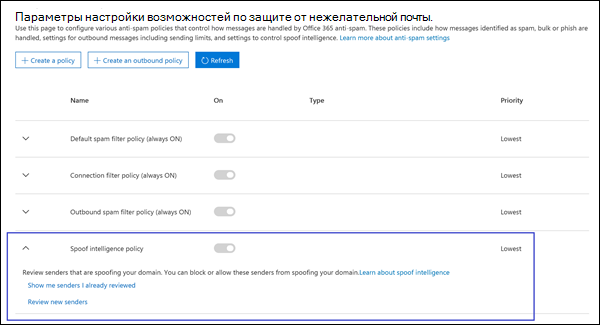
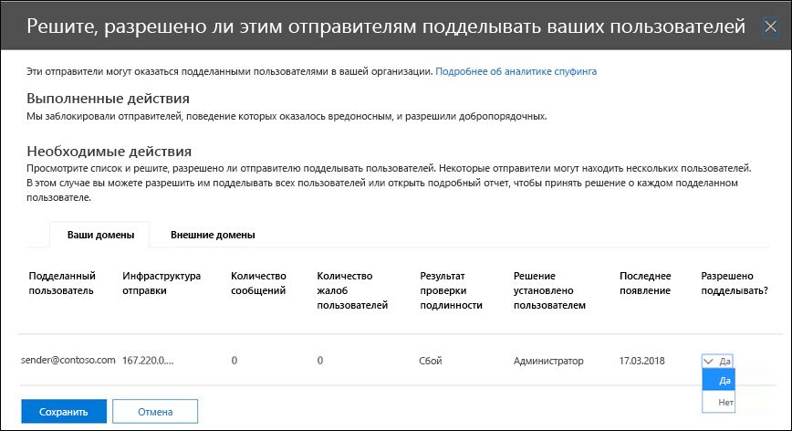

# <a name="configure-spoof-intelligence-in-eop"></a><span data-ttu-id="29e65-103">Настройка подмены сведений в EOP</span><span class="sxs-lookup"><span data-stu-id="29e65-103">Configure spoof intelligence in EOP</span></span>

[!INCLUDE [Microsoft 365 Defender rebranding](../includes/microsoft-defender-for-office.md)]

<span data-ttu-id="29e65-104">**Область применения**</span><span class="sxs-lookup"><span data-stu-id="29e65-104">**Applies to**</span></span>
- [<span data-ttu-id="29e65-105">Exchange Online Protection</span><span class="sxs-lookup"><span data-stu-id="29e65-105">Exchange Online Protection</span></span>](exchange-online-protection-overview.md)
- [<span data-ttu-id="29e65-106">Microsoft Defender для Office 365 (план 1 и план 2)</span><span class="sxs-lookup"><span data-stu-id="29e65-106">Microsoft Defender for Office 365 plan 1 and plan 2</span></span>](defender-for-office-365.md)
- [<span data-ttu-id="29e65-107">Microsoft 365 Defender</span><span class="sxs-lookup"><span data-stu-id="29e65-107">Microsoft 365 Defender</span></span>](../defender/microsoft-365-defender.md)

<span data-ttu-id="29e65-108">В 365 организациях Microsoft 365 с почтовыми ящиками в организациях Exchange Online или автономных exchange Online Protection (EOP) без почтовых ящиков Exchange Online входящие сообщения электронной почты автоматически защищены от подмены EOP с октября 2018 г.</span><span class="sxs-lookup"><span data-stu-id="29e65-108">In Microsoft 365 organizations with mailboxes in Exchange Online or standalone Exchange Online Protection (EOP) organizations without Exchange Online mailboxes, inbound email messages are automatically protected against spoofing by EOP as of October 2018.</span></span> <span data-ttu-id="29e65-109">EOP использует spoof intelligence как часть общей защиты организации от фишинга.</span><span class="sxs-lookup"><span data-stu-id="29e65-109">EOP uses spoof intelligence as part of your organization's overall defense against phishing.</span></span> <span data-ttu-id="29e65-110">Дополнительные сведения см. в дополнительных сведениях в области защиты от подмены в [EOP.](anti-spoofing-protection.md)</span><span class="sxs-lookup"><span data-stu-id="29e65-110">For more information, see [Anti-spoofing protection in EOP](anti-spoofing-protection.md).</span></span>

<span data-ttu-id="29e65-111">Когда отправитель подменит адрес электронной почты, он, как представляется, является пользователем в одном из доменов организации или пользователем внешнего домена, который отправляет электронную почту в организацию.</span><span class="sxs-lookup"><span data-stu-id="29e65-111">When a sender spoofs an email address, they appear to be a user in one of your organization's domains, or a user in an external domain that sends email to your organization.</span></span> <span data-ttu-id="29e65-112">Злоумышленники, которые подменили отправителей для отправки нежелательной почты или фишинга, должны быть заблокированы.</span><span class="sxs-lookup"><span data-stu-id="29e65-112">Attackers who spoof senders to send spam or phishing email need to be blocked.</span></span> <span data-ttu-id="29e65-113">Но существуют сценарии, в которых законные отправители подменяются.</span><span class="sxs-lookup"><span data-stu-id="29e65-113">But there are scenarios where legitimate senders are spoofing.</span></span> <span data-ttu-id="29e65-114">Пример.</span><span class="sxs-lookup"><span data-stu-id="29e65-114">For example:</span></span>

- <span data-ttu-id="29e65-115">Законные сценарии подмены внутренних доменов:</span><span class="sxs-lookup"><span data-stu-id="29e65-115">Legitimate scenarios for spoofing internal domains:</span></span>

  - <span data-ttu-id="29e65-116">Сторонние отправители используют домен для отправки массовой почты своим сотрудникам для опросов компании.</span><span class="sxs-lookup"><span data-stu-id="29e65-116">Third-party senders use your domain to send bulk mail to your own employees for company polls.</span></span>
  - <span data-ttu-id="29e65-117">Внешняя компания создает и отправляет от вашего имени рекламные или продуктные обновления.</span><span class="sxs-lookup"><span data-stu-id="29e65-117">An external company generates and sends advertising or product updates on your behalf.</span></span>
  - <span data-ttu-id="29e65-118">Помощнику регулярно требуется отправлять электронную почту другому лицу в вашей организации.</span><span class="sxs-lookup"><span data-stu-id="29e65-118">An assistant regularly needs to send email for another person within your organization.</span></span>
  - <span data-ttu-id="29e65-119">Внутреннее приложение отправляет уведомления электронной почты.</span><span class="sxs-lookup"><span data-stu-id="29e65-119">An internal application sends email notifications.</span></span>

- <span data-ttu-id="29e65-120">Законные сценарии подмены внешних доменов:</span><span class="sxs-lookup"><span data-stu-id="29e65-120">Legitimate scenarios for spoofing external domains:</span></span>

  - <span data-ttu-id="29e65-121">Отправитель находится в списке рассылки (также известном как список обсуждений), и список рассылки передает сообщение от исходного отправитель всем участникам списка рассылки.</span><span class="sxs-lookup"><span data-stu-id="29e65-121">The sender is on a mailing list (also known as a discussion list), and the mailing list relays email from the original sender to all the participants on the mailing list.</span></span>
  - <span data-ttu-id="29e65-122">Внешняя компания отправляет электронную почту от имени другой компании (например, автоматического отчета или компании по программному обеспечению в качестве службы).</span><span class="sxs-lookup"><span data-stu-id="29e65-122">An external company sends email on behalf of another company (for example, an automated report or a software-as-a-service company).</span></span>

<span data-ttu-id="29e65-123">Spoof intelligence, и в частности политика разведки по умолчанию (и только) подмены, помогает убедиться, что подмена электронной почты, отправленной законными отправителями, не попасть в фильтры нежелательной почты EOP или внешние системы электронной почты, защищая пользователей от нежелательной почты или фишинговых атак.</span><span class="sxs-lookup"><span data-stu-id="29e65-123">Spoof intelligence, and specifically the default (and only) spoof intelligence policy, helps ensure that the spoofed email sent by legitimate senders doesn't get caught up in EOP spam filters or external email systems, while protecting your users from spam or phishing attacks.</span></span>

<span data-ttu-id="29e65-124">Вы можете управлять спуф-аналитикой в Центре & безопасности или в PowerShell (Exchange Online PowerShell для организаций Microsoft 365 с почтовыми ящиками в Exchange Online; автономный EOP PowerShell для организаций без почтовых ящиков Exchange Online).</span><span class="sxs-lookup"><span data-stu-id="29e65-124">You can manage spoof intelligence in the Security & Compliance Center, or in PowerShell (Exchange Online PowerShell for Microsoft 365 organizations with mailboxes in Exchange Online; standalone EOP PowerShell for organizations without Exchange Online mailboxes).</span></span>

## <a name="what-do-you-need-to-know-before-you-begin"></a><span data-ttu-id="29e65-125">Что нужно знать перед началом работы</span><span class="sxs-lookup"><span data-stu-id="29e65-125">What do you need to know before you begin?</span></span>

- <span data-ttu-id="29e65-126">Откройте Центр безопасности и соответствия требованиям на сайте <https://protection.office.com/>.</span><span class="sxs-lookup"><span data-stu-id="29e65-126">You open the Security & Compliance Center at <https://protection.office.com/>.</span></span> <span data-ttu-id="29e65-127">Чтобы сразу перейти к странице **Параметры защиты от нежелательной почты**, используйте ссылку <https://protection.office.com/antispam>.</span><span class="sxs-lookup"><span data-stu-id="29e65-127">To go directly to the **Anti-spam settings** page, use <https://protection.office.com/antispam>.</span></span> <span data-ttu-id="29e65-128">Чтобы перейти непосредственно на страницу **anti-phishing,** используйте <https://protection.office.com/antiphishing> .</span><span class="sxs-lookup"><span data-stu-id="29e65-128">To go directly to the **Anti-phishing** page, use <https://protection.office.com/antiphishing>.</span></span>

- <span data-ttu-id="29e65-129">Сведения о том, как подключиться к Exchange Online PowerShell, см. в статье [Подключение к Exchange Online PowerShell](/powershell/exchange/connect-to-exchange-online-powershell).</span><span class="sxs-lookup"><span data-stu-id="29e65-129">To connect to Exchange Online PowerShell, see [Connect to Exchange Online PowerShell](/powershell/exchange/connect-to-exchange-online-powershell).</span></span> <span data-ttu-id="29e65-130">Чтобы подключиться к автономному EOP PowerShell, см. раздел [Подключение к PowerShell Exchange Online Protection](/powershell/exchange/connect-to-exchange-online-protection-powershell).</span><span class="sxs-lookup"><span data-stu-id="29e65-130">To connect to standalone EOP PowerShell, see [Connect to Exchange Online Protection PowerShell](/powershell/exchange/connect-to-exchange-online-protection-powershell).</span></span>

- <span data-ttu-id="29e65-131">Для выполнения процедур, описанных в этой статье, вам должны быть назначены разрешения в **Exchange Online**:</span><span class="sxs-lookup"><span data-stu-id="29e65-131">You need to be assigned permissions in **Exchange Online** before you can do the procedures in this article:</span></span>
  - <span data-ttu-id="29e65-132">Чтобы изменить политику подмены сведений или включить или отключить подмену сведений, необходимо быть членом группы ролей администратора организации или **администратора** безопасности. </span><span class="sxs-lookup"><span data-stu-id="29e65-132">To modify the spoof intelligence policy or enable or disable spoof intelligence, you need to be a member of the **Organization Management** or **Security Administrator** role groups.</span></span>
  - <span data-ttu-id="29e65-133">Для доступа только для чтения к политике подмены сведений необходимо быть членом групп ролей **Global Reader** или **Security Reader.**</span><span class="sxs-lookup"><span data-stu-id="29e65-133">For read-only access to the spoof intelligence policy, you need to be a member of the **Global Reader** or **Security Reader** role groups.</span></span>

  <span data-ttu-id="29e65-134">Дополнительные сведения см. в статье [Разрешения в Exchange Online](/exchange/permissions-exo/permissions-exo).</span><span class="sxs-lookup"><span data-stu-id="29e65-134">For more information, see [Permissions in Exchange Online](/exchange/permissions-exo/permissions-exo).</span></span>

  <span data-ttu-id="29e65-135">**Примечания**.</span><span class="sxs-lookup"><span data-stu-id="29e65-135">**Notes**:</span></span>

  - <span data-ttu-id="29e65-136">Добавление пользователей в соответствующую роль Azure Active Directory в Центре безопасности Microsoft 365 предоставляет пользователям необходимые разрешения _и_ разрешения для других функций в Microsoft 365.</span><span class="sxs-lookup"><span data-stu-id="29e65-136">Adding users to the corresponding Azure Active Directory role in the Microsoft 365 admin center gives users the required permissions _and_ permissions for other features in Microsoft 365.</span></span> <span data-ttu-id="29e65-137">Дополнительные сведения см. в статье [О ролях администраторов](../../admin/add-users/about-admin-roles.md).</span><span class="sxs-lookup"><span data-stu-id="29e65-137">For more information, see [About admin roles](../../admin/add-users/about-admin-roles.md).</span></span>
  - <span data-ttu-id="29e65-138">Группа ролей **Управление организацией с правами только на просмотр** в [Exchange Online](/Exchange/permissions-exo/permissions-exo#role-groups) также предоставляет доступ только для чтения к этой функции.</span><span class="sxs-lookup"><span data-stu-id="29e65-138">The **View-Only Organization Management** role group in [Exchange Online](/Exchange/permissions-exo/permissions-exo#role-groups) also gives read-only access to the feature.</span></span>

- <span data-ttu-id="29e65-139">Рекомендуемые параметры для подмены сведений см. в параметрах политики защиты от фишинга по умолчанию [EOP.](recommended-settings-for-eop-and-office365.md#eop-default-anti-phishing-policy-settings)</span><span class="sxs-lookup"><span data-stu-id="29e65-139">For our recommended settings for spoof intelligence, see [EOP default anti-phishing policy settings](recommended-settings-for-eop-and-office365.md#eop-default-anti-phishing-policy-settings).</span></span>

## <a name="use-the-security--compliance-center-to-manage-spoofed-senders"></a><span data-ttu-id="29e65-140">Используйте Центр & безопасности для управления поддельными отправителями</span><span class="sxs-lookup"><span data-stu-id="29e65-140">Use the Security & Compliance Center to manage spoofed senders</span></span>

> [!NOTE]
> <span data-ttu-id="29e65-141">Если у вас есть подписка Microsoft 365 Enterprise E5 или вы отдельно приобрели надстройку Microsoft Defender для Office 365, вы также можете управлять отправителями, которые подменяют домен с помощью анализа [Spoof Intelligence.](walkthrough-spoof-intelligence-insight.md)</span><span class="sxs-lookup"><span data-stu-id="29e65-141">If you have an Microsoft 365 Enterprise E5 subscription or have separately purchased a Microsoft Defender for Office 365 add-on, you can also manage senders who are spoofing your domain through the [Spoof Intelligence insight](walkthrough-spoof-intelligence-insight.md).</span></span>

1. <span data-ttu-id="29e65-142">В Центре безопасности и соответствия требованиям выберите **Управление угрозами** \> **Политика** \> **Защита от спама**.</span><span class="sxs-lookup"><span data-stu-id="29e65-142">In the Security & Compliance Center, go to **Threat management** \> **Policy** \> **Anti-spam**.</span></span>

2. <span data-ttu-id="29e65-143">На странице **Параметры для борьбы со спамом** нажмите кнопку  чтобы расширить политику **разведки Spoof**.</span><span class="sxs-lookup"><span data-stu-id="29e65-143">On the **Anti-spam settings** page, click  to expand **Spoof intelligence policy**.</span></span>

   

3. <span data-ttu-id="29e65-145">Сделайте один из следующих выборов:</span><span class="sxs-lookup"><span data-stu-id="29e65-145">Make one of the following selections:</span></span>

   - <span data-ttu-id="29e65-146">**Просмотр новых отправителей**</span><span class="sxs-lookup"><span data-stu-id="29e65-146">**Review new senders**</span></span>
   - <span data-ttu-id="29e65-147">**Покажи мне отправителей, которые я уже просмотрел**</span><span class="sxs-lookup"><span data-stu-id="29e65-147">**Show me senders I already reviewed**</span></span>

4. <span data-ttu-id="29e65-148">В поле **Решить, разрешено** ли этим отправителям подмену вылетов пользователей, которые появляются, выберите одну из следующих вкладок:</span><span class="sxs-lookup"><span data-stu-id="29e65-148">In the **Decide if these senders are allowed to spoof your users** flyout that appears, select one of the following tabs:</span></span>

   - <span data-ttu-id="29e65-149">**Домены.** Отправители, которые подменяют пользователей во внутренних доменах.</span><span class="sxs-lookup"><span data-stu-id="29e65-149">**Your Domains**: Senders spoofing users in your internal domains.</span></span>
   - <span data-ttu-id="29e65-150">**Внешние домены.** Отправители спуфинг пользователей во внешних доменах.</span><span class="sxs-lookup"><span data-stu-id="29e65-150">**External Domains**: Senders spoofing users in external domains.</span></span>

5. <span data-ttu-id="29e65-151">Щелкните  в **столбце Разрешено подмены?**</span><span class="sxs-lookup"><span data-stu-id="29e65-151">Click  in the **Allowed to spoof?** column.</span></span> <span data-ttu-id="29e65-152">Выберите **Да,** чтобы разрешить подмену отправитель, или выберите **Нет,** чтобы пометить сообщение как поддельный.</span><span class="sxs-lookup"><span data-stu-id="29e65-152">Choose **Yes** to allow the spoofed sender, or choose **No** to mark the message as spoofed.</span></span> <span data-ttu-id="29e65-153">Действие контролируется политикой защиты от фишинга по умолчанию или настраиваемой политикой защиты от фишинга (по умолчанию значение **Move message to Junk Email folder).**</span><span class="sxs-lookup"><span data-stu-id="29e65-153">The action is controlled by the default anti-phishing policy or custom anti-phishing policies (the default value is **Move message to Junk Email folder**).</span></span> <span data-ttu-id="29e65-154">Дополнительные сведения см. в [параметрах Spoof в политиках защиты от фишинга.](set-up-anti-phishing-policies.md#spoof-settings)</span><span class="sxs-lookup"><span data-stu-id="29e65-154">For more information, see [Spoof settings in anti-phishing policies](set-up-anti-phishing-policies.md#spoof-settings).</span></span>

   

   <span data-ttu-id="29e65-156">Столбцы и значения, которые вы видите, объясняются в следующем списке:</span><span class="sxs-lookup"><span data-stu-id="29e65-156">The columns and values that you see are explained in the following list:</span></span>

   - <span data-ttu-id="29e65-157">**Spoofed user:** The user account that's being spoofed.</span><span class="sxs-lookup"><span data-stu-id="29e65-157">**Spoofed user**: The user account that's being spoofed.</span></span> <span data-ttu-id="29e65-158">Это отправитель сообщений в адресе From (также известном как адрес), который отображается `5322.From` в клиентах электронной почты.</span><span class="sxs-lookup"><span data-stu-id="29e65-158">This is the message sender in the From address (also known as the `5322.From` address) that's shown in email clients.</span></span> <span data-ttu-id="29e65-159">Подлинность этого адреса не проверяется SPF.</span><span class="sxs-lookup"><span data-stu-id="29e65-159">The validity of this address is not checked by SPF.</span></span>

     - <span data-ttu-id="29e65-160">На **вкладке Your Domains** значение содержит один адрес электронной почты, или если исходный сервер электронной почты подменит несколько учетных записей пользователей, он содержит несколько **.**</span><span class="sxs-lookup"><span data-stu-id="29e65-160">On the **Your Domains** tab, the value contains a single email address, or if the source email server is spoofing multiple user accounts, it contains **More than one**.</span></span>

     - <span data-ttu-id="29e65-161">На **вкладке Внешние домены** значение содержит домен подмены пользователя, а не полный адрес электронной почты.</span><span class="sxs-lookup"><span data-stu-id="29e65-161">On the **External Domains** tab, the value contains the domain of the spoofed user, not the full email address.</span></span>

   - <span data-ttu-id="29e65-162">**Отправка** инфраструктуры. Домен, найденный в обратном DNS-сервере (запись PTR) IP-адреса сервера электронной почты источника.</span><span class="sxs-lookup"><span data-stu-id="29e65-162">**Sending Infrastructure**: The domain found in a reverse DNS lookup (PTR record) of the source email server's IP address.</span></span> <span data-ttu-id="29e65-163">Если исходный IP-адрес не имеет записи PTR, инфраструктура отправки определена как \<source IP\> /24 (например, 192.168.100.100/24).</span><span class="sxs-lookup"><span data-stu-id="29e65-163">If the source IP address has no PTR record, then the sending infrastructure is identified as \<source IP\>/24 (for example, 192.168.100.100/24).</span></span>

     <span data-ttu-id="29e65-164">Дополнительные сведения об источниках сообщений и отправителей сообщений см. [в обзоре стандартов сообщений электронной почты.](how-office-365-validates-the-from-address.md#an-overview-of-email-message-standards)</span><span class="sxs-lookup"><span data-stu-id="29e65-164">For more information about message sources and message senders, see [An overview of email message standards](how-office-365-validates-the-from-address.md#an-overview-of-email-message-standards).</span></span>

   - <span data-ttu-id="29e65-165">**# сообщений.** Количество сообщений из инфраструктуры отправки в организацию, содержащих указанный поддельный отправитель или отправитель в течение последних 30 дней.</span><span class="sxs-lookup"><span data-stu-id="29e65-165">**# of messages**: The number of messages from the sending infrastructure to your organization that contain the specified spoofed sender or senders within the last 30 days.</span></span>

   - <span data-ttu-id="29e65-166">**# жалоб пользователей.** Жалобы, поданных пользователями на этого отправитель в течение последних 30 дней.</span><span class="sxs-lookup"><span data-stu-id="29e65-166">**# of user complaints**: Complaints filed by your users against this sender within the last 30 days.</span></span> <span data-ttu-id="29e65-167">Жалобы обычно в виде нежелательной отправки в Корпорацию Майкрософт.</span><span class="sxs-lookup"><span data-stu-id="29e65-167">Complaints are usually in the form of junk submissions to Microsoft.</span></span>

   - <span data-ttu-id="29e65-168">**Результат проверки подлинности:** одно из следующих значений:</span><span class="sxs-lookup"><span data-stu-id="29e65-168">**Authentication result**: One of the following values:</span></span>
      - <span data-ttu-id="29e65-169">**Пройдено.** Отправитель прошел проверки проверки подлинности электронной почты отправитель (SPF или DKIM).</span><span class="sxs-lookup"><span data-stu-id="29e65-169">**Passed**: The sender passed sender email authentication checks (SPF or DKIM).</span></span>
      - <span data-ttu-id="29e65-170">**Failed:** The sender failed EOP sender authentication checks.</span><span class="sxs-lookup"><span data-stu-id="29e65-170">**Failed**: The sender failed EOP sender authentication checks.</span></span>
      - <span data-ttu-id="29e65-171">**Неизвестно.** Результат этих проверок неизвестен.</span><span class="sxs-lookup"><span data-stu-id="29e65-171">**Unknown**: The result of these checks isn't known.</span></span>

   - <span data-ttu-id="29e65-172">**Решение,** запредельное: показывает, кто определяет, разрешено ли инфраструктуре отправки подменить пользователя:</span><span class="sxs-lookup"><span data-stu-id="29e65-172">**Decision set by**: Shows who determined if the sending infrastructure is allowed to spoof the user:</span></span>
       - <span data-ttu-id="29e65-173">**Политика разведки spoof** (автоматическая)</span><span class="sxs-lookup"><span data-stu-id="29e65-173">**Spoof intelligence policy** (automatic)</span></span>
       - <span data-ttu-id="29e65-174">**Администратор** (вручную)</span><span class="sxs-lookup"><span data-stu-id="29e65-174">**Admin** (manual)</span></span>

   - <span data-ttu-id="29e65-175">**Последний просмотр:** последняя дата, когда сообщение было получено из инфраструктуры отправки, содержавшей подмену пользователя.</span><span class="sxs-lookup"><span data-stu-id="29e65-175">**Last seen**: The last date when a message was received from the sending infrastructure that contains the spoofed user.</span></span>

   - <span data-ttu-id="29e65-176">**Разрешено подмену?**: Значения, которые вы видите здесь:</span><span class="sxs-lookup"><span data-stu-id="29e65-176">**Allowed to spoof?**: The values that you see here are:</span></span>
     - <span data-ttu-id="29e65-177">**Да.** Сообщения из сочетания подмены пользователя и инфраструктуры отправки разрешены и не рассматриваются как поддельные сообщения электронной почты.</span><span class="sxs-lookup"><span data-stu-id="29e65-177">**Yes**: Messages from the combination of spoofed user and sending infrastructure are allowed and not treated as spoofed email.</span></span>
     - <span data-ttu-id="29e65-178">**Нет.** Сообщения из сочетания подмены пользователя и инфраструктуры отправки помечены как поддельные.</span><span class="sxs-lookup"><span data-stu-id="29e65-178">**No**: Messages from the combination of spoofed user and sending infrastructure are marked as spoofed.</span></span> <span data-ttu-id="29e65-179">Действие контролируется политикой защиты от фишинга по умолчанию или настраиваемой политикой защиты от фишинга (по умолчанию значение **Move message to Junk Email folder).**</span><span class="sxs-lookup"><span data-stu-id="29e65-179">The action is controlled by the default anti-phishing policy or custom anti-phishing policies (the default value is **Move message to Junk Email folder**).</span></span> <span data-ttu-id="29e65-180">Дополнительные сведения см. в следующем разделе.</span><span class="sxs-lookup"><span data-stu-id="29e65-180">See the next section for more information.</span></span>

     - <span data-ttu-id="29e65-181">**Некоторые пользователи** **(только** вкладка Домены): инфраструктура отправки подмены нескольких пользователей, где некоторые подмены пользователей разрешены, а другие нет.</span><span class="sxs-lookup"><span data-stu-id="29e65-181">**Some users** (**Your Domains** tab only): A sending infrastructure is spoofing multiple users, where some spoofed users are allowed and others are not.</span></span> <span data-ttu-id="29e65-182">Используйте **вкладку Подробные,** чтобы увидеть конкретные адреса.</span><span class="sxs-lookup"><span data-stu-id="29e65-182">Use the **Detailed** tab to see the specific addresses.</span></span>

6. <span data-ttu-id="29e65-183">В нижней части страницы нажмите кнопку **Сохранить**.</span><span class="sxs-lookup"><span data-stu-id="29e65-183">At the bottom of the page, click **Save**.</span></span>

## <a name="use-powershell-to-manage-spoofed-senders"></a><span data-ttu-id="29e65-184">Использование PowerShell для управления поддельными отправителями</span><span class="sxs-lookup"><span data-stu-id="29e65-184">Use PowerShell to manage spoofed senders</span></span>

<span data-ttu-id="29e65-185">Чтобы просмотреть разрешенных и заблокированных отправителей в спуф-аналитике, используйте следующий синтаксис:</span><span class="sxs-lookup"><span data-stu-id="29e65-185">To view allowed and blocked senders in spoof intelligence, use the following syntax:</span></span>

```powershell
Get-PhishFilterPolicy [-AllowedToSpoof <Yes | No | Partial>] [-ConfidenceLevel <Low | High>] [-DecisionBy <Admin | SpoofProtection>] [-Detailed] [-SpoofType <Internal | External>]
```

<span data-ttu-id="29e65-186">В этом примере возвращаются подробные сведения обо всех отправителей, которые могут подменять пользователей в доменах.</span><span class="sxs-lookup"><span data-stu-id="29e65-186">This example returns detailed information about all senders that are allowed to spoof users in your domains.</span></span>

```powershell
Get-PhishFilterPolicy -AllowedToSpoof Yes -Detailed -SpoofType Internal
```

<span data-ttu-id="29e65-187">Подробные сведения о синтаксисах и параметрах см. в [обзоре Get-PhishFilterPolicy.](/powershell/module/exchange/get-phishfilterpolicy)</span><span class="sxs-lookup"><span data-stu-id="29e65-187">For detailed syntax and parameter information, see [Get-PhishFilterPolicy](/powershell/module/exchange/get-phishfilterpolicy).</span></span>

<span data-ttu-id="29e65-188">Чтобы настроить разрешенных и заблокированных отправителей в спуф-аналитике, выполните следующие действия:</span><span class="sxs-lookup"><span data-stu-id="29e65-188">To configure allowed and blocked senders in spoof intelligence, follow these steps:</span></span>

1. <span data-ttu-id="29e65-189">Захват текущего списка обнаруженных поддельных отправителей, написав в CSV-файл выводов из **cmdlet Get-PhishFilterPolicy:**</span><span class="sxs-lookup"><span data-stu-id="29e65-189">Capture the current list of detected spoofed senders by writing the output of the **Get-PhishFilterPolicy** cmdlet to a CSV file:</span></span>

   ```powershell
   Get-PhishFilterPolicy -Detailed | Export-CSV "C:\My Documents\Spoofed Senders.csv"
   ```

2. <span data-ttu-id="29e65-190">Измените CSV-файл, чтобы добавить или изменить **значения SpoofedUser** (адрес электронной почты) и **AllowedToSpoof** (Да или Нет).</span><span class="sxs-lookup"><span data-stu-id="29e65-190">Edit the CSV file to add or modify the **SpoofedUser** (email address) and **AllowedToSpoof** (Yes or No) values.</span></span> <span data-ttu-id="29e65-191">Сохраните файл, прочитайте файл и сохраните содержимое в качестве переменной с `$UpdateSpoofedSenders` именем:</span><span class="sxs-lookup"><span data-stu-id="29e65-191">Save the file, read the file, and store the contents as a variable named `$UpdateSpoofedSenders`:</span></span>

   ```powershell
   $UpdateSpoofedSenders = Get-Content -Raw "C:\My Documents\Spoofed Senders.csv"
   ```

3. <span data-ttu-id="29e65-192">Используйте `$UpdateSpoofedSenders` переменную для настройки политики подмены сведений:</span><span class="sxs-lookup"><span data-stu-id="29e65-192">Use the `$UpdateSpoofedSenders` variable to configure the spoof intelligence policy:</span></span>

   ```powershell
   Set-PhishFilterPolicy -Identity Default -SpoofAllowBlockList $UpdateSpoofedSenders
   ```

<span data-ttu-id="29e65-193">Подробные сведения о синтаксисах и параметрах см. в [инструкции Set-PhishFilterPolicy.](/powershell/module/exchange/set-phishfilterpolicy)</span><span class="sxs-lookup"><span data-stu-id="29e65-193">For detailed syntax and parameter information, see [Set-PhishFilterPolicy](/powershell/module/exchange/set-phishfilterpolicy).</span></span>

## <a name="use-the-security--compliance-center-to-configure-spoof-intelligence"></a><span data-ttu-id="29e65-194">Используйте Центр & безопасности для настройки подмены сведений</span><span class="sxs-lookup"><span data-stu-id="29e65-194">Use the Security & Compliance Center to configure spoof intelligence</span></span>

<span data-ttu-id="29e65-195">Параметры конфигурации для spoof intelligence описаны в [параметрах Spoof в политиках](set-up-anti-phishing-policies.md#spoof-settings)защиты от фишинга.</span><span class="sxs-lookup"><span data-stu-id="29e65-195">The configuration options for spoof intelligence are described in [Spoof settings in anti-phishing policies](set-up-anti-phishing-policies.md#spoof-settings).</span></span>

<span data-ttu-id="29e65-196">Параметры подмены сведений можно настроить в политике защиты от фишинга по умолчанию, а также в настраиваемых политиках.</span><span class="sxs-lookup"><span data-stu-id="29e65-196">You can configure spoof intelligence settings in the default anti-phishing policy, and also in custom policies.</span></span> <span data-ttu-id="29e65-197">Инструкции по подписке см. в одном из следующих разделов:</span><span class="sxs-lookup"><span data-stu-id="29e65-197">For instructions based on your subscription, see one of the following topics:</span></span>

- <span data-ttu-id="29e65-198">[Настройка политик защиты от фишинга в EOP](configure-anti-phishing-policies-eop.md).</span><span class="sxs-lookup"><span data-stu-id="29e65-198">[Configure anti-phishing policies in EOP](configure-anti-phishing-policies-eop.md).</span></span>

- <span data-ttu-id="29e65-199">[Настройка политик защиты от фишинга в Microsoft Defender для Office 365.](configure-atp-anti-phishing-policies.md)</span><span class="sxs-lookup"><span data-stu-id="29e65-199">[Configure anti-phishing policies in Microsoft Defender for Office 365](configure-atp-anti-phishing-policies.md).</span></span>

## <a name="how-do-you-know-these-procedures-worked"></a><span data-ttu-id="29e65-200">Как проверить, что эти процедуры выполнены?</span><span class="sxs-lookup"><span data-stu-id="29e65-200">How do you know these procedures worked?</span></span>

<span data-ttu-id="29e65-201">Чтобы убедиться, что вы настроили подмену сведений с отправителями, которым разрешено и не разрешено подмену, и что вы настроили параметры разведки подмены, используйте любой из следующих действий:</span><span class="sxs-lookup"><span data-stu-id="29e65-201">To verify that you've configured spoof intelligence with senders who are allowed and not allowed to spoof, and that you've configured the spoof intelligence settings, use any of the following steps:</span></span>

- <span data-ttu-id="29e65-202">В Центре & безопасности перейдите к  политике управления угрозами, чтобы расширить политику \>  \>  \> Spoof intelligence select Show me senders I already reviewed select the Your  \>  \> **Domains** or **External Domains** tab, and verify the **Allowed to spoof?** value for the sender.</span><span class="sxs-lookup"><span data-stu-id="29e65-202">In the Security & Compliance Center, go to **Threat management** \> **Policy** \> **Anti-spam** \> expand **Spoof intelligence policy** \> select **Show me senders I already reviewed** \> select the **Your Domains** or **External Domains** tab, and verify the **Allowed to spoof?** value for the sender.</span></span>

- <span data-ttu-id="29e65-203">В PowerShell запустите следующие команды, чтобы просмотреть отправителей, которым разрешено и не разрешено подмену:</span><span class="sxs-lookup"><span data-stu-id="29e65-203">In PowerShell, run the following commands to view the senders who are allowed and not allowed to spoof:</span></span>

  ```powershell
  Get-PhishFilterPolicy -AllowedToSpoof Yes -SpoofType Internal
  Get-PhishFilterPolicy -AllowedToSpoof No -SpoofType Internal
  Get-PhishFilterPolicy -AllowedToSpoof Yes -SpoofType External
  Get-PhishFilterPolicy -AllowedToSpoof No -SpoofType External
  ```

- <span data-ttu-id="29e65-204">В PowerShell запустите следующую команду, чтобы экспортировать список всех поддельных отправителей в CSV-файл:</span><span class="sxs-lookup"><span data-stu-id="29e65-204">In PowerShell, run the following command to export the list of all spoofed senders to a CSV file:</span></span>

   ```powershell
   Get-PhishFilterPolicy -Detailed | Export-CSV "C:\My Documents\Spoofed Senders.csv"
   ```

- <span data-ttu-id="29e65-205">В Центре & безопасности перейдите  в центр по борьбе с фишингом политики управления угрозами или atP и сделайте один из \>  \>  следующих действий:   </span><span class="sxs-lookup"><span data-stu-id="29e65-205">In the Security & Compliance Center, go to **Threat management** \> **Policy**  \> **Anti-phishing**  or **ATP anti-phishing**, and do either of the following steps:</span></span>

  - <span data-ttu-id="29e65-206">Выберите политику из списка.</span><span class="sxs-lookup"><span data-stu-id="29e65-206">Select a policy from the list.</span></span> <span data-ttu-id="29e65-207">В вылете, который отображается, проверьте значения в разделе **Spoof.**</span><span class="sxs-lookup"><span data-stu-id="29e65-207">In the flyout that appears, verify the values in the **Spoof** section.</span></span>
  - <span data-ttu-id="29e65-208">Щелкните **политику по умолчанию**.</span><span class="sxs-lookup"><span data-stu-id="29e65-208">Click **Default policy**.</span></span> <span data-ttu-id="29e65-209">В вылете, который отображается, проверьте значения в разделе **Spoof.**</span><span class="sxs-lookup"><span data-stu-id="29e65-209">In the flyout that appears, verify the values in the **Spoof** section.</span></span>

- <span data-ttu-id="29e65-210">В Exchange Online PowerShell замените office365 по умолчанию или имя настраиваемой политики и запустите следующую команду для проверки \<Name\> параметров:</span><span class="sxs-lookup"><span data-stu-id="29e65-210">In Exchange Online PowerShell, replace \<Name\> with Office365 AntiPhish Default or the name of a custom policy, and run the following command to verify the settings:</span></span>

  ```PowerShell
  Get-AntiPhishPolicy -Identity "<Name>" | Format-List EnableSpoofIntelligence,EnableUnauthenticatedSender,AuthenticationFailAction
  ```

## <a name="other-ways-to-manage-spoofing-and-phishing"></a><span data-ttu-id="29e65-211">Другие способы управления подменой и фишингом</span><span class="sxs-lookup"><span data-stu-id="29e65-211">Other ways to manage spoofing and phishing</span></span>

<span data-ttu-id="29e65-212">Будьте внимательны к подмене и защите от фишинга.</span><span class="sxs-lookup"><span data-stu-id="29e65-212">Be diligent about spoofing and phishing protection.</span></span> <span data-ttu-id="29e65-213">Вот связанные способы проверки отправителей, спуфинг домена и предотвращение их повреждения организации:</span><span class="sxs-lookup"><span data-stu-id="29e65-213">Here are related ways to check on senders spoofing your domain and help prevent them from damaging your organization:</span></span>

- <span data-ttu-id="29e65-214">Проверьте **отчет о подмене почты**.</span><span class="sxs-lookup"><span data-stu-id="29e65-214">Check the **Spoof Mail Report**.</span></span> <span data-ttu-id="29e65-215">Этот отчет можно часто использовать для просмотра и управления поддельными отправителями.</span><span class="sxs-lookup"><span data-stu-id="29e65-215">You can use this report often to view and help manage spoofed senders.</span></span> <span data-ttu-id="29e65-216">Сведения см. в [отчете Spoof Detections.](view-email-security-reports.md#spoof-detections-report)</span><span class="sxs-lookup"><span data-stu-id="29e65-216">For information, see [Spoof Detections report](view-email-security-reports.md#spoof-detections-report).</span></span>

- <span data-ttu-id="29e65-217">Просмотрите конфигурацию политики отправитель (SPF).</span><span class="sxs-lookup"><span data-stu-id="29e65-217">Review your Sender Policy Framework (SPF) configuration.</span></span> <span data-ttu-id="29e65-218">Для быстрого ознакомления с SPF и его быстрой настройки см. раздел [Настройка SPF в Microsoft 365, чтобы предотвратить подделку](set-up-spf-in-office-365-to-help-prevent-spoofing.md).</span><span class="sxs-lookup"><span data-stu-id="29e65-218">For a quick introduction to SPF and to get it configured quickly, see [Set up SPF in Microsoft 365 to help prevent spoofing](set-up-spf-in-office-365-to-help-prevent-spoofing.md).</span></span> <span data-ttu-id="29e65-219">Дополнительные сведения об использовании инфраструктуры политики отправителей в Office 365, рекомендации по устранению неполадок и инструкции для нестандартных, в том числе гибридных, развертываний см. в статье [How Office 365 uses Sender Policy Framework (SPF) to prevent spoofing](how-office-365-uses-spf-to-prevent-spoofing.md).</span><span class="sxs-lookup"><span data-stu-id="29e65-219">For a more in-depth understanding of how Office 365 uses SPF, or for troubleshooting or non-standard deployments such as hybrid deployments, start with [How Office 365 uses Sender Policy Framework (SPF) to prevent spoofing](how-office-365-uses-spf-to-prevent-spoofing.md).</span></span>

- <span data-ttu-id="29e65-220">Просмотрите конфигурацию идентифицированной почты DomainKeys (DKIM).</span><span class="sxs-lookup"><span data-stu-id="29e65-220">Review your DomainKeys Identified Mail (DKIM) configuration.</span></span> <span data-ttu-id="29e65-221">Кроме SPF и DMARC необходимо использовать DKIM, чтобы предотвратить отправку злоумышленниками сообщений, которые выглядят так, как будто они приходят из вашего домена.</span><span class="sxs-lookup"><span data-stu-id="29e65-221">You should use DKIM in addition to SPF and DMARC to help prevent attackers from sending messages that look like they are coming from your domain.</span></span> <span data-ttu-id="29e65-222">DKIM позволяет добавлять цифровую подпись в заголовки сообщений электронной почты.</span><span class="sxs-lookup"><span data-stu-id="29e65-222">DKIM lets you add a digital signature to email messages in the message header.</span></span> <span data-ttu-id="29e65-223">Сведения см. в ссылке Использование DKIM для проверки исходящие сообщения электронной почты, отправленной из настраиваемого домена [в Office 365.](use-dkim-to-validate-outbound-email.md)</span><span class="sxs-lookup"><span data-stu-id="29e65-223">For information, see [Use DKIM to validate outbound email sent from your custom domain in Office 365](use-dkim-to-validate-outbound-email.md).</span></span>

- <span data-ttu-id="29e65-224">Просмотрите конфигурацию проверки подлинности сообщений на основе домена, отчетов и соответствия (DMARC).</span><span class="sxs-lookup"><span data-stu-id="29e65-224">Review your Domain-based Message Authentication, Reporting, and Conformance (DMARC) configuration.</span></span> <span data-ttu-id="29e65-225">Реализация DMARC в сочетании с SPF и DKIM обеспечивает дополнительную защиту от спуфинга и фишинга.</span><span class="sxs-lookup"><span data-stu-id="29e65-225">Implementing DMARC with SPF and DKIM provides additional protection against spoofing and phishing email.</span></span> <span data-ttu-id="29e65-226">DMARC помогает получающим почтовым системам определить, что делать с сообщениями, отправленными из вашего домена, которые не прошли проверки SPF или DKIM.</span><span class="sxs-lookup"><span data-stu-id="29e65-226">DMARC helps receiving mail systems determine what to do with messages sent from your domain that fail SPF or DKIM checks.</span></span> <span data-ttu-id="29e65-227">Сведения см. в [сообщении Use DMARC для проверки](use-dmarc-to-validate-email.md)электронной почты в Office 365.</span><span class="sxs-lookup"><span data-stu-id="29e65-227">For information, see [Use DMARC to validate email in Office 365](use-dmarc-to-validate-email.md).</span></span>