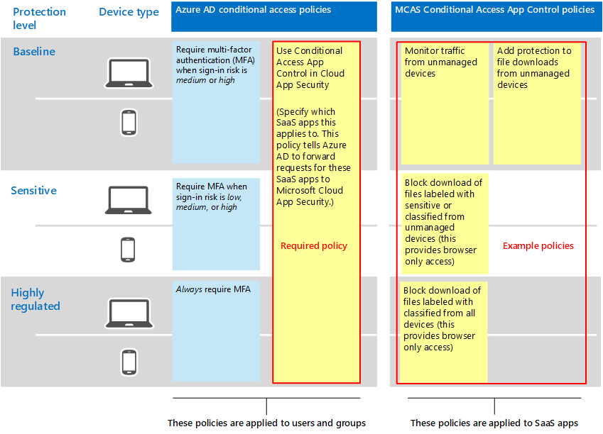

# Рекомендуемые Microsoft Cloud App Security для приложений SaaSRecommended Microsoft Cloud App Security policies for SaaS apps
Microsoft Cloud App Security создается на основе политик условного доступа Azure AD, которые позволяют в режиме реального времени контролировать и контролировать детализацию действий с приложениями SaaS, таких как блокировка скачивания, загрузки, копирования и вклеивания и печати.Microsoft Cloud App Security builds on Azure AD conditional access policies to enable real-time monitoring and control of granular actions with SaaS apps, such as blocking downloads, uploads, copy and paste, and printing. Эта функция добавляет безопасность сеансам, которые несут в себе риски, например, когда корпоративные ресурсы доступны с неугомонные устройства или гостевых пользователей.This feature adds security to sessions that carry inherent risk, such as when corporate resources are accessed from unmanaged devices or by guest users.

Microsoft Cloud App Security также интегрируется с Microsoft Information Protection, обеспечивая проверку контента в режиме реального времени для поиска конфиденциальных данных на основе типов конфиденциальной информации и меток конфиденциальности и принятия соответствующих мер.Microsoft Cloud App Security also integrates natively with Microsoft Information Protection, providing real-time content inspection to find sensitive data based on sensitive information types and sensitivity labels and to take appropriate action.

В этом руководстве содержатся рекомендации по этим сценариям:This guidance includes recommendations for these scenarios:

- Приведение приложений SaaS в управление ИТ-ресурсамиBring SaaS apps into IT management
- Настройка защиты для определенных приложений SaaSTune protection for specific SaaS apps
- Настройка предотвращения потери данных (DLP), чтобы соответствовать правилам защиты данныхConfigure data loss prevention (DLP) to help comply with data protection regulations

## Приведение приложений SaaS в управление ИТ-ресурсамиBring SaaS apps into IT management

Первым шагом к использованию Microsoft Cloud App Security для управления приложениями SaaS является обнаружение этих приложений и добавление их в клиент Azure AD.The first step in using Microsoft Cloud App Security to manage SaaS apps is to discover these and then add them to your Azure AD tenant. Если вам нужна помощь в обнаружении, см. [в справке Откройте и управляйте приложениями SaaS в сети.](/cloud-app-security/tutorial-shadow-it)If you need help with discovery, see [Discover and manage SaaS apps in your network](/cloud-app-security/tutorial-shadow-it). После обнаружения приложений добавьте их в клиент [Azure AD.](/azure/active-directory/manage-apps/add-application-portal)After you've discovered apps, [add these to your Azure AD tenant](/azure/active-directory/manage-apps/add-application-portal).

Вы можете начать управлять этими данными, делая следующее:You can begin to manage these by doing the following:

1. Сначала в Azure AD создайте новую политику условного доступа и настройте ее на "Управление приложениями условного доступа".First, in Azure AD, create a new conditional access policy and configure it to "Use Conditional Access App Control." Это перенаправляет запрос на Cloud App Security.This redirects the request to Cloud App Security. Вы можете создать одну политику и добавить все приложения SaaS в эту политику.You can create one policy and add all SaaS apps to this policy.
1. Далее в Cloud App Security создайте политики сеанса.Next, in Cloud App Security, create session policies. Создайте по одной политике для каждого необходимого управления.Create one policy for each control you want to apply.

Разрешения для приложений SaaS обычно основаны на бизнес-потребности в доступе к приложению.Permissions to SaaS apps are typically based on business need for access to the app. Эти разрешения могут быть очень динамичными.These permissions can be highly dynamic. Использование Cloud App Security обеспечивает защиту данных приложений, независимо от того, назначены ли пользователи группе Azure AD, связанной с базовой, чувствительной или строго регулируемой защитой.Using Cloud App Security policies ensures protection to app data, regardless of whether users are assigned to an Azure AD group associated with baseline, sensitive, or highly regulated protection.

Чтобы защитить данные из коллекции приложений SaaS, на следующей схеме показано, как использовать необходимую политику условного доступа Azure AD, а также предлагаемые политики, которые можно создать в Cloud App Security.To protect data across your collection of SaaS apps, the following diagram illustrates the necessary Azure AD conditional access policy plus suggested policies you can create in Cloud App Security. В этом примере политики, созданные в Cloud App Security, применяются к всем приложениям SaaS, которые вы управляете.In this example, the policies created in Cloud App Security apply to all SaaS apps you are managing. Они предназначены для применения соответствующих элементов управления в зависимости от того, управляются ли устройствами, а также меток чувствительности, которые уже применяются к файлам.These are designed to apply appropriate controls based on whether devices are managed as well as sensitivity labels that are already applied to files.

В следующей таблице перечислены новые политики условного доступа, которые необходимо создать в Azure AD.The following table lists the new conditional access policy you must create in Azure AD.

|Уровень защитыProtection level|ПолитикаPolicy|Дополнительные сведенияMore information|
|---|---|---|
|Все уровни защитыAll protection levels|[Используйте управление приложениями условного доступа в Cloud App SecurityUse Conditional Access App Control in Cloud App Security](/cloud-app-security/proxy-deployment-aad#configure-integration-with-azure-ad)|Это настраивает ваш IdP (Azure AD) для работы с Cloud App Security.This configures your IdP (Azure AD) to work with Cloud App Security.|
||||

В следующей таблице перечислены примеры политик, иллюстрированный выше, которые можно создать для защиты всех приложений SaaS.This next table lists the example policies illustrated above that you can create to protect all SaaS apps. Обязательно оцените собственные цели бизнеса, безопасности и соответствия требованиям, а затем создайте политики, которые обеспечивают наиболее соответствующую защиту для вашей среды.Be sure to evaluate your own business, security, and compliance objectives and then create policies that provide the most appropriate protection for your environment.

|Уровень защитыProtection level|ПолитикаPolicy|
|---|---|
|Базовый уровеньBaseline|Отслеживание трафика с неугодных устройствMonitor traffic from unmanaged devices 
 Добавление защиты для скачивания файлов с неугомонных устройствAdd protection to file downloads from unmanaged devices|
|КонфиденциальныйSensitive|Блокировать загрузку файлов, помеченных конфиденциальными или классифицированными с неуголовных устройств (это обеспечивает доступ только к браузеру)Block download of files labeled with sensitive or classified from unmanaged devices (this provides browser only access)|
|Строго контролируемыйHighly regulated|Блокировать загрузку файлов, помеченных классифицированными со всех устройств (это обеспечивает доступ только к браузеру)Block download of files labeled with classified from all devices (this provides browser only access)|
|||

Инструкции по настройке управления приложениями условного доступа см. в инструкции по развертыванию элементов управления приложениями условного доступа [для рекомендуемых приложений.](/cloud-app-security/proxy-deployment-aad)For end-to-end instructions for setting up Conditional Access App Control, see [Deploy Conditional Access App Control for featured apps](/cloud-app-security/proxy-deployment-aad). В этой статье вы проходите процесс создания необходимой политики условного доступа в Azure AD и тестирования приложений SaaS.This article walks you through the process of creating the necessary conditional access policy in Azure AD and testing your SaaS apps.

Дополнительные сведения см. в Microsoft Cloud App Security с управлением приложениями условного [доступа.](/cloud-app-security/proxy-intro-aad)For more information, see [Protect apps with Microsoft Cloud App Security Conditional Access App Control](/cloud-app-security/proxy-intro-aad).

## Настройка защиты для определенных приложений SaaSTune protection for specific SaaS apps

Может потребоваться применить дополнительные средства мониторинга и управления к определенным приложениям SaaS в вашей среде.You might want to apply additional monitoring and controls to specific SaaS apps in your environment. Cloud App Security позволяет выполнить это.Cloud App Security allows you to accomplish this. Например, если приложение типа Box активно используется в среде, имеет смысл применить дополнительные элементы управления.For example, if an app like Box is used heavily in your environment, it makes sense to apply additional controls. Или, если ваш юридический или финансовый отдел использует определенное приложение SaaS для конфиденциальных бизнес-данных, вы можете нацелить дополнительную защиту на эти приложения.Or, if your legal or finance department is using a specific SaaS app for sensitive business data, you can target extra protection to these apps.

Например, вы можете защитить среду Box с помощью таких типов встроенных шаблонов политики обнаружения аномалий:For example, you can protect your Box environment with these types of built-in anomaly detection policy templates:

- Действия с анонимных IP-адресов.Activity from anonymous IP addresses
- Действия из нетипичных стран.Activity from infrequent country
- Действия с подозрительных IP-адресов.Activity from suspicious IP addresses
- Неосуществимое перемещение.Impossible travel
- Действия, выполняемые прекращенным пользователем (требуется AAD в качестве IdP)Activity performed by terminated user (requires AAD as IdP)
- Обнаружение вредоносных программ.Malware detection
- Многократные неудачные попытки входа.Multiple failed login attempts
- Действия программы-шантажиста.Ransomware activity
- Рискованное приложение OauthRisky Oauth App
- Необычные действия по отправке файлов.Unusual file share activity

Вот примеры.These are examples. Регулярно добавляются дополнительные шаблоны политики.Additional policy templates are added on a regular basis. Примеры применения дополнительной защиты к определенным приложениям см. в примере [Protecting connected apps.](/cloud-app-security/protect-connected-apps)For examples of how to apply additional protection to specific apps, see [Protecting connected apps](/cloud-app-security/protect-connected-apps).

Как Cloud App Security защитить среду [Box,](/cloud-app-security/protect-box) демонстрирует типы элементов управления, которые могут помочь защитить бизнес-данные в Box и других приложениях с конфиденциальными данными.[How Cloud App Security helps protect your Box environment](/cloud-app-security/protect-box) demonstrates the types of controls that can help you protect your business data in Box and other apps with sensitive data.

## Настройка предотвращения потери данных (DLP), чтобы соответствовать правилам защиты данныхConfigure data loss prevention (DLP) to help comply with data protection regulations

Cloud App Security может быть ценным средством настройки защиты для нормативных актов соответствия требованиям.Cloud App Security can be a valuable tool for configuring protection for compliance regulations. В этом случае вы создаете определенные политики, чтобы искать конкретные данные, к которых применяется регулирование, и настраивать каждую политику для принятия соответствующих действий.In this case, you create specific policies to look for specific data that a regulation applies to and configure each policy to take appropriate action.

В следующей иллюстрации и таблице приводится несколько примеров политик, которые можно настроить, чтобы соответствовать Общему правилу защиты данных (GDPR).The following illustration and table provide several examples of policies that can be configured to help comply with  the General Data Protection Regulation (GDPR). В этих примерах политики искать конкретные данные.In these examples, policies look for specific data. В зависимости от чувствительности данных каждая политика настроена для принятия соответствующих действий.Based on the sensitivity of the data, each policy is configured to take appropriate action.

|Уровень защитыProtection level|Примеры политикExample policies|
|---|---|
|Базовый уровеньBaseline|Оповещение о том, что файлы, содержащие этот тип конфиденциальной информации (&quot;Номер кредитной карты"), делятся за пределами организации.Alert when files containing this sensitive information type ("Credit Card Number") are shared outside the organization 
 >блок скачивания файлов, содержащих этот тип конфиденциальной информации ("Номер кредитной карты") на неугодные устройства>Block downloads of files containing this sensitive information type ("Credit card number") to unmanaged devices|
|КонфиденциальныйSensitive|Защита скачивания файлов, содержащих этот тип конфиденциальной информации ("Номер кредитной карты") на управляемые устройстваProtect downloads of files containing this sensitive information type ("Credit card number") to managed devices 
 Блок скачивание файлов, содержащих этот тип конфиденциальной информации ("Номер кредитной карты") на неугодные устройстваBlock downloads of files containing this sensitive information type ("Credit card number") to unmanaged devices 
 Оповещение о том, что файл с этими меточками загружается в OneDrive для бизнеса или Box (данные клиента, кадровые ресурсы: данные о зарплате, кадровые ресурсы, данные сотрудников)Alert when a file with on of these labels is uploaded to OneDrive for Business or Box (Customer data, Human Resources: Salary Data,Human Resources, Employee data)|
|Строго контролируемыйHighly regulated|Оповещение, когда файлы с этой меткой ("Высококлассифицированные") загружаются на управляемые устройстваAlert when files with this label ("Highly classified") are downloaded to managed devices 
 Блокировать загрузку файлов с этой меткой ("Высококлассифицированные") на неугодные устройстваBlock downloads of files with this label ("Highly classified") to unmanaged devices|
|||

## Дальнейшие действияNext steps

Дополнительные сведения об использовании Cloud App Security см. в [Microsoft Cloud App Security документации.](//cloud-app-security/)For more information about using Cloud App Security, see [Microsoft Cloud App Security documentation](//cloud-app-security/).
