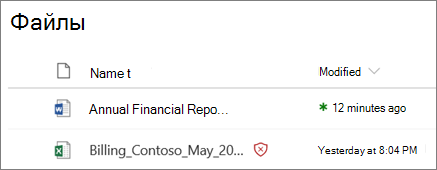
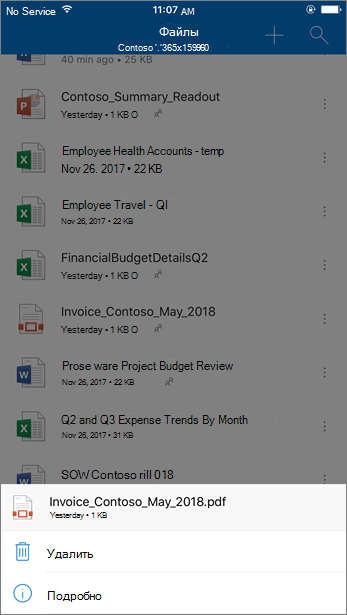
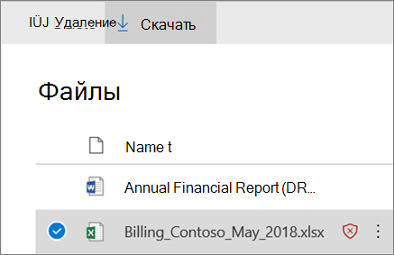

# Безопасные вложения для SharePoint, OneDrive и Microsoft TeamsSafe Attachments for SharePoint, OneDrive, and Microsoft Teams

[!INCLUDE [Microsoft 365 Defender rebranding](../includes/microsoft-defender-for-office.md)]

**Область применения****Applies to**
- [Microsoft Defender для Office 365 (план 1 и план 2)Microsoft Defender for Office 365 plan 1 and plan 2](defender-for-office-365.md)
- [Microsoft 365 DefenderMicrosoft 365 Defender](../defender/microsoft-365-defender.md)

Сейф Вложения для SharePoint, OneDrive и Microsoft Teams [в Microsoft Defender для Office 365](whats-new-in-defender-for-office-365.md) обеспечивают дополнительный уровень защиты файлов, которые уже асинхронно отсканированы обычным механизмом обнаружения вирусов в [Microsoft 365](virus-detection-in-spo.md).Safe Attachments for SharePoint, OneDrive, and Microsoft Teams in [Microsoft Defender for Office 365](whats-new-in-defender-for-office-365.md) provides an additional layer of protection for files that have already been scanned asynchronously by the [common virus detection engine in Microsoft 365](virus-detection-in-spo.md). Сейф Вложения для SharePoint, OneDrive и Microsoft Teams помогают обнаруживать и блокировать существующие файлы, идентифицированные как вредоносные на сайтах группы и библиотеках документов.Safe Attachments for SharePoint, OneDrive, and Microsoft Teams helps detect and block existing files that are identified as malicious in team sites and document libraries.

Сейф Вложения для SharePoint, OneDrive и Microsoft Teams по умолчанию не включены.Safe Attachments for SharePoint, OneDrive, and Microsoft Teams is not enabled by default. Чтобы включить его, включив Сейф вложения для [SharePoint, OneDrive и Microsoft Teams.](turn-on-mdo-for-spo-odb-and-teams.md)To turn it on, see [Turn on Safe Attachments for SharePoint, OneDrive, and Microsoft Teams](turn-on-mdo-for-spo-odb-and-teams.md).

## Как Сейф вложения для SharePoint, OneDrive и Microsoft Teams работаетHow Safe Attachments for SharePoint, OneDrive, and Microsoft Teams works

Когда Сейф вложения для SharePoint, OneDrive и Microsoft Teams и идентифицирует файл как вредоносный, файл блокируется с помощью прямой интеграции с хранилищами файлов.When Safe Attachments for SharePoint, OneDrive, and Microsoft Teams is enabled and identifies a file as malicious, the file is locked using direct integration with the file stores. На следующем изображении показан пример вредоносного файла, обнаруженного в библиотеке.The following image shows an example of a malicious file detected in a library.

Несмотря на то, что заблокированный файл по-прежнему перечислены в библиотеке документов и в веб-, мобильных или настольных приложениях, люди не могут открывать, копировать, перемещать или делиться файлом.Although the blocked file is still listed in the document library and in web, mobile, or desktop applications, people can't open, copy, move, or share the file. Но они могут удалить заблокированный файл.But they can delete the blocked file.

Вот пример того, как заблокированный файл выглядит на мобильном устройстве:Here's an example of what a blocked file looks like on a mobile device:

По умолчанию люди могут скачать заблокированный файл.By default, people can download a blocked file. Вот как выглядит загрузка заблокированного файла на мобильном устройстве:Here's what downloading a blocked file looks like on a mobile device:

SharePoint Сетевые администраторы могут запретить людям скачивать вредоносные файлы.SharePoint Online admins can prevent people from downloading malicious files. Инструкции см. в SharePoint Online PowerShell, чтобы запретить пользователям [скачивать вредоносные файлы.](turn-on-mdo-for-spo-odb-and-teams.md#step-2-recommended-use-sharepoint-online-powershell-to-prevent-users-from-downloading-malicious-files)For instructions, see [Use SharePoint Online PowerShell to prevent users from downloading malicious files](turn-on-mdo-for-spo-odb-and-teams.md#step-2-recommended-use-sharepoint-online-powershell-to-prevent-users-from-downloading-malicious-files).

Дополнительные данные о пользовательском опыте, когда файл был обнаружен как вредоносный, см. в материалах What [to do when a malicious file is found in SharePoint Online, OneDrive или Microsoft Teams.](https://support.microsoft.com/office/01e902ad-a903-4e0f-b093-1e1ac0c37ad2)To learn more about the user experience when a file has been detected as malicious, see [What to do when a malicious file is found in SharePoint Online, OneDrive, or Microsoft Teams](https://support.microsoft.com/office/01e902ad-a903-4e0f-b093-1e1ac0c37ad2).

## Просмотр сведений о вредоносных файлах, обнаруженных Сейф вложениями для SharePoint, OneDrive и Microsoft TeamsView information about malicious files detected by Safe Attachments for SharePoint, OneDrive, and Microsoft Teams

Файлы, которые определены как вредоносные Сейф вложения для SharePoint, OneDrive и Microsoft Teams будут показываться в отчетах для [Microsoft Defender](view-reports-for-mdo.md) для Office 365 и в Explorer (и обнаружения в режиме реального [времени).](threat-explorer.md)Files that are identified as malicious by Safe Attachments for SharePoint, OneDrive, and Microsoft Teams will show up in [reports for Microsoft Defender for Office 365](view-reports-for-mdo.md) and in [Explorer (and real-time detections)](threat-explorer.md).

С мая 2018 г., когда файл Сейф вложениями для SharePoint, OneDrive и Microsoft Teams, файл также доступен в карантине.As of May 2018, when a file is identified as malicious by Safe Attachments for SharePoint, OneDrive, and Microsoft Teams, the file is also available in quarantine. Дополнительные сведения см. в [материалах Управление карантинными](manage-quarantined-messages-and-files.md#use-the-microsoft-365-defender-portal-to-manage-quarantined-files-in-defender-for-office-365)файлами в Defender для Office 365.For more information, see [Manage quarantined files in Defender for Office 365](manage-quarantined-messages-and-files.md#use-the-microsoft-365-defender-portal-to-manage-quarantined-files-in-defender-for-office-365).

## Имейте в виду эти точкиKeep these points in mind

- Defender for Office 365 не будет сканировать каждый файл в SharePoint Online, OneDrive для бизнеса или Microsoft Teams.Defender for Office 365 will not scan every single file in SharePoint Online, OneDrive for Business, or Microsoft Teams. Данное поведение является особенностью продукта.This is by design. Файлы сканируют асинхронно.Files are scanned asynchronously. В этом процессе для выявления вредоносных файлов используются события совместной и гостевой активности, а также интеллектуальные heuristics и сигналы угрозы.The process uses sharing and guest activity events along with smart heuristics and threat signals to identify malicious files.

- Убедитесь, что SharePoint веб-сайты настроены для использования современного [опыта](/sharepoint/guide-to-sharepoint-modern-experience).Make sure your SharePoint sites are configured to use the [Modern experience](/sharepoint/guide-to-sharepoint-modern-experience). Защита для Office 365 применяется независимо от того, используется ли современный опыт или классическое представление; Однако визуальные индикаторы блокировки файла доступны только в современном опыте.Defender for Office 365 protection applies whether the Modern experience or the Classic view is used; however, visual indicators that a file is blocked are available only in the Modern experience.

- Сейф Вложения для SharePoint, OneDrive и Microsoft Teams являются частью общей стратегии защиты от угроз вашей организации, которая включает защиту от нежелательной почты и вредоносных программ в Exchange Online Protection (EOP), а также ссылки Сейф и Сейф вложения в Microsoft Defender для Office 365.Safe Attachments for SharePoint, OneDrive, and Microsoft Teams is part of your organization's overall threat protection strategy, which includes anti-spam and anti-malware protection in Exchange Online Protection (EOP), as well as Safe Links and Safe Attachments in Microsoft Defender for Office 365. Дополнительные дополнительные новости [см.](protect-against-threats.md)в Office 365.To learn more, see [Protect against threats in Office 365](protect-against-threats.md).
