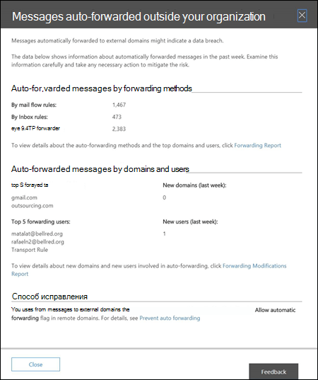

# Отчет по автоматически пересылаемым сообщениям

Отчет о **автоматических пересылках сообщений** в панели мониторинга почтовых ящиков отображает сведения о сообщениях, которые автоматически пересылаются из вашей организации Office 365 получателям во внешних доменах.

## Сведения о автоматически пересылаемых сообщениях

Если щелкнуть число сообщений в мини-приложении, отображается раскрывающаяся панель, в которой отображается состояние автоматически переадресованного сообщения. Подробные сведения можно просмотреть, щелкнув ссылку **отчет о переадресации** .

## Аналитика

На основе данных отчета создается два аналитических отчета: **новые пересылаемые пользователи** и **новые домены пересылки**. Каждый аналитический отчет содержит сводную информацию о количестве новых серверов пересылки или доменов со ссылкой на **Новый отчет о перенаправлении** , который предоставляет более подробные сведения для двух типов данных. В **новом отчете о переадресации** также отображается представление о новых действиях временной шкалы, а в таблице сведений указывается, кто начал пересылку и в какие домены.

## См. также

Для получения дополнительных сведений о других аналитиках почтовых ящиков в панели мониторинга обработки почты ознакомьтесь с разрешениями [почтовых ящиков в центре безопасности & соответствия требованиям](mail-flow-insights-v2.md).
