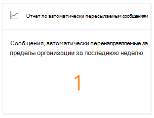

# Автоматически переадресованные сообщения в центре безопасности & соответствия требованиямAuto-forwarded messages insight in the Security & Compliance Center

[!INCLUDE [Microsoft 365 Defender rebranding](../includes/microsoft-defender-for-office.md)]

**Автоматически переадресованные сообщения** в [панели мониторинга "Направление почты](mail-flow-insights-v2.md) " в [центре безопасности & соответствия требованиям](https://protection.office.com) отображаются сведения о сообщениях, которые автоматически пересылаются из организации получателям во внешние домены.The **Auto-forwarded messages** insight in the [Mail flow dashboard](mail-flow-insights-v2.md) in the [Security & Compliance Center](https://protection.office.com) displays information about messages that are automatically forwarded from your organization to recipients in external domains.

## Сведения о автоматически пересылаемых сообщенияхAuto-forwarded messages details

Если щелкнуть число сообщений в мини-приложении, отобразится раскрывающаяся меню с дополнительными сведениями об автоматически пересылаемых сообщениях:When you click the number of messages in the widget, a flyout pane appears that shows more information about the auto-forwarded messages:

- **Автоматически переадресованные сообщения пересылаются методами пересылки** :**Auto-forwarded messages by forwarding methods** :

  - **По правилам для почтового процесса****By mail flow rules**
  - **Правила для папки "Входящие"****By Inbox rules**
  - **При пересылке SMTP** : Этот метод указывает на автоматическую пересылку, которую администраторы могут настроить для почтового ящика, как описано в разделе [Настройка переадресации электронной почты для почтового ящика](https://docs.microsoft.com/Exchange/recipients-in-exchange-online/manage-user-mailboxes/configure-email-forwarding).**By SMTP forwarding** : This method indicates automatic forwarding that admins can configure on a mailbox as described in [Configure email forwarding for a mailbox](https://docs.microsoft.com/Exchange/recipients-in-exchange-online/manage-user-mailboxes/configure-email-forwarding).
  - Ссылка на [отчет о перенаправлении](view-mail-flow-reports.md#forwarding-report) для получения дополнительных сведений.A link to the [Forwarding report](view-mail-flow-reports.md#forwarding-report) for more details.

- **Автоматически перенаправляемые сообщения доменами и пользователями** :**Auto-forwarded messages by domains and users** :

  - **5 самых популярных доменов, переадресованных****Top 5 domains forwarded to**
  - **Новые домены (за последнюю неделю)****New domains (last week)**
  - **5 Топ пользователей пересылки****Top 5 forwarding users**
  - **Новых пользователей (за последнюю неделю)****New users (last week)**
  - Ссылка на отчет об [изменениях пересылки](mfi-new-users-forwarding-email.md#forwarding-modifications-report) для получения дополнительных сведений.A link to the [Forwarding modifications report](mfi-new-users-forwarding-email.md#forwarding-modifications-report) for more details.

## АналитикаInsights

В зависимости от данных отчета создается два аналитических отчета:Two insights are generated based on the report data:

- [Новые пользователи, пересылаемые по электронной почтеNew users forwarding email](mfi-new-users-forwarding-email.md)
- [Пересылка сообщений электронной почты для новых доменовNew domains being forwarded email](mfi-new-domains-being-forwarded-email.md)

## См. такжеSee also

Сведения о других аналитиках в панели мониторинга для почтового процесса приведены в статье сведения о [почтовых сообщениях в центре безопасности & соответствия требованиям](mail-flow-insights-v2.md).For information about other insights in the Mail flow dashboard, see [Mail flow insights in the Security & Compliance Center](mail-flow-insights-v2.md).
