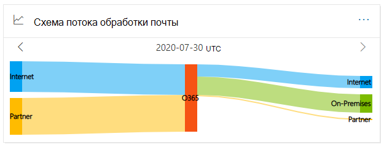
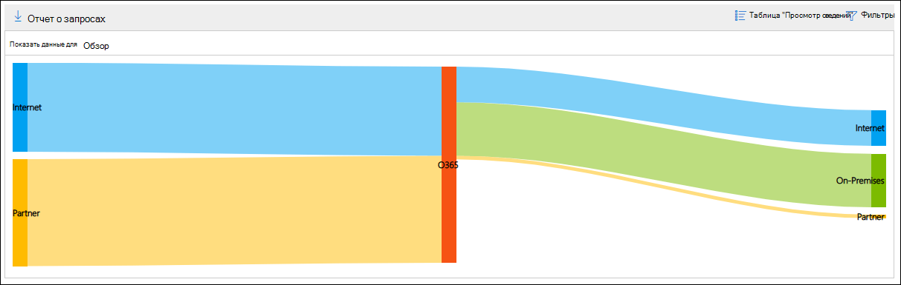
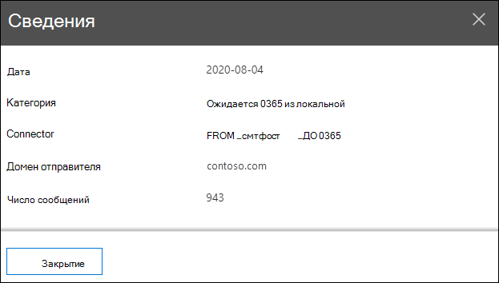

# Карта потока обработки почты в Центре & соответствия требованиямMail flow map in the Security & Compliance Center

[!INCLUDE [Microsoft 365 Defender rebranding](../includes/microsoft-defender-for-office.md)]

Карта **потока обработки почты** на  панели мониторинга потока обработки почты в Центре & соответствия требованиям позволяет понять, как почта проходит через организацию. The **Mail flow map** in the [Mail flow dashboard](mail-flow-insights-v2.md) in the [Security & Compliance Center](https://protection.office.com) gives insight as to how mail flows through your organization. Эти сведения можно использовать для получения сведений о шаблонах, выявления аномалий и устранения неполадок по мере их возникновения.You can use this information to learn patterns, identify anomalies, and fix issues as they occur.

По умолчанию мини-приложения показывает шаблон потока почты из предыдущего дня на диаграмме, известной как *схема Sankey.*By default, the widget shows the mail flow pattern from the previous day in a chart known as a *Sankey* diagram. Для показа сведений из разных дней можно использовать стрелку влево и стрелку   вправо.You can use the left arrow  and right arrow  to show information from different days. Каждый цвет представляет поток почты через разные входящие или исходящие соединители (или без использования соединители).Each different color represents mail flow over a different inbound or outbound connector (or without using connectors). Если навести курсор на определенный цвет, для этого типа соединители будет отображаться количество сообщений.If you hover over a specific color, the number of messages is displayed for that type of connector.

## Представление отчета для карты потока почтыReport view for the Mail flow map

Щелкнув **мини-виджет "Карта** потока почты", вы йдите в отчет **о карте потока почты.**Clicking on the **Mail flow map** widget will take you to the **Mail flow map** report.

В представлении отчета доступны следующие диаграммы:The following charts are available in the report view:

- **Показать данные для: обзор**: это, по сути, большее представление виджета.**Show data for: Overview**: This is basically a larger view of the widget. Если навести курсор на определенный цвет, для этого типа соединители будет отображаться количество сообщений.If you hover over a specific color, the number of messages is displayed for that type of connector.

  

- **Показать данные для: подробности :** в этом представлении показаны сведения о соединители и домены назначения.**Show data for: Detail**: This view shows details about the connectors and destination domains. В списке указаны домены верхнего отправитель и получатель, а остальные находятся в **списке "Другие".**The top sender and recipient domains are listed, and the rest are put in **Others**. Если наведите курсор на определенный цвет и раздел, отображается количество сообщений.If you hover over a specific color and section, the number of messages is displayed.

  

Если **щелкнуть "Фильтры"** в представлении отчета, можно указать диапазон дат с датой **начала** и **датой окончания.**If you click **Filters** in a report view, you can specify a date range with **Start date** and **End date**.

Чтобы отправить отчет по электронной почте для определенного диапазона дат одному или более получателям, нажмите кнопку **"Запросить загрузку".**To email the report for a specific date range to one or more recipients, click **Request download**.

Связанные сведения показаны под картой потока почты, если они доступны (например, анализ возможного почтового [цикла исправления).](mfi-mail-loop-insight.md)Related insights are shown beneath the Mail flow map if they're available (for example, the [Fix possible mail loop insight](mfi-mail-loop-insight.md)).

## Представление таблицы сведений для карты потока почтыDetails table view for the Mail flow map

Если **щелкнуть "Просмотреть таблицу сведений"** в представлении отчета, будут показаны следующие сведения:If you click **View details table** in a report view, the following information is shown:

- **Дата****Date**
- **Категория****Category**
- **Соединители / сторонний поставщик услуг****Connector / Third-party service provider**
- **Домен отправитель/получатель****Sender/Recipient domain**
- **Количество сообщений****Message count**

Если **щелкнуть "Фильтры"** в представлении таблицы сведений, можно указать диапазон дат с датой **начала** и **датой окончания.**If you click **Filters** in a details table view, you can specify a date range with **Start date** and **End date**.

Если выбрать строку, аналогичные сведения будут показаны во flyout:If you select a row, similar details are shown in a flyout:

Чтобы отправить отчет по электронной почте для определенного диапазона дат одному или более получателям, нажмите кнопку **"Запросить загрузку".**To email the report for a specific date range to one or more recipients, click **Request download**.

Чтобы вернуться в представление отчетов, щелкните **"Просмотреть отчет".**To go back to the reports view, click **View report**.

## См. такжеSee also

Сведения о других сведениях на панели мониторинга потока обработки почты см. в анализе потока обработки почты в Центре безопасности [& соответствия требованиям.](mail-flow-insights-v2.md)For information about other insights in the Mail flow dashboard, see [Mail flow insights in the Security & Compliance Center](mail-flow-insights-v2.md).
