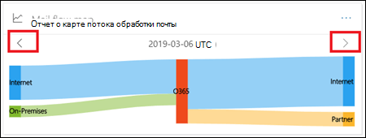
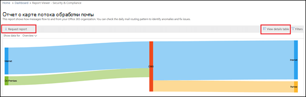

# Отчет о карте потока обработки почтыMail flow map report

Этот отчет предоставляет подробные сведения о том, как почтовые сообщения проходят через вашу организацию.This report gives insights as to how mail flows through your organization. Вы можете использовать эти сведения для изучения шаблонов, выявления аномалий и устранения проблем по мере их возникновения.You can use this information to learn patterns, identify anomalies, and fix issues as they arise.

## Мини-приложение карты почтовых ящиковMail flow map widget

По умолчанию в карте почтовых ящиков показан шаблон почтовых ящиков высокого уровня с предыдущего дня.By default, the mail flow map shows the high level mail flow pattern from the previous day. Для разных дней можно использовать стрелки влево и вправо.You can use the left and right arrows for different days. При наведении курсора мыши на каждую область в отчете будет показан объем почты в Организации и из нее, как показано на следующей схеме:Hovering your mouse cursor over each area in the report will show the volume of mail to and from your organization as shown in the following diagram:

## Основные сведения о карте почтовых ящиковMail flow map basics

Щелкнув мини-приложение **карты почтовых ящиков** , вы перейдете к отчету **карты процесса обработки почты** .Clicking on the **Mail flow map** widget will take you to the **Mail flow map** report. Вы можете увидеть более детализированный уровень отчетов, щелкнув таблица Просмотр сведений для просмотра подробных данных.Here you can see more granular level of report, you can click View details table to see detailed data. Вы также можете скачать подробный отчет, щелкнув запрос отчет.You can also download the detailed report by clicking Request report.

## СведенияDetails

По умолчанию для параметра **Показать данные** задано значение **Обзор**.By default, **Show data for** is set to the value **Overview**. Если щелкнуть раскрывающийся список и выбрать **сведения**, представление будет переключаться на сведения о уровне домена.When you click on the drop down and select **Detail**, the view switches to the domain level detail.

Отображаются домены верхнего отправителя и получателя, и остальные домены будут помещены в **другие** , как показано на следующих схемах:The top sender and recipient domains are listed, and the rest will be put in **Others** as shown in the following diagrams:

## Связанная аналитикаRelated insights

Связанные сведения отображаются под схемой почтовых процессов, если они доступны (например, для получения сведений о домене отправителя или в цикле обработки почты).Related insights are shown beneath the Mail flow map if they're available (for example, the Sender domain insight or the Mail loop insight).

## См. такжеSee also

Для получения дополнительных сведений о других аналитиках почтовых ящиков в панели мониторинга обработки почты ознакомьтесь с разрешениями [почтовых ящиков в центре безопасности & соответствия требованиям](mail-flow-insights-v2.md).For more information about other mail flow insights in the mail flow dashboard, see [Mail flow insights in the Security & Compliance Center](mail-flow-insights-v2.md).
