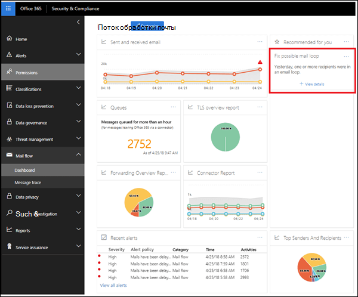

# Аналитика почтового цикла

Почтовый цикл является недопустимым, так как он создает неисправность системных ресурсов, использует квоту почтового ящика организации и отправляет исходным отправителям неправильные отчеты о недоставке (также называемые сообщениями NDR и Bounce). Эти отчеты отображаются при обнаружении почтового ящика в Организации, о почтовых доменах, участвующих в цикле, а также о количестве сообщений, отправленных с предыдущего дня в цикле.

Вы можете щелкнуть **Просмотреть сведения** , чтобы просмотреть подробные сведения в раскрывающейся области. Мы также указываем наиболее распространенные сценарии циклов и предлагаемые действия (если они доступны) для исправления цикла.

## См. также

Для получения дополнительных сведений о других аналитиках почтовых ящиков в панели мониторинга обработки почты ознакомьтесь с разрешениями [почтовых ящиков в центре безопасности & соответствия требованиям](mail-flow-insights-v2.md).
