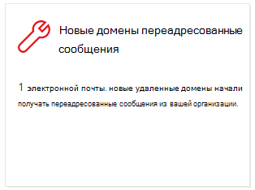
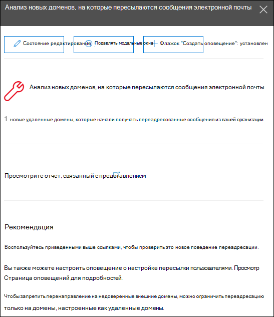

# Новые домены, перена которые перена электронная почта передается в Центре безопасности & соответствия требованиямNew domains being forwarded email insight in the Security & Compliance Center

[!INCLUDE [Microsoft 365 Defender rebranding](../includes/microsoft-defender-for-office.md)]

**Относится к****Applies to**
- [Exchange Online ProtectionExchange Online Protection](https://go.microsoft.com/fwlink/?linkid=2148611)
- [Microsoft Defender для Office 365 (план 1) и план 2Microsoft Defender for Office 365 plan 1 and plan 2](https://go.microsoft.com/fwlink/?linkid=2148715)
- [Microsoft 365 DefenderMicrosoft 365 Defender](https://go.microsoft.com/fwlink/?linkid=2118804)

Существуют допустимые бизнес-причины для переадружия сообщений электронной почты внешним получателям в определенных доменах.There are valid business reasons to forward email messages to external recipients in specific domains. Тем не менее, это подозрительно, когда пользователи в вашей организации внезапно начинают переададантовку сообщений на домен, в который никто в вашей организации никогда не переадрил сообщения (новый домен).However, it's suspicious when users in your organization suddenly start forwarding messages to a domain where no one in your organization has ever forwarded messages to (a new domain).

Это условие может указывать на то, что учетные записи пользователей скомпрометированы.This condition might indicate that the user accounts are compromised. Если вы подозреваете, что учетные записи были скомпрометированы, см. ответ на компрометации учетной [записи электронной почты.](responding-to-a-compromised-email-account.md)If you suspect the accounts have been compromised, see [Responding to a compromised email account](responding-to-a-compromised-email-account.md).

Сведения **о новых доменах,** перена которые будут перена отправляться по электронной почте в Центре безопасности и соответствия & соответствия требованиям, будут отправлять сообщения пользователям в организации на новые домены. The **New domains being forwarded email** insight in the [Security & Compliance Center](https://protection.office.com) notifies you when users in your organization are forwarding messages to new domains.

Эта информация отображается только при обнаружении проблемы и отображается на странице отчета ["Переад](view-mail-flow-reports.md#forwarding-report) сообщений".This insight appears only when the issue is detected, and it appears on the [Forwarding report](view-mail-flow-reports.md#forwarding-report) page.

При нажатии мини-приложения появится элемент, в котором можно найти дополнительные сведения о переададантных сообщениях, в том числе ссылку на отчет о [переадпорте.](view-mail-flow-reports.md#forwarding-report)When you click on the widget, a flyout appears where you can find more details about the forwarded messages, including a link back to the [Forwarding report](view-mail-flow-reports.md#forwarding-report).

Вы также можете вернуться на эту страницу  сведений при выборе статистики после нажатия кнопки "Просмотреть все в области "Лучшие **сведения&** рекомендации"**(** панель мониторинга отчетов \>  или <https://protection.office.com/insightdashboard> ).You can also get to this details page when you select the insight after you click **View all** in the **Top insights & recommendations** area on (**Reports** \> **Dashboard** or <https://protection.office.com/insightdashboard>).

Чтобы запретить автоматическую переадружение сообщений на внешние домены, настройте удаленный домен для некоторых или всех внешних доменов.To prevent automatic message forwarding to external domains, configure a remote domain for some or all external domains. Дополнительные сведения см. в под [управлением удаленных доменов в Exchange Online.](https://docs.microsoft.com/Exchange/mail-flow-best-practices/remote-domains/manage-remote-domains)For more information, see [Manage remote domains in Exchange Online](https://docs.microsoft.com/Exchange/mail-flow-best-practices/remote-domains/manage-remote-domains).

## Связанные статьиRelated topics

Сведения о других сведениях на панели мониторинга потока обработки почты см. в анализе потока обработки почты в Центре безопасности [& соответствия требованиям.](mail-flow-insights-v2.md)For information about other insights in the Mail flow dashboard, see [Mail flow insights in the Security & Compliance Center](mail-flow-insights-v2.md).
