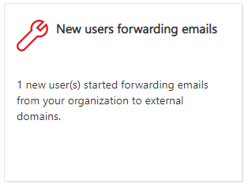
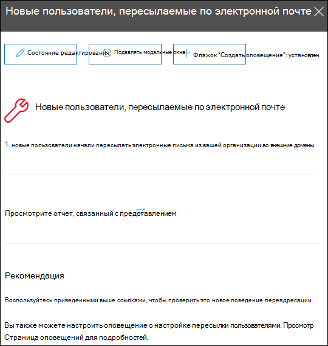
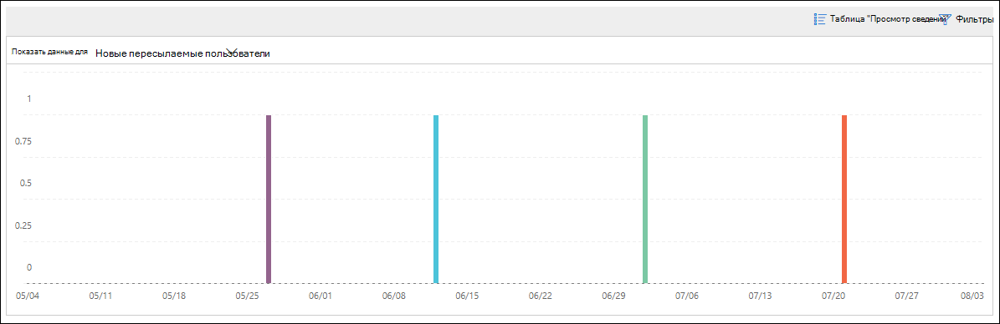

# Новые пользователи пересылают аналитику электронной почты в Центре безопасности & требованиямNew users forwarding email insight in the Security & Compliance Center

Подозрительный процесс передачи сообщений на внешние домены подозрительным.It's suspicious when new user accounts in your organization suddenly start forwarding email messages to external domains.

Новые **домены, которые пересылают электронную** почту, уведомляет вас о недавно создаваемых пользователями в организации, пересылающем сообщения на внешние домены.The **New domains being forwarded email** insight notifies you when newly-created users in your organization are forwarding messages to external domains. Это условие может указывать на компрометацию учетных записей администраторов, созданных для создания новых пользователей.This condition could indicate compromised admin accounts were used to create the new users. Если вы подозревали, что учетные записи были скомпрометированы, см. раздел ["Реагирование на компрометацию учетной записи электронной почты".](https://docs.microsoft.com/microsoft-365/security/office-365-security/responding-to-a-compromised-email-account)If you suspect the accounts have been compromised, see [Responding to a compromised email account](https://docs.microsoft.com/microsoft-365/security/office-365-security/responding-to-a-compromised-email-account).

Эта аналитика появляется только при обнаружении проблемы и отображается на странице [отчета о пересылке.](view-mail-flow-reports.md#forwarding-report)This insight appears only when the issue is detected, and it appears on the [Forwarding report](view-mail-flow-reports.md#forwarding-report) page.

Если щелкнуть мини-приложение, появляется всплывающий элемент, в котором можно получить дополнительные сведения об пересылаемых сообщениях, включая ссылку на [отчет изменений пересылки,](#forwarding-modifications-report) как описано ниже в этом разделе.When you click on the widget, a flyout appears where you can find more details about the forwarded messages, including a link to the [Forwarding modifications report](#forwarding-modifications-report) as described later in this topic.

Вы также можете попадать на эту страницу сведений при выборе аналитики после нажатия кнопки **"Просмотреть** все" **в верхней & рекомендаций** в области рекомендования (**на панели** \> **мониторинга** <https://protection.office.com/insightdashboard> или).You can also get to this details page when you select the insight after you click **View all** in the **Top insights & recommendations** area on (**Reports** \> **Dashboard** or <https://protection.office.com/insightdashboard>).

Вы можете щелкнуть **ссылку "Просмотреть отчет, связанный со аналитическим** ссылкой", чтобы перейти **к отчету "Пересылка** изменений", как описано в следующем разделе.You can click the **See report associated with insight** link to go to the **Forwarding modifications report** as described in the next section.

## Отчет об изменениях переадресацииForwarding modifications report

В **отчете об изменениях пересылки** отображаются сведения о сообщениях, которые автоматически пересылаются отправителями в вашей организации.The **Forwarding modifications report** shows details about messages that are being automatically forwarded from senders in your organization:

- создание создаваемых учетных записей, которые пересылают сообщения на внешние домены;Newly-created accounts that are forwarding messages to external domains.
- Учетные записи, которые пересылают сообщения на внешние домены, которые никогда не пересылаются другими отправителями в вашей организации.Accounts that are forwarding messages to external domains that have never been forwarded to by other senders in your organization.

Эти типы пересланных сообщений могут представлять угрозу безопасности или соответствия требованиям, а также могут указывать на компрометацию учетных записей.These types of forwarded messages can pose a security or compliance risk, and might indicate compromised accounts.

В отчете содержатся данные за период до 90 дней.The report contains data for up to 90 days. По умолчанию в отчете отображаются данные за последние 7 дней.By default, the report shows data for the last 7 days.

Этот отчет недоступен напрямую на панели [мониторинга потока обработки почты](mail-flow-insights-v2.md) или на панели [мониторинга отчетов.](view-mail-flow-reports.md)This report isn't directly available in the [Mail flow dashboard](mail-flow-insights-v2.md) or in the [Reports dashboard](view-mail-flow-reports.md). Помимо щелчка **ссылки "Просмотреть отчет",** связанного со ссылкой "Сведения о новых пользователях" в аналитическом **сведениях** для новых пользователей, вы можете просмотреть отчет по следующим ссылкам:In addition to clicking the **See report associated with insight** link in the **New users forwarding email** insight, you get to the report by:

- Щелкните ссылку **"Отчет о пересылке"** в дополнительных сведениях о новых доменах, [которые пересылают ся.](mfi-new-domains-being-forwarded-email.md)Clicking the **Forwarding notifications report** link in the details of the [New domains being forwarded email insight](mfi-new-domains-being-forwarded-email.md).
- <https://protection.office.com/reportv2?id=MailFlowNewForwarding>Открытие.Opening <https://protection.office.com/reportv2?id=MailFlowNewForwarding>.

### Представление отчета для отчета "Пересылка изменений"Report view for the Forwarding modifications report

В представлении отчета доступны следующие диаграммы:The following charts are available in the report view:

- **Показать данные для: Новые пользователи пересылки:****Show data for: New forwarding users**:

  

- **Отображение данных для: Новые домены пересылки:****Show data for: New forwarding domains**:

  

При выборе **фильтров в представлении** отчета можно указать диапазон дат с **начальной** и **конечной датами.**If you click **Filters** in a report view, you can specify a date range with **Start date** and **End date**.

### Представление таблицы подробностей для отчета "Изменения пересылки"Details table view for the Forwarding modifications report

При нажатии **кнопки "Просмотр таблицы**сведений" показанная информация зависит от диаграммы, на которую вы ищете:If you click **View details table**, the information that's shown depends on the chart you were looking at:

- **Показать данные для: Новые пользователи пересылки:****Show data for: New forwarding users**:

  - **Name**— адрес электронной почты отправителя.**Name**: The email address of the sender.
  - **Тип пересылки****Forwarding type**
  - **Адрес получателя****Recipient address**
  - **Сведения****Details**
  - **Count****Count**
  - **Дата первого переадресации****First forward date**

- **Отображение данных для: Новые домены пересылки:****Show data for: New forwarding domains**:

  - **Имя**— домен электронной почты отправителя.**Name**: The email domain of the sender.
  - **Тип пересылки****Forwarding type**
  - **Адрес получателя****Recipient address**
  - **Сведения****Details**
  - **Count****Count**
  - **Дата первого переадресации****First forward date**

При выборе **фильтров в представлении** таблицы сведений можно указать диапазон дат с **начальной** и **конечной датами.**If you click **Filters** in a details table view, you can specify a date range with **Start date** and **End date**.

При выборе строки в таблице **появится** всплывающая область "Подробно" со следующими сведениями:If you select a row from the table, a **Details** flyout appears with the following information:

- **Имя**. Это адрес электронной почты отправителя (из поля "Показать данные для: представление **новых адресованных** пользователей") или домен электронной почты отправителя (из представления **доменов для новых доменов пересылки).****Name**: This is either the sender's email address (from **Show data for: New forwarding users** view) or the sender's email domain (from **Show data for: New forwarding domains** view).
- **Тип пересылки****Forwarding type**
- **Recipient****Recipient**
- **Сведения****Details**
- **Count****Count**
- **Дата начала****Start date**
- **Рекомендации:** здесь можно щелкнуть ссылку, чтобы управлять пользователем в Центре администрирования Microsoft 365.**Recommendation**: From here, you can click the link to manage the user in the Microsoft 365 admin center.

Чтобы вернуться в представление отчетов, нажмите **кнопку "Просмотреть отчет".**To go back to the reports view, click **View report**.

## Связанные статьиRelated topics

Сведения о других аналитических данных на панели мониторинга потока обработки почты см. в статье "Аналитика потока [обработки почты" в Центре безопасности & соответствия требованиям.](mail-flow-insights-v2.md)For information about other insights in the Mail flow dashboard, see [Mail flow insights in the Security & Compliance Center](mail-flow-insights-v2.md).
