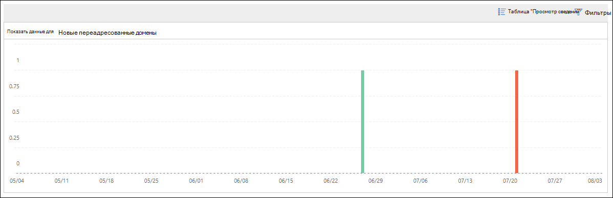

# Новые пользователи пересылает электронную почту в центре безопасности & соответствия требованиям

Она подозрительна, когда новые учетные записи пользователей в Организации неожиданно начинают пересылать сообщения электронной почты внешним доменам.

**Новые домены, пересылаемые по электронной почте** , уведомляют пользователя, когда новые пользователи в вашей организации пересылают сообщения на внешние домены. Это условие может указывать на то, что для создания новых пользователей были использованы скомпрометированные учетные записи администратора. Если вы подозреваете, что учетные записи были скомпрометированы, ознакомьтесь со [статьей ответ на скомпрометированную учетную запись электронной почты](https://docs.microsoft.com/microsoft-365/security/office-365-security/responding-to-a-compromised-email-account).

Это представление отображается только в том случае, если проблема обнаружена, и она отображается на странице [отчет о переадресации](view-mail-flow-reports.md#forwarding-report) .

Если щелкнуть мини-приложение, появится раскрывающееся меню, в котором можно найти дополнительные сведения о переадресованных сообщениях, в том числе ссылку на [отчет о переадресации](#forwarding-modifications-report) , как описано далее в этом разделе.

Кроме того, вы можете перейти к этой странице сведений при выборе команды **Просмотреть все** в верхней области сведений **& рекомендации** (**Reports** \> **панель мониторинга** отчетов или <https://protection.office.com/insightdashboard> ).

Вы можете щелкнуть ссылку **Просмотреть отчет, связанный с представлением** , чтобы перейти к **отчету об изменениях переадресации** , как описано в следующем разделе.

## Отчет о перенаправлении изменений

В **отчете пересылка изменений** отображаются сведения о сообщениях, которые автоматически пересылаются от отправителей в Организации.

- Новые учетные записи, пересылаемые сообщения на внешние домены.
- Учетные записи, которые пересылают сообщения на внешние домены, которые не были переадресованы другими отправителями в Организации.

Эти типы переадресованных сообщений могут представлять угрозу безопасности или соответствия требованиям, а также могут указывать на скомпрометированные учетные записи.

Отчет содержит данные в течение до 90 дней. По умолчанию в отчете отображаются данные за последние 7 дней.

Этот отчет недоступен непосредственно в [панели мониторинга обработки почты](mail-flow-insights-v2.md) или на [панели мониторинга отчетов](view-mail-flow-reports.md). В дополнение к щелчку ссылки **Просмотреть отчет, связанную с представлением** в статье **новые пользователи пересылает сообщение электронной почты** , вы получаете отчет по следующим адресам:

- Щелкнув ссылку **отчет о переадресации** , в разделе сведения о [перенаправляемых почтовых доменах](mfi-new-domains-being-forwarded-email.md).
- Открытие <https://protection.office.com/reportv2?id=MailFlowNewForwarding> .

### Представление отчета для отчета о перенаправлении

В представлении отчета доступны следующие диаграммы:

- **Показать данные для: новые пересылаемые пользователи**:

  

- **Показать данные для: новые домены пересылки**:

  

Если в представлении отчета щелкнуть **фильтры** , можно указать диапазон дат с **начальным** и **конечным**датами.

### Представление таблицы сведений для отчета о перенаправлении

Если щелкнуть **Таблица Просмотр сведений**, отображаемая информация зависит от диаграммы, которую Вы искали:

- **Показать данные для: новые пересылаемые пользователи**:

  - **Name**: адрес электронной почты отправителя.
  - **Тип переадресации**
  - **Адрес получателя**
  - **Сведения**
  - **Count**
  - **Дата первой пересылки**

- **Показать данные для: новые домены пересылки**:

  - **Name**: домен электронной почты отправителя.
  - **Тип переадресации**
  - **Адрес получателя**
  - **Сведения**
  - **Count**
  - **Дата первой пересылки**

Если в представлении Таблица сведений щелкнуть **фильтры** , можно указать диапазон дат с датой **начала** и **датой окончания**.

Если выбрать строку из таблицы, откроется всплывающее окно со **сведениями** со следующими сведениями:

- **Name**: адрес электронной почты отправителя ( **Показать данные для: новое перенаправление пользователей** ) или домен электронной почты отправителя ( **Показать данные для: новые домены пересылки** ).
- **Тип переадресации**
- **Recipient**
- **Сведения**
- **Count**
- **Дата начала**
- **Рекомендация**: отсюда вы можете щелкнуть ссылку для управления пользователем в центре администрирования Microsoft 365.

Чтобы вернуться к представлению отчетов, нажмите кнопку **Просмотреть отчет**.

## Статьи по теме

Сведения о других аналитиках в панели мониторинга для почтового процесса приведены в статье сведения о [почтовых сообщениях в центре безопасности & соответствия требованиям](mail-flow-insights-v2.md).
