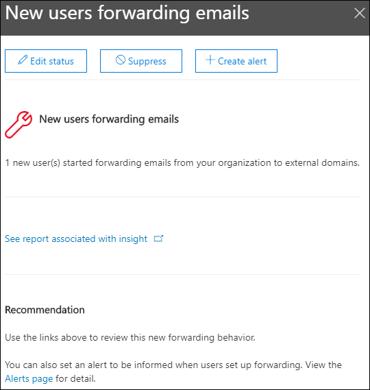

# Новые пользователи, переадлиющие данные электронной почты в Центре & соответствия требованиямNew users forwarding email insight in the Security & Compliance Center

[!INCLUDE [Microsoft 365 Defender rebranding](../includes/microsoft-defender-for-office.md)]

Это подозрительно, когда новые учетные записи пользователей в организации внезапно начинают переадружайте сообщения электронной почты на внешние домены.It's suspicious when new user accounts in your organization suddenly start forwarding email messages to external domains.

Новые **домены,** переадружающие данные электронной почты в Центре безопасности & [соответствия](https://protection.office.com) требованиям, будут извещение о том, когда только что созданные пользователи в организации переадружали сообщения на внешние домены.The **New domains being forwarded email** insight in the [Security & Compliance Center](https://protection.office.com) notifies you when newly-created users in your organization are forwarding messages to external domains. Это условие может указывать на то, что для создания новых пользователей использовались скомпрометированные учетные записи администраторов.This condition could indicate compromised admin accounts were used to create the new users. Если вы подозреваете, что учетные записи были скомпрометированы, см. ответ на компрометации учетной [записи электронной почты.](responding-to-a-compromised-email-account.md)If you suspect the accounts have been compromised, see [Responding to a compromised email account](responding-to-a-compromised-email-account.md).

Эта информация отображается только при обнаружении проблемы и отображается на странице отчета ["Переадпорт".](view-mail-flow-reports.md#forwarding-report)This insight appears only when the issue is detected, and it appears on the [Forwarding report](view-mail-flow-reports.md#forwarding-report) page.

При нажатии мини-приложения появится элемент, в котором можно найти дополнительные сведения о переададантных сообщениях, в том числе ссылку на отчет об изменениях в [forwarding,](#forwarding-modifications-report) как описано далее в этой статье.When you click on the widget, a flyout appears where you can find more details about the forwarded messages, including a link to the [Forwarding modifications report](#forwarding-modifications-report) as described later in this article.

Вы также можете вернуться на эту страницу  сведений при выборе статистики после нажатия кнопки "Просмотреть все в области "Лучшие **сведения&** рекомендации"**(** панель мониторинга отчетов \>  или <https://protection.office.com/insightdashboard> ).You can also get to this details page when you select the insight after you click **View all** in the **Top insights & recommendations** area on (**Reports** \> **Dashboard** or <https://protection.office.com/insightdashboard>).

Вы можете щелкнуть ссылку  **"Просмотр отчета, связанного** с данными", чтобы перейти к отчету об изменениях в переадэинге, как описано в следующем разделе.You can click the **See report associated with insight** link to go to the **Forwarding modifications report** as described in the next section.

## Отчет об изменениях при переададпортеForwarding modifications report

В **отчете об изменениях** в forwarding показаны сведения о сообщениях, которые автоматически переадформируются от отправителей в вашей организации:The **Forwarding modifications report** shows details about messages that are being automatically forwarded from senders in your organization:

- Вновь созданные учетные записи, которые переадружют сообщения на внешние домены.Newly-created accounts that are forwarding messages to external domains.
- Учетные записи, которые перенаправят сообщения на внешние домены, на которые никогда не переадружались другие отправителю в вашей организации.Accounts that are forwarding messages to external domains that have never been forwarded to by other senders in your organization.

Эти типы переададантных сообщений могут представлять угрозу безопасности или соответствия требованиям и указывать на компрометации учетных записей.These types of forwarded messages can pose a security or compliance risk, and might indicate compromised accounts.

Отчет содержит данные за 90 дней.The report contains data for up to 90 days. По умолчанию в отчете показаны данные за последние 7 дней.By default, the report shows data for the last 7 days.

Этот отчет не доступен напрямую на панели мониторинга потока [почты](mail-flow-insights-v2.md) или в панели [отчетов.](view-mail-flow-reports.md)This report isn't directly available in the [Mail flow dashboard](mail-flow-insights-v2.md) or in the [Reports dashboard](view-mail-flow-reports.md). Помимо нажатия отчета "Просмотр", связанного  со ссылкой **"Анализ"** в сообщении "Новые пользователи, перена которые перенабовыют данные электронной почты", к отчету можно получить:In addition to clicking the **See report associated with insight** link in the **New users forwarding email** insight, you get to the report by:

- Щелкните ссылку **отчета "Уведомления** о переададаторе" в сведениях о новых доменах, перена которые будут перена отправляться по [электронной почте.](mfi-new-domains-being-forwarded-email.md)Clicking the **Forwarding notifications report** link in the details of the [New domains being forwarded email insight](mfi-new-domains-being-forwarded-email.md).
- Открытие <https://protection.office.com/reportv2?id=MailFlowNewForwarding> .Opening <https://protection.office.com/reportv2?id=MailFlowNewForwarding>.

### Представление отчета об изменениях в переадпортеReport view for the Forwarding modifications report

В представлении отчета доступны следующие диаграммы:The following charts are available in the report view:

- **Показать данные для: новые пользователи, переадлицющие:****Show data for: New forwarding users**:

  

- **Показать данные для: новые домены переадантовки:****Show data for: New forwarding domains**:

  

Если **щелкнуть "Фильтры"** в представлении отчета, можно указать диапазон дат с датой **начала** и **датой окончания.**If you click **Filters** in a report view, you can specify a date range with **Start date** and **End date**.

### Представление таблицы сведений для отчета об изменениях переададантовDetails table view for the Forwarding modifications report

Если **щелкнуть таблицу "Просмотр** сведений", показанная информация зависит от диаграммы, на которую вы просматривали:If you click **View details table**, the information that's shown depends on the chart you were looking at:

- **Показать данные для: новые пользователи, переадлицющие:****Show data for: New forwarding users**:

  - **Name**: The email address of the sender.**Name**: The email address of the sender.
  - **Тип переад вперед****Forwarding type**
  - **Адрес получателя****Recipient address**
  - **Details****Details**
  - **Count****Count**
  - **Дата первой переададности****First forward date**

- **Показать данные для: новые домены переадантовки:****Show data for: New forwarding domains**:

  - **Name**: The email domain of the sender.**Name**: The email domain of the sender.
  - **Тип переад вперед****Forwarding type**
  - **Адрес получателя****Recipient address**
  - **Details****Details**
  - **Count****Count**
  - **Дата первой переададности****First forward date**

Если **щелкнуть "Фильтры"** в представлении таблицы сведений, можно указать диапазон дат с датой **начала** и **датой окончания.**If you click **Filters** in a details table view, you can specify a date range with **Start date** and **End date**.

Если вы выберете строку в таблице, появится flyout **Details** со следующими сведениями:If you select a row from the table, a **Details** flyout appears with the following information:

- **Name**: this is either the sender's email address (from **Show data for: New forwarding users** view) or the sender's email domain (from Show data **for: New forwarding domains** view).**Name**: This is either the sender's email address (from **Show data for: New forwarding users** view) or the sender's email domain (from **Show data for: New forwarding domains** view).
- **Тип переад вперед****Forwarding type**
- **Получатель****Recipient**
- **Details****Details**
- **Count****Count**
- **Дата начала****Start date**
- **Рекомендация.** Здесь можно щелкнуть ссылку для управления пользователем в Центре администрирования Microsoft 365.**Recommendation**: From here, you can click the link to manage the user in the Microsoft 365 admin center.

Чтобы вернуться в представление отчетов, щелкните **"Просмотреть отчет".**To go back to the reports view, click **View report**.

## Связанные статьиRelated topics

Сведения о других сведениях на панели мониторинга потока обработки почты см. в анализе потока обработки почты в Центре безопасности [& соответствия требованиям.](mail-flow-insights-v2.md)For information about other insights in the Mail flow dashboard, see [Mail flow insights in the Security & Compliance Center](mail-flow-insights-v2.md).
