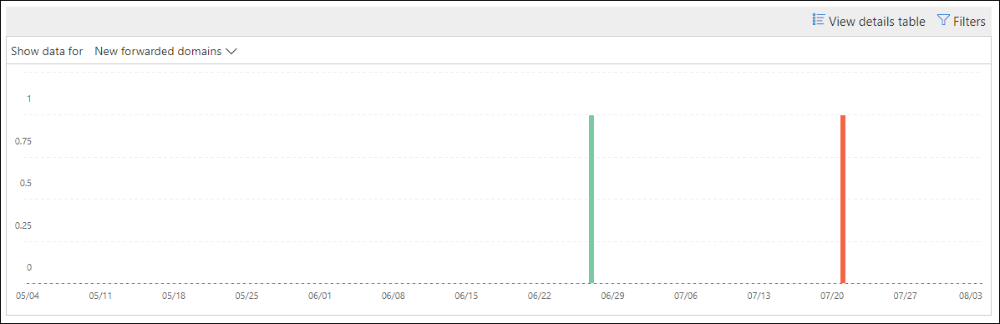

# Новые пользователи пересылает электронную почту в центре безопасности & соответствия требованиямNew users forwarding email insight in the Security & Compliance Center

[!INCLUDE [Microsoft 365 Defender rebranding](../includes/microsoft-defender-for-office.md)]

Она подозрительна, когда новые учетные записи пользователей в Организации неожиданно начинают пересылать сообщения электронной почты внешним доменам.It's suspicious when new user accounts in your organization suddenly start forwarding email messages to external domains.

**Новые домены, перенаправляемые по электронной почте** , в [центре безопасности & соответствия требованиям](https://protection.office.com) уведомляют о пересылке сообщений во внешние домены в центре безопасности соответствия требованиям.The **New domains being forwarded email** insight in the [Security & Compliance Center](https://protection.office.com) notifies you when newly-created users in your organization are forwarding messages to external domains. Это условие может указывать на то, что для создания новых пользователей были использованы скомпрометированные учетные записи администратора.This condition could indicate compromised admin accounts were used to create the new users. Если вы подозреваете, что учетные записи были скомпрометированы, ознакомьтесь со [статьей ответ на скомпрометированную учетную запись электронной почты](https://docs.microsoft.com/microsoft-365/security/office-365-security/responding-to-a-compromised-email-account).If you suspect the accounts have been compromised, see [Responding to a compromised email account](https://docs.microsoft.com/microsoft-365/security/office-365-security/responding-to-a-compromised-email-account).

Это представление отображается только в том случае, если проблема обнаружена, и она отображается на странице [отчет о переадресации](view-mail-flow-reports.md#forwarding-report) .This insight appears only when the issue is detected, and it appears on the [Forwarding report](view-mail-flow-reports.md#forwarding-report) page.

Если щелкнуть мини-приложение, появится раскрывающееся меню, в котором можно найти дополнительные сведения о переадресованных сообщениях, в том числе ссылку на [отчет о переадресации](#forwarding-modifications-report) , как описано далее в этом разделе.When you click on the widget, a flyout appears where you can find more details about the forwarded messages, including a link to the [Forwarding modifications report](#forwarding-modifications-report) as described later in this topic.

Кроме того, вы можете перейти к этой странице сведений при выборе команды **Просмотреть все** в верхней области сведений **& рекомендации** ( **Reports** \> **панель мониторинга** отчетов или <https://protection.office.com/insightdashboard> ).You can also get to this details page when you select the insight after you click **View all** in the **Top insights & recommendations** area on ( **Reports** \> **Dashboard** or <https://protection.office.com/insightdashboard>).

Вы можете щелкнуть ссылку **Просмотреть отчет, связанный с представлением** , чтобы перейти к **отчету об изменениях переадресации** , как описано в следующем разделе.You can click the **See report associated with insight** link to go to the **Forwarding modifications report** as described in the next section.

## Отчет о перенаправлении измененийForwarding modifications report

В **отчете пересылка изменений** отображаются сведения о сообщениях, которые автоматически пересылаются от отправителей в Организации.The **Forwarding modifications report** shows details about messages that are being automatically forwarded from senders in your organization:

- Новые учетные записи, пересылаемые сообщения на внешние домены.Newly-created accounts that are forwarding messages to external domains.
- Учетные записи, которые пересылают сообщения на внешние домены, которые не были переадресованы другими отправителями в Организации.Accounts that are forwarding messages to external domains that have never been forwarded to by other senders in your organization.

Эти типы переадресованных сообщений могут представлять угрозу безопасности или соответствия требованиям, а также могут указывать на скомпрометированные учетные записи.These types of forwarded messages can pose a security or compliance risk, and might indicate compromised accounts.

Отчет содержит данные в течение до 90 дней.The report contains data for up to 90 days. По умолчанию в отчете отображаются данные за последние 7 дней.By default, the report shows data for the last 7 days.

Этот отчет недоступен непосредственно в [панели мониторинга обработки почты](mail-flow-insights-v2.md) или на [панели мониторинга отчетов](view-mail-flow-reports.md).This report isn't directly available in the [Mail flow dashboard](mail-flow-insights-v2.md) or in the [Reports dashboard](view-mail-flow-reports.md). В дополнение к щелчку ссылки **Просмотреть отчет, связанную с представлением** в статье **новые пользователи пересылает сообщение электронной почты** , вы получаете отчет по следующим адресам:In addition to clicking the **See report associated with insight** link in the **New users forwarding email** insight, you get to the report by:

- Щелкнув ссылку **отчет о переадресации** , в разделе сведения о [перенаправляемых почтовых доменах](mfi-new-domains-being-forwarded-email.md).Clicking the **Forwarding notifications report** link in the details of the [New domains being forwarded email insight](mfi-new-domains-being-forwarded-email.md).
- Открытие <https://protection.office.com/reportv2?id=MailFlowNewForwarding> .Opening <https://protection.office.com/reportv2?id=MailFlowNewForwarding>.

### Представление отчета для отчета о перенаправленииReport view for the Forwarding modifications report

В представлении отчета доступны следующие диаграммы:The following charts are available in the report view:

- **Показать данные для: новые пересылаемые пользователи** :**Show data for: New forwarding users** :

  

- **Показать данные для: новые домены пересылки** :**Show data for: New forwarding domains** :

  

Если в представлении отчета щелкнуть **фильтры** , можно указать диапазон дат с **начальным** и **конечным** датами.If you click **Filters** in a report view, you can specify a date range with **Start date** and **End date**.

### Представление таблицы сведений для отчета о перенаправленииDetails table view for the Forwarding modifications report

Если щелкнуть **Таблица Просмотр сведений** , отображаемая информация зависит от диаграммы, которую Вы искали:If you click **View details table** , the information that's shown depends on the chart you were looking at:

- **Показать данные для: новые пересылаемые пользователи** :**Show data for: New forwarding users** :

  - **Name** : адрес электронной почты отправителя.**Name** : The email address of the sender.
  - **Тип переадресации****Forwarding type**
  - **Адрес получателя****Recipient address**
  - **Details****Details**
  - **Count****Count**
  - **Дата первой пересылки****First forward date**

- **Показать данные для: новые домены пересылки** :**Show data for: New forwarding domains** :

  - **Name** : домен электронной почты отправителя.**Name** : The email domain of the sender.
  - **Тип переадресации****Forwarding type**
  - **Адрес получателя****Recipient address**
  - **Details****Details**
  - **Count****Count**
  - **Дата первой пересылки****First forward date**

Если в представлении Таблица сведений щелкнуть **фильтры** , можно указать диапазон дат с датой **начала** и **датой окончания**.If you click **Filters** in a details table view, you can specify a date range with **Start date** and **End date**.

Если выбрать строку из таблицы, откроется всплывающее окно со **сведениями** со следующими сведениями:If you select a row from the table, a **Details** flyout appears with the following information:

- **Name** : адрес электронной почты отправителя ( **Показать данные для: новое перенаправление пользователей** ) или домен электронной почты отправителя ( **Показать данные для: новые домены пересылки** ).**Name** : This is either the sender's email address (from **Show data for: New forwarding users** view) or the sender's email domain (from **Show data for: New forwarding domains** view).
- **Тип переадресации****Forwarding type**
- **Recipient****Recipient**
- **Details****Details**
- **Count****Count**
- **Дата начала****Start date**
- **Рекомендация** : отсюда вы можете щелкнуть ссылку для управления пользователем в центре администрирования Microsoft 365.**Recommendation** : From here, you can click the link to manage the user in the Microsoft 365 admin center.

Чтобы вернуться к представлению отчетов, нажмите кнопку **Просмотреть отчет**.To go back to the reports view, click **View report**.

## Статьи по темеRelated topics

Сведения о других аналитиках в панели мониторинга для почтового процесса приведены в статье сведения о [почтовых сообщениях в центре безопасности & соответствия требованиям](mail-flow-insights-v2.md).For information about other insights in the Mail flow dashboard, see [Mail flow insights in the Security & Compliance Center](mail-flow-insights-v2.md).
