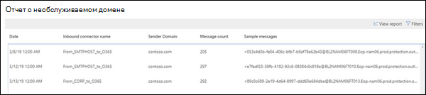
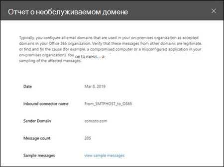

# Отчет о необслуживаемом домене

Как и в случае с **доменом отправителя** , **неодобренный Доменная** информация идентифицирует сообщения из локальной организации электронной почты, но домен отправителя не настроен в качестве обслуживаемого домена в Организации.

Microsoft 365 может регулировать эти сообщения, если у нас есть данные для подтверждения того, что назначение этих сообщений является вредоносным. Поэтому важно понимать, что происходит и как устранить проблему.

Если щелкнуть мини-приложение, вы перейдете к полному отчету. В полном отчете, где можно щелкнуть **Просмотреть сведения** , чтобы просмотреть сведения в таблице, как показано на следующей схеме:

Когда вы выбираете строку в таблице, в всплывающем меню появятся дополнительные сведения. Вы можете щелкнуть **Просмотреть примеры сообщений** , чтобы увидеть некоторые из идентифицированных сообщений.

## Статьи по теме

Для получения дополнительных сведений о других аналитиках почтовых ящиков в панели мониторинга обработки почты ознакомьтесь с разрешениями [почтовых ящиков в центре безопасности & соответствия требованиям](mail-flow-insights-v2.md).
