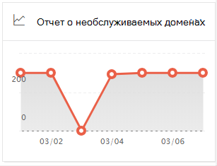
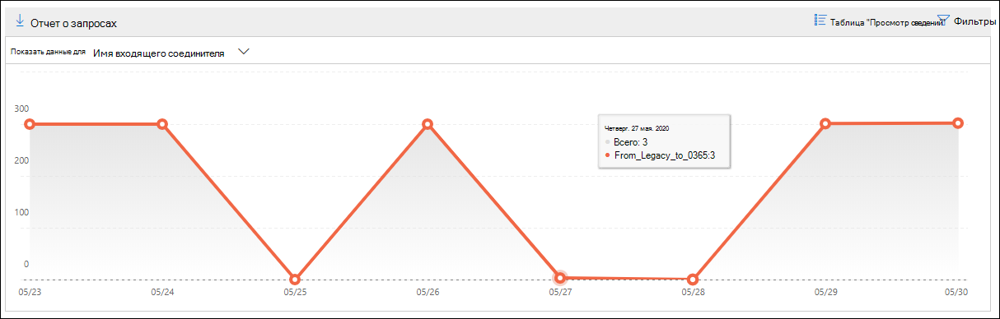
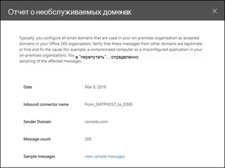

# Отчет о необслуживаемом домене в центре безопасности & соответствия требованиямNon-accepted domain report in the Security & Compliance Center

Отчет о **непринятом домене** в [панели мониторинга "почтовый](mail-flow-insights-v2.md) индекс" в [центре безопасности & соответствия требованиям](https://protection.office.com) отображает сведения об сообщениях из локальной организации электронной почты, в которых домен отправителя не настроен как обслуживаемый домен в организации Microsoft 365.The **Non-accepted domain** report in the [Mail flow dashboard](mail-flow-insights-v2.md) in the [Security & Compliance Center](https://protection.office.com) displays information about messages from your on-premises email organization where the sender's domain isn't configured as an accepted domain in your Microsoft 365 organization.

Microsoft 365 может регулировать эти сообщения, если у нас есть данные для подтверждения того, что назначение этих сообщений является вредоносным.Microsoft 365 might throttle these messages if we have data to prove that the intent of these messages is malicious. Поэтому важно понимать, что происходит и как устранить проблему.Therefore, it's important for you to understand what's happening and to fix the issue.

## Представление отчета для отчета о непринятом доменеReport view for the Non-accepted domain report

Если щелкнуть диаграмму в мини **-приложении необслуживаемого домена** , вы перейдете к отчету о **непринятом домене** .Clicking the chart on the **Non-accepted domain** widget will take you to the **Non-accepted domain** report.

По умолчанию отображается действие для всех затронутых соединителей.By default, the activity for all affected connectors is shown. Если нажать кнопку **Показать данные для**, вы можете выбрать конкретный соединитель из раскрывающегося списка.If you click **Show data for**, you can select a specific connector from the dropdown.

При наведении курсора на точку данных (день) на диаграмме отображается общее число сообщений для соединителя.If you hover over a data point (day) in the chart, you'll see the total number of messages for the connector.

## Представление таблицы сведений для отчета о непринятом доменеDetails table view for the Non-accepted domain report

Если в представлении отчета выбрать **Таблица Просмотр сведений** , отображаются следующие сведения:If you click **View details table** in a report view, the following information is shown:

- **Date****Date**
- **Имя входящего соединителя****Inbound connector name**
- **Домен отправителя****Sender domain**
- **Количество сообщений****Message count**
- **Примеры сообщений**: идентификаторы сообщений с примерами затронутых сообщений.**Sample messages**: The message IDs of a sample of affected messages.

Если в представлении Таблица сведений щелкнуть **фильтры** , можно указать диапазон дат с датой **начала** и **датой окончания**.If you click **Filters** in a details table view, you can specify a date range with **Start date** and **End date**.

Чтобы отправить отчет по определенному диапазону дат одному или нескольким получателям, щелкните **запросить скачивание**.To email the report for a specific date range to one or more recipients, click **Request download**.

При выборе строки в таблице появляется раскрывающееся меню со следующими сведениями:When you select a row in the table, a flyout appears with the following information:

- **Date****Date**
- **Имя входящего соединителя****Inbound connector name**
- **Домен отправителя****Sender domain**
- **Количество сообщений****Message count**
- **Примеры сообщений**: вы можете щелкнуть **Просмотреть примеры сообщений** , чтобы просмотреть результаты [трассировки сообщений](message-trace-scc.md) для примера затронутых сообщений.**Sample messages**: You can click **View sample messages** to see the [message trace](message-trace-scc.md) results for a sample of the affected messages.

Чтобы вернуться к представлению отчетов, нажмите кнопку **Просмотреть отчет**.To go back to the reports view, click **View report**.

## Статьи по темеRelated topics

Сведения о других аналитиках в панели мониторинга для почтового процесса приведены в статье сведения о [почтовых сообщениях в центре безопасности & соответствия требованиям](mail-flow-insights-v2.md).For information about other insights in the Mail flow dashboard, see [Mail flow insights in the Security & Compliance Center](mail-flow-insights-v2.md).
