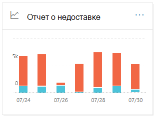
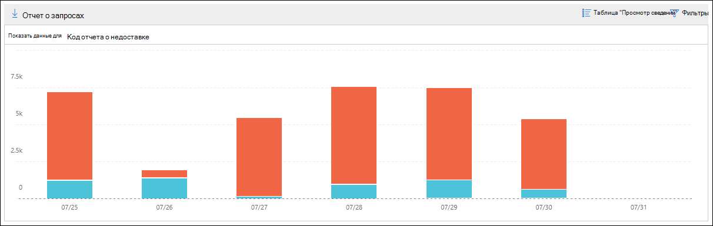
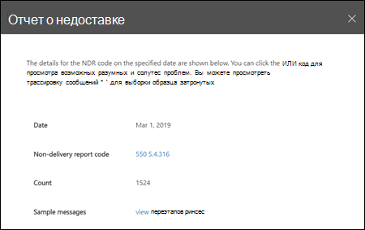

# Отчет о недоставке в центре безопасности & соответствия требованиям

**Отчет о недоставке** в [панели мониторинга "почтовый ящик](mail-flow-insights-v2.md) " в центре безопасности & соответствия требованиям показывает наиболее часто встречающиеся коды ошибок в отчетах о недоставке (также известных как отчеты о недоставке или сообщениях Bounce) для пользователей в Организации. В этом отчете представлены сведения о отчетах о недоставке для устранения проблем с доставкой электронной почты.

## Представление отчета для отчета о недоставке

Если щелкнуть мини **-приложение отчета о недоставке** , вы перейдете к **отчету о недоставке**.

По умолчанию отображается действие для всех кодов ошибок. Если нажать кнопку **Показать данные для**, вы можете выбрать определенный код ошибки из раскрывающегося меню.

При наведении указателя на определенный цвет (код ошибки) в определенный день на диаграмме отображается общее количество сообщений об ошибке.

## Представление таблицы сведений для отчета о недоставке

Если в представлении отчета выбрать **Таблица Просмотр сведений** , отображаются следующие сведения:

- **Date**
- **Код отчета о недоставке**
- **Count**
- **Примеры сообщений**: идентификаторы сообщений с примерами затронутых сообщений.

Если в представлении Таблица сведений щелкнуть **фильтры** , можно указать диапазон дат с датой **начала** и **датой окончания**.

Чтобы отправить отчет по определенному диапазону дат одному или нескольким получателям, щелкните **запросить скачивание**.

При выборе строки в таблице появляется раскрывающееся меню со следующими сведениями:

- **Date**
- **Код отчета о недоставке**: вы можете щелкнуть ссылку, чтобы найти дополнительные сведения о причинах и решениях для конкретного кода ошибки.
- **Count**
- **Примеры сообщений**: вы можете щелкнуть **Просмотреть примеры сообщений** , чтобы просмотреть результаты [трассировки сообщений](message-trace-scc.md) для примера затронутых сообщений.

## Статьи по теме

Сведения о других аналитиках в панели мониторинга для почтового процесса приведены в статье сведения о [почтовых сообщениях в центре безопасности & соответствия требованиям](mail-flow-insights-v2.md).
