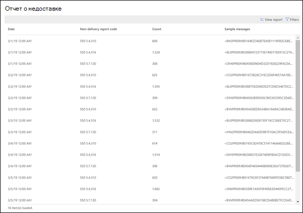
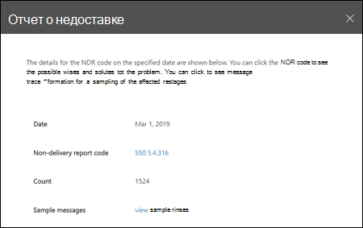

# Отчет о недоставке

В **отчете о недоставке** отображаются наиболее часто встречающиеся коды ошибок в отчетах о недоставке (которые также называют сообщениями о недоставке или сообщениях Bounce) для пользователей в вашей организации. Этот отчет предназначен для отображения подробных сведений о отчетах о недоставке, чтобы можно было устранять неполадки.

Вы можете отобразить информацию для всех кодов отчета о недоставке или определенного кода, нажав **Показать данные для**. Вы также можете щелкнуть **Таблица просмотреть сведения** , чтобы просмотреть более подробное представление, как показано на следующей схеме:

При выборе строки в таблице для просмотра сведений об определенном отчете о недоставке можно использовать подробные сведения для устранения и выполнения необходимых действий.

## Статьи по теме

Для получения дополнительных сведений о других аналитиках почтовых ящиков в панели мониторинга обработки почты ознакомьтесь с разрешениями [почтовых ящиков в центре безопасности & соответствия требованиям](mail-flow-insights-v2.md).
