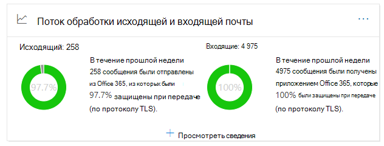
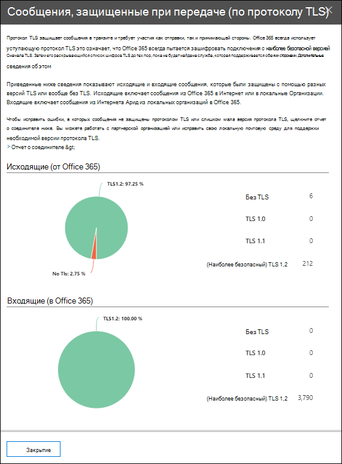

# Представление о потоке исходящие и входящие сообщения в Центре & безопасностиOutbound and inbound mail flow insight in the Security & Compliance Center

[!INCLUDE [Microsoft 365 Defender rebranding](../includes/microsoft-defender-for-office.md)]

**Область применения****Applies to**
- [Exchange Online ProtectionExchange Online Protection](exchange-online-protection-overview.md)
- [Microsoft Defender для Office 365 (план 1 и план 2)Microsoft Defender for Office 365 plan 1 and plan 2](defender-for-office-365.md)
- [Microsoft 365 DefenderMicrosoft 365 Defender](../defender/microsoft-365-defender.md)

Анализ **потока** исходящие и входящие  сообщения в  панели мониторинга потока почты в Центре соответствия требованиям & безопасности объединяет сведения из отчета [Connector](view-mail-flow-reports.md#connector-report) и бывшего отчета об обзоре **TLS** в одном месте.The **Outbound and inbound mail flow** insight in the [Mail flow dashboard](mail-flow-insights-v2.md) in the [Security & Compliance Center](https://protection.office.com) combines the information from the [Connector report](view-mail-flow-reports.md#connector-report) and the former **TLS overview report** in one place.

Виджет отображает шифрование TLS, которое используется для подключения при доставке сообщений в организацию и из нее.The widget displays the TLS encryption that's used for the connection when messages are delivered to and from your organization. Подключения, установленные с другими службами электронной почты, шифруются TLS, когда TLS предлагается обеими сторонами.The connections that are established with other email services are encrypted by TLS when TLS is offered by both sides. Виджет предлагает снимок последней недели потока почты.The widget offers a snapshot of the last week of mail flow.

Сведения в виджете связаны с соединиттелями и защитой сообщений TLS в Microsoft 365.The information in the widget is related to connectors and TLS message protection in Microsoft 365. Дополнительные сведения см. в следующих статьях:For more information, see these topics:

- [Настройка потока почты с помощью соединителиConfigure mail flow using connectors](/exchange/mail-flow-best-practices/use-connectors-to-configure-mail-flow/use-connectors-to-configure-mail-flow)
- [Использование протокола TLS службой Exchange Online для защиты электронной почтыHow Exchange Online uses TLS to secure email connections](../../compliance/exchange-online-uses-tls-to-secure-email-connections.md)
- [Технические справочные сведения о шифровании в Microsoft 365Technical reference details about encryption in Microsoft 365](../../compliance/technical-reference-details-about-encryption.md)

## Сообщение, защищенное при транзите (по TLS)Message protected in transit (by TLS)

При нажатии кнопки **Просмотр** сведений на виджете в сообщении, защищенном при транзите **(tLS),** показана защита TLS для сообщений, въехающих и покидающих организацию.When you click **View Details** on the widget, the **Message protected in transit (by TLS)** flyout shows you the TLS protection for messages entering and leaving your organization.

В настоящее время TLS 1.2 является самой безопасной версией TLS, которую предлагает Microsoft 365.Currently, TLS 1.2 is the most secure version of TLS that's offered by Microsoft 365. Часто необходимо знать шифрование TLS, которое используется для аудита соответствия требованиям.Often, you'll need to know the TLS encryption that's being used for compliance audits. Вы, вероятно, не имеете прямых связей с большинством серверов электронной почты источника и назначения (они у вас не принадлежат, и microsoft не принадлежат), поэтому у вас нет много вариантов для улучшения шифрования TLS, которое используется на этих серверах.You probably don't have a direct relationship with most of the source and destination email servers (you don't own them, and neither does Microsoft), so you don't have many options to improve the TLS encryption that's used by those servers.

Но соединители  можно использовать для обеспечения наилучшей доступной защиты TLS для сообщений, отправленных между серверами электронной почты и Microsoft 365.But, you can use [connectors](/exchange/mail-flow-best-practices/use-connectors-to-configure-mail-flow/use-connectors-to-configure-mail-flow) to ensure the best available TLS protection for messages that are sent between your email servers and Microsoft 365. Поток почты между Microsoft 365 и вашими собственными серверами электронной почты или серверами, принадлежащими вашим партнерам, часто более важен и чувствителен, чем обычные сообщения, поэтому к этим сообщениям необходимо применять дополнительную безопасность и бдительность.Mail flow between Microsoft 365 and your own email servers or servers that belong to your partners is often more important and sensitive than regular messages, so you'll want to apply extra security and vigilance to those messages.

Вы можете обновить или исправить собственные серверы электронной почты для улучшения шифрования TLS, которое используется, или связаться с партнерами, чтобы сделать то же самое.You can upgrade or fix your own email servers to improve the TLS encryption that's being used, or reach out to your partners to do the same. Отчет **Соединительщика** отображает как объем потока почты, так и шифрование TLS для сообщений, которые используют соединители Microsoft 365.The **Connector Report** displays both mail flow volume and TLS encryption for messages that use your Microsoft 365 connectors.

Чтобы перейти к отчету **Connector,** вы можете нажать ссылку на [отчет Connector.](view-mail-flow-reports.md#connector-report)You can click the **Connector report** link to go to the [Connector report](view-mail-flow-reports.md#connector-report). Следующие сведения могут быть доступны на странице **отчета Connector,** если обнаружено связанное условие:The following insights might be available on the **Connector report** page if the associated condition has been detected:

- **Соединитель входящий партнер видит значительный поток почты TLS1.0****Inbound Partner connector seeing significant TLS1.0 mail flow**
- **Входящий соединитель OnPremises видит значительный поток почты TLS1.0****Inbound OnPremises connector seeing significant TLS1.0 mail flow**

Для подключений TLS 1.0 необходимо обновить или исправить сервер электронной почты или сервер вашего партнера, чтобы избежать проблем, когда поддержка TLS 1.0 в Microsoft 365 в конечном итоге будет обесценяться.For TLS 1.0 connections, you really need to get your email server or your partner's server upgraded or fixed to avoid any issues when TLS 1.0 support is eventually deprecated in Microsoft 365.

## См. такжеSee also

Сведения о других сведениях в панели мониторинга потока почты см. в странице Анализ потока почты в Центре [& соответствия](mail-flow-insights-v2.md)требованиям.For information about other insights in the Mail flow dashboard, see [Mail flow insights in the Security & Compliance Center](mail-flow-insights-v2.md).