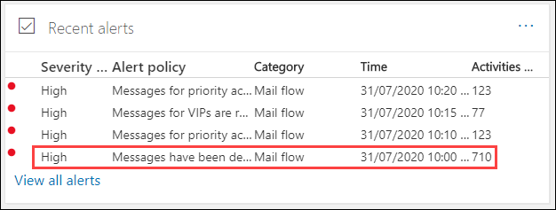
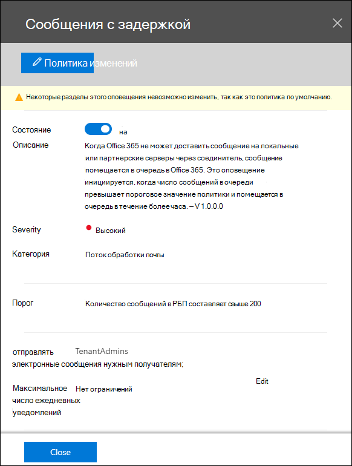
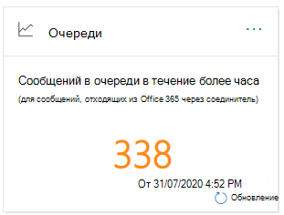
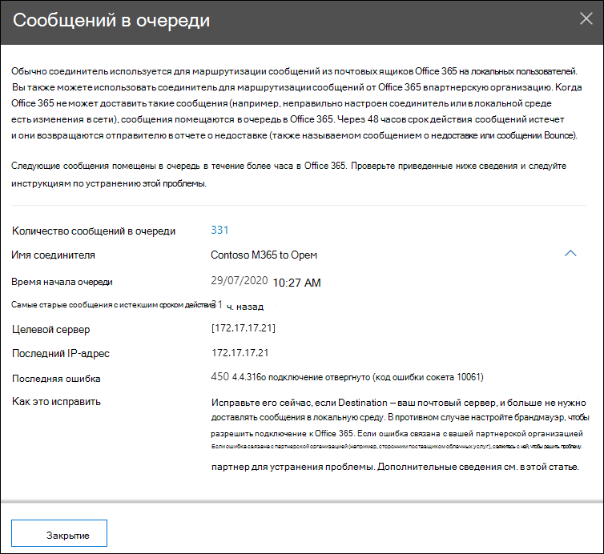
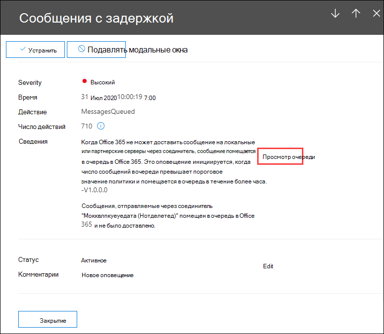

# Анализ очередей в Центре & безопасностиQueues insight in the Security & Compliance Center

[!INCLUDE [Microsoft 365 Defender rebranding](../includes/microsoft-defender-for-office.md)]

**Область применения****Applies to**
- [Exchange Online ProtectionExchange Online Protection](exchange-online-protection-overview.md)
- [Microsoft Defender для Office 365 (план 1 и план 2)Microsoft Defender for Office 365 plan 1 and plan 2](defender-for-office-365.md)
- [Microsoft 365 DefenderMicrosoft 365 Defender](../defender/microsoft-365-defender.md)

Когда сообщения не могут отправляться из организации на локальном или партнером серверах электронной почты с помощью соединителок, эти сообщения выстрояются в очередь в Microsoft 365.When messages can't be sent from your organization to your on-premises or partner email servers using connectors, the messages are queued in Microsoft 365. Распространенные примеры, которые вызывают это условие:Common examples that cause this condition are:

- Соединителю некорректно настроен.The connector is incorrectly configured.
- В локальной среде произошли изменения сетевого или брандмауэра.There have been networking or firewall changes in your on-premises environment.

Microsoft 365 будет продолжать повторить доставку в течение 24 часов.Microsoft 365 will continue to retry to delivery for 24 hours. По истечении 24 часов срок действия сообщений истекает, и они будут возвращены отправителям в отчетах о невывозе (также известных как NDRs или отказов).After 24 hours, the messages will expire and will be returned to the senders in non-delivery reports (also known as a NDRs or bounce messages).

Если объем электронной почты в очереди превышает заранее определенный порог (значение по умолчанию составляет 200 сообщений), сведения доступны в следующих расположениях:If the queued email volume exceeds the pre-defined threshold (the default value is 200 messages), the information is available in the following locations:

- Представление **о очередях** в [панели](mail-flow-insights-v2.md) мониторинга потока почты в Центре [& безопасности.](https://protection.office.com)The **Queues** insight in the [Mail flow dashboard](mail-flow-insights-v2.md) in the [Security & Compliance Center](https://protection.office.com). Дополнительные сведения см. в разделе ["Очереди" в разделе Панель](#queues-insight-in-the-mail-flow-dashboard) мониторинга потока почты в этой статье.For more information, see the [Queues insight in the Mail flow dashboard](#queues-insight-in-the-mail-flow-dashboard) section in this article.

- Оповещение отображается в **последних** оповещениях панели оповещений в Центре [&](https://protection.office.com) безопасности **(Панель** оповещений \>  или <https://protection.office.com/alertsdashboard> ).An alert is displayed in **Recent alerts** the Alerts dashboard in the [Security & Compliance Center](https://protection.office.com) (**Alerts** \> **Dashboard** or <https://protection.office.com/alertsdashboard>).

  

- Администраторы получат уведомление по электронной почте в зависимости от конфигурации политики оповещения по умолчанию с именем **Сообщения были отложены**.Admins will receive an email notification based on the configuration of the default alert policy named **Messages have been delayed**. Чтобы настроить параметры уведомлений для этого оповещения, см. в следующем разделе.To configure the notification settings for this alert, see the next section.

  Дополнительные сведения о политиках оповещений см. в центре оповещения в центре [& безопасности.](../../compliance/alert-policies.md)For more information about alert policies, see [Alert policies in the Security & Compliance Center](../../compliance/alert-policies.md).

## Настройка оповещений очередиCustomize queue alerts

1. В Центре [& безопасности](https://protection.office.com)перейдите к политикам **оповещения** оповещений или \>  откройте <https://protection.office.com/alertpolicies> .In the [Security & Compliance Center](https://protection.office.com), go to **Alerts** \> **Alert policies** or open <https://protection.office.com/alertpolicies>.

2. На странице **Политики оповещения** поиск и выбор политики с именем **Сообщения отложены.**On the **Alert policies** page, find and select the policy named **Messages have been delayed**.

3. В **открываемом** вылете Сообщение было отложено, можно включить или отключить оповещение и настроить параметры уведомлений.In the **Message have been delayed** flyout that opens, you can turn the alert on or off and configure the notification settings.

   

   - **Состояние.** Вы можете отключить или отключить оповещение.**Status**: You can toggle the alert on or off.

   - **Получатели электронной почты** и ограничение ежедневных **уведомлений:** нажмите **кнопку Изменить,** чтобы настроить следующие параметры:**Email recipients** and **Daily notification limit**: Click **Edit** to configure the following settings:

4. Чтобы настроить параметры уведомлений, нажмите **кнопку Изменить**.To configure the notification settings, click **Edit**. В **вылете политики** редактирования, которая появится, настройте следующие параметры:In the **Edit policy** flyout that appears, configure the following settings:

   - **Отправка уведомлений электронной** почты: значение по умолчанию в режиме.**Send email notifications**: The default value is on.
   - **Получатели электронной почты:** по умолчанию значение **TenantAdmins**.**Email recipients**: The default value is **TenantAdmins**.
   - **Ежедневное ограничение** уведомлений. Значение по умолчанию **не является ограничением**.**Daily notification limit**: The default value is **No limit**.
   - **Пороговое** значение: значение по умолчанию — 200.**Threshold**: The default value is 200.

   

5. По завершению нажмите кнопку **Сохранить и** **Закрыть**.When you're finished, click **Save** and **Close**.

## Представление очередей в панели мониторинга потока почтыQueues insight in the Mail flow dashboard

Даже если объем сообщений в очереди не превысил пороговое значение и  не вызвал  оповещений, вы можете использовать представление очередей в панели мониторинга потока почты, чтобы увидеть сообщения, которые были в очереди более одного часа, и принять меры до того, как число очередных сообщений станет слишком большим.Even if the queued message volume hasn't exceeded the threshold and generated an alert, you can still use the **Queues** insight in the [Mail flow dashboard](mail-flow-insights-v2.md) to see messages that have been queued for more than one hour, and take action before the number of queued messages becomes too large.

Если щелкнуть число сообщений в  виджете, вылет сообщений в очереди появится со следующей информацией:If you click the number of messages on the widget, a **Messages queued** flyout appears with the following information:

- **Количество сообщений в очереди****Number of queued messages**
- **Имя соединителя.** Щелкните имя соединителя, чтобы управлять соединитетелем в центре администрирования Exchange (EAC).**Connector name**: Click on the connector name to manage the connector in the Exchange admin center (EAC).
- **Время начала очереди****Queue started time**
- **Срок действия самых старых сообщений****Oldest messages expired**
- **Сервер назначения****Destination server**
- **Последний IP-адрес****Last IP address**
- **Последняя ошибка****Last error**
- **Исправление.** Общие проблемы и решения доступны.**How to fix**: Common issues and solutions are available. Если теперь **доступна** ссылка Исправление, щелкните ее, чтобы устранить проблему.If a **Fix it now** link is available, click it to fix the problem. В противном случае щелкните все доступные ссылки, чтобы получить дополнительные сведения об ошибке и возможных решениях.Otherwise, click on any available links for more information about the error and possible solutions.

Такая же вылетная информация отображается после нажатия очереди **Просмотр** в сведениях о задержке оповещения о **сообщениях.**The same flyout is displayed after you click **View queue** in the details of a **Messages have been delayed** alert.

## См. такжеSee also

Сведения о других сведениях в панели мониторинга потока почты см. в странице Анализ потока почты в Центре [& соответствия](mail-flow-insights-v2.md)требованиям.For information about other insights in the Mail flow dashboard, see [Mail flow insights in the Security & Compliance Center](mail-flow-insights-v2.md).
