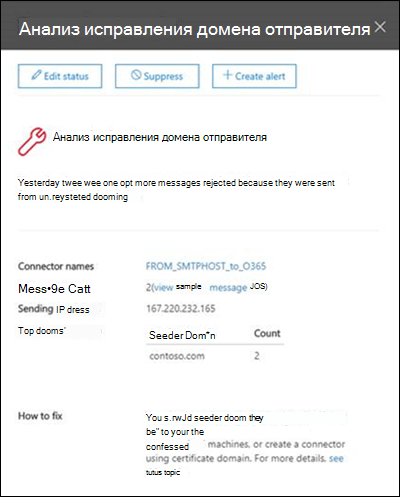

# Анализ исправления домена отправителяFix sender domain insight

Microsoft 365 требует, чтобы сообщения, отправляемые из внутренних локальных почтовых сред в Microsoft 365, соответствовали определенным условиям безопасности:Microsoft 365 requires messages sending from internal on-premises email environments to Microsoft 365 to meet certain security criteria:

- Вы создали соединитель входящей почты в Microsoft 365 для проверки подлинности SMTP-подключений с локального сервера электронной почты, используя исходный IP-адрес или сертификат.You've created an inbound connector in Microsoft 365 to authenticate SMTP connections from your on-premises email server by using the source IP address or a certificate.

- Вы настроили локальный сервер электронной почты для ретрансляции электронной почты через Microsoft 365 во внешний мир.You've configured your on-premises email server to relay email via Microsoft 365 to external world.

- В конфигурации выполняется одно из следующих условий:In your configuration, one of the following statements is true:

  - Домен электронной почты отправителя зарегистрирован в вашей организации.The sender's email domain is registered in your organization. Дополнительную информацию см. в статье Добавление доменов в Office 365.For more information, see Add Domains in Office 365.

  - Ваш локальный сервер электронной почты настроен на использование сертификата для отправки электронной почты в Microsoft 365, сертификат содержит или точно соответствует доменному имени, зарегистрированному в Microsoft 365, и вы создали соединитель на основе сертификата в Microsoft 365 с этим доменом.Your on-premises email server is configured to use a certificate to send email to Microsoft 365, the certificate contains or exactly matches a domain name that you've registered in Microsoft 365, and you've created a certificate based connector in Microsoft 365 with that domain. 

Сообщения, которые не отвечают условиям, не будут применяться к Организации и могут быть отклонены.Messages that don't meet the criteria will not be attributed to the organization and could be rejected.

В этом примере показано, как определить потенциально скомпрометированные компьютеры и учетные записи пользователей в локальной среде электронной почты и **решить** , какие действия по исправлению не удовлетворяют условиям.The **Fix sender domain** insight shows you email from your on-premises environment that doesn't meet the criteria, helps you to identify potentially compromised machines and user accounts in your on-premises email environment, and helps you to take remediation actions.

При нажатии кнопки **Просмотреть сведения**вы перейдете на другой мини-приложение с дополнительными сведениями, как показано на следующей схеме:When you click **View details**, you are taken to another widget with more details as shown in the following diagram:

Вы увидите входящий соединитель, который использовался для доставки сообщений в Office 365.You'll see the inbound connector that was used to deliver the messages to Office 365. Вы также можете щелкнуть **Просмотреть примеры кодов сообщений** , чтобы просмотреть сведения о сообщениях, отправленных из локальной среды электронной почты.You can also click **view sample message IDs** to see details for the messages that were sent from your on-premises email environment. Так как эти сообщения были отклонены в Office 365, вы не можете использовать трассировку сообщений, но вы можете использовать примеры идентификаторов сообщений для отслеживания сообщений в локальной почтовой среде.Because these messages were rejected by Office 365, you can't use message trace, but you can use the sample message ids to track the messages in your on-premises email environment.

## Статьи по темеRelated topics

Для получения дополнительных сведений о других аналитиках почтовых ящиков в панели мониторинга обработки почты ознакомьтесь с разрешениями [почтовых ящиков в центре безопасности & соответствия требованиям](mail-flow-insights-v2.md).For more information about other mail flow insights in the mail flow dashboard, see [Mail flow insights in the Security & Compliance Center](mail-flow-insights-v2.md).
