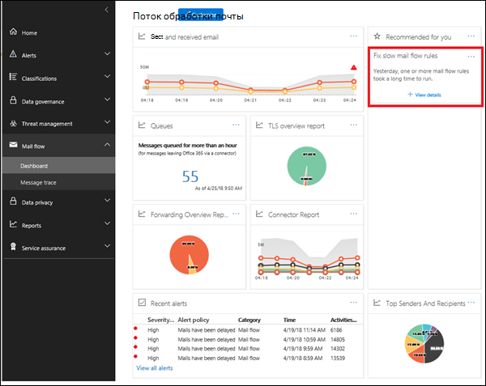
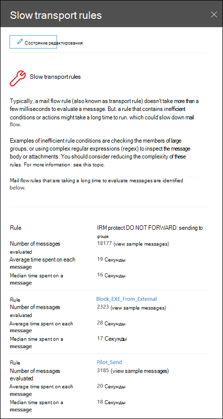

# Отображение аналитики правил потока обработки почтыSlow mail flow rules insight

Неэффективные правила для поток обработки почты (также называемые правилами транспорта) могут приводить к задержкам обработки почты для вашей организации.Inefficient mail flow rules (also known as transport rules) can lead to mail flow delays for your organization. Этот отчет содержит правила обработки почты, которые влияют на процесс обработки почты в Организации.This insight reports mail flow rules that have an impact on your organization's mail flow. Ниже приведены примеры этих типов правил.Examples of these types of rules are:

- Условия использования **— членство** в группах больших групп.Conditions that use **Is member of** for large groups.

- Условия, в которых используется сложное совпадение с шаблонами регулярных выражений (Regex).Conditions that use complex regular expression (regex) pattern matching.

- Условия, в которых используется проверка содержимого во вложениях.Conditions that use content checking in attachments.

Сведения, содержащиеся в этой справке, помогут вам определить и настроить правила обработки почтового ящика, чтобы снизить задержку обработки почты.The insight will help you to identify and fine-tune mail flow rules to help reduce mail flow delays.

При нажатии кнопки **Просмотреть сведения**отображается раскрывающаяся панель, в которой можно просмотреть правило.When you click **View details**, a flyout pane appears where you can review the rule. В раскрывающейся области можно также щелкнуть **Просмотр образцов сообщений** , чтобы узнать, какие типы сообщений влияют на это правило.In the flyout pane, can also click **view sample messages** to see what kind of messages are impacted by the rule.

## Статьи по темеRelated topics

Для получения дополнительных сведений о других аналитиках почтовых ящиков в панели мониторинга обработки почты ознакомьтесь с разрешениями [почтовых ящиков в центре безопасности & соответствия требованиям](mail-flow-insights-v2.md).For more information about other mail flow insights in the mail flow dashboard, see [Mail flow insights in the Security & Compliance Center](mail-flow-insights-v2.md).
