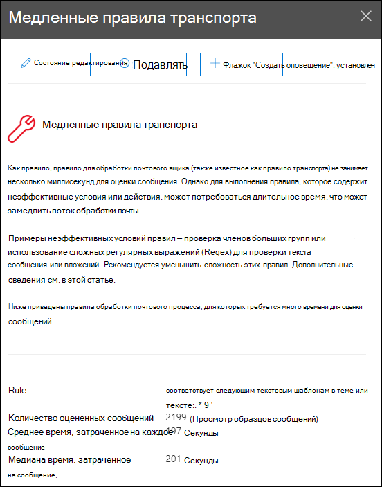

# Исправление анализа правил медленного потока почты в центре & безопасностиFix slow mail flow rules insight in the Security & Compliance Center

[!INCLUDE [Microsoft 365 Defender rebranding](../includes/microsoft-defender-for-office.md)]

**Область применения****Applies to**
- [Exchange Online ProtectionExchange Online Protection](exchange-online-protection-overview.md)
- [Microsoft Defender для Office 365 (план 1 и план 2)Microsoft Defender for Office 365 plan 1 and plan 2](defender-for-office-365.md)
- [Microsoft 365 DefenderMicrosoft 365 Defender](../defender/microsoft-365-defender.md)

Неэффективные правила потока почты (также известные как правила транспорта) могут привести к задержкам потока почты для организации.Inefficient mail flow rules (also known as transport rules) can lead to mail flow delays for your organization. В этом анализе отчеты о правилах потока почты, которые влияют на поток почты организации.This insight reports mail flow rules that have an impact on your organization's mail flow. Примеры этих типов правил:Examples of these types of rules include:

- Условия, которые **используют Is member для** больших групп.Conditions that use **Is member of** for large groups.
- Условия, в которых используется сложный шаблон регулярного выражения (regex).Conditions that use complex regular expression (regex) pattern matching.
- Условия, в которых используется проверка контента в вложениях.Conditions that use content checking in attachments.

Сведения  о правилах медленного потока почты в  рекомендуемой для  вас области панели мониторинга потока почты в Центре соответствия требованиям безопасности &, когда правило потока почты завершается слишком долго. The **Fix slow mail flow rules** insight in the **Recommended for you** area of the [Mail flow dashboard](mail-flow-insights-v2.md) in the [Security & Compliance Center](https://protection.office.com) notifies you when a mail flow rule is taking too long to complete.

Это представление появляется только после обнаружения условия (если у вас нет каких-либо циклов почты, вы не увидите представление).This insight appears only after the condition is detected (if you don't have any mail loops, you won't see the insight).

Вы можете использовать это уведомление, чтобы помочь вам определить и настроить правила потока почты, чтобы уменьшить задержки потока почты.You can use this notification to help you to identify and fine-tune mail flow rules to help reduce mail flow delays.

При **нажатии сведений о** просмотре на виджете появляется флажок с дополнительными сведениями:When you click **View details** on the widget, a flyout appears with more information:

- **Правило.** Вы можете наведите курсор на сводку, чтобы увидеть все условия, исключения и действия правила.**Rule**: You can hover over the summary to see all of the conditions, exceptions, and actions of the rule. Вы можете нажать на сводку, чтобы изменить правило в центре администрирования Exchange (EAC).You can click on the summary to edit the rule in the Exchange admin center (EAC).
- **Количество оцениваемого** количества сообщений. Вы можете нажать просмотреть примеры сообщений, чтобы просмотреть результаты трассировки сообщений для примера сообщений, затронутых правилом.  **Number of messages evaluated**: You can click **View sample messages** to see the [message trace](message-trace-scc.md) results for a sample of the messages that were affected by the rule.
- **Среднее время, затраченное на каждое сообщение****Average time spent on each message**
- **Среднее время, затраченное на сообщение:** среднее значение, которое отделяет верхнюю половину от нижней половины данных времени.**Median time spent on a message**: The middle value that separates the upper half from the lower half of time data.

Дополнительные сведения об условиях и исключениях в правилах потока почты см. в [Exchange Online.](/Exchange/security-and-compliance/mail-flow-rules/conditions-and-exceptions)For more information about conditions and exceptions in mail flow rules, see [Mail flow rule conditions and exceptions (predicates) in Exchange Online](/Exchange/security-and-compliance/mail-flow-rules/conditions-and-exceptions).

## См. такжеSee also

Сведения о других сведениях в панели мониторинга потока почты см. в странице Анализ потока почты в Центре [& соответствия](mail-flow-insights-v2.md)требованиям.For information about other insights in the Mail flow dashboard, see [Mail flow insights in the Security & Compliance Center](mail-flow-insights-v2.md).