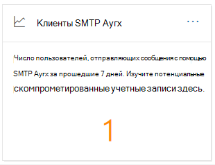
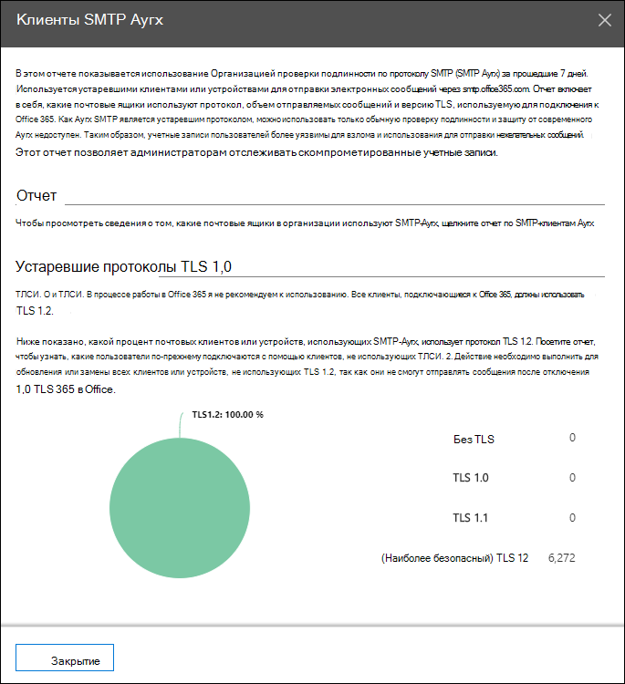
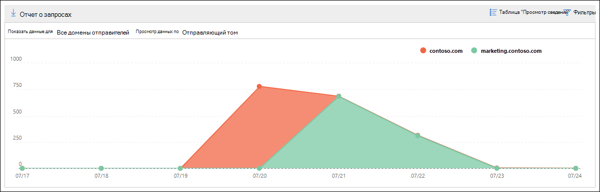
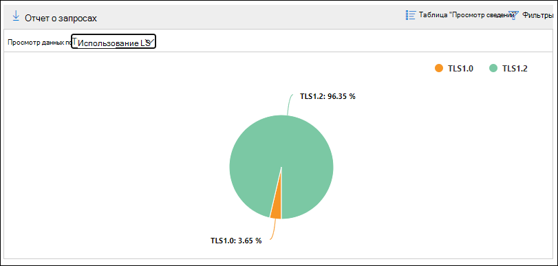

# Проверка подлинности клиентов проверки подлинности SMTP и составление отчетов в центре безопасности & соответствия требованиям

**Клиенты проверки подлинности SMTP** просматриваются в [панели мониторинга почтовых ящиков](mail-flow-insights-v2.md) и сопоставленных с ним [клиентов проверки подлинности SMTP](#smtp-auth-clients-report) в [центре безопасности & соответствия требованиям](https://protection.office.com) выделите использование протокола отправки SMTP-протокола проверки подлинности SMTP пользователями или системными учетными записями в Организации. Этот устаревший протокол (использующий конечную точку smtp.office365.com) обеспечивает только обычную проверку подлинности и может использоваться скомпрометированными учетными записями для отправки электронной почты. В отчете об отправку и отчете можно проверить необычные действия для отправки сообщений с проверкой подлинности SMTP. В нем также отображаются данные об использовании TLS для клиентов или устройств с использованием проверки подлинности SMTP.

Мини-приложение указывает количество пользователей или учетных записей служб, которые использовали протокол проверки подлинности SMTP за последние 7 дней.

Если щелкнуть число сообщений в мини-приложении, появится всплывающее окно **почтовых клиентов проверки подлинности SMTP** . Всплывающее окно содержит сводное представление об использовании и томах TLS за последнюю неделю.

Вы можете щелкнуть ссылку **отчет о клиентах проверки подлинности SMTP** , чтобы перейти к отчету проверки подлинности SMTP, как описано в следующем разделе.

## Отчет о клиентах проверки подлинности SMTP

### Представление отчета для отчета по клиентам проверки подлинности SMTP

По умолчанию в отчете отображаются данные за последние 7 дней, но данные доступны в течение последних 90 дней.

Раздел Обзор содержит следующие диаграммы:

- **Просмотр данных: отправка тома**: по умолчанию на диаграмме показано количество сообщений клиентов проверки подлинности SMTP, отправленных из всех доменов (**Показать данные для: все домены отправителя** выбраны по умолчанию). Вы можете отфильтровать результаты в определенном домене отправителя, нажав кнопку **Показать данные** и выбрав домен отправителя из раскрывающегося списка. При наведении курсора на определенную точку данных (день) отображается количество сообщений.

  

- **Просмотр данных по: использование TLS**: на диаграмме показан процент использования TLS для всех сообщений клиентов проверки подлинности SMTP в течение выбранного периода времени. Эта диаграмма позволяет определять и выполнять действия с пользователями и системными учетными записями, которые все еще используют старые версии протокола TLS.

  

Если в представлении отчета щелкнуть **фильтры** , можно указать диапазон дат с **начальным** и **конечным**датами.

Щелкните **запросить отчет** , чтобы получить более подробную версию отчета в сообщении электронной почты. Вы можете указать диапазон дат и получателей, которые будут получать отчет.

### Представление таблицы сведений для отчета по клиентам проверки подлинности SMTP

Если щелкнуть **Таблица Просмотр сведений**, отображаемая информация зависит от диаграммы, которую Вы искали:

- **Просмотр данных: отправка тома**: в таблице показаны следующие сведения:

  - **Адрес отправителя**
  - **Количество сообщений**

  Если выбрана строка, в всплывающем меню отображаются те же сведения.

- **Просмотр данных по: использование TLS**: в таблице показаны следующие сведения:

  - **Адрес отправителя**
  - **TLS 1.0%**\*
  - **TLS 1.1%**\*
  - **TLS 1.2%**\*
  - **Количество сообщений**

  \* В этом столбце показаны процентное отношение и количество сообщений от отправителя.

Если в представлении Таблица сведений щелкнуть **фильтры** , можно указать диапазон дат с датой **начала** и **датой окончания**.

Если выбрана строка, похожие сведения отображаются в всплывающем меню:

Щелкните **запросить отчет** , чтобы получить более подробную версию отчета в сообщении электронной почты. Вы можете указать диапазон дат и получателей, которые будут получать отчет.

Чтобы вернуться к представлению отчетов, нажмите кнопку **Просмотреть отчет**.

## Статьи по теме

Сведения о других аналитиках в панели мониторинга для почтового процесса приведены в статье сведения о [почтовых сообщениях в центре безопасности & соответствия требованиям](mail-flow-insights-v2.md).
