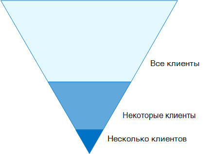
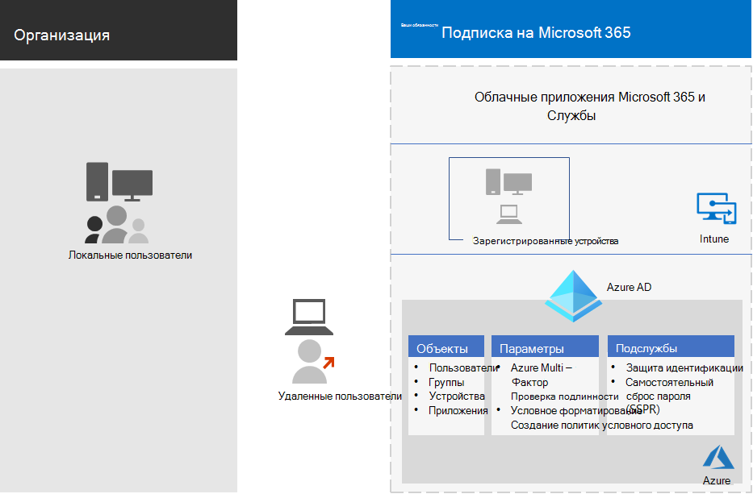
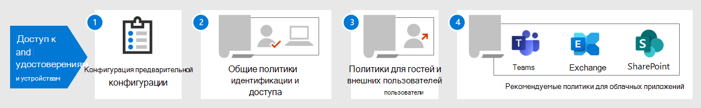

# Конфигурации доступа для удостоверений и устройствIdentity and device access configurations

**Область применения****Applies to**
- [Exchange Online ProtectionExchange Online Protection](exchange-online-protection-overview.md)
- [Microsoft Defender для Office 365 (план 1 и план 2)Microsoft Defender for Office 365 plan 1 and plan 2](defender-for-office-365.md)

Современный периметр безопасности организации теперь выходит за пределы сети и включает пользователей, которые могут получать доступ к облачным приложениям из любого расположения с различными устройствами.The modern security perimeter of your organization now extends beyond your network to include users accessing cloud-based apps from any location with a variety of devices. Инфраструктура безопасности должна определить, следует ли предоставлять данный запрос доступа и при каких условиях.Your security infrastructure needs to determine whether a given access request should be granted and under what conditions.

Это определение должно основываться на учетной записи пользователя входной записи, используемом устройстве, приложении, используемом пользователем для доступа, расположении, из которого сделан запрос на доступ, и оценке риска запроса.This determination should be based on the user account of the sign-in, the device being used, the app the user is using for access, the location from which the access request is made, and an assessment of the risk of the request. Благодаря этой возможности только утвержденные пользователи и устройства смогут получить доступ к важным ресурсам.This capability helps ensure that only approved users and devices can access your critical resources.

В этой серии статей описывается набор необходимых конфигураций удостоверений и доступа к устройствам, а также набор условных доступов Azure Active Directory (Azure AD), Microsoft Intune и других политик для обеспечения доступа к Microsoft 365 для корпоративных облачных приложений и служб, других служб SaaS и локального приложения, опубликованных с помощью прокси-сервера azure AD Application.This series of articles describes a set of identity and device access prerequisite configurations and a set of Azure Active Directory (Azure AD) Conditional Access, Microsoft Intune, and other policies to secure access to Microsoft 365 for enterprise cloud apps and services, other SaaS services, and on-premises applications published with Azure AD Application Proxy.

Параметры и политики доступа к удостоверениям и устройствам рекомендуется использовать в трех уровнях: базовая защита, чувствительная защита и защита для сред с высокорегулируемыми или секретными данными.Identity and device access settings and policies are recommended in three tiers: baseline protection, sensitive protection, and protection for environments with highly regulated or classified data. Эти уровни и соответствующие конфигурации обеспечивают согласованные уровни защиты ваших данных, удостоверений и устройств.These tiers and their corresponding configurations provide consistent levels of protection across your data, identities, and devices.

Эти возможности и их рекомендации:These capabilities and their recommendations:

- Поддерживаются в Microsoft 365 E3 и Microsoft 365 E5.Are supported in Microsoft 365 E3 and Microsoft 365 E5.
- Выровнены с [показателем microsoft Secure Score,](../defender/microsoft-secure-score.md) а также показателем удостоверений [в Azure AD](/azure/active-directory/fundamentals/identity-secure-score)и увеличит эти баллы для вашей организации.Are aligned with [Microsoft Secure Score](../defender/microsoft-secure-score.md) as well as [identity score in Azure AD](/azure/active-directory/fundamentals/identity-secure-score), and will increase these scores for your organization.
- Это поможет вам реализовать эти [пять шагов по обеспечению безопасности инфраструктуры удостоверений.](/azure/security/azure-ad-secure-steps)Will help you implement these [five steps to securing your identity infrastructure](/azure/security/azure-ad-secure-steps).

Если в организации есть уникальные требования к среде или сложности, используйте эти рекомендации в качестве отправной точки.If your organization has unique environment requirements or complexities, use these recommendations as a starting point. Однако большинство организаций могут выполнять эти рекомендации по назначению.However, most organizations can implement these recommendations as prescribed.

Просмотрите это видео для быстрого обзора конфигураций удостоверений и доступа к устройствам для Microsoft 365 для предприятия.Watch this video for a quick overview of identity and device access configurations for Microsoft 365 for enterprise.

> [!VIDEO https://www.microsoft.com/videoplayer/embed/RWxEDQ]

> [!NOTE]
> Корпорация Майкрософт также продает лицензии на корпоративную мобильность и безопасность (EMS) для подписки на Office 365.Microsoft also sells Enterprise Mobility + Security (EMS) licenses for Office 365 subscriptions. Возможности EMS E3 и EMS E5 эквивалентны возможностям Microsoft 365 E3 и Microsoft 365 E5.EMS E3 and EMS E5 capabilities are equivalent to those in Microsoft 365 E3 and Microsoft 365 E5. Подробные сведения см. в планах [EMS.](https://www.microsoft.com/microsoft-365/enterprise-mobility-security/compare-plans-and-pricing)See [EMS plans](https://www.microsoft.com/microsoft-365/enterprise-mobility-security/compare-plans-and-pricing) for the details.

## Целевая аудиторияIntended audience

Эти рекомендации предназначены для корпоративных архитекторов и ИТ-специалистов, знакомых с облачными службами Microsoft 365 и службами безопасности, которые включают Azure AD (identity), Microsoft Intune (управление устройствами) и Azure Information Protection (защита данных).These recommendations are intended for enterprise architects and IT professionals who are familiar with Microsoft 365 cloud productivity and security services, which includes Azure AD (identity), Microsoft Intune (device management), and Azure Information Protection (data protection).

### Клиентская средаCustomer environment

Рекомендуемые политики применимы к корпоративным организациям, работающим как полностью в облаке Майкрософт, так и для клиентов с гибридной инфраструктурой удостоверений, которая является локальной лесовой служб домена Active Directory, синхронизируемым с клиентом Azure AD.The recommended policies are applicable to enterprise organizations operating both entirely within the Microsoft cloud and for customers with hybrid identity infrastructure, which is an on-premises Active Directory Domain Services (AD DS) forest that is synchronized with an Azure AD tenant.

Многие из предоставленных рекомендаций зависят от служб, доступных только с лицензиями Microsoft 365 E5, Microsoft 365 E3 с надстройки identity & Threat Protection, EMS E5 или Azure Premium P2.Many of the provided recommendations rely on services available only with Microsoft 365 E5, Microsoft 365 E3 with the Identity & Threat Protection add-on, EMS E5, or Azure Premium P2 licenses.

Для тех организаций, у которых нет этих лицензий, Корпорация Майкрософт рекомендует по крайней мере реализовать по умолчанию [безопасность,](/azure/active-directory/fundamentals/concept-fundamentals-security-defaults)которая включена во все планы Microsoft 365.For those organizations who do not have these licenses, Microsoft recommends you at least implement [security defaults](/azure/active-directory/fundamentals/concept-fundamentals-security-defaults), which is included with all Microsoft 365 plans.

### ОговоркиCaveats

К вашей организации могут применяться нормативные или другие требования, в том числе конкретные рекомендации, которые могут потребовать применения политик, которые отличаются от этих рекомендуемых конфигураций.Your organization may be subject to regulatory or other compliance requirements, including specific recommendations that may require you to apply policies that diverge from these recommended configurations. В этих конфигурациях рекомендуется использовать элементы управления, которые исторически недоступны.These configurations recommend usage controls that have not historically been available. Мы рекомендуем использовать эти элементы управления, так как считаем, что они представляют собой баланс между безопасностью и производительностью.We recommend these controls because we believe they represent a balance between security and productivity.

Мы сделали все возможное, чтобы учитывать самые разнообразные требования к организационной защите, но мы не можем учитывать все возможные требования или все уникальные аспекты вашей организации.We've done our best to account for a wide variety of organizational protection requirements, but we're not able to account for all possible requirements or for all the unique aspects of your organization.

## Три уровня защитыThree tiers of protection

Большинство организаций предъявляет особые требования, касающиеся безопасности и защиты данных.Most organizations have specific requirements regarding security and data protection. Эти требования зависят от отраслевого сегмента и должностных обязанностей в организации.These requirements vary by industry segment and by job functions within organizations. Например, вашему юридическому отделу и администраторам могут потребоваться дополнительные средства контроля безопасности и защиты информации в их электронной переписке, которые не требуются для других подразделений бизнеса.For example, your legal department and administrators might require additional security and information protection controls around their email correspondence that are not required for other business units.

Кроме того, в каждой отрасли существует собственный набор специализированных нормативных предписаний.Each industry also has their own set of specialized regulations. Вместо предоставления списка всех возможных вариантов безопасности или рекомендации для каждого сегмента отрасли или функции задания были предоставлены рекомендации для трех различных уровней безопасности и защиты, которые могут применяться в зависимости от детализации ваших потребностей.Rather than providing a list of all possible security options or a recommendation per industry segment or job function, recommendations have been provided for three different tiers of security and protection that can be applied based on the granularity of your needs.

- **Базовая** защита. Рекомендуется установить минимальный стандарт защиты данных, а также удостоверений и устройств, которые имеют доступ к вашим данным.**Baseline protection**: We recommend you establish a minimum standard for protecting data, as well as the identities and devices that access your data. Вы можете следовать этим базовым рекомендациям, чтобы обеспечить сильную защиту по умолчанию, которая отвечает потребностям многих организаций.You can follow these baseline recommendations to provide strong default protection that meets the needs of many organizations.
- **Чувствительная** защита. Некоторые клиенты имеют подмножество данных, которые должны быть защищены на более высоких уровнях, или они могут требовать защиты всех данных на более высоком уровне.**Sensitive protection**: Some customers have a subset of data that must be protected at higher levels, or they may require all data to be protected at a higher level. Вы можете применять повышенную защиту для всех или определенных наборов данных в среде Microsoft 365.You can apply increased protection to all or specific data sets in your Microsoft 365 environment. Рекомендуется защищать удостоверения и устройства, обращающиеся к конфиденциальным данным, с помощью сравнимых уровней безопасности.We recommend protecting identities and devices that access sensitive data with comparable levels of security.
- **Строго регламентировано.** Некоторые организации могут иметь небольшое количество данных, которые высоко классифицируются, представляют собой секреты торговли или регулируются данными.**Highly regulated**: Some organizations may have a small amount of data that is highly classified, constitutes trade secrets, or is regulated data. Корпорация Майкрософт предоставляет возможности, позволяющие организациям соответствовать этим требованиям, включая дополнительную защиту для удостоверений и устройств.Microsoft provides capabilities to help organizations meet these requirements, including added protection for identities and devices.

В этом руководстве показано, как реализовать защиту удостоверений и устройств для каждого из этих уровней защиты.This guidance shows you how to implement protection for identities and devices for each of these tiers of protection. Используйте это руководство в качестве отправной точки для организации и подстройте политики для удовлетворения определенных требований организации.Use this guidance as a starting point for your organization and adjust the policies to meet your organization's specific requirements.

Важно, чтобы уровни защиты данных, удостоверений и устройств согласовывались между собой.It's important to use consistent levels of protection across your data, identities, and devices. Например, если вы реализуете это руководство, обязательно защитите данные на сопоставимых уровнях.For example, if you implement this guidance, be sure to protect your data at comparable levels.

Защита **удостоверений и устройств для архитектурной модели Microsoft 365** показывает, какие возможности сопоставимы.The **Identity and device protection for Microsoft 365** architecture model shows you which capabilities are comparable.

   [Просмотр в формате PDF](../../downloads/MSFT_cloud_architecture_identity&device_protection.pdf) \| [Скачивание в формате PDF](https://github.com/MicrosoftDocs/microsoft-365-docs/raw/public/microsoft-365/downloads/MSFT_cloud_architecture_identity&device_protection.pdf) \| [Скачать в качестве visio](https://github.com/MicrosoftDocs/microsoft-365-docs/raw/public/microsoft-365/downloads/MSFT_cloud_architecture_identity&device_protection.vsdx)  [View as a PDF](../../downloads/MSFT_cloud_architecture_identity&device_protection.pdf) \| [Download as a PDF](https://github.com/MicrosoftDocs/microsoft-365-docs/raw/public/microsoft-365/downloads/MSFT_cloud_architecture_identity&device_protection.pdf)  \| [Download as a Visio](https://github.com/MicrosoftDocs/microsoft-365-docs/raw/public/microsoft-365/downloads/MSFT_cloud_architecture_identity&device_protection.vsdx)

Кроме того, см. в веб-сайте [Deploy information protection for data privacy regulations solution](../../solutions/information-protection-deploy.md) to protect information stored in Microsoft 365.Additionally, see the [Deploy information protection for data privacy regulations](../../solutions/information-protection-deploy.md) solution to protect information stored in Microsoft 365.

## Баланс между безопасностью и производительностьюSecurity and productivity trade-offs

Реализация любой стратегии безопасности требует компромиссов между безопасностью и производительностью.Implementing any security strategy requires trade-offs between security and productivity. Полезно оценить, как каждое решение влияет на баланс безопасности, функциональности и простоты использования.It's helpful to evaluate how each decision affects the balance of security, functionality, and ease of use.

Предоставляемые рекомендации основаны на следующих принципах:The recommendations provided are based on the following principles:

- Знайте пользователей и будьте гибкими к их требованиям безопасности и функциональным требованиям.Know your users and be flexible to their security and functional requirements.
- Применяем политику безопасности как раз вовремя и убедитесь, что она имеет смысл.Apply a security policy just in time and ensure it is meaningful.

## Службы и концепции защиты удостоверений и доступа к устройствамServices and concepts for identity and device access protection

Microsoft 365 для предприятия предназначена для крупных организаций, чтобы дать всем возможность быть творческими и безопасно работать вместе.Microsoft 365 for enterprise is designed for large organizations to empower everyone to be creative and work together securely.

В этом разделе представлен обзор служб и возможностей Microsoft 365, важных для доступа к удостоверениям и устройствам.This section provides an overview of the Microsoft 365 services and capabilities that are important for identity and device access.

### Azure ADAzure AD

Azure AD предоставляет полный набор возможностей управления удостоверениями.Azure AD provides a full suite of identity management capabilities. Мы рекомендуем использовать эти возможности для обеспечения доступа.We recommend using these capabilities to secure access.

|Возможность или функцияCapability or feature|ОписаниеDescription|ЛицензированиеLicensing|
|---|---|---|
|[многофакторная проверка подлинности (MFA);Multi-factor authentication (MFA)](/azure/active-directory/authentication/concept-mfa-howitworks)|MFA требует, чтобы пользователи предоставили две формы проверки, такие как пароль пользователя плюс уведомление из приложения Microsoft Authenticator или телефонный звонок.MFA requires users to provide two forms of verification, such as a user password plus a notification from the Microsoft Authenticator app or a phone call. MFA значительно снижает риск использования украденных учетных данных для доступа к среде.MFA greatly reduces the risk that stolen credentials can be used to access your environment. Microsoft 365 использует службу многофакторной проверки подлинности Azure AD для входов на основе MFA.Microsoft 365 uses the Azure AD Multi-Factor Authentication service for MFA-based sign-ins.|Microsoft 365 E3 или E5Microsoft 365 E3 or E5|
|[Условный доступConditional Access](/azure/active-directory/conditional-access/overview)|Azure AD оценивает условия входных данных пользователя и использует политики условного доступа для определения разрешенного доступа.Azure AD evaluates the conditions of the user sign-in and uses Conditional Access policies to determine the allowed access. Например, в этом руководстве мы покажем, как создать политику условного доступа, требуемую соответствия устройств доступу к конфиденциальным данным.For example, in this guidance we show you how to create a Conditional Access policy to require device compliance for access to sensitive data. Это значительно снижает риск того, что хакер с собственным устройством и украденными учетными данными может получить доступ к конфиденциальным данным.This greatly reduces the risk that a hacker with their own device and stolen credentials can access your sensitive data. Он также защищает конфиденциальные данные на устройствах, так как устройства должны соответствовать определенным требованиям к безопасности и безопасности.It also protects sensitive data on the devices, because the devices must meet specific requirements for health and security.|Microsoft 365 E3 или E5Microsoft 365 E3 or E5|
|[Группы Azure ADAzure AD groups](/azure/active-directory/fundamentals/active-directory-manage-groups)|Политики условного доступа, управление устройствами с помощью Intune и даже разрешения на файлы и сайты в организации зависят от назначения учетным записям пользователей или группам Azure AD.Conditional Access policies, device management with Intune, and even permissions to files and sites in your organization rely on the assignment to user accounts or Azure AD groups. Рекомендуется создавать группы Azure AD, соответствующие уровням защиты, которые вы реализуете.We recommend you create Azure AD groups that correspond to the levels of protection you are implementing. Например, у ваших сотрудников, скорее всего, более высокие целевые значения для хакеров.For example, your executive staff are likely higher value targets for hackers. Поэтому имеет смысл добавить учетные записи этих сотрудников в группу Azure AD и назначить эту группу политикам условного доступа и другим политикам, которые обеспечивает более высокий уровень защиты для доступа.Therefore, it makes sense to add the user accounts of these employees to an Azure AD group and assign this group to Conditional Access policies and other policies that enforce a higher level of protection for access.|Microsoft 365 E3 или E5Microsoft 365 E3 or E5|
|[Регистрация устройствDevice enrollment](/azure/active-directory/devices/overview)|Чтобы создать удостоверение для устройства, необходимо зарегистрить устройство в Azure AD.You enroll a device into Azure AD to create an identity for the device. Этот идентификатор используется для проверки подлинности устройства при входе пользователя и применения политик условного доступа, которые требуют компьютеров, присоединенных к домену или совместимых с ним.This identity is used to authenticate the device when a user signs in and to apply Conditional Access policies that require domain-joined or compliant PCs. В этом руководстве мы используем регистрацию устройств для автоматической регистрации компьютеров Windows, присоединив к домену.For this guidance, we use device enrollment to automatically enroll domain-joined Windows computers. Регистрация устройств является обязательным условием для управления устройствами с помощью Intune.Device enrollment is a prerequisite for managing devices with Intune.|Microsoft 365 E3 или E5Microsoft 365 E3 or E5|
|[Защита идентификации Azure ADAzure AD Identity Protection](/azure/active-directory/identity-protection/overview)|Позволяет обнаруживать потенциальные уязвимости, влияющие на удостоверения организации, и настраивать автоматизированную политику восстановления с низким, средним и высоким уровнем риска и риска для пользователей.Enables you to detect potential vulnerabilities affecting your organization's identities and configure automated remediation policy to low, medium, and high sign-in risk and user risk. Это руководство опирается на эту оценку риска для применения политик условного доступа для многофакторной проверки подлинности.This guidance relies on this risk evaluation to apply Conditional Access policies for multi-factor authentication. В этом руководстве также содержится политика условного доступа, которая требует от пользователей изменить пароль, если обнаружена высокая активность для учетной записи.This guidance also includes a Conditional Access policy that requires users to change their password if high-risk activity is detected for their account.|Лицензии Microsoft 365 E5, Microsoft 365 E3 с надстройки identity & threat Protection, EMS E5 или Azure Premium P2Microsoft 365 E5, Microsoft 365 E3 with the Identity & Threat Protection add-on, EMS E5, or Azure Premium P2 licenses|
|[Сброс пароля самообслуживаемого (SSPR)Self-service password reset (SSPR)](/azure/active-directory/authentication/concept-sspr-howitworks)|Разрешить пользователям безопасно и без вмешательства службы поддержки сбросить пароли, предоставив проверку нескольких методов проверки подлинности, которые может контролировать администратор.Allow your users to reset their passwords securely and without help-desk intervention, by providing verification of multiple authentication methods that the administrator can control.|Microsoft 365 E3 или E5Microsoft 365 E3 or E5|
|[Защита паролей Azure ADAzure AD password protection](/azure/active-directory/authentication/concept-password-ban-bad)|Обнаружение и блокировка известных слабых паролей и их вариантов и дополнительных слабых терминов, которые являются специфическими для вашей организации.Detect and block known weak passwords and their variants and additional weak terms that are specific to your organization. Общие списки заблокированных паролей по умолчанию автоматически применяются ко всем пользователям в клиенте Azure AD.Default global banned password lists are automatically applied to all users in an Azure AD tenant. Дополнительные элементы можно определить в настраиваемом списке заблокированных паролей.You can define additional entries in a custom banned password list. При изменении или сбросе паролей пользователями эти списки заблокированных паролей проверяются с целью обеспечения использования надежных паролей.When users change or reset their passwords, these banned password lists are checked to enforce the use of strong passwords.|Microsoft 365 E3 или E5Microsoft 365 E3 or E5|
|

Ниже компоненты доступа к удостоверениям и устройствам, включая объекты Intune и Azure AD, параметры и подсервисы.Here are the components of identity and device access, including Intune and Azure AD objects, settings, and subservices.

### Microsoft IntuneMicrosoft Intune

[Intune](/intune/introduction-intune) — это облачная служба управления мобильными устройствами Майкрософт.[Intune](/intune/introduction-intune) is Microsoft's cloud-based mobile device management service. В этом руководстве рекомендуется управление устройствами компьютеров Windows с помощью Intune и рекомендуется конфигурации политик соответствия требованиям устройств.This guidance recommends device management of Windows PCs with Intune and recommends device compliance policy configurations. Intune определяет соответствие устройств требованиям и отправляет эти данные в Azure AD для использования при применении политик условного доступа.Intune determines whether devices are compliant and sends this data to Azure AD to use when applying Conditional Access policies.

#### Защита приложений intuneIntune app protection

[Политики защиты приложений intune](/intune/app-protection-policy) можно использовать для защиты данных организации в мобильных приложениях, с помощью или без регистрации устройств в управление.[Intune app protection](/intune/app-protection-policy) policies can be used to protect your organization's data in mobile apps, with or without enrolling devices into management. Intune помогает защитить информацию, убедившись, что ваши сотрудники по-прежнему могут быть продуктивными и предотвратить потерю данных.Intune helps protect information, making sure your employees can still be productive, and preventing data loss. Реализуя политики на уровне приложений, вы можете ограничить доступ к ресурсам компании и хранить данные в пределах управления ИТ-отделом.By implementing app-level policies, you can restrict access to company resources and keep data within the control of your IT department.

В этом руководстве показано, как создавать рекомендуемые политики для обеспечения использования утвержденных приложений и определения возможности использования этих приложений с бизнес-данными.This guidance shows you how to create recommended policies to enforce the use of approved apps and to determine how these apps can be used with your business data.

### Microsoft 365Microsoft 365

В этом руководстве показано, как реализовать набор политик для защиты доступа к облачным службам Microsoft 365, включая Microsoft Teams, Exchange Online, SharePoint Online и OneDrive для бизнеса.This guidance shows you how to implement a set of policies to protect access to Microsoft 365 cloud services, including Microsoft Teams, Exchange Online, SharePoint Online, and OneDrive for Business. В дополнение к реализации этих политик мы рекомендуем также повысить уровень защиты клиента с помощью этих ресурсов:In addition to implementing these policies, we recommend you also raise the level of protection for your tenant using these resources:

- [Настройка клиента для улучшения безопасностиConfigure your tenant for increased security](tenant-wide-setup-for-increased-security.md)

  Рекомендации, применимые к базовой безопасности для клиента.Recommendations that apply to baseline security for your tenant.

- [Дорожная карта безопасности: главные приоритеты в течение первых 30 дней, 90 дней и болееSecurity roadmap: Top priorities for the first 30 days, 90 days, and beyond](security-roadmap.md)

  Рекомендации, которые включают ведение журнала, управление данными, доступ администратора и защиту от угроз.Recommendations that include logging, data governance, admin access, and threat protection.

### Windows 10 и Приложения Microsoft 365 для предприятийWindows 10 and Microsoft 365 Apps for enterprise

Windows 10 с Microsoft 365 Apps для предприятия — это рекомендуемая клиентская среда для компьютеров.Windows 10 with Microsoft 365 Apps for enterprise is the recommended client environment for PCs. Мы рекомендуем Windows 10, так как Azure предназначена для обеспечения максимально плавного использования как локального, так и Azure AD.We recommend Windows 10 because Azure is designed to provide the smoothest experience possible for both on-premises and Azure AD. Windows 10 также включает расширенные возможности безопасности, которые можно управлять с помощью Intune.Windows 10 also includes advanced security capabilities that can be managed through Intune. Приложения Microsoft 365 для предприятия включают последние версии приложений Office.Microsoft 365 Apps for enterprise includes the latest versions of Office applications. В них используется современная проверка подлинности, которая является более безопасной и необходимой для условного доступа.These use modern authentication, which is more secure and a requirement for Conditional Access. Эти приложения также включают расширенные средства обеспечения безопасности и соответствия требованиям.These apps also include enhanced security and compliance tools.

## Применение этих возможностей на трех уровнях защитыApplying these capabilities across the three tiers of protection

В следующей таблице обобщены рекомендации по использованию этих возможностей на трех уровнях защиты.The following table summarizes our recommendations for using these capabilities across the three tiers of protection.

|Механизм защитыProtection mechanism|Базовый уровеньBaseline|КонфиденциальныйSensitive|Строго контролируемыйHighly regulated|
|---|---|---|---|
|**Применять MFA****Enforce MFA**|При среднем или более высоком уровне риска при входеOn medium or above sign-in risk|При низком или более высоком уровне риска при входеOn low or above sign-in risk|Для всех новых сеансовOn all new sessions|
|**Принудительное изменение пароля****Enforce password change**|Для пользователей с высоким уровнем рискаFor high-risk users|Для пользователей с высоким уровнем рискаFor high-risk users|Для пользователей с высоким уровнем рискаFor high-risk users|
|**Обеспечение защиты приложений Intune****Enforce Intune application protection**|ДаYes|ДаYes|ДаYes|
|**Обеспечение регистрации Intune для устройства, наемного в организации****Enforce Intune enrollment for organization-owned device**|Требуется совместимый или присоединились к домену ПК, но позволяют принести собственные устройства (BYOD) телефоны и планшетыRequire a compliant or domain-joined PC, but allow bring-your-own devices (BYOD) phones and tablets|Требуются совместимые или присоединимые к домену устройстваRequire a compliant or domain-joined device|Требуются совместимые или присоединимые к домену устройстваRequire a compliant or domain-joined device|
|

## Владение устройствамиDevice ownership

В этой таблице отражена тенденция многих организаций поддерживать сочетание устройств, которые принадлежат организации, а также персональных или BYOD для обеспечения производительности мобильных устройств в рабочей силе.The above table reflects the trend for many organizations to support a mix of organization-owned devices, as well as personal or BYODs to enable mobile productivity across the workforce. Политики защиты приложений intune гарантируют защиту электронной почты от exfiltrating из мобильного приложения Outlook и других мобильных приложений Office как на устройствах, так и в byOD.Intune app protection policies ensure that email is protected from exfiltrating out of the Outlook mobile app and other Office mobile apps, on both organization-owned devices and BYODs.

Мы рекомендуем управлять устройствами, управляемыми intune или с помощью домена, для применения дополнительных средств защиты и управления.We recommend organization-owned devices be managed by Intune or domain-joined to apply additional protections and control. В зависимости от конфиденциальности данных организация может не разрешать byODs для определенных групп пользователей или определенных приложений.Depending on data sensitivity, your organization may choose to not allow BYODs for specific user populations or specific apps.

## Развертывание и приложенияDeployment and your apps

Перед настройкой и развертывание конфигурации доступа к удостоверениям и устройствам для приложений, интегрированных в Azure AD, необходимо:Prior to configuring and rolling out identity and device access configuration for your Azure AD-integrated apps, you must:

- Определите, какие приложения, используемые в организации, необходимо защитить.Decide which apps used in your organization you want to protect.
- Анализ этого списка приложений, чтобы определить наборы политик, которые обеспечивают соответствующие уровни защиты.Analyze this list of apps to determine the sets of policies that provide appropriate levels of protection.

  Не следует создавать отдельные наборы политик для каждого приложения, так как управление ими может стать громоздким.You should not create separate sets of policies each for app because management of them can become cumbersome. Корпорация Майкрософт рекомендует группу приложений с одинаковыми требованиями к защите для тех же пользователей.Microsoft recommends that you group your apps that have the same protection requirements for the same users.

  Например, у вас может быть один набор политик, которые включают все приложения Microsoft 365 для всех пользователей для базовой защиты, а второй набор политик для всех конфиденциальных приложений, например тех, которые используются отделами кадров или финансов, и применять их к этим группам.For example, you could have one set of policies that include all Microsoft 365 apps for all of your users for baseline protection and a second set of policies for all sensitive apps, such as those used by human resources or finance departments, and apply them to those groups.

После того как вы определите набор политик для приложений, которые необходимо обезопасить, выкатите политики для пользователей постепенно, решая проблемы по пути.Once you have determined the set of policies for the apps you want to secure, roll the policies out to your users incrementally, addressing issues along the way.

Например, настройте политики, которые будут использоваться для всех приложений Microsoft 365 только для Exchange Online, с дополнительными изменениями для Exchange.For example, configure the policies that will be used for all your Microsoft 365 apps for just Exchange Online with the additional changes for Exchange. Выкатите эти политики для пользователей и проработать любые проблемы.Roll these policies out to your users and work through any issues. Затем добавьте Teams со своими дополнительными изменениями и выкатите это пользователям.Then, add Teams with its additional changes and roll this out to your users. Затем добавьте SharePoint с дополнительными изменениями.Then, add SharePoint with its additional changes. Продолжайте добавлять остальные приложения, пока вы не сможете уверенно настроить эти базовые политики, чтобы включить все приложения Microsoft 365.Continue adding the rest of your apps until you can confidently configure these baseline policies to include all Microsoft 365 apps.

Аналогичным образом, для конфиденциальных приложений создайте набор политик и добавьте по одному приложению одновременно и проработать все проблемы, пока все они не будут включены в набор конфиденциальной политики приложений.Similarly, for your sensitive apps, create the set of policies and add one app at a time and work through any issues until they are all included in the sensitive app policy set.

Корпорация Майкрософт рекомендует не создавать наборы политик, применимые к всем приложениям, так как это может привести к непреднамеренным конфигурациям.Microsoft recommends that you do not create policy sets that apply to all apps because it can result in some unintended configurations. Например, политики, которые блокируют все приложения, могут блокировать администраторов портала Azure, а исключения не могут быть настроены для важных конечных точек, таких как Microsoft Graph.For example, policies that block all apps could lock your admins out of the Azure portal and exclusions cannot be configured for important endpoints such as Microsoft Graph.

## Действия в процессе настройки удостоверений и доступа к устройствамSteps in the process of configuring identity and device access

1. Настройка необходимых функций удостоверений и их параметров.Configure prerequisite identity features and their settings.
2. Настройка общих политик удостоверений и доступа к условному доступу.Configure the common identity and access Conditional Access policies.
3. Настройка политик условного доступа для гостевых и внешних пользователей.Configure Conditional Access policies for guest and external users.
4. Настройка политик условного доступа для облачных приложений Microsoft 365, таких как Microsoft Teams, Exchange Online и SharePoint.Configure Conditional Access policies for Microsoft 365 cloud apps such as Microsoft Teams, Exchange Online, and SharePoint.

После настройки доступа к удостоверениям и устройствам см. в руководстве по развертыванию компонентов [Azure AD](/azure/active-directory/fundamentals/active-directory-deployment-checklist-p2) для поэтапного контрольного списка дополнительных функций для рассмотрения и управления удостоверением [Azure AD](/azure/active-directory/governance/) для защиты, мониторинга и аудита доступа.After you have configured identity and device access, see the [Azure AD feature deployment guide](/azure/active-directory/fundamentals/active-directory-deployment-checklist-p2) for a phased checklist of additional features to consider and [Azure AD Identity Governance](/azure/active-directory/governance/) to protect, monitor, and audit access.

## Следующий шагNext step

[Необходимые условия для реализации политик доступа к удостоверениям и устройствамPrerequisite work for implementing identity and device access policies](identity-access-prerequisites.md)