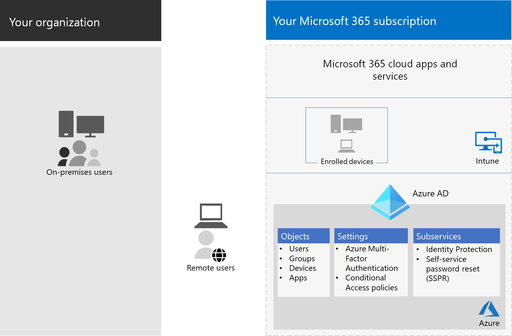

# Конфигурации доступа для удостоверений и устройствIdentity and device access configurations

Современный периметр безопасности организации теперь выходит за пределы сети и включает пользователей, которые имеют доступ к облачным приложениям из любого расположения с различными устройствами.The modern security perimeter of your organization now extends beyond your network to include users accessing cloud-based apps from any location with a variety of devices. Ваша инфраструктура безопасности должна определить, следует ли предоставлять заданный запрос на доступ и при каких условиях.Your security infrastructure needs to determine whether a given access request should be granted and under what conditions.

Это определение должно основываться на учетной записи пользователя для вход в учетную запись, используемом устройстве, приложении, используемом пользователем для доступа, расположении, из которого сделан запрос на доступ, и оценке риска запроса.This determination should be based on the user account of the sign-in, the device being used, the app the user is using for access, the location from which the access request is made, and an assessment of the risk of the request. Благодаря этой возможности только утвержденные пользователи и устройства смогут получить доступ к важным ресурсам.This capability helps ensure that only approved users and devices can access your critical resources.

В этой серии статей описывается набор необходимых конфигураций удостоверений и доступа к устройствам, а также набор условных доступа Azure Active Directory (Azure AD), Microsoft Intune и других политик для защиты доступа к Microsoft 365 для корпоративных облачных приложений и служб, других служб SaaS и локального приложения, опубликованного с помощью прокси приложения Azure AD.This series of articles describes a set of identity and device access prerequisite configurations and a set of Azure Active Directory (Azure AD) Conditional Access, Microsoft Intune, and other policies to secure access to Microsoft 365 for enterprise cloud apps and services, other SaaS services, and on-premises applications published with Azure AD Application Proxy.

Параметры и политики доступа к удостоверениям и устройствам рекомендуются на трех уровнях: базовая защита, конфиденциальную защиту и защита сред со строго регулируемыми или секретными данными.Identity and device access settings and policies are recommended in three tiers: baseline protection, sensitive protection, and protection for environments with highly regulated or classified data. Эти уровни и соответствующие конфигурации обеспечивают согласованные уровни защиты ваших данных, удостоверений и устройств.These tiers and their corresponding configurations provide consistent levels of protection across your data, identities, and devices.

Эти возможности и их рекомендации:These capabilities and their recommendations:

- Поддерживаются в Microsoft 365 E3 и Microsoft 365 E5.Are supported in Microsoft 365 E3 and Microsoft 365 E5.
- Выровнены с оценкой безопасности [(Майкрософт),](https://docs.microsoft.com/microsoft-365/security/mtp/microsoft-secure-score) а также оценкой удостоверений в [Azure AD](https://docs.microsoft.com/azure/active-directory/fundamentals/identity-secure-score)и увеличивают эти показатели для вашей организации.Are aligned with [Microsoft Secure Score](https://docs.microsoft.com/microsoft-365/security/mtp/microsoft-secure-score) as well as [identity score in Azure AD](https://docs.microsoft.com/azure/active-directory/fundamentals/identity-secure-score), and will increase these scores for your organization.
- Поможет вам реализовать эти [пять шагов для защиты инфраструктуры удостоверений.](https://docs.microsoft.com/azure/security/azure-ad-secure-steps)Will help you implement these [five steps to securing your identity infrastructure](https://docs.microsoft.com/azure/security/azure-ad-secure-steps).

Если в организации есть уникальные требования или сложности среды, используйте эти рекомендации в качестве отправной точки.If your organization has unique environment requirements or complexities, use these recommendations as a starting point. Однако большинство организаций могут реализовать эти рекомендации в предписанных ему организациях.However, most organizations can implement these recommendations as prescribed.

> [!NOTE]
> Корпорация Майкрософт также продает лицензии Enterprise Mobility + Security (EMS) для подписок на Office 365.Microsoft also sells Enterprise Mobility + Security (EMS) licenses for Office 365 subscriptions. Возможности EMS E3 и EMS E5 эквивалентны возможностям в Microsoft 365 E3 и Microsoft 365 E5.EMS E3 and EMS E5 capabilities are equivalent to those in Microsoft 365 E3 and Microsoft 365 E5. Подробные сведения см. в планах [EMS.](https://www.microsoft.com/microsoft-365/enterprise-mobility-security/compare-plans-and-pricing)See [EMS plans](https://www.microsoft.com/microsoft-365/enterprise-mobility-security/compare-plans-and-pricing) for the details.

## Целевая аудиторияIntended audience

Эти рекомендации предназначены для корпоративных архитекторов и ИТ-специалистов, знакомых со службами повышения производительности и безопасности в облаке Microsoft 365, в том числе Azure AD (удостоверение), Microsoft Intune (управление устройствами) и Azure Information Protection (защита данных).These recommendations are intended for enterprise architects and IT professionals who are familiar with Microsoft 365 cloud productivity and security services, which includes Azure AD (identity), Microsoft Intune (device management), and Azure Information Protection (data protection).

### Среда клиентаCustomer environment

Рекомендуемые политики применимы к корпоративным организациям, работающим как полностью в облаке Майкрософт, так и для клиентов с гибридной инфраструктурой удостоверений, которая является локальной лесом доменных служб Active Directory (AD DS), синхронизированным с клиентом Azure AD.The recommended policies are applicable to enterprise organizations operating both entirely within the Microsoft cloud and for customers with hybrid identity infrastructure, which is an on-premises Active Directory Domain Services (AD DS) forest that is synchronized with an Azure AD tenant.

Многие из предоставленных рекомендаций зависят от служб, доступных только с лицензиями Microsoft 365 E5, Microsoft 365 E3 с надстройки Identity & Threat Protection, EMS E5 или Azure Premium P2.Many of the provided recommendations rely on services available only with Microsoft 365 E5, Microsoft 365 E3 with the Identity & Threat Protection add-on, EMS E5, or Azure Premium P2 licenses.

Для организаций, у которых нет этих лицензий, Корпорация Майкрософт рекомендует по крайней мере реализовать значения по умолчанию для системы [безопасности,](https://docs.microsoft.com/azure/active-directory/fundamentals/concept-fundamentals-security-defaults)которые включены во все планы Microsoft 365.For those organizations who do not have these licenses, Microsoft recommends you at least implement [security defaults](https://docs.microsoft.com/azure/active-directory/fundamentals/concept-fundamentals-security-defaults), which is included with all Microsoft 365 plans.

### Предостереские оговоркиCaveats

К вашей организации могут применяться нормативные или другие требования по обеспечению соответствия требованиям, включая конкретные рекомендации, которые могут потребовать применения политик, которые отличаются от рекомендуемых конфигураций.Your organization may be subject to regulatory or other compliance requirements, including specific recommendations that may require you to apply policies that diverge from these recommended configurations. Эти конфигурации рекомендуют элементы управления использованием, которые ранее были недоступны.These configurations recommend usage controls that have not historically been available. Мы рекомендуем использовать эти средства контроля, так как мы считаем, что они представляют собой баланс между безопасностью и производительностью.We recommend these controls because we believe they represent a balance between security and productivity.

Мы сделали все возможное, чтобы учесть широкий спектр требований к защите в организации, но не можем учесть все возможные требования или уникальные аспекты вашей организации.We've done our best to account for a wide variety of organizational protection requirements, but we're not able to account for all possible requirements or for all the unique aspects of your organization.

## Три уровня защитыThree tiers of protection

Большинство организаций предъявляет особые требования, касающиеся безопасности и защиты данных.Most organizations have specific requirements regarding security and data protection. Эти требования зависят от отраслевого сегмента и должностных обязанностей в организации.These requirements vary by industry segment and by job functions within organizations. Например, юридическому отделу и администраторам могут потребоваться дополнительные средства контроля безопасности и защиты информации для их электронной почты, которые не требуются для других подразделений.For example, your legal department and administrators might require additional security and information protection controls around their email correspondence that are not required for other business units.

Кроме того, в каждой отрасли существует собственный набор специализированных нормативных предписаний.Each industry also has their own set of specialized regulations. Вместо того чтобы предоставлять список всех возможных вариантов безопасности или рекомендации для каждого отраслевого сегмента или функции задания, были предоставлены рекомендации для трех различных уровней безопасности и защиты, которые можно применять в зависимости от детализации ваших потребностей.Rather than providing a list of all possible security options or a recommendation per industry segment or job function, recommendations have been provided for three different tiers of security and protection that can be applied based on the granularity of your needs.

- **Базовая** защита: рекомендуется установить минимальный стандарт защиты данных, а также удостоверений и устройств, которые имеют доступ к вашим данным.**Baseline protection**: We recommend you establish a minimum standard for protecting data, as well as the identities and devices that access your data. Вы можете следовать этим базовым рекомендациям, чтобы обеспечить мощную защиту по умолчанию, которая соответствует потребностям многих организаций.You can follow these baseline recommendations to provide strong default protection that meets the needs of many organizations.
- **Защита конфиденциальных** данных: некоторые клиенты имеют подмножество данных, которые должны быть защищены на более высоком уровне, или им может потребоваться защита всех данных на более высоком уровне.**Sensitive protection**: Some customers have a subset of data that must be protected at higher levels, or they may require all data to be protected at a higher level. Вы можете применять повышенную защиту к всем или определенным наборам данных в среде Microsoft 365.You can apply increased protection to all or specific data sets in your Microsoft 365 environment. Рекомендуется защищать удостоверения и устройства, обращающиеся к конфиденциальным данным, с помощью сравнимых уровней безопасности.We recommend protecting identities and devices that access sensitive data with comparable levels of security.
- **Строго регулируемые**: в некоторых организациях может быть небольшой объем строго классифицированных данных, составляющих секретные сведения или регулируемых данных.**Highly regulated**: Some organizations may have a small amount of data that is highly classified, constitutes trade secrets, or is regulated data. Корпорация Майкрософт предоставляет возможности, позволяющие организациям соответствовать этим требованиям, включая дополнительную защиту для удостоверений и устройств.Microsoft provides capabilities to help organizations meet these requirements, including added protection for identities and devices.

В этом руководстве показано, как реализовать защиту удостоверений и устройств для каждого из этих уровней защиты.This guidance shows you how to implement protection for identities and devices for each of these tiers of protection. Используйте это руководство в качестве отправной точки для организации и настройте политики в удовлетворении конкретных требований организации.Use this guidance as a starting point for your organization and adjust the policies to meet your organization's specific requirements.

Важно, чтобы уровни защиты данных, удостоверений и устройств согласовывались между собой.It's important to use consistent levels of protection across your data, identities, and devices. Например, если вы реализуете это руководство, обязательно защитите данные на сравнимых уровнях.For example, if you implement this guidance, be sure to protect your data at comparable levels.

Модель **защиты удостоверений и устройств для модели архитектуры Microsoft 365** показывает, какие возможности сравнимы.The **Identity and device protection for Microsoft 365** architecture model shows you which capabilities are comparable.

   [Представление в формате PDF](../../downloads/MSFT_cloud_architecture_identity&device_protection.pdf) \| [Скачивание в формате PDF](https://github.com/MicrosoftDocs/microsoft-365-docs/raw/public/microsoft-365/downloads/MSFT_cloud_architecture_identity&device_protection.pdf) \| [Скачивание в качестве Visio](https://github.com/MicrosoftDocs/microsoft-365-docs/raw/public/microsoft-365/downloads/MSFT_cloud_architecture_identity&device_protection.vsdx)  [View as a PDF](../../downloads/MSFT_cloud_architecture_identity&device_protection.pdf) \| [Download as a PDF](https://github.com/MicrosoftDocs/microsoft-365-docs/raw/public/microsoft-365/downloads/MSFT_cloud_architecture_identity&device_protection.pdf)  \| [Download as a Visio](https://github.com/MicrosoftDocs/microsoft-365-docs/raw/public/microsoft-365/downloads/MSFT_cloud_architecture_identity&device_protection.vsdx)

Кроме того, [см. решение "Развертывание](../../solutions/information-protection-deploy.md) защиты информации для нормативов конфиденциальности данных" для защиты информации, хранимой в Microsoft 365.Additionally, see the [Deploy information protection for data privacy regulations](../../solutions/information-protection-deploy.md) solution to protect information stored in Microsoft 365.

## Баланс между безопасностью и производительностьюSecurity and productivity trade-offs

Реализация любой стратегии безопасности требует компромисса между безопасностью и производительностью.Implementing any security strategy requires trade-offs between security and productivity. Полезно оценить, как каждое решение влияет на баланс безопасности, функциональности и простоты использования.It's helpful to evaluate how each decision affects the balance of security, functionality, and ease of use.

Предоставленные рекомендации основаны на следующих принципах:The recommendations provided are based on the following principles:

- Знать пользователей и быть гибкими в отношении их требований к безопасности и функциональности.Know your users and be flexible to their security and functional requirements.
- Применяет политику безопасности точно во времени и гарантирует ее осмысленность.Apply a security policy just in time and ensure it is meaningful.

## Службы и концепции защиты удостоверений и доступа к устройствамServices and concepts for identity and device access protection

Microsoft 365 для предприятий предназначен для крупных организаций, чтобы дать всем возможность добиться творческого развития и безопасной совместной работы.Microsoft 365 for enterprise is designed for large organizations to empower everyone to be creative and work together securely.

В этом разделе представлен обзор служб и возможностей Microsoft 365, важных для доступа к удостоверениям и устройствам.This section provides an overview of the Microsoft 365 services and capabilities that are important for identity and device access.

### Azure ADAzure AD

Azure AD предоставляет полный набор возможностей управления удостоверениями.Azure AD provides a full suite of identity management capabilities. Мы рекомендуем использовать эти возможности для безопасного доступа.We recommend using these capabilities to secure access.

|Возможность или функцияCapability or feature|ОписаниеDescription|ЛицензированиеLicensing|
|---|---|---|
|[многофакторная проверка подлинности (MFA);Multi-factor authentication (MFA)](/azure/active-directory/authentication/concept-mfa-howitworks)|MFA требует, чтобы пользователи предоставили две формы проверки, такие как пароль пользователя и уведомление из приложения Microsoft Authenticator или телефонный звонок.MFA requires users to provide two forms of verification, such as a user password plus a notification from the Microsoft Authenticator app or a phone call. MFA значительно снижает риск использования украденных учетных данных для доступа к среде.MFA greatly reduces the risk that stolen credentials can be used to access your environment. Microsoft 365 использует службу многофакторной идентификации Azure AD для входов на основе MFA.Microsoft 365 uses the Azure AD Multi-Factor Authentication service for MFA-based sign-ins.|Microsoft 365 E3 или E5Microsoft 365 E3 or E5|
|[Условный доступConditional Access](/azure/active-directory/conditional-access/overview)|Azure AD оценивает условия входов пользователей и использует политики условного доступа для определения разрешенного доступа.Azure AD evaluates the conditions of the user sign-in and uses Conditional Access policies to determine the allowed access. Например, в этом руководстве мы покажем, как создать политику условного доступа, чтобы требовать соответствие устройств требованиям для доступа к конфиденциальным данным.For example, in this guidance we show you how to create a Conditional Access policy to require device compliance for access to sensitive data. Это значительно снижает риск того, что злоумышленник с собственным устройством и украденными учетными данными сможет получить доступ к вашим конфиденциальным данным.This greatly reduces the risk that a hacker with their own device and stolen credentials can access your sensitive data. Кроме того, он защищает конфиденциальные данные на устройствах, так как они должны соответствовать определенным требованиям к безопасности и безопасности.It also protects sensitive data on the devices, because the devices must meet specific requirements for health and security.|Microsoft 365 E3 или E5Microsoft 365 E3 or E5|
|[Группы Azure ADAzure AD groups](/azure/active-directory/fundamentals/active-directory-manage-groups)|Политики условного доступа, управление устройствами с помощью Intune и даже разрешения для файлов и сайтов в организации зависят от назначения учетных записей пользователей или групп Azure AD.Conditional Access policies, device management with Intune, and even permissions to files and sites in your organization rely on the assignment to user accounts or Azure AD groups. Мы рекомендуем создавать группы Azure AD, соответствующие уровням защиты, которые вы реализуете.We recommend you create Azure AD groups that correspond to the levels of protection you are implementing. Например, ваши руководители, скорее всего, имеют более высокую ценность для злоумышленников.For example, your executive staff are likely higher value targets for hackers. Поэтому имеет смысл добавить учетные записи этих сотрудников в группу Azure AD и назначить эту группу политикам условного доступа и другим политикам, которые принудительно применяют более высокий уровень защиты для доступа.Therefore, it makes sense to add the user accounts of these employees to an Azure AD group and assign this group to Conditional Access policies and other policies that enforce a higher level of protection for access.|Microsoft 365 E3 или E5Microsoft 365 E3 or E5|
|[Регистрация устройствDevice enrollment](/azure/active-directory/devices/overview)|Чтобы создать удостоверение для устройства, необходимо зарегистрировать устройство в Azure AD.You enroll a device into Azure AD to create an identity for the device. Это удостоверение используется для проверки подлинности устройства при входе пользователя в службу и применения политик условного доступа, которые требуют присоединенных к домену или совместимых компьютеров.This identity is used to authenticate the device when a user signs in and to apply Conditional Access policies that require domain-joined or compliant PCs. В этом руководстве мы используем регистрацию устройств для автоматической регистрации компьютеров с Windows, которые присоединились к домену.For this guidance, we use device enrollment to automatically enroll domain-joined Windows computers. Регистрация устройств является необходимым условием для управления устройствами с помощью Intune.Device enrollment is a prerequisite for managing devices with Intune.|Microsoft 365 E3 или E5Microsoft 365 E3 or E5|
|[Защита идентификации Azure ADAzure AD Identity Protection](/azure/active-directory/identity-protection/overview)|Позволяет обнаруживать потенциальные уязвимости, влияющие на удостоверения вашей организации, и настраивать автоматическую политику устранения низкой, средней и высокой степени риска для входов и риска для пользователей.Enables you to detect potential vulnerabilities affecting your organization's identities and configure automated remediation policy to low, medium, and high sign-in risk and user risk. Это руководство использует эту оценку риска для применения политик условного доступа для многофакторной проверки подлинности.This guidance relies on this risk evaluation to apply Conditional Access policies for multi-factor authentication. Это руководство также включает политику условного доступа, которая требует, чтобы пользователи меняли свой пароль, если для их учетной записи обнаружены действия с высоким уровнем риска.This guidance also includes a Conditional Access policy that requires users to change their password if high-risk activity is detected for their account.|Лицензии Microsoft 365 E5, Microsoft 365 E3 с удостоверением & Threat Protection, EMS E5 или Azure Premium P2Microsoft 365 E5, Microsoft 365 E3 with the Identity & Threat Protection add-on, EMS E5, or Azure Premium P2 licenses|
|[Самостоятельный сброс пароля (SSPR)Self-service password reset (SSPR)](/azure/active-directory/authentication/concept-sspr-howitworks)|Разрешите пользователям безопасно и без вмешательства службы поддержки сбросить пароли, предоставив проверку нескольких методов проверки подлинности, которые может контролировать администратор.Allow your users to reset their passwords securely and without help-desk intervention, by providing verification of multiple authentication methods that the administrator can control.|Microsoft 365 E3 или E5Microsoft 365 E3 or E5|
|[Защита паролем Azure ADAzure AD password protection](https://docs.microsoft.com/azure/active-directory/authentication/concept-password-ban-bad)|Обнаружение и блокировка известных слабых паролей, их вариантов и дополнительных слабых терминов, характерных для вашей организации.Detect and block known weak passwords and their variants and additional weak terms that are specific to your organization. Общие списки заблокированных паролей по умолчанию автоматически применяются ко всем пользователям в клиенте Azure AD.Default global banned password lists are automatically applied to all users in an Azure AD tenant. Дополнительные элементы можно определить в настраиваемом списке заблокированных паролей.You can define additional entries in a custom banned password list. При изменении или сбросе паролей пользователями эти списки заблокированных паролей проверяются с целью обеспечения использования надежных паролей.When users change or reset their passwords, these banned password lists are checked to enforce the use of strong passwords.|Microsoft 365 E3 или E5Microsoft 365 E3 or E5|
|

Ниже компоненты удостоверений и доступа к устройствам, включая объекты Intune и Azure AD, параметры и подслужбы.Here are the components of identity and device access, including Intune and Azure AD objects, settings, and subservices.

### Microsoft IntuneMicrosoft Intune

[Intune](https://docs.microsoft.com/intune/introduction-intune) — это облачная служба управления мобильными устройствами корпорации Майкрософт.[Intune](https://docs.microsoft.com/intune/introduction-intune) is Microsoft's cloud-based mobile device management service. В этом руководстве рекомендуется управление компьютерами с Windows с помощью Intune, а также конфигурации политик соответствия устройств.This guidance recommends device management of Windows PCs with Intune and recommends device compliance policy configurations. Intune определяет, соответствуют ли устройства требованиям, и отправляет эти данные в Azure AD для использования при применении политик условного доступа.Intune determines whether devices are compliant and sends this data to Azure AD to use when applying Conditional Access policies.

#### Защита приложений IntuneIntune app protection

[Политики защиты приложений Intune](https://docs.microsoft.com/intune/app-protection-policy) можно использовать для защиты данных организации в мобильных приложениях с регистрацией устройств в управлении или без нее.[Intune app protection](https://docs.microsoft.com/intune/app-protection-policy) policies can be used to protect your organization's data in mobile apps, with or without enrolling devices into management. Intune помогает защитить информацию, убедившись, что ваши сотрудники по-прежнему могут работать эффективно и предотвращать потерю данных.Intune helps protect information, making sure your employees can still be productive, and preventing data loss. Реализуя политики на уровне приложений, вы можете ограничить доступ к ресурсам компании и оставить данные под контролем ИТ-отдела.By implementing app-level policies, you can restrict access to company resources and keep data within the control of your IT department.

В этом руководстве показано, как создать рекомендуемые политики для принудительного использования утвержденных приложений и определения того, как эти приложения можно использовать с бизнес-данными.This guidance shows you how to create recommended policies to enforce the use of approved apps and to determine how these apps can be used with your business data.

### Microsoft 365Microsoft 365

В этом руководстве показано, как реализовать набор политик для защиты доступа к облачным службам Microsoft 365, включая Microsoft Teams, Exchange Online, SharePoint Online и OneDrive для бизнеса.This guidance shows you how to implement a set of policies to protect access to Microsoft 365 cloud services, including Microsoft Teams, Exchange Online, SharePoint Online, and OneDrive for Business. Кроме реализации этих политик, мы рекомендуем также повысить уровень защиты клиента, используя указанные ниже ресурсы.In addition to implementing these policies, we recommend you also raise the level of protection for your tenant using these resources:

- [Настройка клиента для улучшения безопасностиConfigure your tenant for increased security](tenant-wide-setup-for-increased-security.md)

  Рекомендации, применимые к базовой безопасности клиента.Recommendations that apply to baseline security for your tenant.

- [План безопасности: приоритеты на первые 30, 90 и более днейSecurity roadmap: Top priorities for the first 30 days, 90 days, and beyond](security-roadmap.md)

  Рекомендации, в том числе ведение журнала, управление данными, доступ администраторов и защита от угроз.Recommendations that include logging, data governance, admin access, and threat protection.

### Windows 10 и приложения Microsoft 365 для предприятийWindows 10 and Microsoft 365 Apps for enterprise

Windows 10 с приложениями Microsoft 365 для предприятий — это рекомендуемая клиентская среда для компьютеров.Windows 10 with Microsoft 365 Apps for enterprise is the recommended client environment for PCs. Мы рекомендуем Windows 10, так как Azure разработана для обеспечения максимального простоя как локальной версии, так и Azure AD.We recommend Windows 10 because Azure is designed to provide the smoothest experience possible for both on-premises and Azure AD. Windows 10 также включает расширенные возможности безопасности, которыми можно управлять с помощью Intune.Windows 10 also includes advanced security capabilities that can be managed through Intune. Приложения Microsoft 365 для предприятий включают последние версии приложений Office.Microsoft 365 Apps for enterprise includes the latest versions of Office applications. В них используется современная проверка подлинности, которая более безопасна и является обязательной для условного доступа.These use modern authentication, which is more secure and a requirement for Conditional Access. Эти приложения также включают расширенные средства обеспечения безопасности и соответствия требованиям.These apps also include enhanced security and compliance tools.

## Применение этих возможностей на трех уровнях защитыApplying these capabilities across the three tiers of protection

В следующей таблице сводятся наши рекомендации по использованию этих возможностей на трех уровнях защиты.The following table summarizes our recommendations for using these capabilities across the three tiers of protection.

|Механизм защитыProtection mechanism|Базовый уровеньBaseline|КонфиденциальныйSensitive|Строго контролируемыйHighly regulated|
|---|---|---|---|
|**Применять MFA****Enforce MFA**|При среднем или более высоком уровне риска при входеOn medium or above sign-in risk|При низком или более высоком уровне риска при входеOn low or above sign-in risk|Для всех новых сеансовOn all new sessions|
|**Принудительное изменение пароля****Enforce password change**|Для пользователей с высоким уровнем рискаFor high-risk users|Для пользователей с высоким уровнем рискаFor high-risk users|Для пользователей с высоким уровнем рискаFor high-risk users|
|**Обеспечение защиты приложений Intune****Enforce Intune application protection**|ДаYes|ДаYes|ДаYes|
|**Принудительное выполнение регистрации Intune для устройства, которое принадлежит организации****Enforce Intune enrollment for organization-owned device**|Требовать совместимый компьютер или компьютер, который присоединяется к домену, но разрешите использовать собственные устройства (BYOD) на телефонах и планшетахRequire a compliant or domain-joined PC, but allow bring-your-own devices (BYOD) phones and tablets|Требовать устройство, совместимее с доменом илиRequire a compliant or domain-joined device|Требовать устройство, совместимее с доменом илиRequire a compliant or domain-joined device|
|

## Владение устройствамиDevice ownership

В таблице выше отражена тенденция многих организаций к поддержке сочетания устройств, которые принадлежат организации, а также персональных или BYOD для повышения производительности мобильных устройств для сотрудников.The above table reflects the trend for many organizations to support a mix of organization-owned devices, as well as personal or BYODs to enable mobile productivity across the workforce. Политики защиты приложений Intune гарантируют защиту электронной почты от инфильтратизации из мобильного приложения Outlook и других мобильных приложений Office как на устройствах, которые принадлежат организации, так и в byoD.Intune app protection policies ensure that email is protected from exfiltrating out of the Outlook mobile app and other Office mobile apps, on both organization-owned devices and BYODs.

Мы рекомендуем управлять устройствами, которые принадлежат организации, с помощью Intune или с помощью домена, чтобы применить дополнительные средства защиты и контроля.We recommend organization-owned devices be managed by Intune or domain-joined to apply additional protections and control. В зависимости от конфиденциальности данных организация может не разрешать BYOD для определенных пользователей или отдельных приложений.Depending on data sensitivity, your organization may choose to not allow BYODs for specific user populations or specific apps.

## Развертывание и приложенияDeployment and your apps

Перед настройкой и развертыванием конфигурации доступа к удостоверениям и устройствам для приложений, интегрированных с Azure AD, необходимо:Prior to configuring and rolling out identity and device access configuration for your Azure AD-integrated apps, you must:

- Определите, какие приложения, используемые в вашей организации, вы хотите защитить.Decide which apps used in your organization you want to protect.
- Проанализируйте этот список приложений, чтобы определить наборы политик, которые обеспечивают соответствующие уровни защиты.Analyze this list of apps to determine the sets of policies that provide appropriate levels of protection.

  Не следует создавать отдельные наборы политик для каждого приложения, так как управление ими может быть очень утомительным.You should not create separate sets of policies each for app because management of them can become cumbersome. Корпорация Майкрософт рекомендует сгруппить приложения с одинаковыми требованиями к защите для тех же пользователей.Microsoft recommends that you group your apps that have the same protection requirements for the same users.

  Например, можно создать один набор политик, которые включают все приложения Microsoft 365 для всех пользователей для базовой защиты, а второй набор политик для всех конфиденциальных приложений, например используемых отделом кадров или финансовым отделом, и применить их к этим группам.For example, you could have one set of policies that include all Microsoft 365 apps for all of your users for baseline protection and a second set of policies for all sensitive apps, such as those used by human resources or finance departments, and apply them to those groups.

Определив набор политик для приложений, которые вы хотите защитить, развяйте политики для пользователей постепенно, уаявая проблемы на протяжении всего пути.Once you have determined the set of policies for the apps you want to secure, roll the policies out to your users incrementally, addressing issues along the way.

Например, настройте политики, которые будут использоваться для всех приложений Microsoft 365, только для Exchange Online, с дополнительными изменениями для Exchange.For example, configure the policies that will be used for all your Microsoft 365 apps for just Exchange Online with the additional changes for Exchange. Разработать эти политики для пользователей и решить все проблемы.Roll these policies out to your users and work through any issues. Затем добавьте Teams с дополнительными изменениями и развяйте их для пользователей.Then, add Teams with its additional changes and roll this out to your users. Затем добавьте SharePoint с дополнительными изменениями.Then, add SharePoint with its additional changes. Продолжайте добавлять остальные приложения, пока вы не сможете уверенно настроить эти базовые политики для добавления всех приложений Microsoft 365.Continue adding the rest of your apps until you can confidently configure these baseline policies to include all Microsoft 365 apps.

Аналогичным образом, для конфиденциальных приложений создавайте набор политик и добавляйте по одному приложению за раз и проработать все проблемы, пока они не будут включены в набор политик для конфиденциальных приложений.Similarly, for your sensitive apps, create the set of policies and add one app at a time and work through any issues until they are all included in the sensitive app policy set.

Корпорация Майкрософт рекомендует не создавать наборы политик, которые применяются к всем приложениям, так как это может привести к непредвиденным конфигурациям.Microsoft recommends that you do not create policy sets that apply to all apps because it can result in some unintended configurations. Например, политики, блокируемые всеми приложениями, могут блокировать доступ администраторов к порталу Azure, а исключения нельзя настроить для важных конечных точек, таких как Microsoft Graph.For example, policies that block all apps could lock your admins out of the Azure portal and exclusions cannot be configured for important endpoints such as Microsoft Graph.

## Действия по настройке удостоверений и доступа к устройствамSteps in the process of configuring identity and device access

1. Настройте необходимые функции удостоверений и их параметры.Configure prerequisite identity features and their settings.
2. Настройте общие политики условного доступа и удостоверений.Configure the common identity and access Conditional Access policies.
3. Настройте политики условного доступа для гостевых и внешних пользователей.Configure Conditional Access policies for guest and external users.
4. Настройте политики условного доступа для облачных приложений Microsoft 365, таких как Microsoft Teams, Exchange Online и SharePoint.Configure Conditional Access policies for Microsoft 365 cloud apps such as Microsoft Teams, Exchange Online, and SharePoint.

После настройки удостоверений и доступа к устройствам см. руководство по развертыванию функций [Azure AD](https://docs.microsoft.com/azure/active-directory/fundamentals/active-directory-deployment-checklist-p2) для поэтапного контрольного списка дополнительных функций и управления удостоверением [Azure AD](https://docs.microsoft.com/azure/active-directory/governance/) для защиты, отслеживания и аудита доступа.After you have configured identity and device access, see the [Azure AD feature deployment guide](https://docs.microsoft.com/azure/active-directory/fundamentals/active-directory-deployment-checklist-p2) for a phased checklist of additional features to consider and [Azure AD Identity Governance](https://docs.microsoft.com/azure/active-directory/governance/) to protect, monitor, and audit access.

## Следующий этапNext step

[Необходимые условия для реализации политик доступа к удостоверениям и устройствамPrerequisite work for implementing identity and device access policies](identity-access-prerequisites.md)
