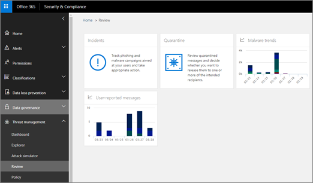

# Анализ угроз и реагирование на них

[!INCLUDE [Microsoft 365 Defender rebranding](../includes/microsoft-defender-for-office.md)]

**Группа ресурсов**
- [Microsoft Defender для Office 365 (план 2)](defender-for-office-365.md)

Возможности расследования и реагирования на угрозы в [Microsoft Defender для](defender-for-office-365.md) Office 365 помогают аналитикам и администраторам безопасности защитить Microsoft 365 организации для бизнес-пользователей с помощью:

- Упростит идентификацию, отслеживание и понимание кибератак
- Помощь в быстром устранении угроз в Exchange Online, SharePoint Online, OneDrive для бизнеса и Microsoft Teams
- Предоставление информации и знаний для предотвращения кибератак на их организацию.
- Использование [автоматизированных расследований](automated-investigation-response-office.md) и ответов в Office 365 для критических угроз на основе электронной почты

Возможности расследования и реагирования на угрозы предоставляют сведения об угрозах и связанных с ними действиях реагирования, доступных на Microsoft 365 Defender портале. Эти сведения помогут группе безопасности организации защитить пользователей от атак на основе электронной почты или файлов. Эти возможности помогают отслеживать сигналы и собирать данные из нескольких источников, таких как активность пользователей, проверка подлинности, электронная почта, скомпрометированная компьютерная информация и инциденты с безопасностью. Лица, принимающие решения для бизнеса и ваша команда по операциям безопасности, могут использовать эти сведения для понимания и реагирования на угрозы в отношении вашей организации и защиты интеллектуальной собственности.

## Знакомство с средствами расследования и реагирования на угрозы

Возможности расследования угроз и реагирования на них Microsoft 365 Defender на портале в качестве набора инструментов и процессов реагирования, включая следующие:

- [Обозреватель](#explorer)
- [Инциденты](#incidents)
- [Обучение имитации атаки](attack-simulation-training.md)
- [Автоматизированный анализ угроз и реагирование на них](automated-investigation-response-office.md)

### Обозреватель

Используйте [Explorer (и](threat-explorer.md) обнаружения в режиме реального времени) для анализа угроз, определения объема атак со временем и анализа данных семей угроз, инфраструктуры злоумышленников и других. Explorer (также именуется Обозреватель угроз) является начальным местом для рабочего процесса расследования любого аналитика безопасности.

Чтобы просмотреть и использовать этот отчет на Microsoft 365 Defender, перейдите в обозреватель **&**  >  **электронной почты.**

### Инциденты

В списке Инциденты (это также называется исследованиями) см. список инцидентов безопасности полетов. Инциденты используются для отслеживания таких угроз, как подозрительные сообщения электронной почты, а также для дальнейшего расследования и устранения.

Чтобы просмотреть список текущих инцидентов для вашей организации, на портале Microsoft 365 Defender перейдите на сайт **Incidents & оповещений**  >  **Incidents**.

### Обучение имитации атаки

Используйте обучение моделированию атаки, чтобы настроить и запустить реалистичные кибератаки в вашей организации, а также определить уязвимых людей до того, как реальная кибератака повлияет на ваш бизнес. Дополнительные дополнительные сообщения см. в [см. в сообщении Simulate a phishing attack.](attack-simulation-training.md)

Чтобы просмотреть и использовать эту функцию на портале Microsoft 365 Defender, перейдите на обучение моделированию & электронной  >  **почты.**

### Автоматическое исследование и реагирование

Используйте возможности автоматического расследования и реагирования (AIR), чтобы сэкономить время и усилия, связанные с контентом, устройствами и людьми, которые рискуют от угроз в вашей организации. Процессы AIR могут начинаться при запуске определенных оповещений или при запуске вашей командой операций безопасности. Дополнительные информации см. [в автоматическом расследовании и ответе в Office 365.](automated-investigation-response-office.md)

## Виджеты разведки угроз

В рамках предложения Microsoft Defender для Office 365 Plan 2 аналитики по безопасности могут просмотреть сведения о известной угрозе. Это полезно для определения того, существуют ли дополнительные профилактические меры или действия, которые можно предпринять для защиты пользователей.

## Как получить эти возможности?

Microsoft 365 и возможности реагирования на угрозы включены в Microsoft Defender для Office 365 Plan 2, который входит в Enterprise E5 или в качестве надстройки для определенных подписок. Дополнительные дополнительные информации см. в [Office 365 Defender for plan 1 и Plan 2.](defender-for-office-365.md#microsoft-defender-for-office-365-plan-1-and-plan-2)

## Обязательные роли и разрешения

Microsoft Defender для Office 365 использует управление доступом на основе ролей. Разрешения назначены с помощью определенных ролей в Azure Active Directory, Центр администрирования Microsoft 365 или Microsoft 365 Defender портале.

> [!TIP]
> Хотя некоторые роли, например администратор безопасности, можно на Microsoft 365 Defender портале, следует использовать Центр администрирования Microsoft 365 или Azure Active Directory. Сведения о ролях, группах ролей и разрешениях см. в следующих ресурсах:
>
> - [Разрешения на портале Microsoft 365 Defender](permissions-microsoft-365-security-center.md)
> - [Разрешения роли администратора в Azure Active Directory](/azure/active-directory/users-groups-roles/directory-assign-admin-roles)

 

****

|Действия|Роли и разрешения|
|---|---|
|Используйте панель управления & уязвимостей (или новую панель [мониторинга безопасности)](security-dashboard.md) 
 Просмотр сведений о недавних или текущих угрозах|Один из следующих продуктов: <ul><li>**Глобальный администратор**</li><li>**Администратор безопасности**</li><li>**Считыватель безопасности**</li></ul> 
 Эти роли могут быть назначены в Azure Active Directory () или <https://portal.azure.com> Центр администрирования Microsoft 365 ( <https://admin.microsoft.com> ).|
|Использование Explorer (и обнаружения [в режиме реального времени)](threat-explorer.md) для анализа угроз|Один из следующих продуктов: <ul><li>**Глобальный администратор**</li><li>**Администратор безопасности**</li><li>**Считыватель безопасности**</li></ul> 
 Эти роли могут быть назначены в Azure Active Directory () или <https://portal.azure.com> Центр администрирования Microsoft 365 ( <https://admin.microsoft.com> ).|
|Просмотр инцидентов (также именуемой исследованиями) 
 Добавление сообщений электронной почты в инцидент|Один из следующих продуктов: <ul><li>**Глобальный администратор**</li><li>**Администратор безопасности**</li><li>**Считыватель безопасности**</li></ul> 
 Эти роли могут быть назначены в Azure Active Directory () или <https://portal.azure.com> Центр администрирования Microsoft 365 ( <https://admin.microsoft.com> ).|
|Триггер действий электронной почты в случае инцидента 
 Поиск и удаление подозрительных сообщений электронной почты|Один из следующих продуктов: <ul><li>**Глобальный администратор**</li><li>**Администратор безопасности** плюс роль **поиска и очистки**</li></ul> 
 Роли **глобального** администратора и администратора безопасности могут быть назначены в Azure Active Directory () или Центр администрирования Microsoft 365 (  <https://portal.azure.com> <https://admin.microsoft.com> ). 
 Роль **поиска и очистки** должна быть  назначена в роли совместной & электронной почты на портале Microsoft 36 Defender ( <https://security.microsoft.com> ).|
|Интеграция Microsoft Defender для Office 365 Plan 2 с Microsoft Defender для конечной точки 
 Интеграция Microsoft Defender для Office 365 Plan 2 с сервером SIEM|Роль **глобального администратора** или администратора безопасности, назначенная в Azure Active Directory () или Центр администрирования Microsoft 365 (  <https://portal.azure.com> <https://admin.microsoft.com> ). 
 --- **plus** --- 
 Соответствующая роль, назначенная в дополнительных приложениях [(например, Центр безопасности в Microsoft Defender](/windows/security/threat-protection/microsoft-defender-atp/user-roles) или сервере SIEM).|
|

## Дальнейшие действия

- [Узнайте о отслеживании угроз - Новые и заслуживающие внимания](threat-trackers.md)
- [Поиск и расследование вредоносной электронной почты, которая была доставлена (Office 365 и ответа на угрозы)](investigate-malicious-email-that-was-delivered.md)
- [Интеграция Office 365 и реагирования на угрозы с Microsoft Defender для конечной точки](integrate-office-365-ti-with-mde.md)
- [Имитация фишинговой атаки](attack-simulation-training.md)
