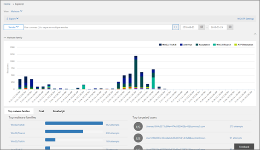

# Анализ угроз и реагирование на них

[!INCLUDE [Microsoft 365 Defender rebranding](../includes/microsoft-defender-for-office.md)]

Исследование угроз и возможности реагирования в [защитнике Майкрософт для Office 365](office-365-atp.md) аналитики и администраторы помогают администраторам системы безопасности и администраторам защищать Microsoft 365 для бизнеса:

- Упрощение идентификации, отслеживания и представления кибератаки
- Помощь в быстром устранении угроз в Exchange Online, SharePoint Online, OneDrive для бизнеса и Microsoft Teams
- Предоставление ценных сведений и знаний по обеспечению безопасности, предотвращающих кибератаки в Организации.
- Применение [автоматического исследования и ответа в Office 365](automated-investigation-response-office.md) для критически важных угроз электронной почты

Исследование угроз и возможности реагирования обеспечивают получение ценных сведений о угрозах и связанных действиях отклика, доступных в центре безопасности & соответствия требованиям. Эти сведения помогут группе безопасности вашей организации защитить пользователей от атак с использованием электронной почты или файлов. Сведения о возможностях отслеживания и сбора данных из нескольких источников, таких как действия пользователей, проверка подлинности, электронная почта, скомпрометированные компьютеры и инциденты безопасности. Лица, принимающие бизнес-решения, и группа "операции по обеспечению безопасности" могут использовать эту информацию для анализа и реагирования на угрозы в Организации и защиты интеллектуальной собственности.

## Знакомство с расследованиям угроз и средствами реагирования

Средство расследования угроз и возможности реагирования в центре безопасности & соответствия требованиям в виде набора средств и рабочих процессов ответа, в том числе следующих:

- [Панель мониторинга угроз](#threat-dashboard)
- [Обозреватель](#threat-explorer)
- [Инциденты](#incidents)
- [Эмулятор атак](#attack-simulator)
- [Автоматизированный анализ угроз и реагирование на них](automated-investigation-response-office.md)

### Панель мониторинга угроз

Используйте панель мониторинга угроз (это также называется [панелью мониторинга безопасности](security-dashboard.md)), чтобы быстро узнать, какие угрозы были устранены, а как визуально сообщить ответственным за бизнес-решениям, как Microsoft 365 Services обеспечивает безопасность вашего предприятия.

Чтобы просмотреть и использовать эту панель мониторинга, в центре безопасности & соответствия требованиям перейдите на панель мониторинга **управления угрозами** \> **Dashboard**.

### Обозреватель угроз

Использование [обозревателя угроз (и обнаружения в реальном времени)](threat-explorer.md) для анализа угроз, просмотра данных по времени и анализа данных по семействам угроз, инфраструктуре злоумышленников и т. д. Обозреватель угроз (также называемый проводником) — это начальное место для любого рабочего процесса анализа безопасности.

Чтобы просмотреть и использовать этот отчет, в центре безопасности & соответствия требованиям перейдите в обозреватель **управления угрозами** \> **Explorer**.

### Инциденты

Используйте список инцидентов (это также называется расследования), чтобы просмотреть список происшествий безопасности рейса. Инциденты используются для отслеживания угроз, таких как подозрительные сообщения электронной почты, а также для проведения дальнейших исследований и исправления.

Чтобы просмотреть список текущих инцидентов в Организации, в центре безопасности & соответствия требованиям перейдите к **Threat management** \> **Review** \> **инцидентам** проверки управления угрозами.

### Эмулятор атак

Используйте симулятор для атаки, чтобы настроить и выполнить реалистичные кибератаки в Организации, а затем определить уязвимых людей, прежде чем реальный цибераттакк повлияет на ваш бизнес. Дополнительные сведения см [в симуляторе атак в Office 365](attack-simulator.md).

### Автоматическое исследование и реагирование

Используйте возможности автоматического исследования и реагирования (AIR), чтобы сэкономить время и усилия при взаимосвязи контента, устройств и людей с угрозами в вашей организации. Процессы AIR могут начаться при срабатывании определенных оповещений или при запуске группы "Управление средствами безопасности". Чтобы узнать больше, ознакомьтесь со статьей [Автоматическое исследование и ответ в Office 365](automated-investigation-response-office.md).

## Мини-элементы аналитики для защиты от угроз

В рамках защитника Майкрософт для Office 365 Plan 2 аналитики безопасности могут просматривать сведения об известной угрозе. Это полезно, чтобы определить, есть ли дополнительные меры по превентивной безопасности, которые можно предпринять для защиты пользователей.

## Как получить эти возможности?

Microsoft 365 Threat расследования и возможности реагирования включены в защитник Майкрософт для Office 365 (план 2), который включен в корпоративную строку "Корпоративная" или в качестве надстройки для определенных подписок. Чтобы узнать больше, ознакомьтесь со статьей ["защитник для Office 365, план 1" и планирование 2](office-365-atp.md#microsoft-defender-for-office-365-plan-1-and-plan-2).

## Обязательные роли и разрешения

Защитник Майкрософт для Office 365 использует управление доступом на основе ролей. Разрешения назначаются с помощью определенных ролей в Azure Active Directory, в центре администрирования Microsoft 365 или центре безопасности & соответствия требованиям.

> [!TIP]
> Несмотря на то, что некоторые роли, например администратор безопасности, могут быть назначены в центре безопасности & соответствия требованиям, рекомендуется использовать вместо центра администрирования Microsoft 365 или Azure Active Directory. Сведения о ролях, группах ролей и разрешениях можно найти в следующих ресурсах:
>
> - [Разрешения в Центре безопасности и соответствия требованиям](permissions-in-the-security-and-compliance-center.md)
>
> - [Разрешения роли администратора в Azure Active Directory](https://docs.microsoft.com/azure/active-directory/users-groups-roles/directory-assign-admin-roles)

****

|Действие|Роли и разрешения|
|---|---|
|Использование панели мониторинга угроз (или новой [панели мониторинга безопасности](security-dashboard.md))   Просмотр сведений о последних и текущих угрозах|Один из следующих продуктов:  - **Глобальный администратор**    - **Администратор безопасности**  - **Средство чтения безопасности**    Эти роли можно назначить в Azure Active Directory ( [https://portal.azure.com](https://portal.azure.com) ) или в центре администрирования Microsoft 365 ( [https://admin.microsoft.com](https://admin.microsoft.com) ).|
|Использование [обозревателя угроз (и обнаружения в реальном времени)](threat-explorer.md) для анализа угроз|Один из следующих продуктов:  - **Глобальный администратор**    - **Администратор безопасности**  - **Средство чтения безопасности**    Эти роли можно назначить в Azure Active Directory ( [https://portal.azure.com](https://portal.azure.com) ) или в центре администрирования Microsoft 365 ( [https://admin.microsoft.com](https://admin.microsoft.com) ).|
|Просмотр инцидентов (также называемых исследованиями)   Добавление сообщений электронной почты в инцидент|Один из следующих продуктов:  - **Глобальный администратор**    - **Администратор безопасности**  - **Средство чтения безопасности**    Эти роли можно назначить в Azure Active Directory ( [https://portal.azure.com](https://portal.azure.com) ) или в центре администрирования Microsoft 365 ( [https://admin.microsoft.com](https://admin.microsoft.com) ).|
|Запуск действий электронной почты в инциденте     Поиск и удаление подозрительных сообщений электронной почты|Один из следующих продуктов:  - **Глобальный администратор**    - **Администратор безопасности** , а также роль **поиска и очистки**  Роли **глобального администратора** и **администратора безопасности** можно назначить в Azure Active Directory ( [https://portal.azure.com](https://portal.azure.com) ) или центре администрирования Microsoft 365 ( [https://admin.microsoft.com](https://admin.microsoft.com) ).   Роль **поиска и очистки** должна быть назначена в центре безопасности & соответствия требованиям ( [https://protection.office.com](https://protection.office.com) ).|
|Интеграция защитника Майкрософт для Office 365 Plan 2 с защитником Майкрософт для конечной точки     Интеграция защитника Майкрософт для Office 365 (план 2) с сервером SIEM|Либо **глобальный администратор** , либо роль **администратора безопасности** , назначенная в Azure Active Directory ( [https://portal.azure.com](https://portal.azure.com) ) или центре администрирования Microsoft 365 ( [https://admin.microsoft.com](https://admin.microsoft.com) ). --- **плюс** --- Соответствующая роль, назначенная в дополнительных приложениях (например, в [центре безопасности защитника Майкрософт](https://docs.microsoft.com/windows/security/threat-protection/microsoft-defender-atp/user-roles) или на сервере SIEM).|
|

## Дальнейшие действия

- [Сведения о средствах отслеживания угроз — новые и полезные](threat-trackers.md)

- [Поиск и исследование вредоносных сообщений электронной почты, которые были доставлены (Office 365: исследование угроз и ответ на них)](investigate-malicious-email-that-was-delivered.md)

- [Интеграция Office 365 Threat расследования и ответ с помощью защитника Майкрософт для конечной точки](integrate-office-365-ti-with-wdatp.md)

- [Сведения о симуляторе атак](attack-simulator.md)
