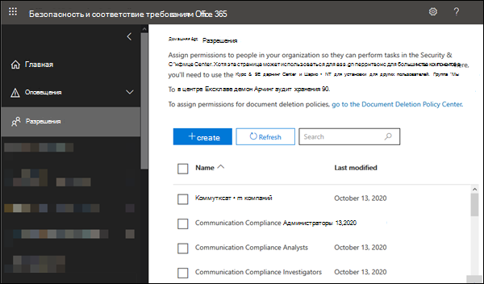
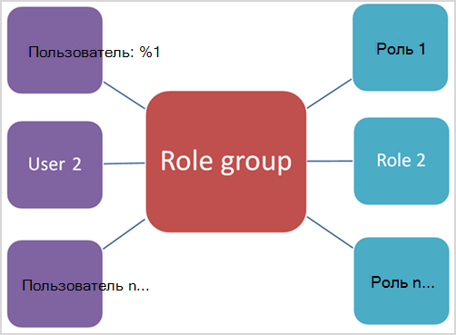

# Разрешения в Центре безопасности и соответствия требованиям

[!INCLUDE [Microsoft 365 Defender rebranding](../includes/microsoft-defender-for-office.md)]

**Область применения**
- [Exchange Online Protection](exchange-online-protection-overview.md)
- [Microsoft Defender для Office 365 (план 1 и план 2)](office-365-atp.md)
- [Microsoft 365 Defender](../mtp/microsoft-threat-protection.md)

Центр безопасности & соответствия требованиям позволяет предоставлять разрешения пользователям, которые выполняют такие задачи соответствия требованиям, как управление устройствами, предотвращение потери данных, eDiscovery, хранение и так далее. Эти пользователи могут выполнять только те задачи, для которых вы явно предоставили доступ. Для доступа к Центру & соответствия требованиям пользователям необходимо быть глобальным администратором или членом одной или & групп ролей Центра безопасности и соответствия требованиям.

Разрешения в Центре безопасности & соответствия требованиям основаны на модели разрешений управления доступом на основе ролей (RBAC). RBAC — это та же модель разрешений, которая используется в Exchange, поэтому если вы знакомы с Exchange, предоставление разрешений в Центре безопасности и соответствия требованиям & будет очень похожим. Однако важно помнить, что группы ролей Exchange и группы ролей & безопасности и соответствия требованиям не имеют права на участие или разрешения. Хотя в них есть группы ролей Organization Management, они не совпадают. Разрешения, которые они предоставляют, и члены групп ролей, не совпадают. Ниже приведен список групп ролей Центра & безопасности.

## Связи между членами, ролями и группами ролей

**Роль** предоставляет разрешения на выполнение набора задач, например роль управления инцидентами позволяет пользователям работать с делами eDiscovery.

Группа **ролей —** это набор ролей, позволяющих пользователям работать в Центре безопасности & соответствия требованиям. Например, группа ролей администратора соответствия требованиям включает (среди прочих ролей) роли для управления делами, поиска контента и конфигурации организации (а также другие), так как для выполнения этих задач нужны разрешения администратора соответствия требованиям.

Центр безопасности & соответствия требованиям включает группы ролей по умолчанию для наиболее распространенных задач и функций, которые необходимо назначить людям. Мы рекомендуем просто добавить отдельных пользователей в **качестве членов** в группы ролей по умолчанию.

## Разрешения, необходимые для использования функций в Центре безопасности & соответствия требованиям

В следующей таблице перечислены группы ролей по умолчанию, доступные в Центре безопасности & соответствия требованиям, а также роли, которые назначены группам ролей по умолчанию. Чтобы предоставить пользователю разрешения на выполнение задачи соответствия требованиям, добавьте его в соответствующую группу ролей Центра & соответствия требованиям.

Управление разрешениями в Центре & соответствия требованиям предоставляет пользователям доступ только к функциям соответствия требованиям, доступным в самом Центре безопасности & соответствия требованиям. Если вы хотите предоставить разрешения для других функций соответствия требованиям, не в центре безопасности и & соответствия требованиям, таких как правила потока обработки почты Exchange (также известные как правила транспорта), необходимо использовать Центр администрирования Exchange.

Чтобы узнать, как предоставить доступ к Центру безопасности & соответствия требованиям, ознакомьтесь с этой темой, чтобы узнать, как предоставить пользователям доступ к Центру администрирования соответствия требованиям [Microsoft 365.](grant-access-to-the-security-and-compliance-center.md)

> [!NOTE]
> Чтобы **просмотреть вкладку "Разрешения"** в Центре безопасности & соответствия требованиям, необходимо быть администратором. В частности, вам должна быть  назначена роль управления ролами,  которая по умолчанию назначена только группе ролей "Управление организацией" в Центре безопасности & соответствия требованиям. Кроме того, роль **управления** ролями позволяет пользователям просматривать, создавать и изменять группы ролей.

  

****

|Группа ролей|Описание|Назначены роли по умолчанию|
|---|---|---|
|**Соответствие требованиям к коммуникациям**|Предоставляет разрешения для всех ролей соответствия коммуникации: администратору, аналитику, следователю и средству просмотра.|Управление делами 
 Администратор соответствия требованиям к коммуникациям 
 Анализ соответствия требованиям к коммуникациям 
 Управление случаями соответствия коммуникациям 
 Исследование соответствия коммуникациям требованиям 
 Просмотр соответствия требованиям к коммуникациям 
 Поставщик отзывов о классификации данных 
 View-Only case|
|**Администраторы соответствия требованиям к коммуникациям**|Администраторы соответствия требованиям к коммуникациям, которые могут создавать и изменять политики и определять глобальные параметры.|Администратор соответствия требованиям к коммуникациям 
 Управление случаями соответствия коммуникациям|
|**Аналитики соответствия коммуникациям**|Аналитики соответствия коммуникациям, которые могут исследовать совпадения политик, просматривать метаданные сообщений и принимать меры по исправлению.|Анализ соответствия требованиям к коммуникациям 
 Управление случаями соответствия коммуникациям|
|**Следователи по обеспечению соответствия коммуникациям**|Аналитики соответствия коммуникациям, которые могут исследовать совпадения политик, просматривать содержимое сообщений и принимать меры по исправлению.|Управление делами 
 Анализ соответствия требованиям к коммуникациям 
 Управление случаями соответствия коммуникациям 
 Исследование соответствия коммуникациям требованиям 
 Поставщик отзывов о классификации данных 
 View-Only case|
|**Средства просмотра соответствия требованиям к коммуникациям**|Просматривает соответствие коммуникации требованиям, которое может получить доступ к доступным отчетам и мини-приложениям.|Управление случаями соответствия коммуникациям 
 Просмотр соответствия требованиям к коммуникациям|
|**Администратор соответствия требованиям**1|Участники могут управлять настройками для управления устройствами, защиты от потери данных, отчетов и сохранения.|Управление делами 
 Администратор соответствия 
 Поиск соответствия 
 Поставщик отзывов о классификации данных 
 Рецензент отзывов о классификации данных 
 Управление устройствами 
 Управление расположением 
 Управление соответствием требованиям DLP 
 Hold 
 Управление соответствием требованиям IB 
 Управление оповещениями 
 Конфигурация организации 
 RecordManagement 
 Управление хранением 
 View-Only аудита 
 View-Only case 
 View-Only устройств 
 View-Only DLP Compliance Management 
 View-Only соответствия требованиям IB 
 View-Only управление оповещениями 
 Получатели только для чтения 
 View-Only управления записями 
 View-Only хранения|
|**Администратор данных соответствия требованиям**|Участники могут управлять настройками для управления устройствами, защиты данных, защиты от потери данных, отчетов и сохранения.|Администратор соответствия 
 Поиск соответствия 
 Управление устройствами 
 Управление соответствием требованиям DLP 
 Управление расположением 
 Управление соответствием требованиям IB 
 Управление оповещениями 
 Конфигурация организации 
 RecordManagement 
 Управление хранением 
 Администратор меток конфиденциальности 
 View-Only аудита 
 View-Only устройств 
 View-Only DLP Compliance Management 
 View-Only соответствия требованиям IB 
 View-Only управление оповещениями 
 Получатели только для чтения 
 View-Only управления записями 
 View-Only хранения|
|**Администраторы диспетчера соответствия требованиям**|Управление созданием и изменением шаблонов.|Администрирование диспетчера соответствия требованиям 
 Оценка в диспетчере соответствия требованиям 
 Участие в диспетчере соответствия требованиям 
 Compliance Manager Reader (Читатель диспетчера соответствия требованиям)|
|**Оценщики в диспетчере соответствия требованиям**|Создание оценок, реализация действий по улучшению и обновление состояния тестирования для действий по улучшению.|Оценка в диспетчере соответствия требованиям 
 Участие в диспетчере соответствия требованиям 
 Compliance Manager Reader (Читатель диспетчера соответствия требованиям)|
|**Участники в диспетчере соответствия требованиям**|Создание оценок и выполнение работы по реализации действий по улучшению.|Участие в диспетчере соответствия требованиям 
 Compliance Manager Reader (Читатель диспетчера соответствия требованиям)|
|**Читатели в диспетчере соответствия требованиям**|Просмотр всего контента диспетчера соответствия требованиям, кроме функций администратора.|Compliance Manager Reader (Читатель диспетчера соответствия требованиям)|
|**Просмотр содержимого обозревателя содержимого**|Просмотр файлов содержимого в обозревателе содержимого.|Просмотр контента классификации данных|
|**Просмотр списка в обозревателе содержимого**|Просмотр всех элементов в обозревателе содержимого только в формате списка.|Просмотр списка классификации данных|
|**Руководитель службы обнаружения электронных данных**|Члены этой группы ролей могут выполнять поиск и хранение на месте почтовых ящиков, сайтов SharePoint Online и расположений OneDrive для бизнеса. Участники также могут создавать дела eDiscovery и управлять ими, добавлять и удалять участников дела, создавать и редактировать операции поиска контента, связанные с делом, и получать доступ к данным дела в Advanced eDiscovery. 
 Администратор, ответственный за обнаружение электронных данных является членом группы ролей "Руководитель службы обнаружения электронных данных" и имеет дополнительные разрешения. В дополнение к задачам, которые может выполнять руководитель eDiscovery, администратор eDiscovery может:<ul><li>Просмотр всех дел eDiscovery в организации.</li><li>Управляйте любым делом eDiscovery после того, как они добавят себя в качестве участника дела.</li></ul> 
 Основное различие между менеджером по обнаружению электронных данных и администратором eDiscovery состоит в том, что администратор может получить доступ ко всем делам, указанным на странице дел **eDiscovery** в Центре безопасности и соответствия требованиям & соответствия требованиям. Менеджер по обнаружению электронных данным может получить доступ только к созданным им делам или делам, в которые он входит. Дополнительные сведения о назначении пользователя администратором при обнаружении электронных данных см. в центре безопасности [& соответствия требованиям.](../../compliance/assign-ediscovery-permissions.md)|Управление делами 
 Коммуникации 
 Поиск соответствия 
 Custodian 
 Экспорт 
 Hold 
 Предварительная версия 
 Проверка 
 Расшифровка RMS|
|**Глобальный читатель**|Участники имеют доступ только для чтения к отчетам, оповещениям и могут видеть все настройки и параметры.
 Основное различие между глобальными читатель и читатель безопасности заключается в том, что глобальный читатель может получить доступ к **конфигурации и параметрам.**|Читатель сведений о безопасности 
 Читатель меток конфиденциальности 
 Представление Service Assurance 
 View-Only аудита 
 View-Only устройств 
 View-Only DLP Compliance Management 
 View-Only соответствия требованиям IB 
 View-Only управление оповещениями 
 Получатели только для чтения 
 View-Only управления записями 
 View-Only хранения|
|**Управление рисками внутри организации**|Используйте эту группу ролей для управления управлением рисками внутри организации в одной группе. Добавляя все учетные записи пользователей для назначенных администраторов, аналитиков и следователей, вы можете настроить разрешения управления рисками внутри организации в одной группе. Эта группа ролей содержит все роли разрешений для управления рисками внутри организации. Это самый простой способ быстро начать работу с управлением рисками внутри организации, и он подходит для организаций, которые не нуждаются в отдельных разрешениях, определенных для отдельных групп пользователей.|Управление делами 
 Администратор управления рисками для внутренней оценки 
 Анализ управления рисками внутри организации 
 Insider Risk Management Investigation 
 View-Only case|
|**Администраторы управления рисками внутри организации**|Используйте эту группу ролей для первоначальной настройки управления рисками внутри организации, а затем для разделения администраторов внутри организации на определенную группу. Пользователи в этой группе ролей могут создавать, читать, обновлять и удалять внутренние политики управления рисками, глобальные параметры и назначения групп ролей.|Управление делами 
 Администратор управления рисками для внутренней оценки 
 View-Only case|
|**Аналитики по управлению внутренними рисками**|Используйте эту группу для назначения разрешений пользователям, которые будут выступать в качестве аналитиков по рискам внутри компании. Пользователи в этой группе ролей могут получать доступ ко всем оповещениям, делам и шаблонам уведомлений об управлении рисками внутри организации. Они не могут получить доступ к обозревателю контента с insider risk.|Управление делами 
 Анализ управления рисками внутри организации 
 View-Only case|
|**Аудиторы по управлению рисками внутри организации**|Аудиторы управления insider risk management, которые могут просматривать журналы аудита действий, выполняемых аналитиками, следователями и администраторами.|Аудит управления рисками внутри организации|
|**Исследователи управления внутренними рисками**|Используйте эту группу для назначения разрешений пользователям, которые будут выступать в качестве участников расследования по данным о рисках. Пользователи в этой группе ролей могут получать доступ ко всем оповещениям, делам, шаблонам уведомлений и обозревателю содержимого для всех случаев.|Управление делами 
 Insider Risk Management Investigation 
 View-Only case|
|**Участники IRM**|Эта группа ролей видна, но используется только фоновой службой.|Постоянное участие в управлении рисками внутри организации 
 Временное участие в управлении рисками внутри организации|
|**Администратор почтового процесса**|Участники могут отслеживать и просматривать сведения о потоке обработки почты и отчеты в Центре & соответствия требованиям. Глобальные администраторы могут добавлять обычных пользователей в эту группу, но если пользователь не входит в группу администраторов Exchange, у пользователя не будет доступа к задачам, связанным с администрированием Exchange.|Получатели только для чтения|
|**Управление организацией**1|Участники могут управлять разрешениями на доступ к функциям в Центре безопасности & соответствия требованиям, а также управлять настройками для управления устройствами, защиты от потери данных, отчетов и сохранения. 
 Пользователи, которые не являются глобальными администраторами, должны быть администраторами Exchange, чтобы видеть и принимать меры на устройствах, управляемых basic Mobility and Security для Microsoft 365 (прежнее название — управление мобильными устройствами или MDM). 
 Глобальные администраторы автоматически добавляются в эту группу ролей.|Журналы аудита 
 Управление делами 
 Администратор соответствия 
 Поиск соответствия 
 Управление устройствами 
 Управление соответствием требованиям DLP 
 Hold 
 Управление соответствием требованиям IB 
 Управление оповещениями 
 Конфигурация организации 
 Карантин 
 RecordManagement 
 Управление хранением 
 Управление ролами 
 Поиск и очистка 
 Администратор безопасности 
 Читатель сведений о безопасности 
 Администратор меток конфиденциальности 
 Читатель меток конфиденциальности 
 Представление Service Assurance 
 Участник тегов 
 Диспетчер тегов 
 Читатель тегов 
 View-Only аудита 
 View-Only устройств 
 View-Only DLP Compliance Management 
 View-Only соответствия требованиям IB 
 View-Only case 
 View-Only управление оповещениями 
 Получатели только для чтения 
 View-Only управления записями 
 View-Only хранения|
|**Администратор карантина**|Участники могут получить доступ ко всем действиям карантина. Дополнительные сведения см. в под управлением сообщений и файлов на карантине от имени [администратора в EOP](manage-quarantined-messages-and-files.md)|Карантин|
|**Управление записями**|Участники могут настраивать все аспекты управления записями, включая метки хранения и проверки выверки.|Управление расположением 
 RecordManagement 
 Управление хранением|
|**Reviewer**|Участники могут получить доступ к наборам для проверки [в случаях Advanced eDiscovery.](../../compliance/overview-ediscovery-20.md) Участники этой группы ролей могут видеть и открывать список дел на странице **"EDiscovery > Advanced"** в Центре соответствия требованиям Microsoft 365, в который они являются участниками. После того как пользователь получает доступ к делу Advanced eDiscovery, он может выбрать наборы проверки для доступа к данным дела.  Эта роль не позволяет пользователю просматривать результаты поиска в коллекции, связанной с делом, или выполнять другие задачи поиска или управления делами. Члены этой группы ролей могут получить доступ только к данным в наборе для проверки.|Проверка|
|**Администратор безопасности**|Участники имеют доступ к ряду функций безопасности в Центре защиты идентификации, privileged Identity Management, мониторинге состояния служб Microsoft 365 и безопасности & Центре соответствия требованиям. 
 По умолчанию в этой группе ролей может не быть участников. Однако этой группе ролей назначена роль администратора безопасности из Azure Active Directory. Поэтому эта группа ролей наследует возможности и членство роли администратора безопасности от Azure Active Directory. 
 Чтобы централизованно управлять разрешениями, добавьте и удалите участников группы в Центре администрирования Azure Active Directory. Дополнительные сведения см. в сведениях о [разрешениях роли администратора в Azure Active Directory.](https://docs.microsoft.com/azure/active-directory/users-groups-roles/directory-assign-admin-roles) Если изменить эту группу ролей в Центре безопасности & соответствия требованиям (членство или роли), эти изменения применяются только к Центру безопасности & соответствия требованиям, а не к другим службам. 
 Эта группа ролей включает все разрешения, доступные только для чтения, для роли читателя безопасности, а также ряд дополнительных административных разрешений для тех же служб: Azure Information Protection, Центр защиты идентификации, Privileged Identity Management, Мониторинг состояния службы Microsoft 365 и Центр & соответствия требованиям.|Журналы аудита 
 Управление устройствами 
 Управление соответствием требованиям DLP 
 Управление соответствием требованиям IB 
 Управление оповещениями 
 Карантин 
 Администратор безопасности 
 Администратор меток конфиденциальности 
 Участник тегов 
 Диспетчер тегов 
 Читатель тегов 
 View-Only аудита 
 View-Only устройств 
 View-Only DLP Compliance Management 
 View-Only соответствия требованиям IB 
 View-Only управление оповещениями|
|**Оператор безопасности**|Участники могут управлять оповещениями системы безопасности, а также просматривать отчеты и параметры функций безопасности.|Поиск соответствия 
 Управление оповещениями 
 Читатель сведений о безопасности 
 Участник тегов 
 Читатель тегов 
 View-Only аудита 
 View-Only устройств 
 View-Only DLP Compliance Management 
 View-Only соответствия требованиям IB 
 View-Only управление оповещениями|
|**Читатель безопасности**|Участники имеют доступ только для чтения к ряду функций безопасности в Центре защиты идентификации, privileged Identity Management, мониторинге состояния службы Microsoft 365 и центре безопасности & соответствия требованиям. 
 По умолчанию в этой группе ролей может не быть участников. Однако этой группе ролей назначена роль читателя безопасности из Azure Active Directory. Следовательно, эта группа ролей наследует возможности и членство в роли читателя безопасности от Azure Active Directory. 
 Чтобы централизованно управлять разрешениями, добавьте и удалите участников группы в Центре администрирования Azure Active Directory. Дополнительные сведения см. в сведениях о [разрешениях роли администратора в Azure Active Directory.](https://docs.microsoft.com/azure/active-directory/users-groups-roles/directory-assign-admin-roles) Если изменить эту группу ролей в Центре безопасности & соответствия требованиям (членство или роли), эти изменения применяются только к Центру безопасности & соответствия требованиям, а не к другим службам.|Читатель сведений о безопасности 
 Читатель меток конфиденциальности 
 Читатель тегов 
 View-Only устройств 
 View-Only DLP Compliance Management 
 View-Only соответствия требованиям IB 
 View-Only управление оповещениями|
|**Пользователь контроля качества обслуживания**|Участники могут получить доступ к разделу "Контроль службы" в Центре & соответствия требованиям. Служба контроля обслуживания предоставляет отчеты и документы, описывая методики майкрософт по обеспечению безопасности данных клиентов, хранимые в Microsoft 365. Он также предоставляет независимые сторонние отчеты аудита в Microsoft 365. Дополнительные сведения [см.](../../compliance/service-assurance.md)в центре безопасности и соответствия & service assurance.|Представление Service Assurance|
|**Надзорная проверка**|Участники могут создавать политики, определяющие виды коммуникации, которые необходимо проверять в организации, и управлять ими. Дополнительные сведения см. в подстройке "Настройка политик соответствия требованиям [к коммуникациям" для организации.](../../compliance/communication-compliance-configure.md)|Администратор надзорной проверки|
|

> [!NOTE]
> 1 Эта группа ролей не назначает участникам разрешения, необходимые для поиска в журнале аудита или использования отчетов, которые могут включать данные Exchange, например отчеты DLP или Defender для Office 365. Для поиска в журнале аудита или просмотра всех отчетов пользователю должны быть назначены разрешения в Exchange Online. Это связано с тем, что для поиска в журнале аудита используется командлет Exchange Online. Глобальные администраторы могут искать данные в журнале аудита и просматривать все отчеты, так как они автоматически добавляются в качестве членов группы ролей "Управление организацией" в Exchange Online. Дополнительные сведения см. в журнале аудита в Центре [безопасности & соответствия требованиям.](../../compliance/search-the-audit-log-in-security-and-compliance.md)

## Роли в Центре безопасности & соответствия требованиям

В следующей таблице перечислены доступные роли и группы ролей, которые они назначены по умолчанию.

Обратите внимание, что по умолчанию группе ролей Управление организацией не назначены следующие роли:

- Администратор имитатора атак
- Автор полезной нагрузки симулятора атаки
- Коммуникации
- Администратор соответствия требованиям к коммуникациям
- Анализ соответствия требованиям к коммуникациям
- Управление случаями соответствия коммуникациям
- Исследование соответствия коммуникациям требованиям
- Просмотр соответствия требованиям к коммуникациям
- Администрирование диспетчера соответствия требованиям
- Оценка в диспетчере соответствия требованиям
- Участие в диспетчере соответствия требованиям
- Compliance Manager Reader (Читатель диспетчера соответствия требованиям)
- Custodian
- Просмотр контента классификации данных
- Поставщик отзывов о классификации данных
- Рецензент отзывов о классификации данных
- Просмотр списка классификации данных
- Управление расположением
- Экспорт
- Администратор управления рисками для внутренней оценки
- Анализ управления рисками внутри организации
- Аудит управления рисками внутри организации
- Insider Risk Management Investigation
- Постоянное участие в управлении рисками внутри организации
- Временное участие в управлении рисками внутри организации
- Предварительная версия
- Проверка
- Расшифровка RMS
- Администратор надзорной проверки

  

****

|Роль|Описание|Назначения группы ролей по умолчанию|
|---|---|---|
|**Администратор имитатора атак**|Используется для создания и управления всеми аспектами кампаний моделирования атак.||
|**Автор полезной нагрузки симулятора атаки**|Используется для создания и управления полезной нагрузкой атаки, которую может развернуть администратор имитатора атак.||
|**Журналы аудита**|Включив и настроив аудит для организации, просматривая отчеты аудита организации, а затем экспортировать эти отчеты в файл.|Управление организацией 
 Администратор безопасности|
|**Управление делами**|Создание, изменение, удаление и управление доступом к делам eDiscovery.|Соответствие требованиям к обмену данными 
 Следователи по обеспечению соответствия коммуникациям 
 Администратор соответствия 
Руководитель службы обнаружения электронных данных 
 Управление внутренними рисками 
 Администраторы управления рисками внутри организации 
 Аналитики по управлению внутренними рисками 
 Исследователи управления внутренними рисками 
 Управление организацией|
|**Коммуникации**|Управление всеми взаимодействиями с хранителями, которые определены в деле Advanced eDiscovery.  Создание уведомлений об удержании, напоминаний об удержаниях и эскалаций для управления. Отслеживайте подтверждение хранителя уведомлений об удержании и управляйте доступом к порталу хранителя, который используется каждым хранителями в деле для отслеживания сообщений о случаях, когда они были определены как хранители.|Руководитель службы обнаружения электронных данных|
|**Администратор соответствия требованиям к коммуникациям**|Используется для управления политиками в функции соответствия коммуникациям.|Соответствие требованиям к обмену данными 
 Администраторы соответствия требованиям к коммуникациям|
|**Анализ соответствия требованиям к коммуникациям**|Используется для исследования, устранения нарушений сообщений в функции соответствия коммуникациям. Можно просматривать только метаданные сообщений.|Соответствие требованиям к обмену данными 
 Аналитики соответствия коммуникациям 
 Следователи по обеспечению соответствия коммуникациям|
|**Управление случаями соответствия коммуникациям**|Используется для доступа к делам соответствия коммуникации требованиям.|Соответствие требованиям к обмену данными 
 Администраторы соответствия требованиям к коммуникациям 
 Аналитики соответствия коммуникациям 
 Следователи по обеспечению соответствия коммуникациям 
 Средства просмотра соответствия требованиям к коммуникациям|
|**Исследование соответствия коммуникациям требованиям**|Используется для исследования, устранения и проверки нарушений сообщений в функции соответствия коммуникациям. Можно просматривать метаданные сообщений и сообщения.|Соответствие требованиям к обмену данными 
 Следователи по обеспечению соответствия коммуникациям|
|**Просмотр соответствия требованиям к коммуникациям**|Используется для доступа к отчетам и мини-приложениям в функции соответствия коммуникациям.|Соответствие требованиям к обмену данными 
 Средства просмотра соответствия требованиям к коммуникациям|
|**Администратор соответствия**|Просмотр и изменение параметров и отчетов для функций соответствия требованиям.|Администратор соответствия 
 Администратор данных соответствия требованиям 
 Управление организацией|
|**Администрирование диспетчера соответствия требованиям**|Управление созданием и изменением шаблонов.|Администраторы диспетчера соответствия требованиям|
|**Оценка в диспетчере соответствия требованиям**|Создание оценок, реализация действий по улучшению и обновление состояния тестирования для действий по улучшению.|Администраторы диспетчера соответствия требованиям 
 Оценщики в диспетчере соответствия требованиям|
|**Участие в диспетчере соответствия требованиям**|Создание оценок и выполнение работы по реализации действий по улучшению.|Администраторы диспетчера соответствия требованиям 
 Оценщики в диспетчере соответствия требованиям 
 Участники в диспетчере соответствия требованиям|
|**Читатель в диспетчере соответствия требованиям**|Просмотр всего контента диспетчера соответствия требованиям, кроме функций администратора.|Администраторы диспетчера соответствия требованиям 
 Оценщики в диспетчере соответствия требованиям 
 Участники в диспетчере соответствия требованиям 
 Читатели в диспетчере соответствия требованиям|
|**Поиск соответствия**|Выполните поиск в почтовых ящиках и получите оценку результатов.|Администратор соответствия 
 Администратор данных соответствия требованиям 
Руководитель службы обнаружения электронных данных 
 Управление организацией 
 Оператор безопасности|
|**Custodian**|Определите хранителей для дел Advanced eDiscovery и управляйте ими, а также используйте информацию из Azure Active Directory и других источников для поиска источников данных, связанных с хранителями. Связывать другие источники данных, такие как почтовые ящики, сайты SharePoint и Teams, с хранителями в деле.  На удержание по юридическим основаниям для источников данных, связанных с хранителями, с целью сохранения контента в контексте дела.|Руководитель службы обнаружения электронных данных|
|**Просмотр контента классификации данных**|Просмотр отображения файлов на месте в обозревателе содержимого.|Просмотр содержимого обозревателя содержимого|
|**Поставщик отзывов о классификации данных**|Позволяет предоставлять отзывы классификаторам в обозревателе содержимого.|Соответствие требованиям к обмену данными 
 Следователи по обеспечению соответствия коммуникациям 
 Администратор соответствия|
|**Рецензент отзывов о классификации данных**|Позволяет просмотреть отзывы от классификаторов в обозревателе отзывов.|Администратор соответствия|
|**Просмотр списка классификации данных**|Просмотр списка файлов в обозревателе содержимого.|Просмотр списка в обозревателе содержимого|
|**Управление устройствами**|Просмотр и изменение параметров и отчетов для функций управления устройствами.|Администратор соответствия 
 Администратор данных соответствия требованиям 
 Управление организацией 
 Администратор безопасности|
|**Управление расположением**|Разрешения на управление доступом к ручным расположениям в Центре & соответствия требованиям.|Администратор соответствия 
 Администратор данных соответствия требованиям 
 Управление записями|
|**Управление соответствием требованиям DLP**|Просмотр и изменение параметров и отчетов для политик защиты от потери данных (DLP).|Администратор соответствия 
 Администратор данных соответствия требованиям 
 Управление организацией 
 Администратор безопасности|
|**Экспорт**|Экспорт почтового ящика и контента сайта, возвращаемой в ходе поиска.|Руководитель службы обнаружения электронных данных|
|**Hold**|Поместите содержимое в почтовые ящики, сайты и общедоступные папки на удержание. При удержании копия контента хранится в надежном месте. Владельцы контента по-прежнему смогут изменять или удалять исходное содержимое.|Администратор соответствия 
Руководитель службы обнаружения электронных данных 
 Управление организацией|
|**Управление соответствием требованиям IB**|Просмотр, создание, удаление, изменение и тестирование политик информационных барьеров.|Администратор соответствия 
 Администратор данных соответствия требованиям 
 Управление организацией 
 Администратор безопасности|
|**Администратор управления рисками для внутренней оценки**|Создание, изменение, удаление и управление доступом к функции управления рисками внутри организации.|Управление внутренними рисками 
 Администраторы управления рисками внутри организации|
|**Анализ управления рисками внутри организации**|Доступ ко всем оповещениям, делам и шаблонам уведомлений об управлении рисками внутри организации.|Управление внутренними рисками 
 Аналитики по управлению внутренними рисками|
|**Аудит управления рисками внутри организации**|Разрешить просмотр следов аудита рисков, связанных с внутренней оценкой.|Аудиторы по управлению рисками внутри организации|
|**Insider Risk Management Investigation**|Доступ ко всем оповещениям, делам, шаблонам уведомлений и обозревателю содержимого для всех случаев.|Управление внутренними рисками 
 Исследователи управления внутренними рисками|
|**Постоянное участие в управлении рисками внутри организации**|Эта группа ролей видна, но используется только фоновой службой.|Участники IRM|
|**Временное участие в управлении рисками внутри организации**|Эта группа ролей видна, но используется только фоновой службой.|Участники IRM|
|**Управление оповещениями**|Просмотр и изменение параметров и отчетов для оповещений.|Администратор соответствия 
 Администратор данных соответствия требованиям 
 Управление организацией 
 Администратор безопасности 
 Оператор безопасности|
|**Конфигурация организации**|Запуск, просмотр и экспорт отчетов аудита и управление политиками соответствия требованиям для DLP, устройств и сохранения.|Администратор соответствия 
 Администратор данных соответствия требованиям 
 Управление организацией|
|**Предварительная версия**|Просмотр списка элементов, возвращаемого при поиске контента, и открытие каждого элемента из списка для просмотра его содержимого.|Руководитель службы обнаружения электронных данных|
|**Карантин**|Позволяет просматривать и освобождать сообщения электронной почты, отправленные на карантин.|Администратор карантина 
 Администратор безопасности 
 Управление организацией|
|**RecordManagement**|Просмотр и изменение конфигурации функции управления записями.|Администратор соответствия 
 Администратор данных соответствия требованиям 
 Управление организацией 
 Управление записями|
|**Управление хранением**|Управление политиками хранения, метами хранения и политиками меток хранения.|Администратор соответствия 
 Администратор данных соответствия требованиям 
 Управление организацией 
 Управление записями|
|**Проверка**|Эта роль позволяет пользователям получать доступ к наборам для проверки в случаях Advanced eDiscovery. Пользователи, которым назначена эта роль, могут видеть и открывать список дел на странице **"EDiscovery > Advanced"** в Центре соответствия требованиям Microsoft 365, в которых они являются участниками. После того как пользователь получает доступ к делу Advanced eDiscovery, он может выбрать наборы проверки для доступа к данным дела.  Эта роль не позволяет пользователю просматривать результаты поиска в коллекции, связанной с делом, или выполнять другие задачи поиска или управления делами. Пользователи с этой ролью могут получать доступ только к данным в наборе для проверки.|Руководитель службы обнаружения электронных данных 
 Reviewer|
|**Расшифровка RMS**|Расшифровывать контент, защищенный RMS, при экспорте результатов поиска.|Руководитель службы обнаружения электронных данных|
|**Управление ролами**|Управление членством в группе ролей и создание или удаление пользовательских групп ролей.|Управление организацией|
|**Поиск и очистка**|Позволяет пользователям массово удалять данные, которые соответствуют условиям поиска контента.|Управление организацией|
|**Администратор безопасности**|Просмотр и изменение конфигурации и отчетов для функций безопасности.|Управление организацией 
 Администратор безопасности|
|**Читатель безопасности**|Просмотр конфигурации и отчетов для функций безопасности.|Глобальный читатель 
 Управление организацией 
 Оператор безопасности 
 Читатель сведений о безопасности|
|**Администратор меток конфиденциальности**|Просмотр, создание, изменение и удаление меток конфиденциальности.|Администратор данных соответствия требованиям 
 Управление организацией 
 Администратор безопасности|
|**Читатель меток конфиденциальности**|Просмотр конфигурации и использования меток конфиденциальности.|Глобальный читатель 
 Управление организацией 
 Читатель сведений о безопасности|
|**Представление Service Assurance**|Скачайте доступные документы из раздела Service Assurance. Контент включает независимый аудит, документацию по обеспечению соответствия требованиям и рекомендации по использованию функций Microsoft 365 для управления нормативным соответствием и рисками безопасности.|Глобальный читатель 
 Управление организацией 
 Пользователь контроля качества обслуживания|
|**Администратор надзорной проверки**|Управляйте политиками надзорной проверки, включая сообщения для проверки и тех, кто должен ее проанализировать.|Надзорная проверка|
|**Участник тегов**|Просмотр и обновление членства в существующих тегах пользователей.|Управление организацией 
 Администратор безопасности 
 Оператор безопасности|
|**Диспетчер тегов**|Просмотр, обновление, создание и удаление тегов пользователей.|Управление организацией 
 Администратор безопасности|
|**Читатель тегов**|Доступ только для чтения к существующим тегам пользователей.|Читатель сведений о безопасности|
|**Журналы аудита только для просмотра**|Просмотр и экспорт отчетов аудита. Поскольку эти отчеты могут содержать конфиденциальную информацию, эту роль следует назначать только тем людям, которые явно нуждаются в просмотре этих сведений.|Администратор соответствия 
 Администратор данных соответствия требованиям 
 Глобальный читатель 
 Управление организацией 
 Администратор безопасности 
 Оператор безопасности|
|**Дело только для просмотра**||Соответствие требованиям к обмену данными 
 Следователи по обеспечению соответствия коммуникациям 
 Администратор соответствия 
 Управление внутренними рисками 
 Администраторы управления рисками внутри организации 
 Аналитики по управлению внутренними рисками 
 Следователи insider RiskManagement 
 Управление организацией|
|**Управление устройствами только для просмотра**|Просмотр конфигурации и отчетов для функции управления устройствами.|Администратор соответствия 
 Администратор данных соответствия требованиям 
 Глобальный читатель 
 Управление организацией 
 Администратор безопасности 
 Оператор безопасности 
 Читатель сведений о безопасности|
|**Управление соответствием требованиям DLP только для просмотра**|Просмотр параметров и отчетов для политик защиты от потери данных (DLP).|Администратор соответствия 
 Администратор данных соответствия требованиям 
 Глобальный читатель 
 Управление организацией 
 Администратор безопасности 
 Оператор безопасности 
 Читатель сведений о безопасности|
|**Управление соответствием требованиям IB только для просмотра**|Просмотр конфигурации и отчетов для функции информационных барьеров.|Администратор соответствия 
 Администратор данных соответствия требованиям 
 Глобальный читатель 
 Управление организацией 
 Администратор безопасности 
 Оператор безопасности 
 Читатель сведений о безопасности|
|**Управление оповещениями только для просмотра**|Просмотр конфигурации и отчетов для функции управления оповещениями.|Администратор соответствия 
 Администратор данных соответствия требованиям 
 Глобальный читатель 
 Управление организацией 
 Администратор безопасности 
 Оператор безопасности 
 Читатель сведений о безопасности|
|**Получатели только для чтения**|Просмотр сведений о пользователях и группах.|Администратор соответствия 
 Администратор данных соответствия требованиям 
 Глобальный читатель 
 Администратор почтового процесса 
 Управление организацией|
|**Управление записями только для просмотра**|Просмотр конфигурации функции управления записями.|Администратор соответствия 
 Администратор данных соответствия требованиям 
 
 Глобальный читатель 
 Управление организацией|
|**Управление хранением только для просмотра**|Просмотр конфигурации политик хранения, меток хранения и политик меток хранения.|Администратор соответствия 
 Администратор данных соответствия требованиям 
 Глобальный администратор 
 Управление организацией|
|
