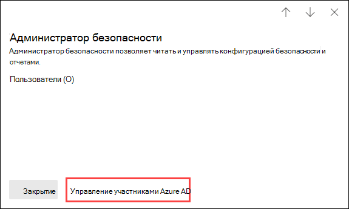
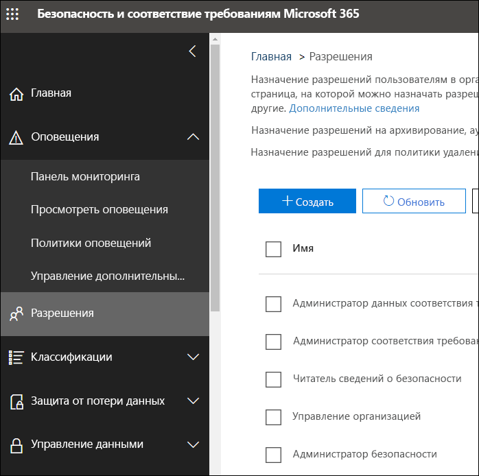

# Разрешения в Центре соответствия требованиям Microsoft 365 и Центре безопасности Microsoft 365

[!INCLUDE [Microsoft 365 Defender rebranding](../includes/microsoft-defender-for-office.md)]

**Область применения**
- [Exchange Online Protection](exchange-online-protection-overview.md)
- [Microsoft Defender для Office 365 (план 1 и план 2)](defender-for-office-365.md)
- [Microsoft 365 Defender](../defender/microsoft-365-defender.md)

Вашей организации необходимо управление сценариями безопасности и соответствия требованиям, которые охватывают все службы Microsoft 365. Также должна быть возможность предоставления необходимых прав администратора соответствующим сотрудникам ИТ-отдела вашей организации. Используя Центр безопасности Microsoft 365 или Центр соответствия требованиям Microsoft 365, можно централизованно управлять разрешениями для всех задач, связанных с безопасностью и соответствием требованиям.

После того как глобальный администратор добавляет пользователей в эти роли администратора, эти администраторы получают доступ к функциям и данным, которые охватывают все службы в Microsoft 365, например Центр безопасности Microsoft 365, Центр соответствия требованиям Microsoft 365, Azure, Office 365 и Enterprise Mobility + Security.

## Что представляют собой роли в Microsoft 365

Роли, которые отображаются в Центре соответствия требованиям Microsoft 365 и Центре безопасности Microsoft 365, являются ролями Azure Active Directory. Эти роли предназначены для выполнения соответствующих должностных обязанностей в ИТ-отделе вашей организации, упрощая предоставление пользователю всех необходимых разрешений в рамках рабочих задач.

****

|Роль|Описание|
|---|---|
|**Глобальный администратор**|Доступ ко всем возможностям администрирования во всех службах Microsoft 365. Только глобальные администраторы могут назначать другие административные роли. Дополнительные сведения см. в разделе [Глобальный администратор / администратор компании](/azure/active-directory/roles/permissions-reference#global-administrator--company-administrator).|
|**Администратор данных соответствия требованиям**|Отслеживание данных вашей организации в службах Microsoft 365, обеспечение их защиты и получение аналитики о любых проблемах для уменьшения рисков. Дополнительные сведения см. в разделе [Администратор данных соответствия требованиям](/azure/active-directory/roles/permissions-reference#compliance-data-administrator).|
|**Администратор соответствия требованиям**|Помощь вашей организации в соблюдении любых нормативных требований, управление делами обнаружения электронных данных и ведение политик управления данными в расположениях, удостоверениях и приложениях Microsoft 365. Дополнительные сведения см. в разделе [Администратор соответствия требованиям](/azure/active-directory/roles/permissions-reference#compliance-administrator).|
|**Оператор безопасности**|Просмотр и изучение активных угроз безопасности пользователей Microsoft 365, устройств, работающих с этой службой, и хранящегося в ней содержимого, а также реагирование на эти угрозы. Дополнительные сведения см. в разделе [Оператор безопасности](/azure/active-directory/roles/permissions-reference#security-operator).|
|**Читатель сведений о безопасности**|Просмотр и изучение активных угроз безопасности пользователей Microsoft 365, устройств, работающих с этой службой, и хранящегося в ней содержимого, но (в отличие от роли оператора безопасности) у пользователей с этой ролью нет разрешений, чтобы реагировать на угрозы, предпринимая определенные действия. Дополнительные сведения см. в разделе [Читатель сведений о безопасности](/azure/active-directory/roles/permissions-reference#security-reader).|
|**Администратор безопасности**|Контроль общей безопасности вашей организации посредством управления политиками безопасности, просмотра аналитики и отчетов о безопасности в различных продуктах Microsoft 365, а также получения последних данных о текущем ландшафте угроз. Дополнительные сведения см. в разделе [Администратор безопасности](/azure/active-directory/roles/permissions-reference#security-administrator).|
|**Глобальный читатель**|Вариант роли **Глобального администратора** с правами только чтения. Просмотр всех параметров и административной информации во всех продуктах Microsoft 365. Дополнительные сведения см. в разделе [Глобальный читатель](/azure/active-directory/roles/permissions-reference#global-reader).|
|

## Глобальный администратор может управлять ролями в Azure Active Directory.

В Центре безопасности Microsoft 365 и Центре соответствия требованиям Microsoft 365 при выборе роли можно просмотреть ее назначения. Однако чтобы управлять этими назначениями, нужно перейти в Azure Active Directory.

Дополнительные сведения см. в статье [Просмотр и назначение ролей администратора в Azure Active Directory](/azure/active-directory/users-groups-roles/directory-manage-roles-portal).

## Управление ролями в службе, вместо Azure Active Directory

Роли, которые отображаются в Центре соответствия требованиям Microsoft 365 и Центре безопасности Microsoft 365, также отображаются в службах, где для них имеются разрешения. Например, их можно увидеть в Центре безопасности и соответствия требованиям.

Сведения об использовании этих ролей в Центре безопасности и соответствия требованиям см. в статье [Разрешения в Центре безопасности и соответствия требованиям](permissions-in-the-security-and-compliance-center.md).

### Прерывание наследования

Важно понимать, что когда выполняется управление этими ролями в Azure Active Directory, оно выполняется централизованно для **всех** служб Microsoft 365. Тем не менее, если вы управляете ролью в определенной службе, например в Центре безопасности и соответствия требованиям, вы управляете ролью **только** для такой отдельной службы. Назначения и разрешения для роли в службе переопределяют любые разрешения, предоставленные роли Azure Active Directory.

Это может быть полезно. Например, если пользователю назначена роль администратора безопасности, у него не будет разрешений на управление инцидентами. Но вы можете использовать разрешения в Microsoft Defender для конечной точки, чтобы предоставить специальное разрешение на управление инцидентами в этой службе.

## Где найти сведения о ролях для каждой службы Microsoft 365?

Назначив пользователю одну из ролей администратора в Центре соответствия требованиям или Центре безопасности Microsoft 365, вы предоставляете разрешения для ряда служб Microsoft 365. Используйте ссылки ниже для поиска дополнительных сведений об определенных разрешениях ролей для каждой службы.

****

|Служба Microsoft 365|Сведения о роли|
|---|---|
|Роли администратора в планах Office 365 и Microsoft 365 для бизнеса|[Роли администратора Microsoft 365](../../admin/add-users/about-admin-roles.md)|
|Azure Active Directory (Azure AD) и защита идентификации Azure Active Directory|[Роли администратора в Azure Active Directory](/azure/active-directory/users-groups-roles/directory-assign-admin-roles)|
|Microsoft Defender для удостоверений|[Группы ролей Microsoft Defender для удостоверений](/azure-advanced-threat-protection/atp-role-groups)|
|Azure Information Protection|[Роли администратора в Azure Active Directory](/azure/active-directory/users-groups-roles/directory-assign-admin-roles)|
|Диспетчер соответствия требованиям|[Диспетчер соответствия требованиям](../../compliance/compliance-manager-setup.md#set-user-permissions-and-assign-roles)|
|Exchange Online|[Управлении доступом на основе ролей в Exchange](/exchange/permissions-exo/permissions-exo)|
|Intune|[Управление доступом на основе ролей в Intune](/intune/role-based-access-control)|
|Управляемые компьютеры|[Роли администратора в Azure Active Directory](/azure/active-directory/users-groups-roles/directory-assign-admin-roles)|
|Microsoft Cloud App Security|[Управление доступом на основе ролей](/cloud-app-security/manage-admins)|
|Центр безопасности и соответствия требованиям|[Роли администратора Microsoft 365](permissions-in-the-security-and-compliance-center.md)|
|Служба Privileged Identity Management|[Роли администратора в Azure Active Directory](/azure/active-directory/users-groups-roles/directory-assign-admin-roles)|
|Оценка безопасности|[Роли администратора в Azure Active Directory](/azure/active-directory/users-groups-roles/directory-assign-admin-roles)|
|SharePoint Online|[Роли администратора в Azure Active Directory](/azure/active-directory/users-groups-roles/directory-assign-admin-roles) 
 [Сведения о роли администратора SharePoint в Office 365](/sharepoint/sharepoint-admin-role)|
|Teams и Skype для бизнеса|[Роли администратора в Azure Active Directory](/azure/active-directory/users-groups-roles/directory-assign-admin-roles)|
|Microsoft Defender для конечной точки|[Управление доступом на основе ролей в Microsoft Defender для конечной точки](/windows/security/threat-protection/windows-defender-atp/rbac-windows-defender-advanced-threat-protection)|
|

## Скоро

Разрешения в Центре соответствия требованиям Microsoft 365 и Центре безопасности Microsoft 365 находятся в процессе разработки. Например в настоящее время мы работаем над поддержкой возможностей для:

- управления ролями в Центре соответствия требованиям Microsoft 365 и Центре безопасности Microsoft 365 без перехода в Azure Active Directory;
- настройки ролей путем добавления или удаления определенных разрешений;
- создания настраиваемых ролей с разрешениями на выбор.