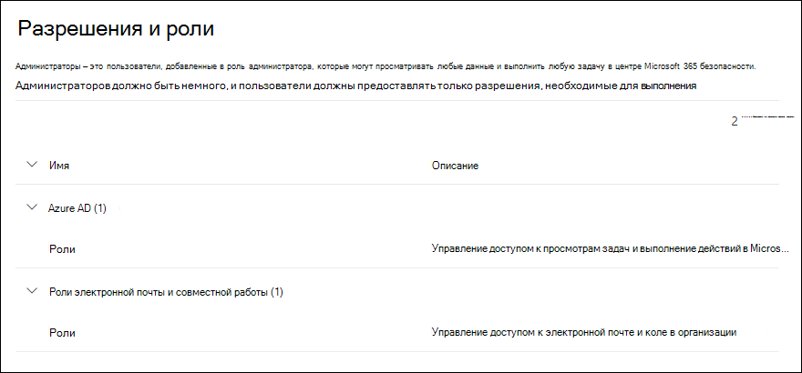

# Разрешения в Центре безопасности Microsoft 365

[!INCLUDE [Microsoft 365 Defender rebranding](../includes/microsoft-defender-for-office.md)]

**Область применения**
- [Exchange Online Protection](exchange-online-protection-overview.md)
- [Microsoft Defender для Office 365 (план 1 и план 2)](defender-for-office-365.md)
- [Microsoft 365 Defender](../defender/microsoft-365-defender.md)

Необходимо управлять сценариями безопасности, которые охватывают все службы Microsoft 365. Также должна быть возможность предоставления необходимых прав администратора соответствующим сотрудникам вашей организации.

Центр безопасности Microsoft 365 в <https://security.microsoft.com> поддерживает прямое управление разрешениями для пользователей, которые выполняют задачи безопасности в Microsoft 365. Используя Центр безопасности для управления разрешениями, можно централизованно управлять разрешениями для всех задач, связанных с безопасностью.

Чтобы управлять разрешениями в Центре безопасности, перейдите в раздел **Разрешения и роли** или <https://security.microsoft.com/securitypermissions>. Вы должны быть **глобальным администратором** или участником группы ролей **Управление организацией** в Центре безопасности. В частности, роль **Управление ролями** позволяет пользователям просматривать, создавать и изменять группы ролей в Центре безопасности. По умолчанию эта роль назначена только группе ролей **Управление организацией**.

## Связи между членами, ролями и группами ролей

Разрешения в Центре безопасности основаны на модели разрешений управления доступом на основе ролей (RBAC). RBAC — это та же модель разрешений, которая используется большинством служб Microsoft 365, поэтому если вы знакомы со структурой разрешений в этих службах, предоставление разрешений в Центре безопасности будет очень знакомым.

**Роль** предоставляет разрешения на выполнение набора задач.

**Группа ролей** — это набор ролей, позволяющих пользователям работать в Центре безопасности. Например, группа ролей "Администраторы эмулятора атак" включает роль администратора эмулятора атак для создания и управления всеми аспектами обучения симуляции атаки.

Центр безопасности включает группы ролей по умолчанию для наиболее распространенных задач и функций, которые необходимо назначить. Как правило, рекомендуется просто добавить отдельных пользователей в качестве **участников** в группы ролей по умолчанию.

## Роли и группы ролей в Центре безопасности

Следующие типы ролей и групп ролей доступны в разделе **Разрешения и роли** в Центре безопасности:

- **Роли Azure AD**: вы можете просматривать роли и назначенных пользователей, но не можете управлять ими непосредственно в Центре безопасности. Роли Azure AD — это центральные роли, которые назначают разрешения **всем** службам Microsoft 365.

- **Роли электронной почты и совместной работы**: это те же группы ролей, которые доступны в Центре безопасности и соответствия требованиям, но вы можете управлять ими непосредственно в Центре безопасности. Разрешения, которые вы назначаете здесь, относятся к центру безопасности Microsoft 365, центру соответствия Microsoft 365 и центру соответствия требованиям и безопасности и не охватывают все разрешения, необходимые для других рабочих нагрузок Microsoft 365.

### Роли Azure AD в Центре безопасности

При переходе в раздел **Роли электронной почты и совместной работы** \> **Разрешения и роли** \> **Роли Azure AD** \> **Роли** (или непосредственно в <https://security.microsoft.com/aadpermissions>) вы увидите роли Azure AD, описанные в этом разделе.

При выборе роли появляется всплывающее окно с подробностями, содержащее описание роли и назначения пользователей. Но для управления этими назначениями необходимо щелкнуть **Управление участниками в Azure AD** во всплывающем окне сведений.

Дополнительные сведения см. в статье [Просмотр и назначение ролей администратора в Azure Active Directory](/azure/active-directory/users-groups-roles/directory-manage-roles-portal).

 

****

|Роль|Описание|
|---|---|
|**Глобальный администратор**|Доступ ко всем возможностям администрирования во всех службах Microsoft 365. Только глобальные администраторы могут назначать другие административные роли. Дополнительные сведения см. в разделе [Глобальный администратор / администратор компании](/azure/active-directory/roles/permissions-reference#global-administrator--company-administrator).|
|**Администратор данных соответствия требованиям**|Отслеживание данных вашей организации в службах Microsoft 365, обеспечение их защиты и получение аналитики о любых проблемах для уменьшения рисков. Дополнительные сведения см. в разделе [Администратор данных соответствия требованиям](/azure/active-directory/roles/permissions-reference#compliance-data-administrator).|
|**Администратор соответствия требованиям**|Помощь вашей организации в соблюдении любых нормативных требований, управление делами обнаружения электронных данных и ведение политик управления данными в расположениях, удостоверениях и приложениях Microsoft 365. Дополнительные сведения см. в разделе [Администратор соответствия требованиям](/azure/active-directory/roles/permissions-reference#compliance-administrator).|
|**Оператор безопасности**|Просмотр и изучение активных угроз безопасности пользователей Microsoft 365, устройств, работающих с этой службой, и хранящегося в ней содержимого, а также реагирование на эти угрозы. Дополнительные сведения см. в разделе [Оператор безопасности](/azure/active-directory/roles/permissions-reference#security-operator).|
|**Читатель сведений о безопасности**|Просмотр и изучение активных угроз безопасности пользователей Microsoft 365, устройств, работающих с этой службой, и хранящегося в ней содержимого, но (в отличие от роли оператора безопасности) у пользователей с этой ролью нет разрешений, чтобы реагировать на угрозы, предпринимая определенные действия. Дополнительные сведения см. в разделе [Читатель сведений о безопасности](/azure/active-directory/roles/permissions-reference#security-reader).|
|**Администратор безопасности**|Контроль общей безопасности вашей организации посредством управления политиками безопасности, просмотра аналитики и отчетов о безопасности в различных продуктах Microsoft 365, а также получения последних данных о текущем ландшафте угроз. Дополнительные сведения см. в разделе [Администратор безопасности](/azure/active-directory/roles/permissions-reference#security-administrator).|
|**Глобальный читатель**|Вариант роли **Глобального администратора** с правами только чтения. Просмотр всех параметров и административной информации во всех продуктах Microsoft 365. Дополнительные сведения см. в разделе [Глобальный читатель](/azure/active-directory/roles/permissions-reference#global-reader).|
|**Администратор симуляции атаки**|Создавайте и управляйте всеми аспектами создания [симуляции атаки](attack-simulation-training.md), запуском и планированием симуляции, а также просмотром результатов симуляции. Дополнительные сведения см. в разделе [Администраторы симуляции атаки](/azure/active-directory/roles/permissions-reference#attack-simulation-administrator).|
|**Автор полезных данных атаки**|Создавайте полезные данные атаки, но не запускайте и не планируйте их. Дополнительные сведения см. в разделе [Автор полезных данных атаки](/azure/active-directory/roles/permissions-reference#attack-payload-author).|
|

### Роли электронной почты и совместной работы в Центре безопасности

При переходе в разделы **Роли электронной почты и совместной работы** \> **Разрешения и роли** \> **Роли электронной почты и совместной работы** \> **Роли** (или непосредственно в <https://security.microsoft.com/emailandcollabpermissions>) вы увидите те же группы ролей, которые доступны в Центре безопасности и соответствия требованиям.

Полные сведения об этих группах ролей см. в разделе [Разрешения в Центре безопасности и соответствия требованиям](permissions-in-the-security-and-compliance-center.md).

#### Изменение членства в роли электронной почты и совместной работы в Центре безопасности

1. В Центре безопасности перейдите в раздел **Роли электронной почты и совместной работы** \> **Разрешения и роли** \> **Роли электронной почты и совместной работы** \> **Роли**.

2. На открывшейся странице **Разрешения** выберите группу ролей, которую вы хотите изменить, в списке. Вы можете щелкнуть **Имя** заголовка столбца, чтобы отсортировать список по имени, или щелкнуть **Поиск** , чтобы найти группу ролей.

3. В открывшемся всплывающем окне сведений о группе ролей щелкните **Изменить** в разделе **Участники**.

4. На странице **Изменение выбора участников**, а затем выполните одно из следующих действий:
   - Если участники группы ролей отсутствует, нажмите кнопку **Выбрать участников**.
   - Если существуют участники группы ролей, нажмите кнопку **Изменить**

5. Во всплывающем меню **Выбор участников**, а затем выполните одно из следующих действий:

   - Нажмите **Добавить**. В списке пользователей выберите одного или несколько пользователей. Вы также можете щелкнуть **Поиск** , чтобы найти и выбрать пользователей.

     Выбрав одного или нескольких пользователей, которых нужно добавить, нажмите кнопку **Добавить**.

   - Нажмите кнопку **Удалить**. Выберите одного или несколько существующих участников. Вы также можете щелкнуть **Поиск** , чтобы найти и выбрать участников.

     Выбрав одного или нескольких пользователей, которых нужно удалить, нажмите кнопку **Удалить**.

6. Вернувшись во всплывающее меню **Выбрать участников**, нажмите **Готово**.

7. Вернувшись во всплывающее меню **Изменение выбора участников**, нажмите **Сохранить**.

8. Вернувшись во всплывающее меню сведений о группе ролей, нажмите **Готово**.
