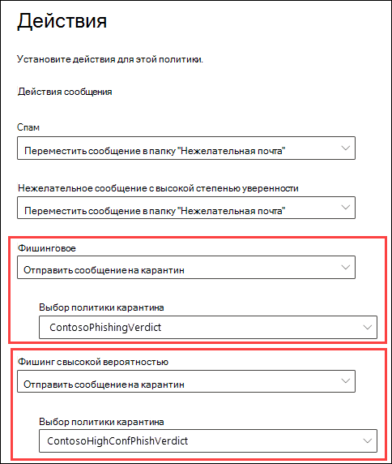
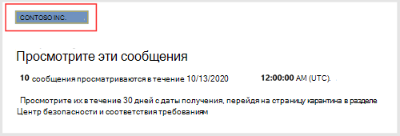
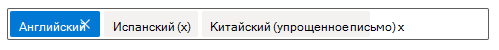
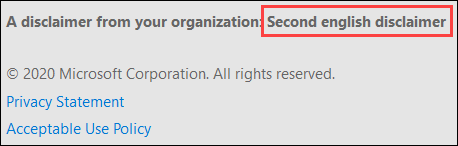
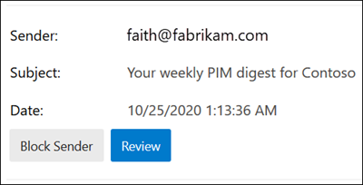

# <a name="quarantine-tags"></a>Теги карантина

> [!NOTE]
> Функции, описанные в этой статье, в настоящее время доступны для всех и могут быть изменены.

Теги карантина в Exchange Online Protection (EOP) позволяют администраторам контролировать, какие пользователи могут выполнять действия с сообщениями в карантине в зависимости от того, как сообщение поступило в карантин.

В EOP традиционно разрешены или запрещены определенные уровни взаимодействия для сообщений в [карантине](find-and-release-quarantined-messages-as-a-user.md) и [уведомления о нежелательной почте конечных пользователей](use-spam-notifications-to-release-and-report-quarantined-messages.md). Например, конечные пользователи могут просматривать и освобождать сообщения, помещенные в карантин с помощью фильтрации нежелательной почты в качестве нежелательной почты или массовых сообщений, но не могут просматривать или освобождать сообщения, помещенные в карантин в качестве высокодостоверных фишинга.

Для [поддерживаемых функций защиты](#step-2-assign-a-quarantine-tag-to-supported-features)Теги карантина указывают, какие пользователи могут выполнять в сообщениях уведомления о нежелательной почте, а также в карантинных сообщениях в карантине (сообщения, в которых пользователь является получателем). Теги карантина по умолчанию автоматически назначаются для применения исторических возможностей для конечных пользователей в сообщениях, помещенных в карантин. Можно также создать и назначить пользовательские теги карантина, чтобы разрешить или запретить конечным пользователям выполнять определенные действия в сообщениях, помещенных в карантин.

Индивидуальные разрешения объединяются в следующие предварительно заданные группы разрешений:

- Нет доступа
- Ограниченный доступ
- Полный доступ

В следующей таблице описаны доступные индивидуальные разрешения, а также включенные и не включенные в предустановленные группы разрешений.

|Разрешение|Нет доступа|Ограниченный доступ|Полный доступ|
|---|:---:|:---:|:---:|
|**Разрешить отправителя** ( _пермиссионтоалловсендер_ )||||
|**Блокировка отправителя** ( _пермиссионтоблокксендер_ )||||
|**Delete** ( _пермиссионтоделете_ )||||
|**Предварительная версия** ( _пермиссионтопревиев_ )||||
|**Разрешить получателям выпустить сообщение из карантина** ( _пермиссионторелеасе_ )||||
|**Разрешить получателям запрашивать сообщение для освобождения из карантина** ( _пермиссионторекуестрелеасе_ )||||
|

Если вы не хотите использовать разрешения по умолчанию в предустановленных группах разрешений, вы можете использовать настраиваемые разрешения при создании или изменении пользовательских тегов карантина. Дополнительные сведения о том, что делает каждый из разрешений, можно найти в разделе [сведения о разрешениях для тегов карантина](#quarantine-tag-permission-details) далее в этой статье.

Теги карантина создаются и назначаются в центре безопасности & соответствия требованиям или в PowerShell (Exchange Online PowerShell для Microsoft 365 организации с почтовыми ящиками Exchange Online; изолированный EOP PowerShell в организациях EOP без почтовых ящиков Exchange Online).

## <a name="what-do-you-need-to-know-before-you-begin"></a>Что нужно знать перед началом работы

- Откройте Центр безопасности и соответствия требованиям на сайте <https://protection.office.com/>. Чтобы перейти непосредственно на страницу **теги карантина** , откройте страницу <https://protection.office.com/quarantineTags> .

- Сведения о том, как подключиться к Exchange Online PowerShell, см. в статье [Подключение к Exchange Online PowerShell](https://docs.microsoft.com/powershell/exchange/connect-to-exchange-online-powershell). Чтобы подключиться к автономному EOP PowerShell, см. раздел [Подключение к PowerShell Exchange Online Protection](https://docs.microsoft.com/powershell/exchange/connect-to-exchange-online-protection-powershell).

- Чтобы просматривать, создавать, изменять или удалять теги карантина, необходимо быть участником одной из следующих групп ролей:
  - **Управление организацией** или **Администратор безопасности** в [Центре безопасности и соответствия требованиям](permissions-in-the-security-and-compliance-center.md).
  - **Управление организацией** или **Управление санацией** в [Exchange Online](https://docs.microsoft.com/Exchange/permissions-exo/permissions-exo#role-groups).

## <a name="step-1-create-quarantine-tags-in-the-security--compliance-center"></a>Шаг 1: Создание тегов карантина в центре безопасности & соответствия требованиям

1. В центре безопасности & соответствия требованиям перейдите к разделу политика **управления угрозами** , \> **Policy** а затем выберите пункт **теги карантина**.

2. На странице " **теги карантина** " выберите **Добавить настраиваемый тег**.

3. Откроется мастер **создания нового тега** . На странице **имя тега** введите краткое, но уникальное имя в поле **имя тега** . Вам потребуется определить и выбрать тег по имени на следующих этапах. По завершении нажмите кнопку **Далее**.

4. На странице **доступа к сообщениям получателя** выберите одно из следующих значений:
   - **Нет доступа**
   - **Ограниченный доступ**
   - **Полный доступ**

   Отдельные разрешения, включенные в эти группы разрешений, описаны ранее в этой статье.

   Чтобы указать настраиваемые разрешения, выберите **задать определенный доступ (дополнительно)** и настройте следующие параметры:

     - **Выберите параметр действия при выпуске** : выберите одно из следующих значений:
       - **Не выпустите действие** : это значение по умолчанию.
       - **Разрешить получателям выпустить сообщение из карантина**
       - **Разрешение получателям запросить отправку сообщения из карантина**

     - **Выберите дополнительные действия получатели могут принимать участие в сообщениях, помещенных в карантин** : выберите некоторые, все или ничего из следующих значений:
       - **удаление** ;
       - **Предварительная версия**
       - **Разрешить отправителя**
       - **Блокировка отправителя**

   Эти разрешения и их последствия для сообщений, помещенных в карантин, и уведомления о нежелательной почте приведены в разделе [сведения о разрешениях для тегов карантина](#quarantine-tag-permission-details) , приведенных далее в этой статье.

   По завершении нажмите кнопку **Далее**.

5. На появившейся странице **сводки** проверьте параметры. Для изменения каждого параметра можно нажать кнопку **изменить** .

   По завершении нажмите кнопку **сохранить**.

6. Нажмите кнопку **done (Готово** ) на появившейся странице подтверждения.

Теперь вы готовы присвоить метку карантина функции карантина, как описано в разделе [Шаг 2](#step-2-assign-a-quarantine-tag-to-supported-features) .

### <a name="create-quarantine-tags-in-powershell"></a>Создание тегов карантина в PowerShell

Если вы предпочитаете создавать теги карантина с помощью PowerShell, подключитесь к Exchange Online PowerShell или Exchange Online Protection PowerShell и используйте командлет **New-куарантинетаг** . Существует два разных способа выбора:

- Используйте параметр _ендусеркуарантинепермиссионсвалуе_ .
- Используйте параметр _ендусеркуарантинепермиссионс_ .

Эти методы описаны в следующих разделах.

#### <a name="use-the-enduserquarantinepermissionsvalue-parameter"></a>Использование параметра Ендусеркуарантинепермиссионсвалуе

Чтобы создать тег карантина с помощью параметра _ендусеркуарантинепермиссионсвалуе_ , используйте следующий синтаксис:

```powershell
New-QuarantineTag -Name "<UniqueName>" -EndUserQuarantinePermissionsValue <0 to 236>
```

Параметр _ендусеркуарантинепермиссионсвалуе_ использует десятичное значение, которое преобразуется из двоичного значения. Двоичное значение соответствует доступным карантинным разрешениям конечного пользователя в определенном порядке. Для каждого разрешения значение 1 равно true, а значение 0 равно false.

Обязательный порядок и значения для каждого отдельного разрешения в предустановленных группах разрешений описаны в следующей таблице.

****

|Разрешение|Нет доступа|Ограниченный доступ|Полный доступ|
|---|:---:|:---:|:---:|
|пермиссионтоалловсендер|нуль|нуль|1,1|
|пермиссионтоблокксендер|нуль|1,1|1,1|
|пермиссионтоделете|нуль|1,1|1,1|
|пермиссионтодовнлоад<sup>\*</sup>|нуль|нуль|нуль|
|пермиссионтопревиев|нуль|1,1|1,1|
|пермиссионторелеасе<sup>\*\*</sup>|нуль|нуль|1,1|
|пермиссионторекуестрелеасе<sup>\*\*</sup>|нуль|1,1|нуль|
|пермиссионтовиевхеадер<sup>\*</sup>|нуль|нуль|нуль|
|Двоичное значение|00000001|01101010|11101100|
|Используемое десятичное значение|нуль|106|236|

<sup>\*</sup> В настоящее время это значение всегда равно 0. Для Пермиссионтовиевхеадер значение 0 не скрывает кнопку **Просмотр заголовка сообщения** в сведениях из помещенного в карантин сообщения (кнопка доступна всегда).

<sup>\*\*</sup> Не устанавливайте оба этих значения равными 1. Задайте для одного из них значение 1, а другое — значение 0.

В этом примере показано создание нового имени тега карантина без доступа, который назначает разрешения без доступа, как описано в предыдущей таблице.

```powershell
New-QuarantineTag -Name NoAccess -EndUserQuarantinePermissionsValue 0
```

Для разрешений с ограниченным доступом используйте значение 106. Для разрешений полного доступа используйте значение 236.

Для настраиваемых разрешений используйте предыдущую таблицу, чтобы получить двоичное значение, соответствующее требуемым разрешениям. Преобразуйте двоичное значение в десятичное и используйте десятичное значение для параметра _ендусеркуарантинепермиссионсвалуе_ .

Подробные сведения о синтаксисе и параметрах можно найти в статье [New – куарантинетаг](https://docs.microsoft.com/powershell/module/exchange/new-quarantinetag).

#### <a name="use-the-enduserquarantinepermissions-parameter"></a>Использование параметра Ендусеркуарантинепермиссионс

Чтобы создать тег карантина с помощью параметра _ендусеркуарантинепермиссионсвалуе_ , выполните следующие действия:

О. Сохраните объект разрешений карантина в переменной с помощью командлета **New – куарантинепермиссионс** .
<br/>
B. Используйте переменную в качестве значения _ендусеркуарантинепермиссионс_ в команде **New – куарантинетаг** .

##### <a name="step-a-store-a-quarantine-permissions-object-in-a-variable"></a>Шаг A: сохранение объекта разрешений карантина в переменной

Используйте указанный ниже синтаксис.

```powershell
$<VariableName> = New-QuarantinePermissions [-PermissionToAllowSender <$true | $False>] [-PermissionToBlockSender <$true | $False>] [-PermissionToDelete <$true | $False>] [-PermissionToPreview <$true | $False>] [-PermissionToRelease <$true | $False>] [-PermissionToRequestRelease <$true | $False>]
```

Значение по умолчанию для всех неиспользуемых параметров `$false` , поэтому необходимо использовать только те параметры, для которых нужно задать значение `$true` .

В следующих примерах показано, как создавать объекты разрешений, соответствующие предварительно заданным группам разрешений:

- **Нет доступа** :

  ```powershell
  $NoAccess = New-QuarantinePermissions
  ```

- **Ограниченный доступ** :

  ```powershell
  $LimitedAccess = New-QuarantinePermissions -PermissionToBlockSender $true -PermissionToDelete $true -PermissionToPreview $true -PermissionToRequestRelease $true
  ```

- **Полный доступ** :

  ```powershell
  $FullAccess = New-QuarantinePermissions -PermissionToAllowSender $true -PermissionToBlockSender $true -PermissionToDelete $true -PermissionToPreview $true -PermissionToRelease $true
  ```

Чтобы просмотреть заданные значения, выполните имя переменной в виде команды (например, выполните команду `$NoAccess` ).

Для настраиваемых разрешений не устанавливайте для параметров _пермиссионторелеасе_ и _пермиссионторекуестрелеасе_ значение `$true` . Задайте для параметра значение `$true` and и оставьте значение `$false` , а не оба `$false` .

Вы также можете изменить существующую переменную объекта Permissions после создания, но перед ее использованием с помощью командлета **Set – куарантинепермиссионс** .

Подробные сведения о синтаксисе и параметрах можно найти в статье [New/куарантинепермиссионс](https://docs.microsoft.com/powershell/module/exchange/new-quarantinepermissions) и [Set – куарантинепермиссионс](https://docs.microsoft.com/powershell/module/exchange/set-quarantinepermissions).

##### <a name="step-b-use-the-variable-in-the-new-quarantinetag-command"></a>Шаг б: использование переменной в команде New-QuarantineTag

После создания и сохранения объекта Permissions в переменной используйте значение параметра _ендусеркуарантинепермиссион_ в следующей команде **New – куарантинетаг** :

```powershell
New-QuarantineTag -Name "<UniqueName>" -EndUserQuarantinePermissions $<VariableName>
```

В этом примере создается новый тег карантина с именем Лимитедакцесс с использованием `$LimitedAccess` объекта Permissions, описанного и созданного на предыдущем шаге.

```powershell
New-QuarantineTag -Name LimitedAccess -EndUserQuarantinePermissions $LimitedAccess
```

Подробные сведения о синтаксисе и параметрах можно найти в статье [New – куарантинетаг](https://docs.microsoft.com/powershell/module/exchange/new-quarantinetag).

## <a name="step-2-assign-a-quarantine-tag-to-supported-features"></a>Шаг 2: назначение тегов карантина поддерживаемым функциям

В _поддерживаемых_ функциях защиты, которые размещаются в карантине для сообщений или файлов (автоматически или как настраиваемое действие), можно назначить для доступных действий карантина тег карантина. В приведенной ниже таблице описаны функции, в которых сообщения и доступность тегов карантина помещены в карантин.

****

|Компонент|Поддерживаются теги карантина?|Используемые по умолчанию теги карантина|
|---|:---:|---|
|[Политики защиты от нежелательной почты](configure-your-spam-filter-policies.md): <ul><li>**Спам** ( _спамактион_ )</li><li>**Нежелательная почта высокой надежности** ( _хигхконфиденцеспамактион_ )</li><li>**Фишинговый адрес электронной почты** ( _фишспамактион_ )</li><li>**Phishing-сообщения с высокой достоверностью** ( _хигхконфиденцефишактион_ )</li><li>**Массовая Электронная почта** ( _булкспамактион_ )</li></ul>|Да|<ul><li>Дефаултспамтаг (полный доступ)</li><li>Дефаулсигхконфспамтаг (полный доступ)</li><li>Дефаултфиштаг (полный доступ)</li><li>Дефаулсигхконффиштаг (нет доступа)</li><li>Дефаултбулктаг (полный доступ)</li></ul>
|Политики защиты от фишинга: <ul><li>[Защита от подделки](set-up-anti-phishing-policies.md#spoof-settings) ( _аусентикатионфаилактион_ )</li><li>[Защита от олицетворения](set-up-anti-phishing-policies.md#impersonation-settings-in-anti-phishing-policies-in-microsoft-defender-for-office-365):<sup>\*</sup> <ul><li>**Если с помощью олицетворенного пользователя отправляется сообщение электронной почты** ( _таржетедусерпротектионактион_ )</li><li>**Если с олицетворенным доменом отправляется сообщение электронной почты** ( _таржетеддомаинпротектионактион_ )</li><li>Аналитика почтовых **ящиков** \> **Если с помощью олицетворенного пользователя отправляется сообщение электронной почты** ( _маилбоксинтеллиженцепротектионактион_ )</li></ul></li></ul></ul>|Нет|н/д|
|[Политики защиты от вредоносных программ](configure-anti-malware-policies.md): все обнаруженные сообщения всегда хранятся в карантине.|Нет|н/д|
|[ATP для SharePoint, OneDrive и Microsoft Teams](atp-for-spo-odb-and-teams.md)|Нет|н/д|
|[Правила для поток обработки почты](https://docs.microsoft.com/exchange/security-and-compliance/mail-flow-rules/mail-flow-rules) (также называемые правилами транспорта) с действием: **Доставка сообщения в размещенный карантин** ( _Карантин_ ).|Нет|н/д|
|

<sup>\*</sup> Параметры защиты от олицетворения доступны только в политиках защиты от фишинга в защитнике Майкрософт для Office 365.

Если вы довольны разрешениями для конечных пользователей, которые предоставляются тегами карантина по умолчанию, вам не нужно ничего делать. Если вы хотите настроить возможности конечного пользователя (доступные кнопки) в уведомлениях о нежелательной почте или сообщениях в карантине, можно назначить настраиваемый тег карантина.

### <a name="assign-quarantine-tags-in-anti-spam-policies-in-the-security--compliance-center"></a>Назначение тегов карантина в политиках защиты от нежелательной почты в центре безопасности & соответствия требованиям

Подробные инструкции по созданию и изменению политик защиты от нежелательной почты описаны в разделе [Настройка политик защиты от нежелательной почты в EOP](configure-your-spam-filter-policies.md).

1. В центре безопасности & соответствия требованиям перейдите к разделу политика **управления угрозами** , \> **Policy** \> а затем выберите пункт **Защита от нежелательной почты**. Или откройте <https://protection.office.com/antispam> .

2. Найдите и выберите существующую политику защиты от нежелательной почты, которую необходимо изменить, или создайте новую политику защиты от нежелательной почты.

3. В всплывающем окне сведения о политике разверните раздел **Нежелательная почта и групповые действия** .
  
4. Если вы выбрали **сообщение в карантине** для действия доступной фильтрации нежелательной почты (вредоносности), поле **Применить метку политики карантина** будет доступно для выбора тега карантина для этого вредоносности.

   **Note** : при создании новой политики значение пустого тега карантина для фильтрации нежелательной почты вредоносности указывает, что используется тег карантина по умолчанию для этого вредоносности. При последующем изменении политики пустые значения заменяются на фактические имена тегов карантина по умолчанию, как описано в предыдущей таблице.
  
   

5. Выполнив необходимые действия, нажмите кнопку **Сохранить**.

#### <a name="assign-quarantine-tags-in-anti-spam-policies-in-powershell"></a>Назначение тегов карантина в политиках защиты от нежелательной почты в PowerShell

Если вы предпочитаете использовать PowerShell для назначения тегов карантина в политиках защиты от нежелательной почты, подключитесь к Exchange Online PowerShell или Exchange Online Protection PowerShell и используйте следующий синтаксис:

```powershell
<New-HostedContentFilterPolicy -Name "<Unique name>" | Set-HostedContentFilterPolicy -Identity "<Policy name>">  [-SpamAction Quarantine] [-SpamQuarantineTag <QuarantineTagName>] [-HighConfidenceSpamAction Quarantine] [-HighConfidenceSpamQuarantineTag <QuarantineTagName>] [-PhishSpamAction Quarantine] [-PhishQuarantineTag <QuarantineTagName>] [-HighConfidencePhishQuarantineTag <QuarantineTagName>] [-BulkSpamAction Quarantine] [-BulkQuarantineTag <QuarantineTagName>] ...
```

**Примечания** :

- Значение по умолчанию для параметра _хигхконфиденцефишактион_ — карантин, поэтому нет необходимости устанавливать действие карантина для обнаружения фишинга высокого уровня доверия в новых политиках защиты от нежелательной почты. Для всех остальных вердиктс фильтрации нежелательной почты в новых или существующих политиках защиты от нежелательной почты тег карантина применяется только в том случае, если значение действия — карантин. Чтобы просмотреть значения действий в существующих политиках защиты от нежелательной почты, выполните следующую команду:

  ```powershell
  Get-HostedContentFilterPolicy | Format-Table Name,*SpamAction,HighConfidencePhishAction
  ```

  Сведения о значениях действий по умолчанию и рекомендуемых значениях действий для стандартных и ограниченных [параметров политики защиты от нежелательной почты см EOP](recommended-settings-for-eop-and-office365-atp.md#eop-anti-spam-policy-settings).

- Фильтрация нежелательной почты вредоносности без соответствующего параметра тега карантина означает, что используется [тег карантина по умолчанию](#step-2-assign-a-quarantine-tag-to-supported-features) для этого вредоносности.

  Необходимо заменить тег карантина по умолчанию на настраиваемый тег карантина, если вы хотите изменить функции конечного пользователя по умолчанию для сообщений, помещенных в карантин.

- Для новой политики защиты от нежелательной почты в PowerShell требуется политика фильтрации нежелательной почты (параметры) с помощью командлета **New-HostedContentFilterPolicy** и нового правила фильтрации нежелательной почты (фильтры получателей) с помощью командлета **New-hostedcontentfilterrule используется** . Инструкции можно найти [в разделе Использование PowerShell для создания политик защиты от нежелательной почты](configure-your-spam-filter-policies.md#use-powershell-to-create-anti-spam-policies).

В этом примере создается новая политика фильтрации нежелательной почты с именем Research Department со следующими параметрами:

- Действие для всех вердиктс фильтрации нежелательной почты настроено как карантин.
- Настраиваемый тег карантина с именем "без доступа", который назначает разрешения " **нет на доступе** ", заменяет все теги карантина по умолчанию, которые по умолчанию не назначают разрешения на **доступ** .

```powershell
New-HostedContentFilterPolicy -Name Research Department -SpamAction Quarantine -SpamQuarantineTag NoAccess -HighConfidenceSpamAction Quarantine -HighConfidenceSpamQuarantineTag NoAction -PhishSpamAction Quarantine -PhishQuarantineTag NoAction -BulkSpamAction Quarantine -BulkQuarantineTag NoAccess
```

Дополнительные сведения о синтаксисе и параметрах см. в статье [New-HostedContentFilterPolicy](https://docs.microsoft.com/powershell/module/exchange/new-hostedcontentfilterpolicy).

В этом примере изменяется существующая политика фильтрации нежелательной почты с именем "Отдел кадров". Для действия вредоносности карантина нежелательной почты задано значение карантин, и назначен настраиваемый тег карантина с именем "недоступно".

```powershell
Set-HostedContentFilterPolicy -Identity "Human Resources" -SpamAction Quarantine -SpamQuarantineTag NoAccess
```

Дополнительные сведения о синтаксисе и параметрах см. в статье [Set-HostedContentFilterPolicy](https://docs.microsoft.com/powershell/module/exchange/set-hostedcontentfilterpolicy).

## <a name="configure-global-quarantine-notification-settings-in-the-security--compliance-center"></a>Настройка глобальных параметров уведомлений в карантине в центре безопасности & соответствия требованиям

Глобальные параметры для тегов карантина позволяют настраивать уведомления конечных пользователей о нежелательной почте, которые отправляются получателям сообщений, помещенных в карантин. Для получения дополнительных сведений об этих уведомлениях обратитесь к разделу [уведомления о нежелательной почте конечных пользователей](use-spam-notifications-to-release-and-report-quarantined-messages.md).

1. В центре безопасности & соответствия требованиям перейдите к разделу политика **управления угрозами** , \> **Policy** а затем выберите пункт **теги карантина**.

2. На странице **теги карантина** выберите **глобальные параметры**.

3. В открывшемся всплывающем окне **Параметры уведомления о карантине** настройте некоторые или все из следующих параметров:

   - **Использовать мою фирменную эмблему** : Выберите этот параметр, чтобы заменить логотип Майкрософт по умолчанию, который будет использоваться в начале уведомления о нежелательной почте. Прежде чем выполнить это действие, выполните инструкции, приведенные в статье [Настройка темы Microsoft 365 для Организации](https://docs.microsoft.com/microsoft-365/admin/setup/customize-your-organization-theme) , чтобы отправить настраиваемый логотип.

     На приведенном ниже снимке экрана показан настраиваемый логотип в уведомлении о нежелательной почте конечных пользователей.

     

   - **Выбрать язык** : уведомления о нежелательной почте для конечных пользователей уже локализованы на основе языковых параметров получателя. Можно указать настраиваемый текст на разных языках для **отображаемого имени** и значения **заявления об отказе** .

     Выберите по крайней мере один язык в поле первый язык, а затем нажмите кнопку **Добавить**. Чтобы выбрать несколько языков, нажмите кнопку **Добавить** после каждого из них. В поле язык раздела отображаются все выбранные языки:

     

   - **Отображаемое имя** : Настройка отображаемого имени отправителя, используемого в уведомлениях о нежелательной почте для конечных пользователей.

     Для каждого добавленного языка выберите язык в поле второй язык (не щелкайте X) и введите нужное текстовое значение в поле **Отображаемое имя** .

     На приведенном ниже снимке экрана показано настраиваемое отображаемое имя в уведомлении о нежелательной почте конечных пользователей.

     

   - **Заявление об отказе** : Добавление настраиваемого заявления об отказе в конец уведомлений конечных пользователей о нежелательной почте. Локализованный текст, **заявление об отказе от вашей организации:** всегда включается в первую очередь, за которым следует заданный текст.

     Для каждого добавленного языка выберите язык в поле второй язык (не щелкайте X) и введите нужное текстовое значение в поле **заявление об отказе** .

     На следующем снимке экрана показан настраиваемый заявление об отказе в уведомлении пользователя о нежелательной почте.

     

## <a name="view-quarantine-tags-in-the-security--compliance-center"></a>Просмотр тегов карантина в центре безопасности & соответствия требованиям

1. В центре безопасности & соответствия требованиям перейдите к разделу политика **управления угрозами** , \> **Policy** а затем выберите пункт **теги карантина**.

- Чтобы просмотреть параметры встроенных или пользовательских тегов карантина, выберите тег карантина в списке (не устанавливайте флажок).

- Чтобы просмотреть глобальные параметры, выберите **глобальные параметры** .

### <a name="view-quarantine-tags-in-powershell"></a>Просмотр тегов карантина в PowerShell

Если вы предпочитаете использовать PowerShell для просмотра тегов карантина, выполните одно из указанных ниже действий.

- Чтобы просмотреть сводный список всех встроенных или настраиваемых тегов, выполните следующую команду:

  ```powershell
  Get-QuarantineTag | Format-Table Name
  ```

- Чтобы просмотреть параметры встроенных или пользовательских тегов карантина, замените на \<TagName\> имя тега карантина и выполните следующую команду:

  ```powershell
  Get-QuarantineTag -Identity "<TagName>"
  ```

- Чтобы просмотреть глобальные параметры, выполните следующую команду:

  ```powershell
  Get-QuarantineTag -QuarantineTagType GlobalQuarantineTag
  ```

Дополнительные сведения о синтаксисе и параметрах см. в статье [Get-HostedContentFilterPolicy](https://docs.microsoft.com/powershell/module/exchange/get-hostedcontentfilterpolicy).

## <a name="remove-quarantine-tags-in-the-security--compliance-center"></a>Удаление тегов карантина в центре безопасности & соответствия требованиям

**Примечания** :

- Встроенные теги карантина удалить невозможно.

- Перед удалением настраиваемого тега карантина убедитесь, что он не используется. Например, выполните следующую команду в PowerShell:

  ```powershell
  Get-HostedContentFilterPolicy | Format-List Name,*QuarantineTag
  ```

  Если используется тег карантина, [замените назначенный тег карантина](#step-2-assign-a-quarantine-tag-to-supported-features) перед удалением.

1. В центре безопасности & соответствия требованиям перейдите к разделу политика **управления угрозами** , \> **Policy** а затем выберите пункт **теги карантина**.

2. На странице " **теги карантина** " выберите настраиваемый тег карантина, который нужно удалить, и **тег Delete Delete (удалить** ).

3. Нажмите кнопку **Удалить тег** в появившемся диалоговом окне подтверждения.

### <a name="remove-quarantine-tags-in-powershell"></a>Удаление тегов карантина в PowerShell

Если вы предпочитаете использовать PowerShell для удаления настраиваемого тега карантина, замените \<TagName\> его именем тега карантина и выполните следующую команду:

```powershell
Remove-QuarantineTag -Identity "<TagName>"
```

Подробные сведения о синтаксисе и параметрах можно найти в статье [Remove – куарантинетаг](https://docs.microsoft.com/powershell/module/exchange/remove-quarantinetag).

## <a name="quarantine-tag-permission-details"></a>Сведения о разрешениях для тега карантина

В следующих разделах описывается влияние предустановленных групп разрешений и отдельных разрешений в сведениях о сообщениях, помещенных в карантин, и уведомлениях о нежелательной почте конечных пользователей.

### <a name="preset-permissions-groups"></a>Предварительно заданные группы разрешений

Индивидуальные разрешения, которые включены в предварительно установленные группы разрешений, перечислены в таблице в начале этой статьи.

#### <a name="no-access"></a>Нет доступа

Если в теге карантина назначаются разрешения **без доступа** (нет разрешений), пользователи по-прежнему получают некоторые базовые возможности:

- **Сведения о сообщении в карантине** : кнопка **Просмотр заголовка сообщения** доступна всегда.

  

- **Уведомления конечных пользователей о нежелательной почте** : кнопка " **Рецензирование** ", которая принимает пользователя на сообщение в карантине, доступна всегда.

  

#### <a name="limited-access"></a>Ограниченный доступ

Если тег карантина назначает разрешения **с ограниченным доступом** , пользователи получают следующие возможности:

- **Сведения о сообщении в карантине** : доступны следующие кнопки:
  - **Выпуск запроса**
  - **Просмотр заголовка сообщения**.
  - **Предварительная версия сообщения**
  - **Блокировка отправителя**
  - **Удалить из карантина**

  

- **Уведомления конечных пользователей о нежелательной почте** : доступны следующие кнопки:
  - **Блокировка отправителя**
  - **Проверка**

  

#### <a name="full-access"></a>Полный доступ

Если тег карантина назначает разрешения на **полный доступ** (все доступные разрешения), пользователи получают следующие возможности:

- **Сведения о сообщении в карантине** : доступны следующие кнопки:
  - **Сообщение об освобождении**
  - **Просмотр заголовка сообщения**.
  - **Предварительная версия сообщения**
  - **Блокировка отправителя**
  - **Разрешить отправителя**
  - **Удалить из карантина**

  

- **Уведомления конечных пользователей о нежелательной почте** : доступны следующие кнопки:
  - **Блокировка отправителя**
  - **Выпуск**
  - **Проверка**

  

### <a name="individual-permissions"></a>Индивидуальные разрешения

> [!NOTE]
> Помните, что пользователи всегда получают кнопки, описанные в разделе " [нет доступа](#no-access) ". Эти кнопки не включены в описание отдельных разрешений.

#### <a name="allow-sender-permission"></a>Разрешение "разрешить отправителю"

Разрешение " **Разрешить отправителю** " ( _пермиссионтоалловсендер_ ) управляет доступом к кнопке, позволяющей пользователям легко добавить отправителя сообщения, помещенного в карантин, в список надежных отправителей.

- **Сведения о сообщении в карантине** :
  - **Разрешить отправителю разрешить** отправку: доступна кнопка **Разрешить отправителя** .
  - Разрешить отправку **отправителей** отключено: кнопка " **Разрешить отправителя** " недоступна.

- **Уведомления конечных пользователей о нежелательной почте** не вступают в противодействия.

Дополнительные сведения о списке надежных отправителей можно найти в статье [предотвращение блокирования надежных отправителей](https://support.microsoft.com/office/274ae301-5db2-4aad-be21-25413cede077#__toc304379666) и [использование Exchange Online PowerShell для настройки коллекции списков надежных отправителей в почтовом ящике](https://docs.microsoft.com/microsoft-365/security/office-365-security/configure-junk-email-settings-on-exo-mailboxes#use-exchange-online-powershell-to-configure-the-safelist-collection-on-a-mailbox).

#### <a name="block-sender-permission"></a>Блокировать разрешение отправителей

Разрешение **блокировать отправителя** ( _пермиссионтоблокксендер_ ) управляет доступом к кнопке, позволяющей пользователям легко добавить отправителя сообщения, помещенного в карантин, в список заблокированных отправителей.

- **Сведения о сообщении в карантине** :
  - **Блокировать разрешение отправителей** : кнопка " **блокировать отправителя** " доступна.
  - **Блокировать разрешение отправителя** отключено: кнопка " **блокировать отправителя** " недоступна.

- **Уведомления конечных пользователей о нежелательной почте** :
  - **Блокировать разрешение отправителя** отключено: кнопка " **блокировать отправителя** " недоступна.
  - **Блокировать разрешение отправителей** : кнопка " **блокировать отправителя** " доступна.

Дополнительные сведения о списке заблокированных отправителей можно узнать в статье [Блокировать сообщения от кого-либо с](https://support.microsoft.com/office/274ae301-5db2-4aad-be21-25413cede077#__toc304379667) [помощью Exchange Online PowerShell для настройки коллекции списков надежных отправителей для почтового ящика](https://docs.microsoft.com/microsoft-365/security/office-365-security/configure-junk-email-settings-on-exo-mailboxes#use-exchange-online-powershell-to-configure-the-safelist-collection-on-a-mailbox).

#### <a name="delete-permission"></a>Разрешения на удаление

Разрешение **Delete** ( _пермиссионтоделете_ ) управляет возможностью пользователей удалять свои сообщения (сообщения, в которых пользователь является получателем) из карантина.

- **Сведения о сообщении в карантине** :
  - Разрешение на **Удаление** включено: доступна кнопка **удалить из карантина** .
  - Разрешение на **Удаление** отключено: кнопка **удалить из карантина** недоступна.

- **Уведомления конечных пользователей о нежелательной почте** не вступают в противодействия.

#### <a name="preview-permission"></a>Разрешение на предварительный просмотр

Разрешение на **Предварительный просмотр** ( _пермиссионтопревиев_ ) управляет возможностью пользователей просматривать сообщения в карантине.

- **Сведения о сообщении в карантине** :
  - Разрешение на **Предварительный просмотр** включен: кнопка **предварительного просмотра сообщения** доступна.
  - Разрешение на **Просмотр** отключено: кнопка " **просмотреть сообщение** " недоступна.

- **Уведомления конечных пользователей о нежелательной почте** не вступают в противодействия.

#### <a name="allow-recipients-to-release-a-message-from-quarantine-permission"></a>Разрешить получателям освобождать сообщение от разрешения "карантин"

**Разрешить получателям выпустить сообщение из карантинного** разрешения ( _пермиссионторелеасе_ ) управляет возможностью пользователей напрямую освобождать сообщения, помещенные на карантин, и без утверждения администратора.

- **Сведения о сообщении в карантине** :
  - Разрешение включено: доступна кнопка **выпустить сообщение** .
  - Разрешение отключено: кнопка **освобождения сообщения** недоступна.
  
- **Уведомления конечных пользователей о нежелательной почте** :
  - Разрешение включено: доступна кнопка **выпустить** .
  - Разрешение отключено: кнопка " **выпустить** " недоступна.

#### <a name="allow-recipients-to-request-a-message-to-be-released-from-quarantine-permission"></a>Разрешить получателям запрашивать разрешение на отправку сообщения из карантина

**Разрешить получателям запрашивать сообщение из карантинного** разрешения ( _пермиссионторекуестрелеасе_ ) управляет возможностью пользователей _запрашивать_ выпуск сообщений, помещенных в карантин. Сообщение будет выпущено только после того, как администратор утвердит запрос.

- **Сведения о сообщении в карантине** :
  - Разрешение включено: доступна кнопка **выпустить запрос** .
  - Разрешение отключено: кнопка " **запрос на выпуск** " недоступна.

- **Уведомления конечных пользователей о нежелательной почте** : кнопка " **выпуск** " недоступна.
