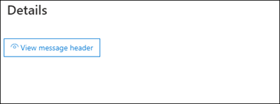

# <a name="quarantine-tags"></a>Теги карантина

> [!NOTE]
> Функции, описанные в этой статье, в настоящее время находятся в предварительном просмотре, недоступны для всех и могут изменяться.

Теги карантина в Exchange Online Protection (EOP) позволяют администраторам управлять тем, что пользователи могут делать с их карантинными сообщениями в зависимости от того, как сообщение поступило в карантин.

EOP традиционно разрешает или предотвращает определенные уровни интерактивности [](find-and-release-quarantined-messages-as-a-user.md) для сообщений в карантине и в уведомлениях о нежелательной почте конечного [пользователя.](use-spam-notifications-to-release-and-report-quarantined-messages.md) Например, конечные пользователи могут просматривать и выпускать сообщения, которые были карантинными в результате фильтрации от нежелательной почты, как спам или массовые, но они не могут просматривать или выпускать сообщения, которые были на карантине, как фишинг с высокой уверенностью.

Для [](#step-2-assign-a-quarantine-tag-to-supported-features)поддерживаемых функций защиты в карантиных тегах указывается, что пользователям разрешено делать в сообщениях уведомлений о нежелательной почте конечных пользователей и в карантинных сообщениях в карантине (сообщения, в которых пользователь является получателем). Теги карантина по умолчанию автоматически назначены для обеспечения выполнения исторических возможностей конечных пользователей в карантинных сообщениях. Или можно создать и назначить настраиваемые теги карантина, чтобы разрешить или запретить конечным пользователям выполнять определенные действия в карантинных сообщениях.

Отдельные разрешения объединяются в следующие группы предварительного разрешения:

- Нет доступа
- Ограниченный доступ
- Полный доступ

Доступные отдельные разрешения и то, что включено или не включено в предустановленные группы разрешений, описаны в следующей таблице:

<br>

****

|Разрешение|Нет доступа|Ограниченный доступ|Полный доступ|
|---|:---:|:---:|:---:|
|**Разрешить отправитель** _(PermissionToAllowSender)_||||
|**Отправитель блока** _(PermissionToBlockSender)_||||
|**Удаление** _(PermissionToDelete)_||||
|**Предварительный** просмотр _(PermissionToPreview)_||||
|**Разрешить получателям освободить сообщение из карантина** _(PermissionToRelease)_||||
|**Разрешить получателям запрашивать сообщение, которое будет выпущено из** карантина _(PermissionToRequestRelease)_||||
|

Если вам не нравятся разрешения по умолчанию в предустановленных группах разрешений, можно использовать настраиваемые разрешения при создании или изменении настраиваемой карантинской метки. Дополнительные сведения о том, что делает каждое разрешение, см. в разделе [Сведения](#quarantine-tag-permission-details) о разрешении тегов карантина в этой статье.

Вы создаете и назначаете теги карантина в Центре & безопасности или в PowerShell (Exchange Online PowerShell для организаций Microsoft 365 с почтовыми ящиками Exchange Online; автономные EOP PowerShell в организациях EOP без почтовых ящиков Exchange Online).

## <a name="what-do-you-need-to-know-before-you-begin"></a>Что нужно знать перед началом работы

- Откройте Центр безопасности и соответствия требованиям на сайте <https://protection.office.com/>. Чтобы перейти непосредственно на страницу тегов **карантина,** откройте <https://protection.office.com/quarantineTags> .

- Сведения о том, как подключиться к Exchange Online PowerShell, см. в статье [Подключение к Exchange Online PowerShell](/powershell/exchange/connect-to-exchange-online-powershell). Чтобы подключиться к автономному EOP PowerShell, см. раздел [Подключение к PowerShell Exchange Online Protection](/powershell/exchange/connect-to-exchange-online-protection-powershell).

- Чтобы просмотреть, создать, изменить или удалить теги карантина,  необходимо быть  членом роли администратора организации или администратора безопасности в Центре & [соответствия](permissions-in-the-security-and-compliance-center.md)требованиям.

## <a name="step-1-create-quarantine-tags-in-the-security--compliance-center"></a>Шаг 1. Создание тегов карантина в Центре & безопасности

1. В Центре & безопасности перейдите к  политике управления угрозами и выберите теги \>  **карантина.**

2. На странице **Теги карантина** выберите **Добавить настраиваемый тег**.

3. Откроется **мастер тегов** New Tag. На странице **Имя тега** введите краткое, но уникальное имя в **поле Имя тега.** В предстоящих действиях необходимо определить и выбрать тег по имени. По завершении нажмите кнопку **Далее**.

4. На странице **доступа к сообщению получателя** выберите одно из следующих значений:
   - **Нет доступа**
   - **Ограниченный доступ**
   - **Полный доступ**

   Отдельные разрешения, включенные в эти группы разрешений, описаны ранее в этой статье.

   Чтобы указать пользовательские разрешения, выберите Задать определенный **доступ (Расширенный)** и настроить следующие параметры:

     - **Выберите предпочтение действий выпуска:** Выберите одно из следующих значений:
       - **Действие выпуска:** это значение по умолчанию.
       - **Разрешить получателям освободить сообщение из карантина**
       - **Разрешить получателям запрашивать сообщение, которое будет выпущено из карантина**

     - **Выберите дополнительные действия, которые** получатели могут принимать на карантин сообщения: Выберите некоторые, все или ни одно из следующих значений:
       - **удаление**;
       - **Предварительная версия**
       - **Разрешить отправитель**
       - **Отправитель блока**

   Эти разрешения и их влияние на карантинные сообщения и уведомления о нежелательной почте конечных пользователей описаны в разделе Сведения о разрешении тегов карантина в этой статье. [](#quarantine-tag-permission-details)

   По завершении нажмите кнопку **Далее**.

5. На странице **Сводка,** которая появится, просмотрите параметры. Чтобы изменить его, можно нажать **кнопку Изменить** каждый параметр.

   По завершению нажмите кнопку **Отправить**.

6. Нажмите **кнопку Готово** на странице подтверждения, которая отображается.

Теперь вы готовы назначить карантинный тег функции карантина, как описано в разделе [Шаг 2.](#step-2-assign-a-quarantine-tag-to-supported-features)

### <a name="create-quarantine-tags-in-powershell"></a>Создание тегов карантина в PowerShell

Если вы хотите использовать PowerShell для создания карантиных тегов, подключись к Exchange Online PowerShell или Exchange Online Protection PowerShell и используйте командлет **New-QuarantineTag.** У вас есть два различных метода на выбор:

- Используйте параметр _EndUserQuarantinePermissionsValue._
- Используйте параметр _EndUserQuarantinePermissions._

Эти методы описаны в следующих разделах.

#### <a name="use-the-enduserquarantinepermissionsvalue-parameter"></a>Используйте параметр EndUserQuarantinePermissionsValue

Чтобы создать карантиновый тег с помощью _параметра EndUserQuarantinePermissionsValue,_ используйте следующий синтаксис:

```powershell
New-QuarantineTag -Name "<UniqueName>" -EndUserQuarantinePermissionsValue <0 to 236>
```

Параметр _EndUserQuarantinePermissionsValue_ использует десятичное значение, преобразованное из двоичного значения. Двоичное значение соответствует доступным разрешениям карантина для конечных пользователей в определенном порядке. Для каждого разрешения значение 1 равно True, а значение 0 - false.

Необходимый порядок и значения для каждого отдельного разрешения в предустановленных группах разрешений описаны в следующей таблице:

<br>

****

|Разрешение|Нет доступа|Ограниченный доступ|Полный доступ|
|---|:---:|:---:|:---:|
|PermissionToAllowSender|0|0|1|
|PermissionToBlockSender|0|1|1|
|PermissionToDelete|0|1|1|
|PermissionToDownload<sup>\*</sup>|0|0|0|
|PermissionToPreview|0|1|1|
|PermissionToRelease<sup>\*\*</sup>|0|0|1|
|PermissionToRequestRelease<sup>\*\*</sup>|0|1|0|
|PermissionToViewHeader<sup>\*</sup>|0|0|0|
|Двоичное значение|00000000|01101010|11101100|
|Десятичная значения для использования|0|106|236|
|

<sup>\*</sup> В настоящее время это значение всегда 0. Для PermissionToViewHeader значение 0 не скрывает кнопку Заголовок сообщения **View** в подробностях карантиного сообщения (кнопка всегда доступна).

<sup>\*\*</sup> Не устанавливайте оба этих значения до 1. Установите одно к 1 и другое к 0, или установите оба к 0.

В этом примере создается новое имя тега карантина NoAccess, которое назначает разрешения доступа без доступа, как описано в предыдущей таблице.

```powershell
New-QuarantineTag -Name NoAccess -EndUserQuarantinePermissionsValue 0
```

Для разрешений ограниченного доступа используйте значение 106. Для разрешений полного доступа используйте значение 236.

Для пользовательских разрешений используйте предыдущую таблицу, чтобы получить двоичное значение, соответствующее нужным разрешениям. Преобразование двоичного значения в десятичное значение и использование десятичного значения для параметра _EndUserQuarantinePermissionsValue._

Подробные сведения о синтаксисах и параметрах см. [в new-QuarantineTag.](/powershell/module/exchange/new-quarantinetag)

#### <a name="use-the-enduserquarantinepermissions-parameter"></a>Использование параметра EndUserQuarantinePermissions

Чтобы создать карантиновый тег с помощью _параметра EndUserQuarantinePermissionsValue,_ сделайте следующие действия:

О. Храните объект разрешений карантина в переменной с помощью подраздела **New-QuarantinePermissions.**

<p>

B. Используйте переменную в качестве _значения EndUserQuarantinePermissions_ в **команде New-QuarantineTag.**

##### <a name="step-a-store-a-quarantine-permissions-object-in-a-variable"></a>Шаг A. Хранение объекта разрешений карантина в переменной

Используйте следующий синтаксис:

```powershell
$<VariableName> = New-QuarantinePermissions [-PermissionToAllowSender <$true | $False>] [-PermissionToBlockSender <$true | $False>] [-PermissionToDelete <$true | $False>] [-PermissionToPreview <$true | $False>] [-PermissionToRelease <$true | $False>] [-PermissionToRequestRelease <$true | $False>]
```

Значение по умолчанию для любых неиспользимых параметров , поэтому вам нужно использовать только параметры, в которых необходимо установить `$false` значение `$true` .

В следующих примерах покажите, как создавать объекты разрешений, соответствующие заранее:

- **Нет доступа:**

  ```powershell
  $NoAccess = New-QuarantinePermissions
  ```

- **Ограниченный доступ:**

  ```powershell
  $LimitedAccess = New-QuarantinePermissions -PermissionToBlockSender $true -PermissionToDelete $true -PermissionToPreview $true -PermissionToRequestRelease $true
  ```

- **Полный доступ:**

  ```powershell
  $FullAccess = New-QuarantinePermissions -PermissionToAllowSender $true -PermissionToBlockSender $true -PermissionToDelete $true -PermissionToPreview $true -PermissionToRelease $true
  ```

Чтобы увидеть значения, которые вы установили, запустите имя переменной в качестве команды (например, запустите `$NoAccess` команду).

Для пользовательских разрешений не заданы параметры _PermissionToRelease_ и _PermissionToRequestRelease._ `$true` Установите одно и `$true` оставьте другое как `$false` , или оставьте оба как `$false` .

Вы также можете изменить существующую переменную объектов разрешений после создания, но перед ее использованием с помощью **cmdlet Set-QuarantinePermissions.**

Подробные сведения о синтаксисах и параметрах см. в [new-QuarantinePermissions](/powershell/module/exchange/new-quarantinepermissions) и [Set-QuarantinePermissions.](/powershell/module/exchange/set-quarantinepermissions)

##### <a name="step-b-use-the-variable-in-the-new-quarantinetag-command"></a>Шаг B. Использование переменной в New-QuarantineTag команде

После создания и хранения объекта разрешений в переменной используйте переменную для значения параметра _EndUserQuarantinePermission_ в следующей команде **New-QuarantineTag:**

```powershell
New-QuarantineTag -Name "<UniqueName>" -EndUserQuarantinePermissions $<VariableName>
```

В этом примере создается новый карантинный тег с именем LimitedAccess с помощью объекта разрешений, который был описан и создан `$LimitedAccess` на предыдущем шаге.

```powershell
New-QuarantineTag -Name LimitedAccess -EndUserQuarantinePermissions $LimitedAccess
```

Подробные сведения о синтаксисах и параметрах см. [в new-QuarantineTag.](/powershell/module/exchange/new-quarantinetag)

## <a name="step-2-assign-a-quarantine-tag-to-supported-features"></a>Шаг 2. Назначение тега карантина поддерживаемых компонентов

В _поддерживаемых_ средствах защиты, карантиных сообщениях или файлах (автоматически или в качестве настраиваемого действия), можно назначить карантинный тег доступным карантиным действиям. Функции карантиных сообщений и наличие тегов карантина описаны в следующей таблице:

<br>

****

|Функция|Поддерживаемые теги карантина?|Используемые теги карантина по умолчанию|
|---|:---:|---|
|[Политики борьбы со спамом:](configure-your-spam-filter-policies.md) <ul><li>**Spam** _(SpamAction)_</li><li>**Высокая достоверность** нежелательной почты _(HighConfidenceSpamAction)_</li><li>**Фишинговая электронная** _почта (PhishSpamAction)_</li><li>**Высокая достоверность фишинговой почты** _(HighConfidencePhishAction_)</li><li>**Массовая электронная** почта _(BulkSpamAction)_</li></ul>|Да|<ul><li>DefaultSpamTag (Полный доступ)</li><li>DefaultHighConfSpamTag (Полный доступ)</li><li>DefaultPhishTag (Полный доступ)</li><li>DefaultHighConfPhishTag (Без доступа)</li><li>DefaultBulkTag (Полный доступ)</li></ul>
|Политики защиты от фишинга: <ul><li>[Защита от спуф-аналитики](set-up-anti-phishing-policies.md#spoof-settings) _(AuthenticationFailAction)_</li><li>[Защита от обезличения:](set-up-anti-phishing-policies.md#impersonation-settings-in-anti-phishing-policies-in-microsoft-defender-for-office-365)<sup>\*</sup> <ul><li>**Если электронная почта отправляется обезличенным пользователем** _(TargetedUserProtectionAction)_</li><li>**Если электронная почта отправляется с помощью обезличенных доменов** _(TargetedDomainProtectionAction)_</li><li>**Аналитика почтовых ящиков** \> **Если электронная почта отправляется обезличенным пользователем** _(MailboxIntelligenceProtectionAction)_</li></ul></li></ul></ul>|Нет|н/д|
|[Политики по борьбе с вредоносными](configure-anti-malware-policies.md)программами. Все обнаруженные сообщения всегда находятся на карантине.|Нет|н/д|
|[Безопасные вложения для SharePoint, OneDrive и Microsoft Teams](mdo-for-spo-odb-and-teams.md)|Нет|н/д|
|[Правила потока почты](/exchange/security-and-compliance/mail-flow-rules/mail-flow-rules) (также известные как правила транспорта) с действием: **Доставка** сообщения на карантин(_карантин)._|Нет|н/д|
|

<sup>\*</sup> Параметры защиты от обезличения доступны только в политиках защиты от фишинга в Microsoft Defender для Office 365.

Если вы довольны разрешениями конечных пользователей, предоставляемыми тегами карантина по умолчанию, вам не нужно ничего делать. Если вы хотите настроить возможности конечных пользователей (доступные кнопки) в уведомлениях о нежелательной почте конечных пользователей или в карантиновом сообщении, можно назначить настраиваемый тег карантина.

### <a name="assign-quarantine-tags-in-anti-spam-policies-in-the-security--compliance-center"></a>Назначение тегов карантина в политиках защиты от нежелательной почты в Центре & безопасности

Полные инструкции по созданию и изменению политик борьбы со спамом описаны в настройках политик по борьбе со спамом [в EOP.](configure-your-spam-filter-policies.md)

1. В Центре & безопасности перейдите к **политике** управления угрозами, а затем выберите службу \>  \> защиты от **нежелательной почты.** Или откройте <https://protection.office.com/antispam> .

2. Найдите и выберите существующую политику по борьбе со спамом для редактирования или создания новой политики по борьбе со спамом.

3. В разделе подробные сведения о политике расширите раздел **Спам и массовые** действия.

4. Если вы выбрали  сообщение карантина для действия решения о фильтрации  нежелательной почты, поле тегов политики применения карантиной политики доступно для выбора тега карантина для этого вердикта.

   **Примечание.** При создании новой политики значение пустого карантиного тега для решения о фильтрации нежелательной почты указывает на то, что для этого решения используется карантин по умолчанию. После редактирования политики пустые значения заменяются фактическими именами карантинными тегами по умолчанию, как описано в предыдущей таблице.

   

5. Когда закончите, нажмите **Сохранить**.

#### <a name="assign-quarantine-tags-in-anti-spam-policies-in-powershell"></a>Назначение тегов карантина в политиках по борьбе со спамом в PowerShell

Если вы хотите использовать PowerShell для назначения тегов карантина в политиках по борьбе со спамом, подключись к Exchange Online PowerShell или Exchange Online Protection PowerShell и используйте следующий синтаксис:

```powershell
<New-HostedContentFilterPolicy -Name "<Unique name>" | Set-HostedContentFilterPolicy -Identity "<Policy name>">  [-SpamAction Quarantine] [-SpamQuarantineTag <QuarantineTagName>] [-HighConfidenceSpamAction Quarantine] [-HighConfidenceSpamQuarantineTag <QuarantineTagName>] [-PhishSpamAction Quarantine] [-PhishQuarantineTag <QuarantineTagName>] [-HighConfidencePhishQuarantineTag <QuarantineTagName>] [-BulkSpamAction Quarantine] [-BulkQuarantineTag <QuarantineTagName>] ...
```

**Примечания**:

- Значение по умолчанию для параметра _HighConfidencePhishAction_ — карантин, поэтому не нужно устанавливать действие карантина для обнаружения фишинга с высокой уверенностью в новых политиках защиты от нежелательной почты. Для всех остальных приговоров по фильтрации нежелательной почты в новых или существующих политиках по борьбе со нежелательной почтой тег карантина эффективен только в том случае, если значение действия — карантин. Чтобы увидеть значения действий в существующих политиках по борьбе со спамом, запустите следующую команду:

  ```powershell
  Get-HostedContentFilterPolicy | Format-Table Name,*SpamAction,HighConfidencePhishAction
  ```

  Сведения о значениях действий по умолчанию и рекомендуемых значениях действий для Standard и Strict см. в параметров политики борьбы со спамом [EOP.](recommended-settings-for-eop-and-office365.md#eop-anti-spam-policy-settings)

- Вердикт фильтрации нежелательной почты без соответствующего [](#step-2-assign-a-quarantine-tag-to-supported-features) параметра карантиного тега означает, что для этого решения используется карантин по умолчанию.

  Чтобы изменить возможности конечных пользователей по умолчанию в карантинных сообщениях, необходимо заменить карантиновую метку по умолчанию.

- Новая политика по борьбе со нежелательной почтой в PowerShell требует политики фильтрации нежелательной почты (параметры) с помощью комлета **New-HostedContentFilterPolicy** и нового правила фильтра нежелательной почты (фильтры получателей) с помощью комлета **New-HostedContentFilterRule.** Инструкции см. в [инструкции Use PowerShell для создания политик по борьбе со спамом.](configure-your-spam-filter-policies.md#use-powershell-to-create-anti-spam-policies)

В этом примере создается новая политика фильтра нежелательной почты с именем Research Department со следующими настройками:

- Действие для всех приговоров фильтрации нежелательной почты задавается карантином.
- Настраиваемый тег карантина с именем NoAccess, который назначает разрешения на доступ без доступа, заменяет любые теги карантина по умолчанию, которые еще не назначают разрешения доступа по умолчанию.  

```powershell
New-HostedContentFilterPolicy -Name Research Department -SpamAction Quarantine -SpamQuarantineTag NoAccess -HighConfidenceSpamAction Quarantine -HighConfidenceSpamQuarantineTag NoAction -PhishSpamAction Quarantine -PhishQuarantineTag NoAction -BulkSpamAction Quarantine -BulkQuarantineTag NoAccess
```

Дополнительные сведения о синтаксисе и параметрах см. в статье [New-HostedContentFilterPolicy](/powershell/module/exchange/new-hostedcontentfilterpolicy).

В этом примере изменяется существующая политика фильтрации нежелательной почты с именем Human Resources. Действие для вердикта карантина нежелательной почты задавается карантином, а настраиваемый карантиный тег с именем NoAccess назначен.

```powershell
Set-HostedContentFilterPolicy -Identity "Human Resources" -SpamAction Quarantine -SpamQuarantineTag NoAccess
```

Дополнительные сведения о синтаксисе и параметрах см. в статье [Set-HostedContentFilterPolicy](/powershell/module/exchange/set-hostedcontentfilterpolicy).

## <a name="configure-global-quarantine-notification-settings-in-the-security--compliance-center"></a>Настройка глобальных параметров уведомлений о карантине в Центре & безопасности

Глобальные параметры карантиных тегов позволяют настраивать уведомления о нежелательной почте конечного пользователя, которые отправляются получателям сообщений, которые были карантинными. Дополнительные сведения об этих уведомлениях см. в сообщении о нежелательной [почте конечных пользователей.](use-spam-notifications-to-release-and-report-quarantined-messages.md)

1. В Центре & безопасности перейдите к  политике управления угрозами и выберите теги \>  **карантина.**

2. На странице **Теги карантина** выберите **глобальные параметры**.

3. В **открываемом** флаауте параметров уведомлений карантина настройте некоторые или все следующие параметры:

   - **Используйте логотип моей компании.** Выберите этот параметр, чтобы заменить логотип Microsoft по умолчанию, который используется в верхней части уведомлений о нежелательной почте конечного пользователя. Прежде чем это сделать, необходимо следовать инструкциям в [Настройка](../../admin/setup/customize-your-organization-theme.md) темы Microsoft 365 для вашей организации, чтобы загрузить свой пользовательский логотип.

     На следующем скриншоте показан настраиваемый логотип в уведомлении о нежелательной почте для конечных пользователей:

     

   - **Выберите язык.** Уведомления о нежелательной почте конечных пользователей уже локализованы в зависимости от параметров языка получателя. Вы можете указать настраиваемый текст на разных языках для значений **Display и** **Disclaimer.**

     Выберите хотя бы один язык из первого языкового окна и нажмите **кнопку Добавить**. Вы можете выбрать несколько языков, щелкнув **Добавить** после каждого из них. В языковом окне раздела показаны все выбранные вами языки:

     

   - **Отображение имени.** Настройте отображаемого имени отправитель, которое используется в уведомлениях о нежелательной почте конечных пользователей.

     Для каждого добавленного языка выберите язык во втором языковом окне (не нажимайте на X) и введите текстовое значение, которое необходимо в поле **Отображайте имя.**

     На следующем скриншоте показано настраиваемого имени отображения в уведомлении о нежелательной почте для конечных пользователей:

     

   - **Отказ от ответственности.** Добавьте настраиваемый отказ в нижней части уведомлений о нежелательной почте конечного пользователя. Локализованный текст , **отказ от организации:** всегда включается в первую очередь, а затем текст, который вы указываете.

     Для каждого добавленного языка выберите язык во втором языковом окне (не щелкните X) и введите текстовое значение, которое необходимо в поле **Отказ** от ответственности.

     На следующем скриншоте показан настраиваемый отказ в уведомлении о нежелательной почте для конечных пользователей:

     

## <a name="view-quarantine-tags-in-the-security--compliance-center"></a>Просмотр тегов карантина в Центре & безопасности

1. В Центре & безопасности перейдите к  политике управления угрозами и выберите теги \>  **карантина.**

- Чтобы просмотреть параметры встроенных или настраиваемого карантиных тегов, выберите карантинный тег из списка (не выберите контрольный ящик).

- Чтобы просмотреть глобальные параметры, выберите **параметры Global**

### <a name="view-quarantine-tags-in-powershell"></a>Просмотр тегов карантина в PowerShell

Если вы хотите использовать PowerShell для просмотра тегов карантина, сделайте любой из следующих действий:

- Чтобы просмотреть сводный список всех встроенных или настраиваемых тегов, запустите следующую команду:

  ```powershell
  Get-QuarantineTag | Format-Table Name
  ```

- Чтобы просмотреть параметры встроенных или настраиваемых карантиных тегов, замените имя тега карантина и запустите \<TagName\> следующую команду:

  ```powershell
  Get-QuarantineTag -Identity "<TagName>"
  ```

- Чтобы просмотреть глобальные параметры, запустите следующую команду:

  ```powershell
  Get-QuarantineTag -QuarantineTagType GlobalQuarantineTag
  ```

Дополнительные сведения о синтаксисе и параметрах см. в статье [Get-HostedContentFilterPolicy](/powershell/module/exchange/get-hostedcontentfilterpolicy).

## <a name="remove-quarantine-tags-in-the-security--compliance-center"></a>Удаление тегов карантина в Центре & безопасности

**Примечания**:

- Нельзя удалять встроенные карантинные теги.

- Перед удалением настраиваемой карантиной метки убедитесь, что она не используется. Например, запустите следующую команду в PowerShell:

  ```powershell
  Get-HostedContentFilterPolicy | Format-List Name,*QuarantineTag
  ```

  Если используется карантинный [тег,](#step-2-assign-a-quarantine-tag-to-supported-features) замените назначенную карантиную метку перед ее удалением.

1. В Центре & безопасности перейдите к  политике управления угрозами и выберите теги \>  **карантина.**

2. На странице **Теги карантина** выберите настраиваемый тег карантина, который необходимо удалить, и нажмите кнопку **Удалить тег**.

3. Нажмите **кнопку Удалить тег** в диалоговом окте подтверждения, который отображается.

### <a name="remove-quarantine-tags-in-powershell"></a>Удаление тегов карантина в PowerShell

Если вы хотите использовать PowerShell для удаления настраиваемого тега карантина, замените имя тега карантина и запустите \<TagName\> следующую команду:

```powershell
Remove-QuarantineTag -Identity "<TagName>"
```

Подробные сведения о синтаксисах и параметрах см. в [инструкции Remove-QuarantineTag.](/powershell/module/exchange/remove-quarantinetag)

## <a name="quarantine-tag-permission-details"></a>Сведения о разрешении тегов карантина

В следующих разделах описаны последствия групп предварительного разрешения и отдельных разрешений в подробностях карантиновых сообщений и уведомлений о нежелательной почте конечного пользователя.

### <a name="preset-permissions-groups"></a>Группы предустановленных разрешений

Отдельные разрешения, включенные в группы предварительного разрешения, перечислены в таблице в начале этой статьи.

#### <a name="no-access"></a>Нет доступа

Если на карантиновом  теге назначаются разрешения без доступа (без разрешений), пользователи по-прежнему получают некоторые базовые возможности:

- **Карантинные сведения о сообщении.** Кнопка **"Просмотр"** всегда доступна.

  

- **Уведомления о нежелательной почте** конечных пользователей: кнопка **Обзор,** которая принимает пользователя к сообщению на карантине, всегда доступна.

  

#### <a name="limited-access"></a>Ограниченный доступ

Если тег карантина назначает  разрешения ограниченного доступа, пользователи получают следующие возможности:

- **Сведения о карантинном сообщении:** доступны следующие кнопки:
  - **Выпуск запроса**
  - **Просмотр заголовка сообщения**.
  - **Предварительное сообщение**
  - **Отправитель блока**
  - **Удаление из карантина**

  

- **Уведомления о нежелательной почте** конечных пользователей: доступны следующие кнопки:
  - **Отправитель блока**
  - **Проверка**

  

#### <a name="full-access"></a>Полный доступ

Если тег карантина назначает  разрешения полного доступа (все доступные разрешения), пользователи получают следующие возможности:

- **Сведения о карантинном сообщении:** доступны следующие кнопки:
  - **Сообщение о выпуске**
  - **Просмотр заголовка сообщения**.
  - **Предварительное сообщение**
  - **Отправитель блока**
  - **Разрешить отправитель**
  - **Удаление из карантина**

  

- **Уведомления о нежелательной почте** конечных пользователей: доступны следующие кнопки:
  - **Отправитель блока**
  - **Выпуск**
  - **Проверка**

  

### <a name="individual-permissions"></a>Отдельные разрешения

> [!NOTE]
> Помните, что пользователи всегда получают кнопки, описанные в разделе [Нет доступа.](#no-access) Эти кнопки не включены в отдельные описания разрешений.

#### <a name="allow-sender-permission"></a>Разрешить разрешение отправитель

Разрешение **разрешить отправитель** _(PermissionToAllowSender)_ управляет доступом к кнопке, которая позволяет пользователям удобно добавлять отправитель сообщений, на карантин, в Сейф список отправителей.

- **Сведения о карантине:**
  - **Разрешить разрешение отправитель** включен: **кнопка Разрешить отправитель** доступна.
  - **Разрешить отключение** разрешения отправитель: кнопка **Разрешить** отправитель недоступна.

- **Уведомления о нежелательной почте конечных пользователей.**

Дополнительные сведения о списке Сейф отправителей [](https://support.microsoft.com/office/274ae301-5db2-4aad-be21-25413cede077#__toc304379666) см. в этой информации, чтобы предотвратить блокировку доверенных отправителей и использовать [Exchange Online PowerShell](configure-junk-email-settings-on-exo-mailboxes.md#use-exchange-online-powershell-to-configure-the-safelist-collection-on-a-mailbox)для настройки коллекции safelist на почтовом ящике.

#### <a name="block-sender-permission"></a>Разрешение отправитель блокировки

Разрешение **отправителей** блокировки _(PermissionToBlockSender)_ управляет доступом к кнопке, которая позволяет пользователям удобно добавлять отправитель сообщений, на карантин, в список заблокированных отправителей.

- **Сведения о карантине:**
  - **Включено разрешение отправитель** блока. Кнопка **"Отправитель** блока" доступна.
  - **Отключено разрешение** отправитель блокировки. Кнопка **"Отправитель** блока" недоступна.

- **Уведомления о нежелательной почте конечных пользователей:**
  - **Отключено разрешение** отправитель блокировки. Кнопка **"Отправитель** блока" недоступна.
  - **Включено разрешение отправитель** блока. Кнопка **"Отправитель** блока" доступна.

Дополнительные сведения о списке заблокированных [](https://support.microsoft.com/office/274ae301-5db2-4aad-be21-25413cede077#__toc304379667) отправителей см. в дополнительных сведениях о блокировке сообщений от кого-либо и использовании Exchange Online PowerShell для настройки коллекции safelist на [почтовом ящике.](configure-junk-email-settings-on-exo-mailboxes.md#use-exchange-online-powershell-to-configure-the-safelist-collection-on-a-mailbox)

#### <a name="delete-permission"></a>Разрешения на удаление

Разрешение **Delete** _(PermissionToDelete)_ управляет возможностью пользователей удалять свои сообщения (сообщения, в которых пользователь является получателем) из карантина.

- **Сведения о карантине:**
  - **Удаление** включенного разрешения. Кнопка Удаление из **карантина** доступна.
  - **Удаление** отключенных разрешений. Кнопка Удалить из **карантина** недоступна.

- **Уведомления о нежелательной почте конечных пользователей.**

#### <a name="preview-permission"></a>Разрешение предварительного просмотра

Разрешение **Preview** _(PermissionToPreview)_ контролирует возможность предварительного просмотра сообщений пользователями в карантине.

- **Сведения о карантине:**
  - **Включено** разрешение предварительного просмотра: **доступна** кнопка предварительного просмотра сообщения.
  - **Отключено** разрешение предварительного просмотра. **Кнопка** предварительного просмотра недоступна.

- **Уведомления о нежелательной почте конечных пользователей.**

#### <a name="allow-recipients-to-release-a-message-from-quarantine-permission"></a>Разрешить получателям освободить сообщение из разрешения карантина

Разрешить **получателям** освободить сообщение из разрешения карантина _(PermissionToRelease)_ контролирует возможность пользователей выпускать свои карантинные сообщения напрямую и без разрешения администратора.

- **Сведения о карантине:**
  - Включено разрешение. Доступна кнопка **"Сообщение** о выпуске".
  - Отключено разрешение. **Кнопка "Сообщение о выпуске"** недоступна.

- **Уведомления о нежелательной почте конечных пользователей:**
  - Включено разрешение. Доступна кнопка **Release.**
  - Отключено разрешение. **Кнопка Выпуска** недоступна.

#### <a name="allow-recipients-to-request-a-message-to-be-released-from-quarantine-permission"></a>Разрешить получателям запрашивать сообщение, которое будет выпущено из разрешения карантина

Разрешить **получателям** запрашивать сообщение, которое будет выпущено из разрешения карантина _(PermissionToRequestRelease)_ контролирует возможность пользователей запрашивать выпуск их карантинов.  Сообщение будет выпущено только после утверждения запроса администратором.

- **Сведения о карантине:**
  - Включено разрешение: **доступна кнопка выпуска** запроса.
  - Отключено разрешение. **Кнопка выпуска запроса** недоступна.

- **Уведомления о нежелательной почте** конечных пользователей. Кнопка **Выпуска** недоступна.